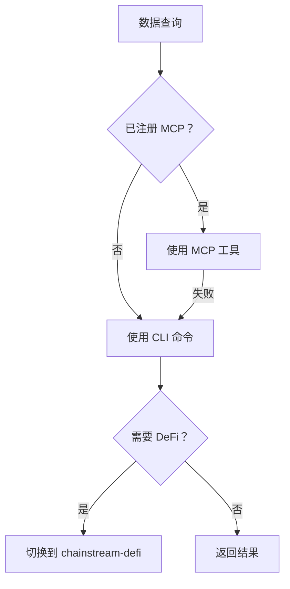
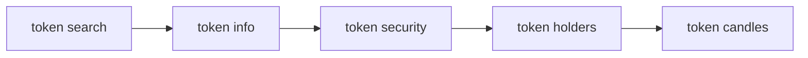
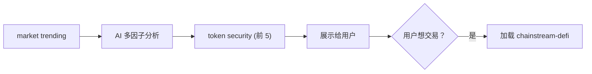
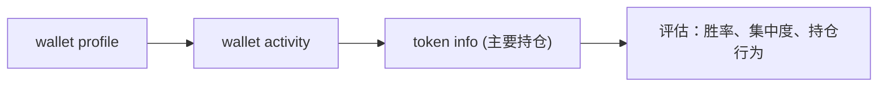

## 概述

`chainstream-data` skill 提供 Solana、BSC 和 Ethereum 上的只读链上数据能力，涵盖代币分析、市场排行、钱包画像和 WebSocket 流。

- **模式**：Tool（只读，无需签名）
- **MCP Server**：`https://mcp.chainstream.io/mcp`（17 个工具）
- **CLI**：`npx @chainstream-io/cli`
- **API 基础 URL**：`https://api.chainstream.io`

## 集成路径

Skill 使用决策树路由到正确的执行通道：



## 通道矩阵

| 操作 | MCP 工具 | CLI 命令 | SDK 方法 |
|------|----------|----------|----------|
| 搜索代币 | `tokens_search` | `token search` | `client.token.search` |
| 分析代币 | `tokens_analyze` | `token info` | `client.token.getToken` |
| 安全检查 | `tokens_analyze` | `token security` | `client.token.getSecurity` |
| 前 N 大持有人 | `tokens_analyze` | `token holders` | `client.token.getHolders` |
| 价格历史（K 线） | `tokens_price_history` | `token candles` | `client.token.getCandles` |
| 流动性池 | `tokens_discover` | `token pools` | `client.token.getPools` |
| 热门代币 | `market_trending` | `market trending` | `client.ranking.*` |
| 新上线代币 | `market_trending` | `market new` | `client.ranking.*` |
| 最近交易 | `trades_recent` | `market trades` | `client.trade.*` |
| 钱包画像 | `wallets_profile` | `wallet profile` | `client.wallet.*` |
| 钱包 PnL | `wallets_profile` | `wallet pnl` | `client.wallet.*` |
| 代币余额 | `wallets_profile` | `wallet holdings` | `client.wallet.*` |
| 转账历史 | `wallets_activity` | `wallet activity` | `client.wallet.*` |
| DEX 报价 | `dex_quote` | `dex route` | `client.dex.quote` |

## AI 工作流

### 代币研究

完整的代币分析流程 — 推荐任何代币前必须运行安全检查。



<Tabs>
  <Tab title="CLI">
    ```bash
    npx @chainstream-io/cli token search --keyword PUMP --chain sol
    npx @chainstream-io/cli token info --chain sol --address <addr>
    npx @chainstream-io/cli token security --chain sol --address <addr>
    npx @chainstream-io/cli token holders --chain sol --address <addr>
    npx @chainstream-io/cli token candles --chain sol --address <addr> --resolution 1h
    ```
  </Tab>
  <Tab title="MCP">
    ```
    tokens_search { "query": "PUMP", "chain": "solana" }
    tokens_analyze { "chain": "solana", "address": "<addr>" }
    tokens_price_history { "chain": "solana", "address": "<addr>", "resolution": "1h" }
    ```
  </Tab>
</Tabs>

### 市场发现

发现热门代币，进行多因子分析，然后对候选代币做安全检查。



<Tabs>
  <Tab title="CLI">
    ```bash
    npx @chainstream-io/cli market trending --chain sol --duration 1h --limit 50
    # AI 分析：聪明钱信号、成交量、动量、安全性
    npx @chainstream-io/cli token security --chain sol --address <candidate_1>
    npx @chainstream-io/cli token security --chain sol --address <candidate_2>
    ```
  </Tab>
  <Tab title="MCP">
    ```
    market_trending { "chain": "solana", "duration": "1h", "limit": 50 }
    tokens_analyze { "chain": "solana", "address": "<candidate>" }
    ```
  </Tab>
</Tabs>

### 钱包画像

分析钱包的表现、持仓和交易行为。



<Tabs>
  <Tab title="CLI">
    ```bash
    npx @chainstream-io/cli wallet profile --chain sol --address <wallet>
    npx @chainstream-io/cli wallet activity --chain sol --address <wallet>
    npx @chainstream-io/cli token info --chain sol --address <top_holding>
    ```
  </Tab>
  <Tab title="MCP">
    ```
    wallets_profile { "chain": "solana", "address": "<wallet>" }
    wallets_activity { "chain": "solana", "address": "<wallet>" }
    ```
  </Tab>
</Tabs>

## 安全规则

<Warning>
这些规则由 Skill 强制执行，确保数据准确性和负责任的 AI 行为。
</Warning>

| 规则 | 原因 |
|------|------|
| 不得用训练数据回答价格问题 | 加密货币价格在几秒内就会过时 — 必须实时 API 调用 |
| 推荐代币前必须运行 `token security` | ChainStream 风险模型覆盖蜜罐、Rug Pull 和集中度信号 |
| 不得向 MCP 传递 `format: "detailed"`（除非用户要求） | 返回 4-10 倍数据，浪费上下文窗口 |
| `/multi` 端点不超过 50 个地址 | API 硬限制 |
| 不得用公链 RPC 替代 | 结果不同且缺少 ChainStream 特有的增强数据 |

## 错误恢复

| 错误 | 恢复方式 |
|------|----------|
| 401 / "Not authenticated" | 配置 API Key 或运行 `chainstream login` |
| 402 / "Payment required" | 按照 [x402 支付流程](/cn/docs/platform/billing-payments/x402-payments) 操作 |
| 429 / 速率限制 | 等待 1 秒，指数退避 |
| 5xx / 服务器错误 | 2 秒后重试一次 |

## 相关文档

<CardGroup cols={2}>
  <Card title="chainstream-defi" icon="right-left" href="/cn/docs/ai-agents/agent-skills/chainstream-defi">
    研究后执行交易
  </Card>
  <Card title="CLI 命令" icon="terminal" href="/cn/api-reference/cli-commands/overview">
    完整 CLI 命令参考
  </Card>
</CardGroup>
