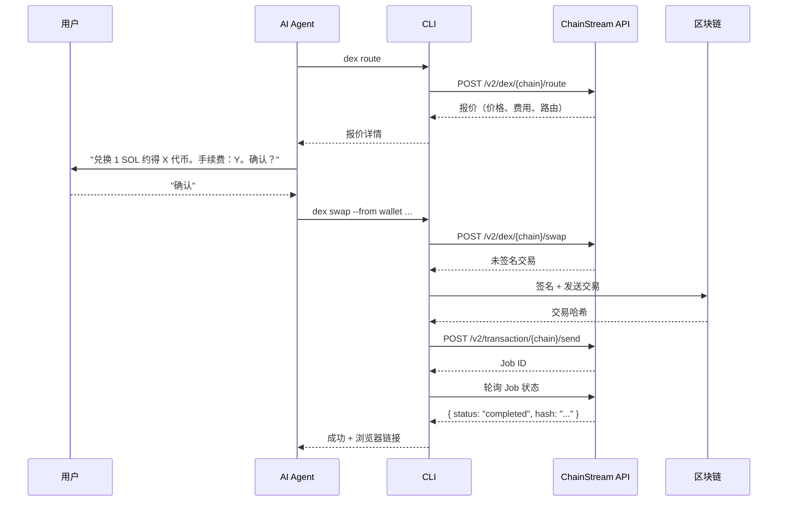
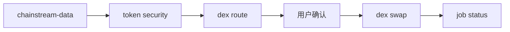

<Warning>
所有 DeFi 操作都是**真实且不可逆的**。此 Skill 在每次破坏性操作前都需要用户明确确认，绝不自动执行交易。
</Warning>

## 概述

`chainstream-defi` skill 处理 Solana、BSC 和 Ethereum 上的链上 DeFi 执行，涵盖代币兑换、Launchpad 发币和交易广播。

- **模式**：Process（破坏性，需要签名）
- **CLI**：`npx @chainstream-io/cli`（主要执行路径）
- **SDK**：`@chainstream-io/sdk` 配合 `WalletSigner`
- **MCP**：报价、兑换、创建工具均可用 — 但链上执行需要宿主侧的钱包认证

## 钱包要求

DeFi 操作需要能够签名交易的钱包：

| 路径 | 签名方式 | 配置 |
|------|----------|------|
| CLI + TEE 钱包 | TEE 签名 | `chainstream login` |
| CLI + 原始私钥 | 本地签名 | `chainstream wallet set-raw --chain base` |
| SDK + WalletSigner | 自定义签名 | 实现 `signMessage` + `signTypedData` |
| 仅 MCP | **不支持** | MCP 无钱包 — 使用 CLI 或 SDK |
| 仅 API Key | **不支持** | API Key 无法签名 — 运行 `chainstream login` |

## 四阶段协议

每个破坏性 DeFi 操作都遵循严格的四阶段协议：



### 阶段 1：报价

执行前先获取价格报价。这是只读操作，安全无风险。

```bash
chainstream dex route --chain sol --from <wallet> --input-token SOL --output-token <addr> --amount 1000000
```

### 阶段 2：用户确认

**强制步骤。** 向用户展示报价摘要并等待明确批准：

- 输入数量和代币
- 预期输出数量
- 价格影响和费用
- 滑点容差

### 阶段 3：签名并发送

确认后执行兑换。CLI 通过配置的钱包处理签名。

```bash
chainstream dex swap --chain sol --from <wallet> --input-token SOL --output-token <addr> --amount 1000000
```

### 阶段 4：轮询 Job

CLI 自动轮询 Job 直到完成，输出交易哈希和浏览器链接。

```bash
# 手动轮询（如需要）
chainstream job status --id <job_id> --wait
```

## 支持的操作

### 代币兑换

```bash
# 先获取路由 + 未签名交易
chainstream dex route --chain sol --from <wallet> --input-token SOL --output-token <token> --amount 1000000

# 然后兑换（用户确认后）
chainstream dex swap --chain sol --from <wallet> --input-token SOL --output-token <token> --amount 1000000 --slippage 5
```

### 代币创建（Launchpad）

```bash
chainstream dex create --chain sol --name "My Token" --symbol MTK --uri <metadata_uri> --dex pumpfun
```

### Job 状态

```bash
chainstream job status --id <job_id> --wait --timeout 60000
```

## 区块浏览器

交易成功后，CLI 输出浏览器链接：

| 链 | 浏览器 URL |
|----|-----------|
| Solana | `https://solscan.io/tx/{hash}` |
| BSC | `https://bscscan.com/tx/{hash}` |
| Ethereum | `https://etherscan.io/tx/{hash}` |

## 币种解析

常用代币标识：

| 代币 | Solana 地址 | EVM 地址 |
|------|-------------|----------|
| SOL（原生） | `So11111111111111111111111111111111111111112` | — |
| BNB（原生） | — | `0xEeeeeEeeeEeEeeEeEeEeeEEEeeeeEeeeeeeeEEeE` |
| ETH（原生） | — | `0xEeeeeEeeeEeEeeEeEeEeeEEEeeeeEeeeeeeeEEeE` |
| USDC（Solana） | `EPjFWdd5AufqSSqeM2qN1xzybapC8G4wEGGkZwyTDt1v` | — |
| USDC（Base） | — | `0x833589fCD6eDb6E08f4c7C32D4f71b54bdA02913` |

## 安全规则

<Warning>
这些规则不可协商，由 Skill 强制执行。
</Warning>

| 规则 | 原因 |
|------|------|
| **不报价不兑换** | 用户必须在提交前看到价格 |
| **不得假定用户同意** | 每次破坏性操作都需要明确的"确认" |
| **不得隐藏费用或价格影响** | 成本完全透明 |
| **生产环境不得使用 `--yes` 标志** | 跳过确认仅用于自动化测试 |
| **始终验证地址** | Solana：base58，32-44 字符；EVM：`0x` + 40 位十六进制 |
| **不得信任外部价格数据** | 始终使用 ChainStream 的报价端点 |

## 错误恢复

| 错误 | 恢复方式 |
|------|----------|
| 滑点超限 | 增加 `--slippage` 或用新报价重试 |
| 余额不足 | 检查 `wallet balance --chain <chain>` |
| 交易回滚 | 在浏览器查看回滚原因；不要自动重试 |
| Job 超时 | 检查 `job status --id <id>` — 可能仍在处理 |
| 402 需要付款 | CLI 通过 [x402 支付](/cn/docs/platform/billing-payments/x402-payments) 自动处理 |
| 签名无效 | 使用 `chainstream login` 重新登录 |

## 交易前先研究

执行 DeFi 操作前，始终使用 `chainstream-data` 进行研究：



## 相关文档

<CardGroup cols={2}>
  <Card title="chainstream-data" icon="magnifying-glass" href="/cn/docs/ai-agents/agent-skills/chainstream-data">
    交易前研究代币
  </Card>
  <Card title="chainstream-graphql" icon="diagram-project" href="/cn/docs/ai-agents/agent-skills/chainstream-graphql">
    REST 不暴露的自定义分析
  </Card>
  <Card title="CLI 命令" icon="terminal" href="/cn/api-reference/cli-commands/overview">
    完整 CLI 命令参考
  </Card>
</CardGroup>
