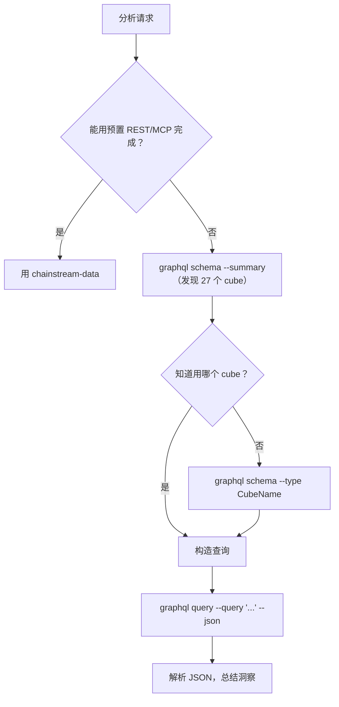

## 概述

`chainstream-graphql` skill 让 AI Agent 通过 GraphQL 灵活地、类 SQL 地访问 ChainStream 的链上数据仓库。当预置的 REST/MCP 端点表达能力不够时，它是合适的工具——跨 cube JOIN、自定义聚合、多条件过滤、自定义时间序列粒度，或只有 GraphQL 才暴露的数据（例如 PolyMarket 预测 cube）。

- **模式**：Tool（只读，不签名）
- **端点**：`https://graphql.chainstream.io/graphql`（经 APISIX 路由）
- **CLI**：`npx @chainstream-io/cli graphql`
- **认证**：`X-API-KEY` 传入 API Key，或使用 SIWX 钱包 token
- **计费**：与 REST 共用同一个 API Key / 订阅池（x402 / MPP 由 CLI 自动处理）
- **范围**：3 个链组、27 个 cube——`Solana`、`EVM(network: eth | bsc | polygon)`、`Trading`

## 何时使用

与 `chainstream-data` 的选用矩阵：

| 场景 | 使用 | 原因 |
|----------|-----|-----|
| 标准代币搜索、市场趋势、钱包画像 | `chainstream-data` | 有预置的 REST / MCP，更简单 |
| 跨 cube JOIN（trades + transfers、pools + events） | **chainstream-graphql** | 支持 `joinXxx` |
| 自定义聚合（`groupBy` 配合 count / sum / avg） | **chainstream-graphql** | 指标 + 维度分组 |
| 多条件过滤（嵌套、通过 `any` 实现 OR） | **chainstream-graphql** | 完整过滤算子 |
| 带自定义粒度 / 桶的时间序列 | **chainstream-graphql** | 时间区间分桶 |
| 预测市场数据（Polygon 上的 PolyMarket） | **chainstream-graphql** | `PredictionTrades / Managements / Settlements` cube |

## 集成路径



## 通道矩阵

GraphQL 是一个接口，被不同调用方使用：

| 操作 | CLI 命令 | SDK 方法 |
|-----------|-------------|------------|
| 列出全部 cube（概要） | `graphql schema --summary` | 无——用 CLI 发现 |
| 深入单个 cube | `graphql schema --type <CubeName>` | 无 |
| 完整 schema 参考 | `graphql schema --full` | 无 |
| 强制刷新缓存 schema | `graphql schema --summary --refresh` | 无 |
| 内联查询 | `graphql query --query '<gql>'` | `client.graphql.query(gql)` |
| 从文件查询 | `graphql query --file ./q.graphql` | `client.graphql.query(fs.readFileSync(...))` |
| 带变量查询 | `graphql query --query '...' --var '{"k":"v"}'` | `client.graphql.query(gql, vars)` |
| 机器可读输出 | 追加 `--json` | 原生 JSON 返回 |

## AI 工作流

### 探索 Schema

Agent 不清楚用哪个 cube 时，总是从这里开始。

```bash
npx @chainstream-io/cli graphql schema --summary
npx @chainstream-io/cli graphql schema --type DEXTrades
```

`--summary` 返回 27 个 cube 按链（EVM / Solana / Trading）分组的紧凑目录，包括顶层字段和说明。`--type` 展开单个 cube 的字段树以便构造查询。

### 构造并执行查询

Schema 以 **链组包装器** 作为顶层入口。

<Tabs>
  <Tab title="Solana">
    ```graphql
    query {
      Solana {
        DEXTrades(
          limit: { count: 25 }
          orderBy: { descending: Block_Time }
        ) {
          Block { Time }
          Trade {
            Buy  { Currency { MintAddress } Amount PriceInUSD }
            Sell { Currency { MintAddress } Amount }
            Dex  { ProtocolName }
          }
        }
      }
    }
    ```
  </Tab>
  <Tab title="EVM">
    ```graphql
    query {
      EVM(network: eth) {
        DEXTrades(
          limit: { count: 25 }
          orderBy: { descending: Block_Time }
          where: { Trade: { Buy: { Amount: { gt: "0" } } } }
        ) {
          Block { Time }
          Trade { Buy { Currency { Symbol } Amount } Sell { Currency { Symbol } Amount } }
        }
      }
    }
    ```
  </Tab>
  <Tab title="Trading">
    ```graphql
    query {
      Trading {
        Pairs(
          tokenAddress: { is: "So11111111111111111111111111111111111111112" }
          limit: { count: 24 }
        ) {
          TimeMinute
          Price { Open High Low Close }
        }
      }
    }
    ```
  </Tab>
</Tabs>

通过 CLI 执行：

```bash
npx @chainstream-io/cli graphql query --file ./query.graphql --json
```

或内联：

```bash
npx @chainstream-io/cli graphql query \
  --query 'query { Solana { DEXTrades(limit:{count:5}) { Block { Time } } } }' \
  --json
```

## 查询构造速查

- **链组包装器**：顶层必需。`Solana`、`EVM(network: ...)` 或 `Trading`。
- **`network`**：仅 `EVM` 可用。取值：`eth`、`bsc`、`polygon`。
- **`limit`**：`{ count: N, offset: M }`。默认 25。
- **`orderBy`**：`{ descending: Field }` / `{ ascending: Field }`。计算字段用 `{ descendingByField: "field_name" }`。
- **`where`**：`{ Group: { Field: { operator: value } } }`。OR 条件通过 `any: [{...}, {...}]`。
- **DateTime 格式**：`"YYYY-MM-DD HH:MM:SS"`——**不带 `T`、不带 `Z`**（ClickHouse 要求）。
- **DateTime 过滤器**：`since`、`till`、`after`、`before`——**禁止** 在 DateTime 字段上用 `gt` / `lt`。
- **`joinXxx`**：到关联 cube 的 LEFT JOIN。优先于多次查询。
- **`dataset`** 包装参数：`realtime`、`archive`、`combined`（默认）。
- **`aggregates`** 包装参数：`yes`、`no`、`only`。

## 链组与 Cube

| 链组 | 包装器 | Cube |
|-------------|---------|-------|
| **Solana** | `Solana { ... }` | DEXTrades、DEXTradeByTokens、Transfers、BalanceUpdates、Blocks、Transactions、DEXPools、Instructions、InstructionBalanceUpdates、Rewards、DEXOrders、TokenSupplyUpdates |
| **EVM** | `EVM(network: eth\|bsc\|polygon) { ... }` | DEXTrades、DEXTradeByTokens、Transfers、BalanceUpdates、Blocks、Transactions、DEXPoolEvents、Events、Calls、MinerRewards、DEXPoolSlippages、TokenHolders、TransactionBalances、Uncles、PredictionTrades\*、PredictionManagements\*、PredictionSettlements\* |
| **Trading** | `Trading { ... }` | Pairs、Tokens、Currencies、Trades |

\* Prediction cube 仅在 `polygon` 网络可用。

## 安全规则

<Warning>
以下规则由 skill 强制执行，以保证查询正确并避免浪费配额。
</Warning>

| 规则 | 原因 |
|------|--------|
| 禁止使用扁平的 `CubeName(network: sol)`——必须放到链组包装器里 | 服务端拒绝未包装的查询 |
| 禁止猜字段名——先跑 `graphql schema --type <cube>` | 避免反复的 "field does not exist" 报错 |
| 禁止用 ISO-8601 `"2026-03-31T00:00:00Z"`——用 `"2026-03-31 00:00:00"` | ClickHouse DateTime 格式 |
| DateTime 禁止 `gt` / `lt`——用 `since` / `after` / `before` / `till` | DateTime 过滤器有专用名 |
| 能用 `joinXxx` 合并就不要拆成多次查询 | 一次计费请求代替多次 |
| 禁止自动选择付费套餐——始终让用户选 | 计费知情同意 |

## 错误恢复

| 错误 | 恢复方式 |
|-------|----------|
| 401 / "Not authenticated" | `config auth`——未登录则跑 `login`（首次自动赠送 nano trial，50K CU）。随后重试。 |
| 402 / "Payment required" | `plan status`；无订阅则 `wallet pricing` → `plan purchase --plan <choice>`。参见 [x402 支付](/cn/docs/platform/billing-payments/x402-payments)。 |
| `GraphQL error: field X does not exist` | 用 `graphql schema --type <cube>` 复核字段名。 |
| 429 | 等 1 秒，指数退避。 |
| 5xx | 2 秒后重试一次。 |

## 相关

<CardGroup cols={2}>
  <Card title="chainstream-data" icon="magnifying-glass" href="/cn/docs/ai-agents/agent-skills/chainstream-data">
    代币、市场、钱包分析的标准 REST/MCP 查询
  </Card>
  <Card title="chainstream-defi" icon="right-left" href="/cn/docs/ai-agents/agent-skills/chainstream-defi">
    分析之后执行交易——swap、发币
  </Card>
  <Card title="GraphQL 接入方式" icon="diagram-project" href="/cn/docs/access-methods/graphql">
    端点参考、认证、schema 概览
  </Card>
  <Card title="CLI `graphql` 子命令" icon="terminal" href="/cn/docs/access-methods/cli#graphql-subcommand">
    `chainstream graphql schema` 和 `query` 参考
  </Card>
</CardGroup>
