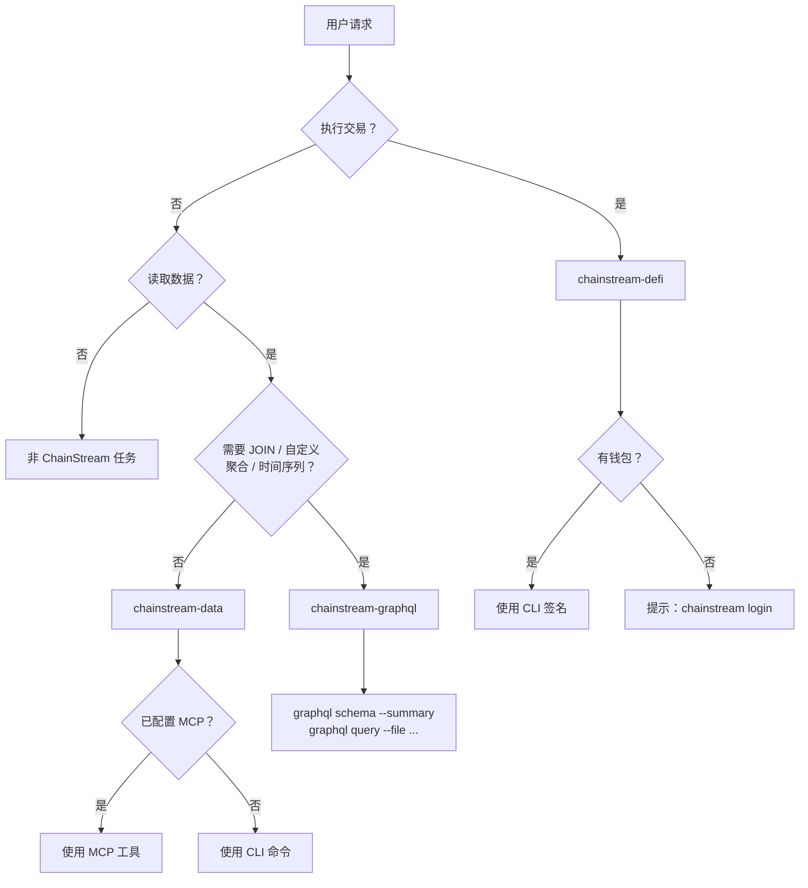

## 什么是 Agent Skills

Agent Skills 是结构化的指令包（`SKILL.md` 文件），用于教 AI 编程助手如何使用 ChainStream 的链上数据和 DeFi 能力。与原始 API 文档不同，Skills 提供了**决策树、工作流、安全规则和错误恢复** — AI Agent 自主运行所需的一切。

<CardGroup cols={3}>
  <Card title="chainstream-data" icon="magnifying-glass" color="#4D9CFF">
    **Tool 模式** — 只读链上数据：代币分析、市场趋势、钱包画像、WebSocket 流
  </Card>
  <Card title="chainstream-graphql" icon="diagram-project" color="#10B981">
    **Tool 模式** — 基于 27 个 cube 的自定义 GraphQL 分析：跨 cube JOIN、聚合、时间序列
  </Card>
  <Card title="chainstream-defi" icon="right-left" color="#9333EA">
    **Process 模式** — 不可逆 DeFi 执行：兑换、Launchpad、交易广播
  </Card>
</CardGroup>

## Skills vs MCP vs SDK

| 层级 | 定义 | 适用场景 |
|------|------|----------|
| **Agent Skills** | 高层 AI 指令集（SKILL.md），含决策树、工作流和安全规则 | AI 编程助手（Cursor、Claude Code、Codex） |
| **MCP Server** | Model Context Protocol — 17 个可被 AI 模型调用的工具 | AI 聊天助手（Claude Desktop、ChatGPT） |
| **CLI** | 命令行工具，内置钱包和 x402 支付 | 脚本、CI/CD、需要 DeFi 的 AI Agent |
| **SDK** | TypeScript/Python/Go/Rust 客户端库 | 自定义应用 |

Skills 处于**最高抽象层** — 内部引用 MCP 工具和 CLI 命令，将 AI Agent 路由到每个任务的正确工具。

## 路由决策树

## Skill 对比

| 方面 | chainstream-data | chainstream-graphql | chainstream-defi |
|------|------------------|---------------------|------------------|
| 模式 | Tool（只读） | Tool（只读） | Process（执行） |
| 风险等级 | 低 | 低 | 高（不可逆） |
| 需要钱包 | 否（API Key 即可） | 否（API Key 即可） | 是（需要签名） |
| MCP 支持 | 完整（17 个工具） | 由 CLI 驱动 | 工具可用，但执行需宿主侧钱包 |
| 用户确认 | 不需要 | 不需要 | **每次交易前强制确认** |
| 典型操作 | 搜索、分析、追踪、流式 | JOIN、聚合、时间序列、复杂 WHERE | 兑换、发币、广播 |
| 最适合 | 通过预置端点做标准分析 | REST 不暴露的自定义分析 | 交易、发币、签名 |

## 共享资源

所有 Skill 共享通用参考文档：

| 资源 | 内容 |
|------|------|
| **认证** | 四种认证路径（API Key、钱包登录、原始私钥、Tempo MPP） |
| **x402 支付** | x402 和 MPP 支付协议、套餐选择流程 |
| **错误处理** | HTTP 状态码、重试策略、DeFi 专属错误 |
| **链** | 支持链矩阵、原生代币地址、区块浏览器 |

## 支持的平台

Skills 适用于任何支持 `SKILL.md` 文件的 AI 编程助手：

| 平台 | 安装方式 |
|------|----------|
| Cursor | 通过 `.cursor-plugin/` 自动发现 |
| Claude Code | `/plugin install chainstream` |
| Codex | Clone + 符号链接 |
| OpenCode | Clone + 符号链接 |
| Gemini CLI | `gemini extensions install` |

详见[安装指南](/cn/docs/ai-agents/agent-skills/installation)。

## 下一步

<CardGroup cols={2}>
  <Card title="安装" icon="download" href="/cn/docs/ai-agents/agent-skills/installation">
    在你的平台上配置 Skills
  </Card>
  <Card title="chainstream-data" icon="magnifying-glass" href="/cn/docs/ai-agents/agent-skills/chainstream-data">
    标准数据查询与分析
  </Card>
  <Card title="chainstream-graphql" icon="diagram-project" href="/cn/docs/ai-agents/agent-skills/chainstream-graphql">
    自定义 GraphQL 分析、JOIN、聚合
  </Card>
  <Card title="chainstream-defi" icon="right-left" href="/cn/docs/ai-agents/agent-skills/chainstream-defi">
    DeFi 执行工作流
  </Card>
  <Card title="MCP Server" icon="plug" href="/cn/docs/ai-agents/mcp-server/introduction">
    底层 MCP 协议
  </Card>
</CardGroup>
