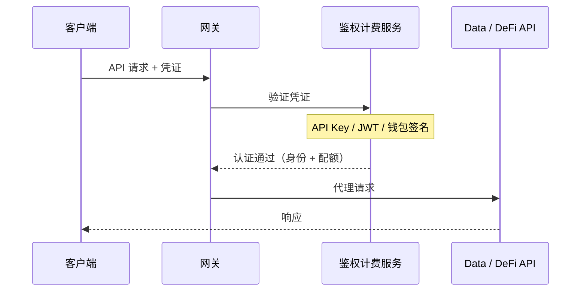

## 架构

所有 API 请求都经过**网关**，网关在转发到后端服务之前验证凭证。网关将认证和配额检查委托给内部的**鉴权计费服务**，确保每个请求在一次跳转中完成验证。



当认证失败时，网关直接返回错误（401 Unauthorized，或在启用 x402 时返回 402 Payment Required），不会触达后端。

---

## 三种认证方式

ChainStream 支持 **三种** 凭证类型，按以下顺序评估：

| 优先级 | 方式 | 请求头 | 适用场景 |
|--------|------|--------|----------|
| 1 | **钱包签名 (SIWX)** | `Authorization: SIWX <token>` | 拥有链上钱包的 AI Agent（x402 订阅用户） |
| 2 | **API Key** | `X-API-KEY: <key>` | 应用、脚本、CLI、MCP Server |
| 3 | **JWT Bearer Token** | `Authorization: Bearer <jwt>` | 使用 OAuth 2.0 Client Credentials 的 Dashboard 应用 |

<Info>
如果没有找到有效凭证且启用了 x402，网关将返回 **HTTP 402 Payment Required**，并指向 `/x402/purchase`。这使 AI Agent 能够自动购买订阅。
</Info>

---

## 方式一：API Key（推荐）

最简单的认证方式。在 Dashboard 创建 API Key，通过 `X-API-KEY` 请求头传递。

### 获取 API Key

<Steps>
  <Step title="登录 Dashboard">
    访问 [ChainStream Dashboard](https://www.chainstream.io/dashboard) 并登录
  </Step>
  <Step title="进入应用管理">
    在侧边栏找到"Applications"
  </Step>
  <Step title="创建新应用">
    点击"Create New App"生成你的 API Key
  </Step>
</Steps>

### 使用 API Key

<Tabs>
  <Tab title="cURL">
```bash
curl https://api.chainstream.io/v2/token/sol/So11111111111111111111111111111111111111112 \
  -H "X-API-KEY: your_api_key"
```
  </Tab>
  <Tab title="SDK">
```typescript
import { ChainStreamClient } from "@chainstream-io/sdk";

const cs = new ChainStreamClient({
  apiKey: "your_api_key",
});

const token = await cs.token.getToken("So11111111111111111111111111111111111111112", "solana");
```
  </Tab>
  <Tab title="CLI">
```bash
chainstream config set --key apiKey --value your_api_key
chainstream token info --chain sol --address So11111111111111111111111111111111111111112
```
  </Tab>
  <Tab title="MCP Server">
```bash
export CHAINSTREAM_API_KEY=your_api_key
npx @chainstream-io/mcp
```
  </Tab>
</Tabs>

### 工作原理

1. 网关提取 `X-API-KEY` 请求头
2. 鉴权服务在数据库中验证该 Key
3. 验证通过后，请求携带关联的组织和权限上下文转发到后端
4. Key 必须为 `active` 状态且未过期

<Warning>
请妥善保管你的 API Key。切勿将其提交到代码仓库。如果泄露，请立即在 Dashboard 中撤销。
</Warning>

---

## 方式二：JWT Bearer Token（OAuth 2.0）

适用于使用 OAuth 2.0 Client Credentials 流程的应用。用 Client ID 和 Client Secret 换取 JWT 访问令牌。

### 生成 Access Token

<Tabs>
  <Tab title="cURL">
```bash
curl -X POST "https://dex.asia.auth.chainstream.io/oauth/token" \
  -H "Content-Type: application/json" \
  -d '{
    "client_id": "YOUR_CLIENT_ID",
    "client_secret": "YOUR_CLIENT_SECRET",
    "audience": "https://api.dex.chainstream.io",
    "grant_type": "client_credentials"
  }'
```
  </Tab>
  <Tab title="JavaScript">
```javascript
const response = await fetch('https://dex.asia.auth.chainstream.io/oauth/token', {
  method: 'POST',
  headers: { 'Content-Type': 'application/json' },
  body: JSON.stringify({
    client_id: 'YOUR_CLIENT_ID',
    client_secret: 'YOUR_CLIENT_SECRET',
    audience: 'https://api.dex.chainstream.io',
    grant_type: 'client_credentials'
  })
});

const { access_token } = await response.json();
```
  </Tab>
  <Tab title="Python">
```python
import requests

response = requests.post(
    'https://dex.asia.auth.chainstream.io/oauth/token',
    json={
        'client_id': 'YOUR_CLIENT_ID',
        'client_secret': 'YOUR_CLIENT_SECRET',
        'audience': 'https://api.dex.chainstream.io',
        'grant_type': 'client_credentials'
    }
)

access_token = response.json()['access_token']
```
  </Tab>
</Tabs>

### 使用 Token

```bash
curl https://api.chainstream.io/v2/token/sol/So11111111111111111111111111111111111111112 \
  -H "Authorization: Bearer YOUR_ACCESS_TOKEN"
```

### 工作原理

1. 网关提取 `Authorization: Bearer <jwt>` 请求头
2. 鉴权服务验证 JWT 签名、签发者和受众
3. 从 token 中的 `client_id` 解析到组织，用于配额跟踪

### Token 详情

- **有效期**：默认 24 小时
- **算法**：RS256
- **Issuer**：`https://dex.asia.auth.chainstream.io/`
- **Audience**：`https://api.dex.chainstream.io`

### Scope 权限

某些端点需要特定的 scope：

| Scope | 说明 | 适用端点 |
|-------|------|----------|
| `webhook.read` | Webhook 读取权限 | 查询 Webhook 配置 |
| `webhook.write` | Webhook 写入权限 | 创建/修改/删除 Webhook |
| `kyt.read` | KYT 读取权限 | 查询风险评估结果 |
| `kyt.write` | KYT 写入权限 | 提交交易/地址进行风险评估 |

```javascript
const response = await auth0Client.oauth.clientCredentialsGrant({
  audience: 'https://api.dex.chainstream.io',
  scope: 'webhook.read webhook.write kyt.read kyt.write'
});
```

<Note>
如果不指定 scope，token 可以访问所有通用 API 端点。仅在访问 Webhook 和 KYT 端点时需要 scope。
</Note>

---

## 方式三：钱包签名 (SIWX)

适用于拥有链上钱包并通过 [x402 支付](/cn/guides/getting-started/x402-payments) 购买了订阅的 AI Agent。使用 **Sign-In with X (SIWX)** 标准（EVM 为 EIP-4361，Solana 为等效协议）。

### 工作原理

1. Agent 构造标准的签名登录消息，包含 domain、address、nonce 和过期时间
2. Agent 用钱包私钥签名消息
3. 签名后的 token 以 `Authorization: SIWX base64(message).signature` 发送
4. 鉴权服务验证签名并检查是否存在有效的 x402 订阅
5. 如果存在有效且未过期的订阅，认证成功

### Token 格式

```
Authorization: SIWX base64(message).signature
```

消息遵循 EIP-4361 格式：

```
api.chainstream.io wants you to sign in with your Ethereum account:
0xYourWalletAddress

Sign in to ChainStream API

URI: https://api.chainstream.io
Version: 1
Chain ID: 8453
Nonce: abc123
Issued At: 2026-03-26T10:00:00Z
Expiration Time: 2026-03-27T10:00:00Z
```

### 支持的链

| 链 | 地址格式 | 签名类型 |
|----|---------|---------|
| EVM（Base、Ethereum） | `0x` 前缀，40 位十六进制 | EIP-191 personal_sign |
| Solana | Base58 编码，32-44 字符 | Ed25519 |

### SDK 用法

```typescript
const cs = new ChainStreamClient({
  auth: {
    type: "siwx",
    address: "0xYourWalletAddress",
    signMessage: async (message: string) => {
      return await wallet.signMessage(message);
    },
  },
});
```

<Note>
SIWX 认证需要有效的 x402 订阅。如果订阅已过期，请求将被拒绝。参见 [x402 支付](/cn/guides/getting-started/x402-payments) 了解如何购买订阅。
</Note>

---

## WebSocket 认证

WebSocket 连接使用相同的三种认证方式。网关会：

1. 检测 WebSocket 升级请求
2. 在允许握手之前验证凭证
3. 跟踪会话用于用量计量
4. 断开连接时上报使用指标（传输字节数、持续时间）

WebSocket token 也可以作为查询参数传递：

```
wss://realtime-dex.chainstream.io/connection/websocket?token=YOUR_ACCESS_TOKEN
```

---

## 认证优先级

当单个请求中存在多种凭证时，按以下顺序评估：

1. **SIWX** — 如果 `Authorization` 头以 `SIWX ` 开头且配置了 x402
2. **API Key** — 如果存在 `X-API-KEY` 头
3. **JWT Bearer** — 如果 `Authorization` 头以 `Bearer ` 开头
4. **402 Payment Required** — 如果没有凭证匹配且启用了 x402

第一个成功匹配的方式生效，后续方式不再评估。

---

## API 端点

| 服务 | URL |
|------|-----|
| 主网 API | `https://api.chainstream.io/` |
| WebSocket | `wss://realtime-dex.chainstream.io/connection/websocket` |
| Auth 服务（OAuth） | `https://dex.asia.auth.chainstream.io/` |
| x402 定价 | `https://api.chainstream.io/x402/pricing` |
| x402 购买 | `https://api.chainstream.io/x402/purchase` |

---

## 选择认证方式

<CardGroup cols={3}>
  <Card title="API Key" icon="key" color="#4D9CFF">
    **适用于**：应用、脚本、CLI、MCP Server

    最简单的设置。在 Dashboard 创建，作为请求头传递。无需刷新 token。
  </Card>
  <Card title="JWT Bearer" icon="shield-check" color="#9333EA">
    **适用于**：Dashboard 应用、服务端对服务端

    标准 OAuth 2.0 流程。支持 scope 权限控制。Token 有效期 24 小时。
  </Card>
  <Card title="SIWX 钱包" icon="wallet" color="#16A34A">
    **适用于**：拥有链上钱包的 AI Agent

    基于钱包的原生认证，通过 x402 订阅。无需管理 API Key。
  </Card>
</CardGroup>

---

## 常见问题

<AccordionGroup>
  <Accordion title="应该使用哪种方式？">
    **API Key** 适用于大多数场景。设置最简单，兼容所有 ChainStream 产品（SDK、CLI、MCP Server）。如果需要 OAuth 2.0 集成和 scope 权限控制，使用 **JWT**。如果你在构建拥有自己钱包的 AI Agent 并希望通过 x402 付费，使用 **SIWX**。
  </Accordion>
  <Accordion title="Token 过期了怎么办？">
    JWT：使用 Client ID 和 Client Secret 重新生成 token。SIWX：用新的过期时间重新签名消息。API Key 除非你在 Dashboard 设置了过期日期，否则不会过期。
  </Accordion>
  <Accordion title="可以同时使用多种认证方式吗？">
    每个请求只评估一种方式。如果同时发送 `X-API-KEY` 和 `Authorization: Bearer`，API Key 优先（优先级：SIWX > API Key > JWT）。
  </Accordion>
  <Accordion title="什么是 402 Payment Required 响应？">
    当没有找到有效凭证且启用了 x402 时，网关返回 HTTP 402 并附带购买订阅的指引（`/x402/purchase`）。这使 AI Agent 能够自动购买访问权限。参见 [x402 支付](/cn/guides/getting-started/x402-payments)。
  </Accordion>
  <Accordion title="如何撤销凭证？">
    **API Key**：在 Dashboard 删除应用，Key 立即失效。**JWT**：在 Dashboard 撤销 Client ID/Secret。**SIWX**：订阅自然过期，无需手动撤销。
  </Accordion>
</AccordionGroup>
