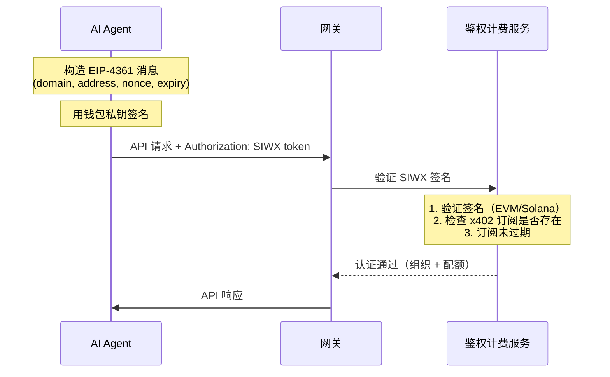

Sign-In with X (SIWX) 允许你在每个 API 请求中通过钱包签名进行认证 — 无需 API Key 或 OAuth Token。这是为**拥有链上钱包并通过 [x402 支付](/cn/guides/getting-started/x402-payments) 购买了订阅的 AI Agent** 设计的。

<Info>
SIWX 替代了 API Key。你不需要传 `X-API-KEY`，而是在每个请求中传 `Authorization: SIWX <token>`。网关实时验证签名并检查是否有有效的 x402 订阅。
</Info>

## 工作原理

与传统的 challenge/response 流程不同，SIWX 是**无状态且自包含的**。客户端在本地构造并签名消息，然后附加到每个请求上。



### 分步说明

1. **构造 EIP-4361 消息**，包含钱包地址、domain、nonce 和过期时间
2. **用钱包私钥签名消息**
3. **编码为 SIWX token**：`base64(message).signature`
4. **附加到每个 API 请求**：`Authorization: SIWX <token>`
5. 网关验证签名并检查该钱包是否有有效的 x402 订阅
6. 验证通过后，请求正常处理（等同于 API Key 认证）

## Token 格式

```
Authorization: SIWX base64(message).signature
```

消息遵循 EIP-4361 标准：

```
api.chainstream.io wants you to sign in with your Ethereum account:
0xYourWalletAddress

Sign in to ChainStream API

URI: https://api.chainstream.io
Version: 1
Chain ID: 8453
Nonce: abc123def456
Issued At: 2026-03-26T10:00:00Z
Expiration Time: 2026-03-27T10:00:00Z
```

### 必填字段

| 字段 | 说明 |
|---|---|
| Domain | 必须为 `api.chainstream.io` |
| Address | 你的钱包地址（EVM `0x...` 或 Solana base58） |
| URI | `https://api.chainstream.io` |
| Version | `1` |
| Nonce | 随机字符串（客户端生成，用于防重放） |
| Issued At | ISO 8601 时间戳 |
| Expiration Time | ISO 8601 时间戳（超过此时间 token 将被拒绝） |

<Note>
过期时间由客户端设置。你可以签署有效期为几分钟、几小时或几天的消息。更长的有效期意味着更少的重签，但更短的有效期更安全。
</Note>

## 支持的链

| 链 | 地址格式 | 签名验证方式 |
|---|---|---|
| EVM（Base、Ethereum） | `0x` 前缀，40 位十六进制 | EIP-191 `personal_sign` 恢复 |
| Solana | Base58 编码，32-44 字符 | Ed25519 签名验证 |

## 前提条件

SIWX 认证需要与钱包地址关联的**有效 x402 订阅**。没有订阅时，网关会拒绝请求并返回错误。

获取订阅：

```bash
# 通过 CLI（自动）
chainstream login
chainstream token info --chain sol --address So11111111111111111111111111111111111111112
# → 402 触发套餐选择 → x402 支付 → API Key 已保存

# 或通过直接 x402 购买
curl https://api.chainstream.io/x402/purchase?plan=nano
# → 按 x402 支付流程操作
```

详见 [x402 支付](/cn/guides/getting-started/x402-payments)。

## 使用示例

### cURL

```bash
# 1. 构造并签名消息（使用你偏好的工具）
# 2. Base64 编码消息并附加签名
TOKEN="base64EncodedMessage.signatureHex"

# 3. 在任何 API 调用中使用
curl https://api.chainstream.io/v2/token/sol/So11111111111111111111111111111111111111112 \
  -H "Authorization: SIWX $TOKEN"
```

### SDK

```typescript
import { ChainStreamClient } from "@chainstream-io/sdk";

const cs = new ChainStreamClient({
  auth: {
    type: "siwx",
    address: "0xYourWalletAddress",
    signMessage: async (message: string) => {
      return await wallet.signMessage(message);
    },
  },
});

const token = await cs.token.getToken("So11111111111111111111111111111111111111112", "sol");
```

### CLI

使用钱包登录后，CLI 会自动使用 SIWX：

```bash
chainstream login
chainstream token info --chain sol --address So11111111111111111111111111111111111111112
```

## SIWX 与 API Key 对比

| | SIWX | API Key |
|---|---|---|
| **请求头** | `Authorization: SIWX <token>` | `X-API-KEY: <key>` |
| **凭证管理** | 无需存储 Key — 按需签名 | 需要存储和保护 Key |
| **前提条件** | 钱包 + x402 订阅 | Dashboard 账号 |
| **适用场景** | 拥有钱包的 AI Agent | 应用、脚本、MCP |
| **Token 过期** | 由客户端设置（每条消息） | 在 Dashboard 设置（或永不过期） |

## 安全注意事项

- **无状态**：没有服务端会话。每个请求独立验证。
- **过期控制**：客户端通过 `Expiration Time` 字段控制 token 有效期。过期 token 会被拒绝。
- **域名绑定**：消息包含 `api.chainstream.io` 作为域名。为其他域名的签名会被拒绝。
- **无私钥泄露**：钱包只签署明文消息 — 私钥永远不会被传输。
- **订阅检查**：即使签名有效，如果钱包没有有效的 x402 订阅，请求也会被拒绝。
