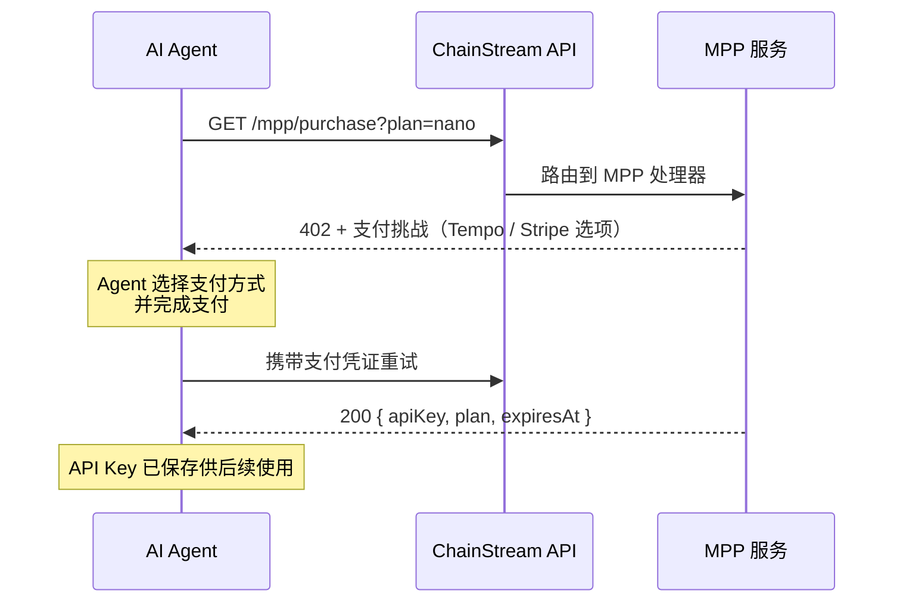

MPP（Machine Payment Protocol）是为 AI Agent 和自动化系统设计的支付协议。它是 x402 的超集，在统一的流程中同时支持 **Tempo 稳定币支付**和 **Stripe 信用卡支付**。

<Info>
与仅支持链上 USDC 的 x402 不同，MPP 额外支持 Tempo 网络稳定币和传统信用卡支付。
</Info>

## 工作原理



### 详细流程

1. **Agent 调用** `GET /mpp/purchase?plan=<plan>`，不带支付凭证
2. **MPP 服务返回 402**，附带 `WWW-Authenticate: Payment` 挑战，包含金额、货币和收款方
3. **Agent 使用 Tempo Wallet 或 Stripe 签署支付**
4. **Agent 携带 `Authorization: Payment` 凭证重试**购买请求
5. **MPP 服务验证支付**，创建订阅，返回 API Key

## 支持的支付方式

| 方式 | 网络 | 货币 | Gas 费 | 适用场景 |
|------|------|------|--------|----------|
| **Tempo** | Tempo（链 ID 4217） | USDC.e (ERC-20) | **免费**（gas 用稳定币支付） | AI Agent，无需 ETH |
| **Stripe** | 传统支付 | USD（信用卡） | 不适用 | 有信用卡的 Agent，无需加密货币 |

<Tip>
Tempo 支付不需要原生 gas 代币 — gas 直接用稳定币支付。这使其非常适合只持有稳定币的 AI Agent。
</Tip>

## API 端点

| 端点 | 方法 | 说明 |
|------|------|------|
| `/mpp/purchase?plan=<plan>` | GET / POST | 通过 MPP 购买订阅 |
| `/mpp/pricing` | GET | 列出可用套餐和支付方式 |
| `/mpp/health` | GET | 健康检查 |

### 定价响应

```bash
curl https://api.chainstream.io/mpp/pricing
```

```json
{
  "plans": [
    { "name": "nano", "priceUsd": 5, "quotaTotal": 500000, "durationDays": 30 },
    { "name": "starter", "priceUsd": 199, "quotaTotal": 10000000, "durationDays": 30 }
  ],
  "currency": "USD",
  "paymentMethods": ["tempo", "stripe"],
  "note": "Prices in USD. Pay via MPP (Tempo stablecoin or Stripe card)."
}
```

### 购买响应（成功）

```json
{
  "status": "ok",
  "plan": "nano",
  "expiresAt": "2026-04-25T12:00:00.000Z",
  "apiKey": "cs_live_..."
}
```

## CLI 使用

ChainStream CLI 在自动购买流程中支持 MPP 作为支付选项：

```bash
chainstream token info --chain sol --address So11111111111111111111111111111111111111112
# → 402 → 套餐选择 → 选择 "MPP Tempo" → 支付 → API Key 已保存
```

对于没有 ChainStream 钱包的 Agent，CLI 会打印 Tempo 命令：

```bash
tempo request "https://api.chainstream.io/mpp/purchase?plan=nano"
```

## 手动集成（Tempo Wallet）

### 安装

安装 Tempo Wallet CLI 并登录（首次需通过浏览器进行 passkey 认证）：

```bash
curl -fsSL https://tempo.xyz/install | bash
tempo wallet login
```

<Note>
Tempo Wallet 使用 passkey (WebAuthn) 认证。首次设置需要浏览器交互。之后会话持久化，Agent 操作无需再次浏览器交互。
</Note>

### 购买

```bash
# 查看余额
tempo wallet balance

# 购买套餐（自动处理 402 → 签名 → 重试）
tempo request "https://api.chainstream.io/mpp/purchase?plan=nano"
```

Tempo CLI 自动处理 `WWW-Authenticate: Payment` 挑战，签署交易，并在成功后返回 API Key。

### 兼容的钱包

Tempo 兼容 EVM（链 ID 4217）。任何在 Tempo 上持有 USDC.e 的钱包都可以使用：

- **Tempo Wallet CLI**（`tempo request`）— 推荐，passkey 认证，内置 MPP 支持
- 任何 EVM 钱包（MetaMask、Coinbase CDP、Privy）— 添加 Tempo 为自定义网络

## MPP 与 x402 对比

| | MPP | x402 |
|---|---|---|
| **支付方式** | Tempo 稳定币 + Stripe 信用卡 | 仅链上 USDC |
| **网络** | Tempo（链 ID 4217）+ Stripe | Base (EVM) + Solana |
| **Gas 费** | 免费（Tempo）/ 不适用（Stripe） | 免费（facilitator 代付） |
| **是否必须加密钱包** | 否（有 Stripe 选项） | 是 |
| **购买端点** | `/mpp/purchase` | `/x402/purchase` |
| **协议** | MPP（HTTP 402） | x402 协议 |
| **适用场景** | 没有加密钱包的 Agent | 在 Base/Solana 上有 USDC 的 Agent |

## 下一步

<CardGroup cols={2}>
  <Card title="x402 支付协议" icon="money-bill-wave" href="/cn/docs/platform/billing-payments/x402-payments">
    通过 x402 协议进行链上 USDC 支付
  </Card>
  <Card title="计费与配额" icon="receipt" href="/cn/docs/platform/billing-payments/plans-and-units">
    了解 CU 消耗和套餐详情
  </Card>
</CardGroup>
