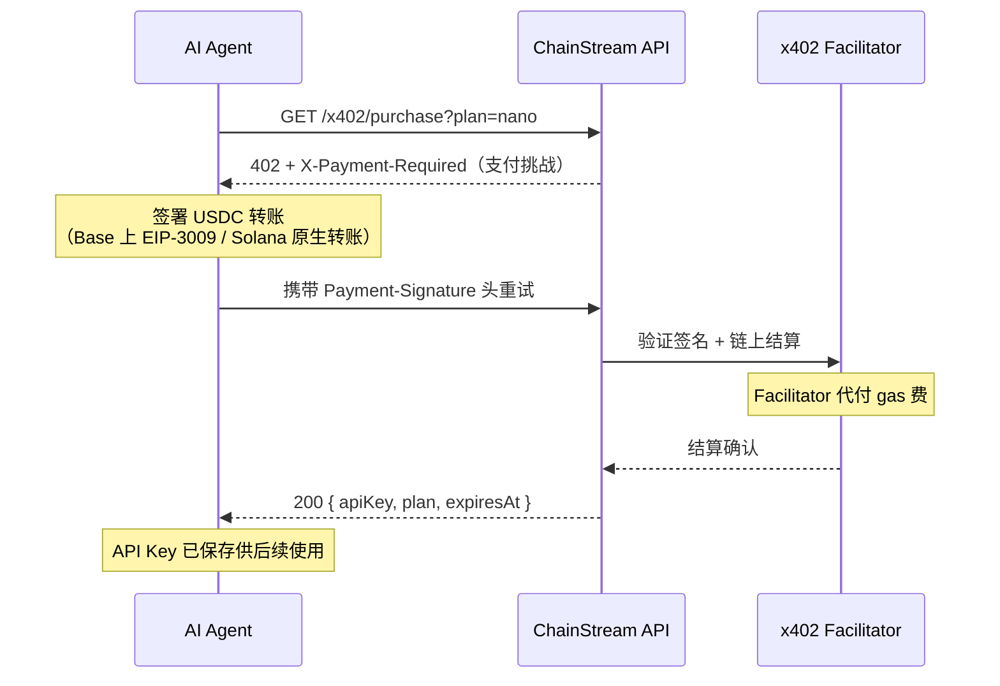

x402 是基于 HTTP 402 Payment Required 状态码的支付协议。它实现了机器对机器的 API 微支付，无需手动计费、信用卡或订阅管理。使用 USDC 按需付费，即时获得 API 访问权限。

## 工作原理



### 详细流程

1. **客户端发送请求**到 ChainStream API，没有 API Key 或 Key 已过期。

2. **网关返回 HTTP 402**，消息指向 `/x402/purchase`。

3. **客户端调用 `GET /x402/purchase?plan=<plan>`**（不带支付头）。服务器返回 HTTP 402 及 x402 支付要求：

   | 响应头 | 说明 |
   |---|---|
   | `X-Payment-Required` | Base64 编码的 JSON 支付详情 |
   | `Payment-Required` | 相同值（兼容 x402 客户端） |

   解码后的 JSON 遵循 x402 v2 协议：

   ```json
   {
     "x402Version": 2,
     "resource": {
       "url": "/x402/purchase?plan=nano",
       "description": "ChainStream API access: nano plan"
     },
     "accepts": [
       {
         "scheme": "exact",
         "network": "eip155:8453",
         "asset": "0x833589fCD6eDb6E08f4c7C32D4f71b54bdA02913",
         "amount": "5000000",
         "payTo": "0xRecipientAddress",
         "maxTimeoutSeconds": 60
       },
       {
         "scheme": "exact",
         "network": "solana:5eykt4UsFv8P8NJdTREpY1vzqKqZKvdp",
         "asset": "EPjFWdd5AufqSSqeM2qN1xzybapC8G4wEGGkZwyTDt1v",
         "amount": "5000000",
         "payTo": "SolanaRecipientAddress",
         "maxTimeoutSeconds": 60
       }
     ]
   }
   ```

4. **客户端使用 `@x402` SDK 签署 USDC 转账**，并携带支付证明重试 `GET /x402/purchase?plan=<plan>`：

   | 请求头 | 说明 |
   |---|---|
   | `Payment-Signature` | Base64 编码的签名支付载荷 |

5. **服务器验证并结算支付**，返回订阅详情：

   ```json
   {
     "status": "ok",
     "plan": "nano",
     "chain": "evm",
     "address": "0xPayerAddress",
     "expiresAt": "2026-04-25T12:00:00.000Z",
     "txHash": "0xabc123...",
     "apiKey": "cs_live_..."
   }
   ```

   客户端保存 `apiKey` 用于后续所有 API 调用。

## CLI 集成

ChainStream CLI 通过 `callWithAutoPayment` 自动处理 x402 支付。当任何命令遇到 402 时，CLI 会引导你完成套餐选择和支付。

### 自动流程

当 CLI 遇到 402 响应时，会：

1. 从 `/x402/pricing` 获取可用套餐并显示选择表格
2. 提示你选择套餐
3. 询问支付方式：**x402**（Base/Solana USDC）或 **MPP**（Tempo USDC.e）
4. 如果选 x402：通过 `@x402/fetch` 签名并发送支付，将返回的 API Key 保存到配置
5. 如果选 MPP：打印 `tempo request` 命令供手动购买
6. 使用新 API Key 重试原始命令

```bash
$ chainstream token info --chain sol --address So11111111111111111111111111111111111111112

[chainstream] No active subscription. Available plans:

   #  Plan       Price    Quota           Duration
   ── ────────── ──────── ──────────────── ────────
   1  nano       $5             500,000 CU  30 days
   2  starter    $199        10,000,000 CU  30 days
   3  pro        $699        50,000,000 CU  30 days

Select plan (1-3): 1

[chainstream] Choose payment method:
  1. x402 (USDC on Base/Solana)
  2. MPP Tempo (USDC.e on Tempo)

Select method (1-2): 1

[chainstream] Purchasing nano plan via x402...
[chainstream] Subscription activated: nano (expires: 2026-04-25T12:00:00.000Z)
[chainstream] API Key saved to config.
```

<Note>
如果你只有 API Key（没有钱包），CLI 会跳过 x402 并打印 MPP 购买指引。
</Note>

### 钱包设置

CLI 需要一个有余额的钱包来进行 x402 支付：

```bash
# 创建 ChainStream TEE 钱包（推荐）
chainstream login

# 或导入原始私钥（仅用于开发/测试）
chainstream wallet set-raw --chain base
```

## 手动集成

对于自定义集成，可以使用 `@x402` 包族实现 x402 流程。

### 依赖

```bash
npm install @x402/core @x402/evm @x402/svm @x402/fetch
```

| 包 | 用途 |
|---|---|
| `@x402/core` | 协议类型、头解析、验证逻辑 |
| `@x402/evm` | EVM 支付执行（基于 viem） |
| `@x402/svm` | Solana 支付执行（基于 @solana/kit） |
| `@x402/fetch` | 即插即用的 `fetch` 封装，自动处理 402 |

### 使用 @x402/fetch（推荐）

最简单的集成方式 — 用 x402 支持封装标准 `fetch`：

```typescript
import { createX402Fetch } from "@x402/fetch";
import { createWalletClient, http } from "viem";
import { base } from "viem/chains";
import { privateKeyToAccount } from "viem/accounts";

const account = privateKeyToAccount(process.env.PRIVATE_KEY as `0x${string}`);
const walletClient = createWalletClient({
  account,
  chain: base,
  transport: http(),
});

const x402Fetch = createX402Fetch({
  evm: { walletClient },
  autoApprove: true,
  maxAmount: "10.00",
});

const response = await x402Fetch(
  "https://api.chainstream.io/v2/token/eth/0x1234abcd"
);

const data = await response.json();
console.log(data);
```

### 手动流程（高级）

完全控制支付流程：

```typescript
import { parsePaymentHeaders, createPaymentProof } from "@x402/core";
import { sendPayment } from "@x402/evm";

// 1. 发起初始请求（无认证、无支付）
const response = await fetch("https://api.chainstream.io/v2/token/eth/0x1234abcd");

if (response.status === 402) {
  // 2. 从响应头解析支付详情
  const payment = parsePaymentHeaders(response.headers);
  console.log(`需要支付: ${payment.amount} USDC on ${payment.chain}`);

  // 3. 发送 USDC 支付
  const txHash = await sendPayment({
    walletClient,
    to: payment.address,
    amount: payment.amount,
    token: payment.token,
    memo: payment.memo,
  });

  // 4. 携带支付签名重试
  const retryResponse = await fetch(
    "https://api.chainstream.io/x402/purchase?plan=nano",
    {
      headers: {
        "Payment-Signature": paymentSignature,
      },
    }
  );

  // 5. 从响应中提取 API Key
  const result = await retryResponse.json();
  console.log("后续使用的 API Key:", result.apiKey);
  console.log("过期时间:", result.expiresAt);
}
```

## 支持的支付链

| 链 | 代币 | 确认时间 |
|---|---|---|
| Base | USDC | 约 2 秒 |
| Solana | USDC | 约 400ms |

## 零 Gas 费

ChainStream 运营自有的 **x402 facilitator**，代替 Agent 提交链上支付交易。这意味着：

- **无需 Gas 费** — facilitator 代付所有 gas 费用（Base ETH / Solana SOL）
- **Agent 钱包只需持有 USDC** — 无需持有原生代币支付 gas
- Agent 签署 USDC 转账授权；facilitator 负责广播交易并支付执行费用

这消除了 AI Agent 最大的摩擦点：在多条链上获取和管理原生 gas 代币。

## 安全注意事项

- **支付上限**：使用 `@x402/fetch` 时始终设置 `maxAmount` 以防止意外扣费。
- **验证**：facilitator 在结算前会在链上验证签名支付。无效签名会被拒绝。
- **幂等性**：如果支付已结算但响应失败（网络错误），可以重新提交相同的 `Payment-Signature`。支付只会被消费一次。
- **合规**：付款方地址在结算前会进行合规筛查。受制裁地址会被拒绝。
