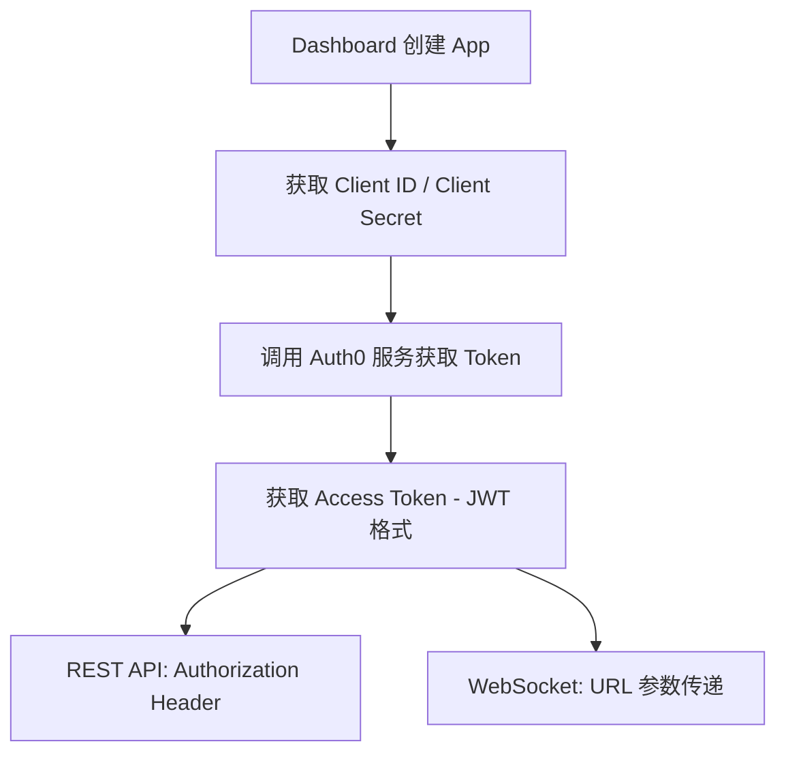

ChainStream 采用多层安全机制保护 API 访问。本文档介绍 API 安全最佳实践、常见威胁防护及安全配置指南。

<Info>
**最后更新:** 2026 年 2 月 | **版本:** v2.0
</Info>

---

## 认证安全

### Access Token 机制

ChainStream 使用基于 OAuth 2.0 的认证机制，通过 Client ID 和 Client Secret 生成 JWT Access Token 进行 API 认证。

**认证流程：**



**凭据规范**

| 项目 | 规范 |
|:--|:--|
| Client ID | 应用唯一标识符 |
| Client Secret | 64 位随机字符 |
| Access Token | JWT 格式，包含过期时间和权限范围 |
| Token 有效期 | 24 小时 |

### Access Token 获取

<CodeGroup>
```javascript JavaScript
import { AuthenticationClient } from 'auth0';

const auth0Client = new AuthenticationClient({
  domain: 'dex.asia.auth.chainstream.io',
  clientId: process.env.CHAINSTREAM_CLIENT_ID,
  clientSecret: process.env.CHAINSTREAM_CLIENT_SECRET
});

const { data } = await auth0Client.oauth.clientCredentialsGrant({
  audience: 'https://api.dex.chainstream.io'
});

const accessToken = data.access_token;
```

```python Python
from auth0.authentication import GetToken

get_token = GetToken(
    'dex.asia.auth.chainstream.io',
    os.environ['CHAINSTREAM_CLIENT_ID'],
    client_secret=os.environ['CHAINSTREAM_CLIENT_SECRET']
)

token = get_token.client_credentials(
    audience='https://api.dex.chainstream.io'
)

access_token = token['access_token']
```
</CodeGroup>

### 凭据安全

**存储要求**

<Warning>
Client Secret 是访问 ChainStream 服务的核心凭证，泄露可能导致服务滥用和费用损失。
</Warning>

| 存储方式 | 安全等级 | 说明 |
|:--|:--|:--|
| 环境变量 | ✅ 推荐 | 不进入版本控制 |
| 密钥管理服务 | ✅ 最佳 | AWS Secrets Manager, HashiCorp Vault 等 |
| 配置文件 | ⚠️ 注意 | 必须加入 .gitignore |
| 代码硬编码 | ❌ 禁止 | 极易泄露 |

### 代码示例

<CodeGroup>
```javascript JavaScript
// ❌ 危险：硬编码凭据
const clientId = "your_client_id";
const clientSecret = "your_secret";

// ❌ 危险：提交到版本控制
// config.json: { "client_id": "...", "client_secret": "..." }

// ✅ 安全：使用环境变量
const clientId = process.env.CHAINSTREAM_CLIENT_ID;
const clientSecret = process.env.CHAINSTREAM_CLIENT_SECRET;

// ✅ 安全：使用密钥管理服务
const credentials = await secretsManager.getSecret('chainstream-credentials');
```

```python Python
import os

# ❌ 危险：硬编码
client_id = "your_client_id"
client_secret = "your_secret"

# ✅ 安全：使用环境变量
client_id = os.environ.get('CHAINSTREAM_CLIENT_ID')
client_secret = os.environ.get('CHAINSTREAM_CLIENT_SECRET')

# ✅ 安全：使用密钥管理服务 (AWS Secrets Manager 示例)
import boto3
client = boto3.client('secretsmanager')
credentials = client.get_secret_value(SecretId='chainstream-credentials')['SecretString']
```

```go Go
// ❌ 危险：硬编码
clientID := "your_client_id"
clientSecret := "your_secret"

// ✅ 安全：使用环境变量
clientID := os.Getenv("CHAINSTREAM_CLIENT_ID")
clientSecret := os.Getenv("CHAINSTREAM_CLIENT_SECRET")
```
</CodeGroup>

### 多 App 管理

建议为不同环境和服务创建独立的 App：

| 用途 | App 名称建议 | 说明 |
|:--|:--|:--|
| 生产环境 | `prod-main` | 生产业务使用 |
| 测试环境 | `test-dev` | 开发测试使用 |
| CI/CD | `ci-pipeline` | 自动化测试使用 |
| 监控服务 | `monitoring` | 监控告警使用 |

---

## 传输安全

### TLS 要求

| 项目 | 要求 |
|:--|:--|
| 最低版本 | TLS 1.2 |
| 推荐版本 | TLS 1.3 |
| 证书验证 | 必须启用 |
| 不支持 | HTTP、TLS 1.0/1.1 |

### 证书验证

<Warning>
生产环境中绝不跳过证书验证，这会使您的应用暴露于中间人攻击风险。
</Warning>

<CodeGroup>
```javascript JavaScript
// ❌ 危险：跳过证书验证
process.env.NODE_TLS_REJECT_UNAUTHORIZED = '0';

// ✅ 安全：正常证书验证（默认行为）
const response = await fetch('https://api.chainstream.io/v1/...');
```

```python Python
import requests

# ❌ 危险：跳过证书验证
requests.get(url, verify=False)

# ✅ 安全：正常证书验证（默认行为）
requests.get(url)
```

```bash cURL
# ❌ 危险：跳过证书验证
curl -k https://api.chainstream.io/v1/...

# ✅ 安全：正常证书验证（默认行为）
curl https://api.chainstream.io/v1/...
```
</CodeGroup>

---

## Webhook 安全

Webhook 消息通过签名机制确保消息来源的可靠性。

### 签名验证

当您收到 Webhook 消息时，需要使用 Webhook Secret 验证签名，确认消息来自 ChainStream 且未被篡改。

| 项目 | 说明 |
|:--|:--|
| 算法 | HMAC-SHA256 |
| 密钥 | Webhook Secret（在 Dashboard 配置） |
| 签名头 | `X-Webhook-Signature` |

### 验证示例

<CodeGroup>
```javascript JavaScript
const crypto = require('crypto');

function verifyWebhookSignature(payload, signature, secret) {
  const expectedSignature = crypto
    .createHmac('sha256', secret)
    .update(JSON.stringify(payload))
    .digest('hex');
  
  return crypto.timingSafeEqual(
    Buffer.from(signature),
    Buffer.from(expectedSignature)
  );
}

// Express 中间件示例
app.post('/webhook', (req, res) => {
  const signature = req.headers['x-webhook-signature'];
  const isValid = verifyWebhookSignature(
    req.body,
    signature,
    process.env.WEBHOOK_SECRET
  );
  
  if (!isValid) {
    return res.status(401).send('Invalid signature');
  }
  
  // 处理 webhook 消息
  console.log('Received webhook:', req.body);
  res.status(200).send('OK');
});
```

```python Python
import hmac
import hashlib
import json

def verify_webhook_signature(payload, signature, secret):
    expected_signature = hmac.new(
        secret.encode(),
        json.dumps(payload).encode(),
        hashlib.sha256
    ).hexdigest()
    
    return hmac.compare_digest(signature, expected_signature)

# Flask 示例
@app.route('/webhook', methods=['POST'])
def webhook():
    signature = request.headers.get('X-Webhook-Signature')
    is_valid = verify_webhook_signature(
        request.json,
        signature,
        os.environ['WEBHOOK_SECRET']
    )
    
    if not is_valid:
        return 'Invalid signature', 401
    
    # 处理 webhook 消息
    print('Received webhook:', request.json)
    return 'OK', 200
```
</CodeGroup>

### Webhook Secret 轮换

如需轮换 Webhook Secret：

<Steps>
  <Step title="生成新 Secret">
    Dashboard → Webhooks → 选择 Endpoint → 轮换 Secret
  </Step>
  <Step title="更新应用配置">
    在应用中更新为新的 Webhook Secret
  </Step>
  <Step title="验证签名">
    确认新 Secret 可以正确验证签名
  </Step>
</Steps>

---

## 使用量监控

### Metrics 面板

在 Dashboard 的 Metrics 面板中，可以查看 API 和 WebSocket 的调用情况：

| 指标 | 说明 |
|:--|:--|
| 请求 IP | 请求来源 IP 地址 |
| User Agent | 请求的客户端标识 |
| 响应码 | HTTP 状态码 |
| 耗时 | 请求响应时间 |
| 消耗 Units | 本次请求消耗的用量单位 |
| 总计用量 | 累计消耗的用量 |

### 图表数据

Metrics 面板提供多种时间维度的图表：

- **小时维度** — 查看最近 24 小时的调用趋势
- **天维度** — 查看最近 30 天的调用趋势
- **月维度** — 查看历史月度统计

**查看路径：** Dashboard → Metrics

---

## 安全监控

<Note>
🚧 **Coming Soon** — 安全监控功能正在开发中，即将上线。
</Note>

上线后将支持：

- **异常检测** — 自动检测认证失败激增、异常地理位置等
- **告警通知** — 邮件和 Webhook 告警
- **自动防护** — 临时封禁、请求限流等

---

## IP 白名单

<Note>
🚧 **Coming Soon** — IP 白名单功能正在开发中，即将上线。
</Note>

上线后将支持：

- 单个 IP 配置（如 `203.0.113.50`）
- IP 段配置（如 `203.0.113.0/24`）
- 多 IP 配置（逗号分隔）

---

## 常见攻击防护

### 中间人攻击

**攻击方式：** 攻击者在客户端和服务器之间拦截通信。

**防护措施：**

| 措施 | 说明 |
|:--|:--|
| 强制 HTTPS | 仅支持 TLS 1.2+ |
| 证书验证 | 必须启用证书验证 |
| HSTS | 强制 HTTPS 连接 |

### 注入攻击

**攻击方式：** 攻击者通过输入恶意数据尝试执行未授权操作。

**防护措施：**

| 措施 | 说明 |
|:--|:--|
| 输入验证 | 严格的参数类型检查 |
| 参数化查询 | 防止 SQL/NoSQL 注入 |
| 输出编码 | 防止 XSS |

### 凭据泄露响应

如果怀疑 Client Secret 已泄露，请立即执行以下步骤：

<Steps>
  <Step title="立即删除 App">
    Dashboard → Apps → 选择 App → 删除
  </Step>
  <Step title="创建新 App">
    Dashboard → Apps → 创建新 App
  </Step>
  <Step title="更新应用配置">
    在所有使用该凭据的应用中更新为新 Client ID 和 Secret
  </Step>
  <Step title="检查 Metrics">
    Dashboard → Metrics → 检查是否有异常调用
  </Step>
  <Step title="审查安全实践">
    检查凭据泄露原因，改进安全措施
  </Step>
</Steps>

---

## 安全错误码

### 认证相关

| 错误码 | HTTP 状态 | 说明 |
|:--|:--|:--|
| `UNAUTHORIZED` | 401 | 未提供认证信息 |
| `EXPIRED_TOKEN` | 401 | Access Token 已过期 |
| `INVALID_TOKEN` | 401 | Access Token 无效 |
| `INVALID_CREDENTIALS` | 401 | Client ID 或 Secret 错误 |

### 访问控制相关

| 错误码 | HTTP 状态 | 说明 |
|:--|:--|:--|
| `FORBIDDEN` | 403 | 无权限访问或用量不足 |
| `RATE_LIMITED` | 429 | 请求频率超限 |
| `INSUFFICIENT_SCOPE` | 403 | Token 权限不足 |

### Webhook 相关

| 错误码 | 说明 |
|:--|:--|
| `INVALID_SIGNATURE` | Webhook 签名验证失败 |
| `MISSING_SIGNATURE` | 缺少签名头 |

### 错误响应示例

```json
{
  "error": {
    "code": "EXPIRED_TOKEN",
    "message": "Access token has expired",
    "details": {
      "expired_at": "2024-01-15T10:30:00Z"
    }
  }
}
```

---

## 安全配置清单

### 基础配置（必须）

- [ ] 使用 HTTPS 访问 API
- [ ] Client ID 和 Client Secret 存储在环境变量或密钥管理服务
- [ ] 不在代码仓库中提交凭据
- [ ] 生产/测试环境使用不同 App
- [ ] 正确验证 Webhook 签名

### 进阶配置（推荐）

- [ ] 集成密钥管理服务（AWS Secrets Manager / HashiCorp Vault）
- [ ] 定期检查 Metrics 面板的调用情况
- [ ] 为不同服务创建独立的 App

### 企业配置（可选）

- [ ] 集成 SIEM 系统进行日志分析
- [ ] 制定安全事件响应流程

---

## 常见问题

<AccordionGroup>
  <Accordion title="Client Secret 泄露了怎么办？">
    立即登录 Dashboard 删除该 App，创建新 App，然后更新所有使用该凭据的应用配置。详见上方"凭据泄露响应"章节。
  </Accordion>

  <Accordion title="Access Token 过期了怎么办？">
    Access Token 有效期为 24 小时。建议：
    
    1. **缓存 Token** — 在有效期内复用同一个 Token
    2. **提前刷新** — 在过期前 1 小时左右刷新 Token
    3. **错误重试** — 收到 401 错误时自动获取新 Token
  </Accordion>

  <Accordion title="如何查看 API 调用情况？">
    登录 Dashboard → Metrics，可以查看请求 IP、响应码、耗时、消耗的 Units 等信息，以及时间维度的图表数据。
  </Accordion>

  <Accordion title="Webhook 签名验证失败如何排查？">
    常见原因：
    
    1. **Secret 不匹配** — 确认使用正确的 Webhook Secret
    2. **Payload 处理错误** — 确保使用原始的 JSON 字符串进行签名计算
    3. **签名头缺失** — 确认请求头中包含 `X-Webhook-Signature`
  </Accordion>

  <Accordion title="是否支持创建多个 App？">
    支持。建议为不同环境（生产/测试）和不同服务创建独立的 App，便于管理和问题排查。
  </Accordion>
</AccordionGroup>

---

## 相关文档

<CardGroup cols={2}>
  <Card title="认证" icon="key" href="/cn/guides/getting-started/authentication">
    认证与凭据管理
  </Card>
  <Card title="数据隐私" icon="shield" href="/cn/guides/data-concepts/data-privacy">
    数据隐私政策
  </Card>
  <Card title="错误码" icon="circle-exclamation" href="/cn/guides/resources/error-codes">
    完整错误码列表
  </Card>
  <Card title="Webhook 基础" icon="webhook" href="/cn/playbooks/frameworks/webhook-fundamentals">
    Webhook 配置与使用
  </Card>
</CardGroup>
