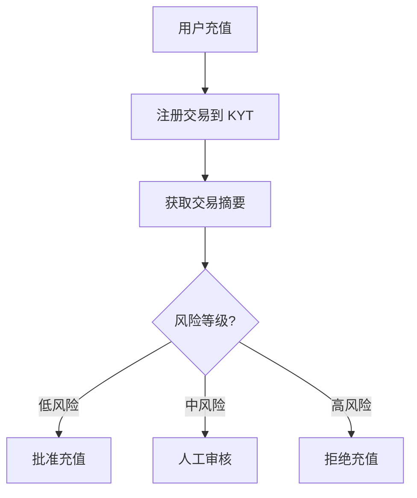

## 项目概述

本教程构建一个充值风控系统，在用户充值时自动评估资金来源风险。

<Info>
**预计时间**：30 分钟  
**难度等级**：⭐⭐ 入门
</Info>

**功能**：
- 注册充值交易进行 KYT 分析
- 查询交易风险评估结果
- 根据风险等级处理充值

---

## 工作原理



---

## Step 1：注册充值交易

当检测到充值时，将交易注册到 KYT API 进行分析。

```javascript
import { ChainStreamClient } from '@chainstream-io/sdk';

const client = new ChainStreamClient(process.env.CHAINSTREAM_ACCESS_TOKEN);

async function registerDeposit(deposit) {
  // 注册交易进行 KYT 分析
  const response = await client.kyt.registerTransfer({
    network: deposit.network,        // 'bitcoin', 'ethereum', 'Solana'
    asset: deposit.asset,            // 'BTC', 'ETH', 'SOL'
    transferReference: deposit.txHash, // 交易哈希
    direction: 'received'            // 充值 = received
  });

  return response.transferId;
}
```

---

## Step 2：获取风险评估

注册后，查询交易摘要获取风险信息。

```javascript
async function getTransferRisk(transferId) {
  // 获取带风险评估的交易摘要
  const summary = await client.kyt.getTransferSummary(transferId);

  // 获取详细警报信息
  const alerts = await client.kyt.getTransferAlerts(transferId);

  // 获取直接风险敞口信息
  const exposures = await client.kyt.getTransferDirectExposure(transferId);

  return {
    summary,
    alerts,
    exposures
  };
}
```

---

## Step 3：根据风险处理

实现基于风险的处理逻辑。

```javascript
async function evaluateDeposit(deposit) {
  // 注册充值
  const transferId = await registerDeposit(deposit);

  // 获取风险评估
  const { summary, alerts, exposures } = await getTransferRisk(transferId);

  // 根据警报判断风险等级
  const hasHighRiskAlert = alerts.some(
    alert => alert.severity === 'high' || alert.severity === 'critical'
  );
  const hasMediumRiskAlert = alerts.some(
    alert => alert.severity === 'medium'
  );

  // 根据风险处理
  if (hasHighRiskAlert) {
    return rejectDeposit(deposit, alerts);
  }

  if (hasMediumRiskAlert) {
    return queueForReview(deposit, alerts);
  }

  return approveDeposit(deposit);
}

function approveDeposit(deposit) {
  console.log(`✅ 充值已批准: ${deposit.txHash}`);
  // 为用户账户入账
  return { status: 'approved', deposit };
}

function queueForReview(deposit, alerts) {
  console.log(`⚠️ 充值待审核: ${deposit.txHash}`);
  // 通知合规团队
  return { status: 'pending_review', deposit, alerts };
}

function rejectDeposit(deposit, alerts) {
  console.log(`❌ 充值已拒绝: ${deposit.txHash}`);
  // 记录并通知
  return { status: 'rejected', deposit, alerts };
}
```

---

## 完整示例

```javascript
import { ChainStreamClient } from '@chainstream-io/sdk';

const client = new ChainStreamClient(process.env.CHAINSTREAM_ACCESS_TOKEN);

class DepositRiskChecker {
  async checkDeposit(deposit) {
    try {
      // Step 1: 注册交易
      const { transferId } = await client.kyt.registerTransfer({
        network: deposit.network,
        asset: deposit.asset,
        transferReference: deposit.txHash,
        direction: 'received'
      });

      console.log(`📝 已注册交易: ${transferId}`);

      // Step 2: 获取风险评估
      const summary = await client.kyt.getTransferSummary(transferId);
      const alerts = await client.kyt.getTransferAlerts(transferId);

      console.log(`📊 风险评估完成`);
      console.log(`   警报数量: ${alerts.length}`);

      // Step 3: 做出决策
      return this.makeDecision(deposit, summary, alerts);

    } catch (error) {
      console.error(`❌ 检查充值时出错: ${error.message}`);
      // 出错时，排队人工审核
      return { status: 'pending_review', reason: 'system_error' };
    }
  }

  makeDecision(deposit, summary, alerts) {
    const criticalAlerts = alerts.filter(a => a.severity === 'critical');
    const highAlerts = alerts.filter(a => a.severity === 'high');
    const mediumAlerts = alerts.filter(a => a.severity === 'medium');

    if (criticalAlerts.length > 0 || highAlerts.length > 0) {
      return {
        status: 'rejected',
        reason: 'high_risk_detected',
        alerts: [...criticalAlerts, ...highAlerts]
      };
    }

    if (mediumAlerts.length > 0) {
      return {
        status: 'pending_review',
        reason: 'medium_risk_detected',
        alerts: mediumAlerts
      };
    }

    return {
      status: 'approved',
      reason: 'low_risk'
    };
  }
}

// 使用示例
const checker = new DepositRiskChecker();

const deposit = {
  network: 'Solana',
  asset: 'SOL',
  txHash: '39z5QAprVrzaFzfHu1JHPgBf9dSqYdNYhH31d3PEd4hWiWL1LML7qCct5MHGxaRAgjjj1nC3XUyLwtzGQmYqUk4y:address'
};

const result = await checker.checkDeposit(deposit);
console.log('决策结果:', result);
```

---

## API 参考

| 端点 | 描述 |
|------|------|
| `POST /v1/kyt/transfer` | 注册交易进行 KYT 分析 |
| `GET /v1/kyt/transfers/{id}/summary` | 获取交易摘要 |
| `GET /v1/kyt/transfers/{id}/alerts` | 获取交易警报 |
| `GET /v1/kyt/transfers/{id}/exposures/direct` | 获取直接风险敞口信息 |

---

## 下一步

<CardGroup cols={2}>
  <Card title="KYT 概念" icon="magnifying-glass-dollar" href="/cn/guides/data-concepts/kyt-concepts">
    了解 KYT 工作原理
  </Card>
  <Card title="KYT API 参考" icon="code" href="/cn/api-reference/endpoint/kyt/v1/kyt-transfer-post">
    完整 API 文档
  </Card>
</CardGroup>
