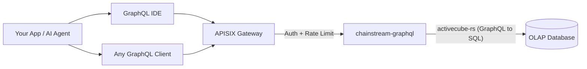

<Info>
ChainStream GraphQL 是一种 OLAP 分析型 API，通过单一 GraphQL 端点暴露多链链上数据（Solana、Ethereum、BSC、Polygon）。按需查询字段、即时聚合数据，并交互式探索 schema —— 底层由高性能 OLAP 数据库驱动。
</Info>

## 什么是 ChainStream GraphQL

ChainStream GraphQL 为链上分析数据提供**声明式查询接口**。无需调用大量固定响应形态的 REST 端点，你可以编写一条 GraphQL 查询，精确指定需要的数据、过滤方式与聚合方式。

服务基于 **activecube-rs** 构建，由 **Cube** 定义动态生成 GraphQL schema —— 每个 Cube 代表一种分析数据模型（例如 DEX 成交、代币转账、OHLC K 线）。查询会被编译为优化后的 SQL，并在高性能 OLAP 数据库上执行。

---

## GraphQL 与 REST Data API

| | **GraphQL API** | **REST Data API** |
|:--|:--|:--|
| **查询方式** | 声明式 —— 自定义形态、过滤与聚合 | 命令式 —— 固定端点与预定义参数 |
| **字段选择** | 客户端只取所需字段 | 服务端返回固定响应 schema |
| **聚合** | 单次查询内置 `count`、`sum`、`avg`、`min`、`max` | 仅预定义的聚合端点 |
| **端点** | 单一端点覆盖所有数据模型 | 每个资源一个端点 |
| **分页** | 查询参数中的 `limit` + `offset` | 查询参数中的 `limit` + `offset` / 游标 |
| **适用场景** | 分析、仪表盘、灵活探索 | 简单查询、实时价格、钱包余额 |
| **延迟** | 侧重吞吐优化 | 侧重低延迟单资源读取 |

<Tip>
当你需要灵活的分析查询时 —— 聚合成交、按时间范围计算 PnL、或构建自定义仪表盘 —— 请使用 **GraphQL**。当你需要快速、简单的查询（如当前代币价格或钱包余额）时，请使用 **REST API**。
</Tip>

---

## 核心优势

<CardGroup cols={3}>
  <Card title="单一端点" icon="bullseye">
    一个 URL 覆盖 4 条链上的 25 个数据 Cube。无需维护大量端点 —— 只需修改查询。
  </Card>
  <Card title="客户端自选字段" icon="filter">
    只请求需要的列。避免过度获取或获取不足 —— 适合带宽受限的客户端。
  </Card>
  <Card title="内置聚合" icon="chart-column">
    在查询中直接计算 `count`、`sum`、`avg`、`min`、`max`，无需事后处理。
  </Card>
</CardGroup>

---

## 支持的链

| Network ID | 区块链 | Chain Group | 覆盖范围 |
|:--|:--|:--|:--|
| `eth` | Ethereum | EVM | 完整 DEX、转账、余额更新、事件、调用追踪、代币统计 |
| `bsc` | BNB Chain (BSC) | EVM | 完整 DEX、转账、余额更新、事件、调用追踪、代币统计 |
| `polygon` | Polygon | EVM | 完整 DEX、转账、余额更新、预测市场 |
| `sol` | Solana | Solana | 完整 DEX、转账、指令、代币持有者、OHLC、PnL |

<Note>
查询按三个 **Chain Group** 组织：**EVM**（需传 `network` 参数）、**Solana** 和 **Trading**（跨链 OHLC 与代币统计）。详见 [Chain Groups](/cn/graphql/schema/chain-groups)。
</Note>

---

## 可用的数据 Cube

共 25 个 Cube，分属三个 Chain Group，每个对应一种分析模型：

<AccordionGroup>
  <Accordion title="DEX 交易">
    - **DEXTrades** —— 单笔 DEX 兑换事件，含买卖数量、价格与 DEX 协议信息
    - **DEXTradeByTokens** —— 按代币索引的 DEX 成交，便于高效的单代币查询
    - **DEXOrders** —— DEX 订单事件，含限价单 *（仅 Solana）*
  </Accordion>
  <Accordion title="池子与流动性">
    - **DEXPoolEvents** —— DEX 池子的添加/移除流动性事件
    - **DEXPools** —— DEX 池子快照，含当前储备与元数据
    - **DEXPoolSlippages** —— 池子滑点数据 *（仅 EVM）*
    - **TokenSupplyUpdates** —— 影响代币供应的铸造与销毁事件
  </Accordion>
  <Accordion title="代币与转账">
    - **Transfers** —— 代币转账事件，含发送方、接收方、数量与 USD 价值
    - **BalanceUpdates** —— 按代币的钱包余额变动事件
    - **TokenHolders** —— 代币当前持有者列表与分布
    - **WalletTokenPnL** —— 按钱包-代币对的 PnL
  </Accordion>
  <Accordion title="交易分析（跨链）">
    - **Pairs** —— 可配置时间间隔的 OHLC K 线数据
    - **Tokens** —— 按代币聚合的成交统计：成交量、笔数、独立交易者数
  </Accordion>
  <Accordion title="区块链基础设施">
    - **Blocks** —— 区块级数据（时间戳、高度、矿工/验证者）
    - **Transactions** —— 交易级数据（哈希、状态、Gas/手续费）
    - **TransactionBalances** —— 逐交易的余额变动
    - **Events** —— 智能合约事件日志 *（仅 EVM）*
    - **Calls** —— 内部调用追踪 *（仅 EVM）*
    - **Instructions** —— 指令级数据 *（仅 Solana）*
    - **InstructionBalanceUpdates** —— 指令级余额变动 *（仅 Solana）*
  </Accordion>
  <Accordion title="奖励与网络">
    - **Rewards** —— 验证者/质押奖励 *（仅 Solana）*
    - **MinerRewards** —— 矿工/验证者奖励 *（仅 EVM）*
    - **Uncles** —— 叔块数据 *（仅 EVM）*
  </Accordion>
  <Accordion title="预测市场">
    - **PredictionTrades** —— 预测市场交易事件 *（EVM — Polygon）*
    - **PredictionManagements** —— 预测市场管理事件 *（EVM — Polygon）*
    - **PredictionSettlements** —— 预测市场结算事件 *（EVM — Polygon）*
  </Accordion>
</AccordionGroup>

---

## 关键查询参数

除标准过滤与分页外，ChainStream GraphQL 在 Chain Group 级别支持两个强大参数：

| 参数 | 可选值 | 说明 |
|:--|:--|:--|
| **`dataset`** | `realtime`、`archive`、`combined`（默认） | 控制数据源范围 —— 仅近期数据、历史数据、或全量 |
| **`aggregates`** | `yes`、`no`、`only` | 控制是否使用预聚合表以加速分析查询 |

<Tip>
详见 [Dataset 与 Aggregates](/cn/graphql/schema/dataset-aggregates) 了解用法与示例。
</Tip>

---

## 架构

<Info>
所有请求经 APISIX 网关进行认证与限流。`chainstream-graphql` 服务将 GraphQL 查询编译为优化 SQL，并在 OLAP 分析数据库上执行。
</Info>

---

## 下一步

<CardGroup cols={3}>
  <Card title="端点与认证" icon="key" href="/cn/graphql/getting-started/endpoints">
    配置端点 URL、认证请求头，并了解请求/响应格式。
  </Card>
  <Card title="首次查询" icon="play" href="/cn/graphql/getting-started/first-query">
    分步运行第一条 GraphQL 查询 —— 通过 IDE 或 cURL。
  </Card>
  <Card title="GraphQL IDE" icon="code" href="/cn/graphql/ide/introduction">
    使用带自动补全、查询模板与代码导出的交互式 GraphQL IDE。
  </Card>
</CardGroup>
