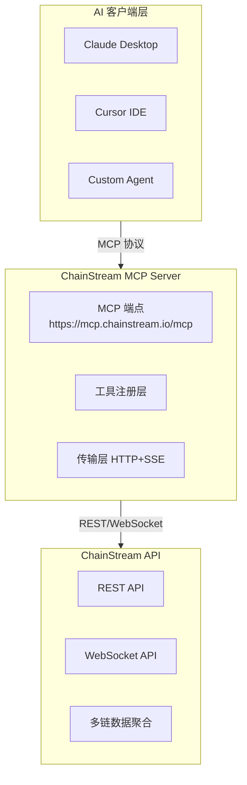

## MCP 是什么

**MCP (Model Context Protocol)** 是由 Anthropic 提出的开放协议，旨在标准化 AI 应用与外部数据源的连接方式。

<Info>
简单来说，MCP 让 AI 能够：
- 发现可用的工具和数据源
- 调用外部工具执行操作
- 理解返回的结构化数据
</Info>

### 传统方式 vs MCP

| 方式 | 流程 |
|------|------|
| **传统方式** | 用户 → 编写代码 → 调用 API → 解析数据 → 输入 AI → 获得回答 |
| **MCP 方式** | 用户 → 自然语言提问 → AI 自动调用工具 → 获得回答 |

### 核心概念

| 概念 | 说明 |
|------|------|
| **MCP Server** | 提供工具和数据的服务端，如 ChainStream MCP Server |
| **MCP Client** | 使用工具的客户端，如 Claude Desktop、Cursor |
| **Tools** | 可被 AI 调用的功能，如查询余额、分析钱包 |
| **Resources** | 可被 AI 访问的数据资源 |

---

## 为什么 MCP 很重要

### AI Agent 需要"手和眼"

AI 大模型拥有强大的推理能力，但它们：

- ❌ 无法直接访问实时数据
- ❌ 无法执行外部操作
- ❌ 知识存在截止日期

MCP 解决了这个问题，让 AI 能够：

- ✅ 实时获取链上数据
- ✅ 调用专业工具进行分析
- ✅ 与外部世界交互

<Note>
**类比理解**

MCP 之于 AI，就像：
- **眼睛** → 让 AI 看到实时数据
- **手** → 让 AI 执行操作
- **工具** → 让 AI 使用专业能力
</Note>

---

## ChainStream MCP 能力

ChainStream MCP Server 将区块链数据和分析能力以 MCP 协议暴露给 AI 应用。

**MCP 端点**：`https://mcp.chainstream.io/mcp`

### 能力矩阵

ChainStream MCP Server 支持 API Reference 中所有的 REST API 和 WebSocket 订阅功能：

<Tabs>
  <Tab title="Token API">
    | 功能 | 说明 |
    |------|------|
    | 代币搜索 | 按名称/符号搜索代币 |
    | 代币信息 | 获取代币基本信息和元数据 |
    | 代币价格 | 实时价格和历史价格 |
    | 代币统计 | 交易量、市值等统计数据 |
    | 持有者分析 | 持有者分布和 Top 持有者 |
    | K 线数据 | 各周期 OHLCV 数据 |
    | 市场数据 | 流动性、交易对信息 |
    | 安全检查 | 代币合约安全分析 |
    | 创建信息 | 代币创建者和时间 |
    | Mint/Burn 历史 | 代币铸造和销毁记录 |
    | 流动性快照 | 历史流动性数据 |
  </Tab>
  
  <Tab title="Wallet API">
    | 功能 | 说明 |
    |------|------|
    | 余额查询 | 钱包代币余额 |
    | PnL 计算 | 盈亏分析 |
    | 钱包统计 | 交易次数、活跃度等 |
    | 余额更新历史 | 余额变化记录 |
  </Tab>
  
  <Tab title="Trade API">
    | 功能 | 说明 |
    |------|------|
    | 交易历史 | 获取交易记录 |
    | 交易活动 | 实时交易活动 |
    | 顶级交易者 | Top Traders 排名 |
  </Tab>
  
  <Tab title="DEX API">
    | 功能 | 说明 |
    |------|------|
    | 报价查询 | 获取交易报价 |
    | 路由计算 | 最优交易路径 |
    | 交换执行 | 构建交换交易 |
    | DEX 列表 | 支持的 DEX 信息 |
  </Tab>
  
  <Tab title="Ranking API">
    | 功能 | 说明 |
    |------|------|
    | 热门代币 | 按时间段排名 |
    | 新代币 | 最新上线代币 |
    | 即将毕业 | Bonding Curve 接近毕业 |
    | 已毕业 | 已迁移到 DEX |
  </Tab>
  
  <Tab title="KYT API">
    | 功能 | 说明 |
    |------|------|
    | 交易注册 | 注册交易进行风险评估 |
    | 风险摘要 | 获取交易风险评级 |
    | 风险告警 | 获取风险告警详情 |
    | 地址风险 | 地址风险评估 |
  </Tab>
  
  <Tab title="WebSocket">
    | 订阅类型 | 说明 |
    |----------|------|
    | 代币 K 线 | 实时 K 线更新 |
    | 代币统计 | 实时统计数据 |
    | 代币持有者 | 持有者变化 |
    | 新代币 | 新代币创建通知 |
    | 钱包余额 | 实时余额更新 |
    | 钱包交易 | 实时交易通知 |
    | 流动性池 | 池子余额变化 |
  </Tab>
</Tabs>

### 支持的区块链

<Tabs>
  <Tab title="EVM 链">
    | 链 | 标识 | 状态 |
    |---|------|------|
    | Ethereum | `ethereum` | ✅ |
    | BNB Chain | `bsc` | ✅ |
    | Polygon | `polygon` | ✅ |
    | Arbitrum | `arbitrum` | ✅ |
    | Optimism | `optimism` | ✅ |
    | Base | `base` | ✅ |
    | Avalanche | `avalanche` | ✅ |
  </Tab>
  <Tab title="非 EVM 链">
    | 链 | 标识 | 状态 |
    |---|------|------|
    | Solana | `solana` | ✅ |
  </Tab>
</Tabs>

---

## 支持的平台

### Claude Desktop

官方支持的 MCP 客户端，提供最完整的功能支持。

| 特性 | 支持状态 |
|------|----------|
| 工具调用 | ✅ |
| 多轮对话 | ✅ |
| 流式响应 | ✅ |

```json
// claude_desktop_config.json
{
  "mcpServers": {
    "chainstream": {
      "url": "https://mcp.chainstream.io/mcp",
      "headers": {
        "Authorization": "Bearer your-access-token"
      }
    }
  }
}
```

### Cursor IDE

开发者友好的 AI 编程助手，支持 MCP 集成。

| 特性 | 支持状态 |
|------|----------|
| 工具调用 | ✅ |
| 代码上下文 | ✅ |

```json
// .cursor/mcp.json
{
  "mcpServers": {
    "chainstream": {
      "url": "https://mcp.chainstream.io/mcp",
      "headers": {
        "Authorization": "Bearer your-access-token"
      }
    }
  }
}
```

### 自定义 Agent

任何遵循 MCP 协议的客户端都可以接入。

```javascript
import { Client } from '@modelcontextprotocol/sdk/client/index.js';
import { SSEClientTransport } from '@modelcontextprotocol/sdk/client/sse.js';

const transport = new SSEClientTransport(
  new URL('https://mcp.chainstream.io/sse'),
  {
    requestInit: {
      headers: {
        'Authorization': `Bearer ${process.env.CHAINSTREAM_ACCESS_TOKEN}`
      }
    }
  }
);

const client = new Client({
  name: 'my-agent',
  version: '1.0.0'
});

await client.connect(transport);

// 列出可用工具
const { tools } = await client.listTools();

// 调用工具
const result = await client.callTool({
  name: 'get_token_balance',
  arguments: {
    address: '0x...',
    chain: 'ethereum'
  }
});
```

---

## 典型使用场景

### 场景 1：AI 研究助手

**需求**：使用 AI 分析特定钱包的交易行为

<Steps>
  <Step title="用户提问">
    分析地址 `0xd8dA6BF26964aF9D7eEd9e03E53415D37aA96045` 的交易风格
  </Step>
  <Step title="AI 调用工具">
    调用 `analyze_wallet` 工具
  </Step>
  <Step title="AI 返回分析">
    基于分析，该地址（Vitalik）的特征如下：
    - 钱包年龄：超过 5 年
    - 主要持仓：ETH、各类 ERC-20 Token
    - 交易风格：长期持有为主，偶有捐赠和项目支持
    - 活跃协议：Uniswap、ENS、Gitcoin
    - 标签：核心开发者、公益捐赠者
  </Step>
</Steps>

### 场景 2：Smart Money 追踪

**需求**：追踪 Smart Money 的大额交易

<Steps>
  <Step title="用户提问">
    最近 24 小时有哪些 Smart Money 在买入 ARB？
  </Step>
  <Step title="AI 调用工具">
    调用 `get_smart_money_activities` 工具
  </Step>
  <Step title="AI 返回结果">
    过去 24 小时，以下 Smart Money 地址买入了 ARB：

    1. `0xabc...123` (标签: whale, defi_expert)
       - 买入数量：500,000 ARB
       - 买入金额：$450,000
       - 时间：2 小时前

    2. `0xdef...456` (标签: institution)
       - 买入数量：200,000 ARB
       - 买入金额：$180,000
       - 时间：5 小时前

    整体趋势：Smart Money 对 ARB 呈净买入状态
  </Step>
</Steps>

### 场景 3：代币安全分析

**需求**：分析某代币的安全性

<Steps>
  <Step title="用户提问">
    帮我检查这个代币 `0x...` 是否安全
  </Step>
  <Step title="AI 调用工具">
    调用 `get_token_security` 工具
  </Step>
  <Step title="AI 返回结果">
    该代币安全检查结果：

    | 检查项 | 结果 |
    |--------|------|
    | 合约已验证 | ✅ |
    | 无恶意函数 | ✅ |
    | 流动性锁定 | ✅ |
    | 持有者分散 | ⚠️ Top 10 持有 45% |
    | 交易税 | 买入 1% / 卖出 1% |
    
    风险等级：中等（注意持有者集中度）
  </Step>
</Steps>

---

## 技术架构



### 数据流程

<Steps>
  <Step title="用户提问">
    自然语言输入到 AI 客户端
  </Step>
  <Step title="意图识别">
    AI 理解用户意图，选择合适的工具
  </Step>
  <Step title="工具调用">
    MCP Client 向 MCP Server 发起请求
  </Step>
  <Step title="数据获取">
    MCP Server 调用 ChainStream API
  </Step>
  <Step title="结果返回">
    结构化数据返回给 AI
  </Step>
  <Step title="生成回答">
    AI 基于数据生成自然语言回答
  </Step>
</Steps>

---

## 与传统 API 的区别

| 特性 | 传统 API | MCP |
|------|----------|-----|
| 调用方式 | HTTP REST | 协议标准化 |
| 目标用户 | 开发者 | AI 模型 |
| 参数处理 | 手动构建 | AI 自动推断 |
| 错误处理 | 返回状态码 | 语义化错误 |
| 上下文 | 无状态 | 可保持会话上下文 |

---

## 认证方式

ChainStream MCP Server 使用 Access Token 进行认证。

### 获取 Access Token

1. 在 [ChainStream Dashboard](https://www.chainstream.io/dashboard) 创建 App
2. 获取 **Client ID** 和 **Client Secret**
3. 使用凭据生成 Access Token（参考 [认证文档](/cn/guides/getting-started/authentication)）
4. 将 Access Token 配置到 MCP Server 环境变量

### 环境变量

| 变量名 | 说明 |
|--------|------|
| `CHAINSTREAM_ACCESS_TOKEN` | JWT Access Token |

<Note>
Access Token 有效期为 24 小时，过期后需要重新生成。建议在应用中实现自动刷新机制。
</Note>

### 权限控制

通过 API Scope 控制工具的访问权限：

| Scope | 说明 |
|-------|------|
| 默认 | 只读数据查询工具 |
| `webhook.read` | Webhook 读取权限 |
| `webhook.write` | Webhook 写入权限 |
| `kyt.read` | KYT 读取权限 |
| `kyt.write` | KYT 写入权限 |

---

## 安全模型

<AccordionGroup>
  <Accordion title="认证机制" icon="key">
    MCP Server 使用 JWT Access Token 进行认证。Access Token 通过 Client ID 和 Client Secret 从 Auth 服务获取，所有 API 请求都需要有效的 Token。
  </Accordion>
  
  <Accordion title="权限控制" icon="lock">
    通过 API Scope 控制工具的访问权限：
    - 只读工具：默认可用
    - 交易工具：需要明确授权
    - KYT 工具：需要 `kyt.read` scope
  </Accordion>
  
  <Accordion title="审计日志" icon="file-lines">
    所有工具调用都有完整记录，可在 Dashboard 查看。
  </Accordion>
</AccordionGroup>

---

## 下一步

<CardGroup cols={2}>
  <Card title="配置指南" icon="gear" href="/cn/guides/ai-infrastructure/mcp-server/setup-guide">
    5 分钟完成 MCP Server 配置
  </Card>
  <Card title="工具目录" icon="wrench" href="/cn/guides/ai-infrastructure/mcp-server/tools-catalog">
    查看所有可用工具详情
  </Card>
</CardGroup>
