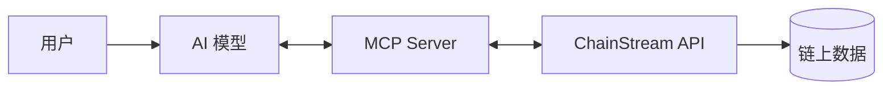

## 概述

ChainStream 提供专为 AI 应用设计的基础设施，让 AI Agent 能够直接查询链上数据、分析市场信息、甚至执行交易操作。

<CardGroup cols={2}>
  <Card title="MCP Server" icon="robot" color="#9333EA">
    Model Context Protocol 服务，让 AI 模型直接调用 ChainStream API
  </Card>
  <Card title="结构化数据" icon="database" color="#4D9CFF">
    为 AI 优化的数据格式，便于理解和推理
  </Card>
</CardGroup>

## 为什么 AI 需要链上数据

传统 AI 模型（如 ChatGPT、Claude）的知识截止于训练时间，无法获取实时链上信息。ChainStream AI 基础设施解决了这个问题：

<AccordionGroup>
  <Accordion title="实时数据访问" icon="bolt">
    AI 可以获取最新的：
    - 代币价格和交易量
    - 钱包余额和持仓
    - DEX 流动性和交易
    - 市场排行榜数据
  </Accordion>
  
  <Accordion title="链上分析能力" icon="chart-mixed">
    AI 可以进行：
    - 代币安全检查
    - 钱包 PnL 计算
    - Smart Money 追踪
    - 风险评估
  </Accordion>
  
  <Accordion title="交易执行" icon="right-left">
    AI 可以帮助用户：
    - 查询最优交易路由
    - 估算 Gas 费用
    - 构建交易（需用户确认）
  </Accordion>
</AccordionGroup>

## MCP (Model Context Protocol)

MCP 是一个开放协议，允许 AI 模型与外部数据源和工具交互。ChainStream 提供 MCP Server 实现，支持主流 AI 模型。

### 工作流程

1. 用户向 AI 提问（如"查询 SOL 的当前价格"）
2. AI 识别需要调用 ChainStream 工具
3. 通过 MCP 协议调用 ChainStream API
4. 获取数据后，AI 整理并回复用户

### 支持的模型

| 模型 | 支持状态 | 说明 |
|------|----------|------|
| Claude | 原生支持 | Anthropic 官方 MCP 支持 |
| GPT-4 | 通过 Function Calling | OpenAI 函数调用 |
| Cursor AI | 原生支持 | IDE 内置 MCP |
| 其他 | 适配中 | 联系我们了解详情 |

## 使用场景

<Tabs>
  <Tab title="投资研究助手">
    让 AI 帮你分析代币：
    
    **用户提问**：
    > "帮我分析一下 BONK 代币，包括价格走势、持有者分布和安全风险"
    
    **AI 能力**：
    - 查询实时价格和历史 K 线
    - 获取持有者数据和集中度
    - 执行安全检查
    - 综合分析并给出建议
  </Tab>
  
  <Tab title="钱包管理助手">
    让 AI 帮你管理钱包：
    
    **用户提问**：
    > "查看我钱包里所有代币的当前价值和最近的盈亏情况"
    
    **AI 能力**：
    - 查询钱包余额
    - 计算各代币价值
    - 分析持仓 PnL
    - 生成持仓报告
  </Tab>
  
  <Tab title="交易助手">
    让 AI 帮你交易（需确认）：
    
    **用户提问**：
    > "我想用 1 SOL 买入 BONK，帮我查询最佳路由"
    
    **AI 能力**：
    - 获取多 DEX 报价
    - 比较滑点和费用
    - 推荐最优路由
    - 展示交易详情（用户确认后执行）
  </Tab>
</Tabs>

## 快速开始

### 安装配置

<Steps>
  <Step title="获取 API 凭据">
    在 [ChainStream Dashboard](https://www.chainstream.io/dashboard) 获取 API 密钥
  </Step>
  
  <Step title="配置 MCP Server">
    根据你使用的 AI 模型/平台，配置 ChainStream MCP Server
  </Step>
  
  <Step title="开始使用">
    在对话中直接询问链上数据相关问题
  </Step>
</Steps>

详细配置请参考 [MCP 配置指南](/cn/guides/ai-infrastructure/mcp-server/setup-guide)

## 安全考虑

<Warning>
AI 执行的交易操作需要用户明确确认。ChainStream MCP Server 默认不会自动执行任何涉及资金的操作。
</Warning>

<CardGroup cols={2}>
  <Card title="只读优先" icon="eye">
    大部分工具是只读的数据查询，不涉及资金操作
  </Card>
  
  <Card title="交易确认" icon="shield-check">
    任何交易操作都需要用户确认私钥签名
  </Card>
  
  <Card title="权限控制" icon="lock">
    可通过 API Scope 限制工具的访问权限
  </Card>
  
  <Card title="审计日志" icon="file-lines">
    所有 API 调用都有完整的审计记录
  </Card>
</CardGroup>

## 下一步

<CardGroup cols={3}>
  <Card title="MCP 介绍" icon="robot" href="/cn/guides/ai-infrastructure/mcp-server/introduction">
    深入了解 MCP 协议
  </Card>
  <Card title="配置指南" icon="gear" href="/cn/guides/ai-infrastructure/mcp-server/setup-guide">
    配置你的 MCP Server
  </Card>
  <Card title="工具目录" icon="wrench" href="/cn/guides/ai-infrastructure/mcp-server/tools-catalog">
    查看所有可用工具
  </Card>
</CardGroup>
