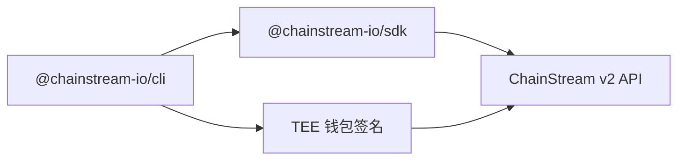

## 什么是 ChainStream CLI

ChainStream CLI (`@chainstream-io/cli`) 是一个命令行工具，用于在 Solana、BSC 和 Ethereum 上查询链上数据和执行 DeFi 操作。它同时面向人类开发者和 AI Agent 设计。

<CardGroup cols={2}>
  <Card title="数据查询" icon="magnifying-glass" color="#4D9CFF">
    搜索代币、分析钱包、追踪市场趋势、查询近期交易
  </Card>
  <Card title="DeFi 执行" icon="right-left" color="#9333EA">
    兑换代币、在发射台创建代币、通过内置钱包签名广播交易
  </Card>
</CardGroup>

## 安装

无需全局安装 — 直接用 `npx` 运行：

```bash
npx @chainstream-io/cli token search --keyword PUMP --chain sol
```

或全局安装：

```bash
npm install -g @chainstream-io/cli
chainstream token search --keyword PUMP --chain sol
```

<Note>需要 Node.js 18 或更高版本。</Note>

## 架构



- **基于 SDK** — 所有 API 调用通过 `@chainstream-io/sdk`，具备类型化响应、自动重试和任务轮询
- **TEE 签名** — DeFi 交易在 TEE（可信执行环境）中远程签名；设备密钥存储在本地 `~/.config/chainstream/keys/`
- **API Key 优先** — x402 购买后自动保存 API Key 到配置；钱包签名仅在 DeFi 执行时需要

## 支持的链

| 链 | CLI ID | Data API | DeFi | WebSocket |
|----|--------|----------|------|-----------|
| Solana | `sol` | 支持 | 支持 | 支持 |
| BSC | `bsc` | 支持 | 支持 | 支持 |
| Ethereum | `eth` | 支持 | 支持 | 支持 |

## CLI vs MCP vs SDK

| 能力 | CLI | MCP Server | SDK |
|------|-----|------------|-----|
| 代币搜索与分析 | 支持 | 支持 | 支持 |
| 市场趋势与排行 | 支持 | 支持 | 支持 |
| 钱包画像与盈亏 | 支持 | 支持 | 支持 |
| DEX 报价 | 支持 | 支持 | 支持 |
| DEX 兑换（签名） | 支持 | 不支持 | 支持（需 WalletSigner） |
| 代币创建 | 支持 | 不支持 | 支持（需 WalletSigner） |
| x402 自动支付 | 支持 | 不适用 | 手动 |
| 适用场景 | AI Agent、脚本、CI | AI 聊天助手 | 自定义应用 |

## 快速开始

```bash
# 1. 认证（仅需一次）
npx @chainstream-io/cli login

# 2. 搜索代币
npx @chainstream-io/cli token search --keyword PUMP --chain sol

# 3. 检查代币安全性
npx @chainstream-io/cli token security --chain sol --address <token_address>

# 4. 查看热门代币
npx @chainstream-io/cli market trending --chain sol --duration 1h

# 5. 分析钱包盈亏
npx @chainstream-io/cli wallet pnl --chain sol --address <wallet_address>
```

## 下一步

<CardGroup cols={3}>
  <Card title="认证" icon="key" href="/cn/guides/cli/authentication">
    设置 API Key 或钱包登录
  </Card>
  <Card title="命令参考" icon="book" href="/cn/guides/cli/commands">
    完整的命令和选项列表
  </Card>
  <Card title="x402 支付" icon="credit-card" href="/cn/guides/cli/x402-payment">
    使用 USDC 自动购买订阅
  </Card>
</CardGroup>
