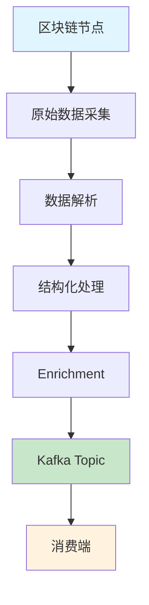

ChainStream 通过 Kafka Streams 提供多链实时链上数据流。相较于 GraphQL Subscriptions 和 WebSocket，Kafka Streams 面向对延迟敏感、可靠性要求高的服务端应用场景，提供更低延迟、更强容错的数据消费能力。

<Card title="Protobuf Schema 仓库" icon="github" href="https://github.com/chainstream-io/streaming_protobuf">
  ChainStream 官方 Protobuf Schema 定义，支持 Go 和 Python，包含 EVM、Solana、TRON 所有消息类型。
</Card>

---

## 支持矩阵

| 链 | dex.trades | tokens | balances | dex.pools | transfers | candlesticks |
|:---|:---:|:---:|:---:|:---:|:---:|:---:|
| Ethereum (eth) | ✅ | ✅ | ✅ | ✅ | ✅ | ✅ |
| BSC (bsc) | ✅ | ✅ | ✅ | ✅ | ✅ | ✅ |
| Solana (sol) | ✅ | ✅ | ✅ | ✅ | ✅ | ✅ |
| TRON (tron) | ✅ | ✅ | ✅ | ✅ | ✅ | ✅ |

<Note>
所有链还支持 `token-supplies`、`token-prices`、`token-holdings`、`token-market-caps`、`trade-stats` 等 Topics。详见完整 Topic 列表。
</Note>

---

## Kafka Streams vs WebSocket 选型指南

### 何时选择 Kafka Streams

<CardGroup cols={2}>
  <Card title="延迟敏感" icon="bolt">
    延迟是首要考量，应用部署在云端或专用服务器
  </Card>
  <Card title="消息可靠" icon="shield-check">
    不可接受丢失任何消息，需要持久可靠的数据消费
  </Card>
  <Card title="复杂处理" icon="gears">
    需要对数据做复杂计算、过滤或格式化，超出预处理能力范围
  </Card>
  <Card title="水平扩展" icon="server">
    需要多实例水平扩展消费能力
  </Card>
</CardGroup>

### 何时选择 WebSocket

<CardGroup cols={2}>
  <Card title="快速原型" icon="rocket">
    正在构建原型，开发速度是首要因素
  </Card>
  <Card title="统一接口" icon="plug">
    应用同时需要历史数据和实时数据，需要统一查询与订阅接口
  </Card>
  <Card title="浏览器端" icon="browser">
    应用直接在浏览器端消费数据（Kafka Streams 仅支持服务端）
  </Card>
  <Card title="动态过滤" icon="filter">
    需要根据页面内容动态过滤数据
  </Card>
</CardGroup>

### 对比总结

| 特性 | Kafka Streams | WebSocket |
|:---|:---:|:---:|
| 延迟 | 最低 | 低 |
| 可靠性 | 持久化，不丢消息 | 断连可能丢失 |
| 扩展性 | 原生水平扩展 | 需额外设计 |
| 数据过滤 | 消费端处理 | 服务端预过滤 |
| 客户端支持 | 仅服务端 | 服务端 + 浏览器 |
| 接入复杂度 | 较高 | 较低 |

---

## 接入凭证获取

Kafka Streams 使用独立的认证凭证，需要联系 ChainStream 团队申请开通。

<Steps>
  <Step title="联系申请">
    发送邮件至 [support@chainstream.io](mailto:support@chainstream.io) 申请 Kafka Streams 接入权限
  </Step>
  <Step title="获取凭证">
    审核通过后，您将收到以下凭证信息：
    - Username
    - Password
    - Broker 地址列表
  </Step>
  <Step title="配置连接">
    使用获取的凭证配置 Kafka 客户端连接
  </Step>
</Steps>

---

## 连接配置

### Broker 地址

<Note>
Broker 地址将在您的申请审核通过后，随凭证信息一同提供。请勿使用任何未经授权的地址进行连接。
</Note>

### SASL_SSL 连接配置

<Tabs>
  <Tab title="Python">
    ```python
    from kafka import KafkaConsumer

    consumer = KafkaConsumer(
        'eth.dex.trades',
        bootstrap_servers=['<your_broker_address>'],
        security_protocol='SASL_SSL',
        sasl_mechanism='SCRAM-SHA-512',
        sasl_plain_username='your_username',
        sasl_plain_password='your_password',
        auto_offset_reset='latest',
        enable_auto_commit=False,
        group_id='your_group_id'
    )
    ```
  </Tab>
  <Tab title="JavaScript">
    ```javascript
    const { Kafka } = require('kafkajs');

    const kafka = new Kafka({
      clientId: 'my-app',
      brokers: ['<your_broker_address>'],
      ssl: true,
      sasl: {
        mechanism: 'scram-sha-512',
        username: 'your_username',
        password: 'your_password'
      }
    });

    const consumer = kafka.consumer({ groupId: 'your_group_id' });
    ```
  </Tab>
  <Tab title="Go">
    ```go
    package main

    import (
        "github.com/segmentio/kafka-go"
        "github.com/segmentio/kafka-go/sasl/scram"
    )

    func main() {
        mechanism, _ := scram.Mechanism(scram.SHA512, "your_username", "your_password")
        
        reader := kafka.NewReader(kafka.ReaderConfig{
            Brokers: []string{"<your_broker_address>"},
            Topic:   "eth.dex.trades",
            GroupID: "your_group_id",
            Dialer: &kafka.Dialer{
                SASLMechanism: mechanism,
                TLS:           &tls.Config{},
            },
        })
    }
    ```
  </Tab>
</Tabs>

---

## Topic 命名规范与完整列表

### 命名规范

Topic 命名遵循以下 pattern：

```
{chain}.{message_type}              # 原始事件数据
{chain}.{message_type}.processed    # 处理后的数据（含价格、标记等增强信息）
{chain}.{message_type}.created      # 创建事件（如代币创建）
```

其中 `{chain}` 包括：`sol`、`bsc`、`eth`、`tron`

### 消息类型说明

| 类型 | 说明 |
|:---|:---|
| `dex.trades` | DEX 交易事件 |
| `dex.pools` | 流动性池事件 |
| `tokens` | Token 事件 |
| `balances` | 余额变动事件 |
| `transfers` | 转账事件 |
| `token-supplies` | 代币供应量事件 |
| `token-prices` | 代币价格事件 |
| `token-holdings` | 代币持仓数据 |
| `token-market-caps` | 代币市值事件 |
| `candlesticks` | K线数据 |
| `trade-stats` | 交易统计数据 |

### 完整 Topic 列表

<Tabs>
  <Tab title="跨链通用 Topics">
    以下 Topics 适用于所有支持的链（将 `{chain}` 替换为 `sol`、`bsc`、`eth`）：

    ```
    # DEX 交易
    {chain}.dex.trades
    {chain}.dex.trades.processed    # 包含 USD/原生币价格、可疑标记

    # 代币事件
    {chain}.tokens
    {chain}.tokens.created          # 代币创建事件
    {chain}.tokens.processed        # 包含描述、图片、社交链接

    # 余额变动
    {chain}.balances
    {chain}.balances.processed      # 包含 USD/原生币价值

    # 流动性池
    {chain}.dex.pools
    {chain}.dex.pools.processed     # 包含流动性 USD/原生币价值

    # 代币数据
    {chain}.token-supplies
    {chain}.token-supplies.processed
    {chain}.token-prices
    {chain}.token-holdings
    {chain}.token-market-caps.processed

    # 聚合数据
    {chain}.candlesticks            # OHLCV K线数据
    {chain}.trade-stats             # 交易统计
    ```
  </Tab>
  <Tab title="Solana 专用">
    ```
    # 转账事件
    sol.transfers
    sol.transfers.processed         # 包含 USD/原生币价值
    ```
  </Tab>
  <Tab title="EVM 专用">
    ```
    # 转账消息（BSC / ETH）
    {chain}.v1.transfers.proto
    {chain}.v1.transfers.processed.proto
    ```
  </Tab>
  <Tab title="TRON 专用">
    ```
    # 转账消息
    tron.v1.transfers.proto
    tron.v1.transfers.processed.proto
    ```
  </Tab>
</Tabs>

<Tip>
完整的 Protobuf Schema 和 Topic 映射请参考 [streaming_protobuf 仓库](https://github.com/chainstream-io/streaming_protobuf)。
</Tip>

---

## 消费模式与 Offset 管理

订阅 topic 时需要关注两个核心配置：

### Offset 策略选择

消费者在连接 Kafka 后，需要决定从哪个位置开始读取消息。两种常见策略：

<Tabs>
  <Tab title="仅消费最新消息">
    每次连接从当前最新位置开始，适合只关心实时数据的场景。重连后不会回溯历史消息。

    ```javascript
    {
      autoCommit: false,
      fromBeginning: false,
      'auto.offset.reset': 'latest'
    }
    ```
  </Tab>
  <Tab title="持久消费不丢消息">
    自动提交 offset，下次重连从上次消费位置继续，确保消息不丢失。

    ```javascript
    {
      autoCommit: true,
      fromBeginning: false,
      'auto.offset.reset': 'latest'
    }
    ```

    <Warning>
    如果服务重启，会从上次记录的 offset 继续读取，重启期间的消息可能在恢复后产生积压。
    </Warning>
  </Tab>
</Tabs>

### Group ID 规则

多实例部署同一 Group ID 可实现故障转移和负载均衡——同一 topic 的消息只会被 Group 中的一个实例消费，Kafka 自动在实例间分配分区。

<Tip>
通常建议每个 topic 对应一个独立 consumer，因为不同 topic 的消息解析逻辑不同。
</Tip>

---

## Quick Start：5 分钟跑通第一个 Consumer

以下示例展示如何消费 `eth.dex.trades` topic 并解析 DEX 交易数据。

<Steps>
  <Step title="获取 Protobuf Schema">
    从官方仓库克隆 Schema 定义：

    ```bash
    git clone https://github.com/chainstream-io/streaming_protobuf.git
    ```

    或作为 Git submodule 添加到项目：

    ```bash
    git submodule add https://github.com/chainstream-io/streaming_protobuf.git
    ```
  </Step>
  <Step title="安装依赖">
    ```bash
    pip install kafka-python protobuf
    ```
  </Step>
  <Step title="配置连接并消费">
    ```python
    from kafka import KafkaConsumer
    from common import trade_event_pb2  # 从 streaming_protobuf 仓库获取

    # 创建 consumer
    consumer = KafkaConsumer(
        'eth.dex.trades',
        bootstrap_servers=['<your_broker_address>'],
        security_protocol='SASL_SSL',
        sasl_mechanism='SCRAM-SHA-512',
        sasl_plain_username='your_username',
        sasl_plain_password='your_password',
        auto_offset_reset='latest',
        enable_auto_commit=False,
        group_id='my-dex-consumer'
    )

    # 消费消息
    for message in consumer:
        # 解析 protobuf 消息
        trade_events = trade_event_pb2.TradeEvents()
        trade_events.ParseFromString(message.value)
        
        # 打印 DEX 交易信息
        for event in trade_events.events:
            print(f"Pool: {event.trade.pool_address}")
            print(f"Token A: {event.trade.token_a_address}")
            print(f"Token B: {event.trade.token_b_address}")
            print(f"Amount A: {event.trade.user_a_amount}")
            print(f"Amount B: {event.trade.user_b_amount}")
            print(f"Block: {event.block.height}")
            print("---")
    ```
  </Step>
</Steps>

---

## 核心数据结构

所有消息类型共享以下基础结构（定义于 `common/common.proto`）：

### 基础结构

<Tabs>
  <Tab title="Block">
    区块信息：

    | 字段 | 类型 | 说明 |
    |:---|:---|:---|
    | `timestamp` | int64 | 区块时间戳 |
    | `hash` | string | 区块哈希 |
    | `height` | uint64 | 区块高度 |
    | `slot` | uint64 | Slot 号（Solana） |
  </Tab>
  <Tab title="Transaction">
    交易信息：

    | 字段 | 类型 | 说明 |
    |:---|:---|:---|
    | `fee` | uint64 | 交易费用 |
    | `fee_payer` | string | 费用支付方 |
    | `index` | uint32 | 区块内索引 |
    | `signature` | string | 交易签名 |
    | `signer` | string | 签名者地址 |
    | `status` | Status | 执行状态（SUCCESS/FAILED） |
    | `bundles` | []BundleTransaction | Bundle 信息（MEV 检测） |
  </Tab>
  <Tab title="Instruction">
    指令信息：

    | 字段 | 类型 | 说明 |
    |:---|:---|:---|
    | `index` | uint32 | 指令索引 |
    | `is_inner_instruction` | bool | 是否内部指令 |
    | `inner_instruction_index` | uint32 | 内部指令索引 |
    | `type` | string | 指令类型 |
  </Tab>
  <Tab title="DApp">
    DApp 信息：

    | 字段 | 类型 | 说明 |
    |:---|:---|:---|
    | `program_address` | string | 程序地址 |
    | `inner_program_address` | string | 内部程序地址 |
    | `chain` | Chain | 链标识 |
  </Tab>
</Tabs>

### 主要消息类型

<AccordionGroup>
  <Accordion title="TradeEvent - DEX 交易事件">
    **Topic**: `{chain}.dex.trades`

    ```protobuf
    message TradeEvent {
      Instruction instruction = 1;
      Block block = 2;
      Transaction transaction = 3;
      DApp d_app = 4;
      Trade trade = 100;
      BondingCurve bonding_curve = 110;
      TradeProcessed trade_processed = 200;  // processed topic 包含
    }
    ```

    **Trade 核心字段**：

    | 字段 | 说明 |
    |:---|:---|
    | `token_a_address` / `token_b_address` | 交易对代币地址 |
    | `user_a_amount` / `user_b_amount` | 用户交易数量 |
    | `pool_address` | 池子地址 |
    | `vault_a` / `vault_b` | 池子 Vault 地址 |
    | `vault_a_amount` / `vault_b_amount` | Vault 数量 |

    **TradeProcessed 增强字段**（processed topic）：

    | 字段 | 说明 |
    |:---|:---|
    | `token_a_price_in_usd` / `token_b_price_in_usd` | USD 价格 |
    | `token_a_price_in_native` / `token_b_price_in_native` | 原生币价格 |
    | `is_token_a_price_in_usd_suspect` | 价格是否可疑 |
    | `is_token_a_price_in_usd_suspect_reason` | 可疑原因 |
  </Accordion>

  <Accordion title="TokenEvent - 代币事件">
    **Topic**: `{chain}.tokens`, `{chain}.tokens.created`

    ```protobuf
    message TokenEvent {
      Instruction instruction = 1;
      Block block = 2;
      Transaction transaction = 3;
      DApp d_app = 4;
      EventType type = 100;        // CREATED, UPDATED
      Token token = 101;
      TokenProcessed token_processed = 200;
    }
    ```

    **Token 核心字段**：

    | 字段 | 说明 |
    |:---|:---|
    | `address` | 代币地址 |
    | `name` / `symbol` | 名称和符号 |
    | `decimals` | 精度 |
    | `uri` | 元数据 URI |
    | `metadata_address` | 元数据地址 |
    | `creators` | 创建者列表 |
    | `solana_extra` | Solana 特有字段 |
    | `evm_extra` | EVM 特有字段（token_standard） |
  </Accordion>

  <Accordion title="BalanceEvent - 余额变动事件">
    **Topic**: `{chain}.balances`

    ```protobuf
    message BalanceEvent {
      Instruction instruction = 1;
      Block block = 2;
      Transaction transaction = 3;
      DApp d_app = 4;
      Balance balance = 100;
      BalanceProcessed balance_processed = 200;
    }
    ```

    **Balance 核心字段**：

    | 字段 | 说明 |
    |:---|:---|
    | `token_account_address` | Token 账户地址 |
    | `account_owner_address` | 账户所有者地址 |
    | `token_address` | 代币地址 |
    | `pre_amount` / `post_amount` | 变动前后余额 |
    | `decimals` | 精度 |
    | `lifecycle` | 账户生命周期（NEW/EXISTING/CLOSED） |
  </Accordion>

  <Accordion title="DexPoolEvent - 流动性池事件">
    **Topic**: `{chain}.dex.pools`

    ```protobuf
    message DexPoolEvent {
      Instruction instruction = 1;
      Block block = 2;
      Transaction transaction = 3;
      DApp d_app = 4;
      DexPoolEventType type = 100;  // INITIALIZE, INCREASE_LIQUIDITY, DECREASE_LIQUIDITY, SWAP
      DexPool pool = 101;
      DexPoolProcessed pool_processed = 200;
    }
    ```

    **DexPool 核心字段**：

    | 字段 | 说明 |
    |:---|:---|
    | `address` | 池子地址 |
    | `token_a_address` / `token_b_address` | 代币地址 |
    | `token_a_vault_address` / `token_b_vault_address` | Vault 地址 |
    | `token_a_amount` / `token_b_amount` | 代币数量 |
    | `lp_wallet` | LP 钱包地址 |
  </Accordion>

  <Accordion title="CandlestickEvent - K线数据">
    **Topic**: `{chain}.candlesticks`

    | 字段 | 说明 |
    |:---|:---|
    | `token_address` | 代币地址 |
    | `resolution` | 时间周期（1m, 5m, 15m, 1h 等） |
    | `timestamp` | 时间戳 |
    | `open` / `high` / `low` / `close` | OHLC 价格（USD） |
    | `open_in_native` / `high_in_native` / `low_in_native` / `close_in_native` | OHLC 价格（原生币） |
    | `volume` / `volume_in_usd` / `volume_in_native` | 成交量 |
    | `trades` | 交易笔数 |
    | `dimension` | 维度类型（TOKEN_ADDRESS/POOL_ADDRESS/PAIR） |
  </Accordion>

  <Accordion title="TradeStatEvent - 交易统计">
    **Topic**: `{chain}.trade-stats`

    | 字段 | 说明 |
    |:---|:---|
    | `token_address` | 代币地址 |
    | `resolution` | 时间周期 |
    | `buys` / `sells` | 买入/卖出笔数 |
    | `buyers` / `sellers` | 买家/卖家数 |
    | `buy_volume` / `sell_volume` | 买入/卖出量 |
    | `buy_volume_in_usd` / `sell_volume_in_usd` | USD 成交量 |
    | `high_in_usd` / `low_in_usd` | 最高/最低价 |
  </Accordion>

  <Accordion title="TokenHoldingEvent - 持仓统计">
    **Topic**: `{chain}.token-holdings`

    | 字段组 | 说明 |
    |:---|:---|
    | `top10_holders` / `top10_amount` / `top10_ratio` | Top 10 持有者统计 |
    | `top50_holders` / `top50_amount` / `top50_ratio` | Top 50 持有者统计 |
    | `top100_holders` / `top100_amount` / `top100_ratio` | Top 100 持有者统计 |
    | `holders` | 总持有者数 |
    | `creators_count` / `creators_amount` / `creators_ratio` | 创建者持仓统计 |
    | `fresh_count` / `fresh_amount` / `fresh_ratio` | 新地址持仓统计 |
    | `smart_count` / `smart_amount` / `smart_ratio` | Smart Money 持仓统计 |
    | `sniper_count` / `sniper_amount` / `sniper_ratio` | Sniper 持仓统计 |
    | `insider_count` / `insider_amount` / `insider_ratio` | 内部人持仓统计 |
  </Accordion>

  <Accordion title="TokenPriceEvent - 价格事件">
    **Topic**: `{chain}.token-prices`

    | 字段 | 说明 |
    |:---|:---|
    | `token_address` | 代币地址 |
    | `price_in_usd` | USD 价格 |
    | `price_in_native` | 原生币价格 |
  </Accordion>

  <Accordion title="TokenSupplyEvent - 供应量事件">
    **Topic**: `{chain}.token-supplies`

    | 字段 | 说明 |
    |:---|:---|
    | `type` | 事件类型（INITIALIZE_MINT/MINT/BURN） |
    | `token_address` | 代币地址 |
    | `amount` | 数量 |
    | `decimals` | 精度 |
    | `amount_with_decimals` | 带精度的数量 |
  </Accordion>
</AccordionGroup>

<Tip>
完整的 Protobuf 定义请参考 [streaming_protobuf 仓库](https://github.com/chainstream-io/streaming_protobuf)。
</Tip>

---

## 消息特性与注意事项

开发者在消费 Kafka Streams 时需要注意以下消息特性：

<AccordionGroup>
  <Accordion title="无过滤的完整数据流">
    Stream 不做预过滤，包含 topic 内的所有消息和完整数据。这意味着消费端需要有足够的网络吞吐、服务器性能和高效的解析代码。
  </Accordion>
  
  <Accordion title="同一实体消息有序">
    **同一个代币或同一个账号的消息严格按 block 顺序到达**。这意味着针对特定代币或钱包地址的事件流是有序的，方便追踪状态变化。但不同代币/账号之间的消息到达顺序不做保证。
  </Accordion>
  
  <Accordion title="消息可能重复">
    同一条消息可能被投递多次。如果重复处理会造成问题，消费端需要维护缓存或存储来实现幂等处理。
  </Accordion>
  
  <Accordion title="消息完整性保证">
    ChainStream 保证每条消息的完整性，消息不会被拆分。无论区块包含多少交易，您收到的消息都是完整的数据单元。
  </Accordion>
  
  <Accordion title="Protobuf 二进制格式">
    消息使用 Protobuf 编码，比 JSON 更紧凑。消费端需要使用对应语言的 Protobuf 库进行解析。
  </Accordion>
</AccordionGroup>

---

## 延迟模型

Kafka Streams 的延迟取决于数据在管道中经过的处理环节。同一条链的不同 topic 延迟不同：



### Broadcasted vs Committed

| 类型 | 说明 | 延迟 | 数据确定性 |
|:---|:---|:---:|:---:|
| Broadcasted | 交易在广播阶段即可消费，无需等待区块确认 | 最低 | 较低 |
| Committed | 交易经过区块确认后才进入 stream | 较高 | 最高 |

### 处理管道延迟

数据从区块链节点到 Kafka topic 的每一层转换（解析、结构化、enrichment）都会引入约 100-1000ms 的延迟：

- **raw topic**：延迟最低，接近原始节点数据
- **transactions topic**：经过解析和结构化
- **dextrades topic**：延迟相对更高，但数据更丰富

<Tip>
如果延迟是首要考量，优先选择离原始数据最近、你能有效解析的 topic。
</Tip>

---

## 最佳实践

### 分区并行消费

Kafka topic 被划分为多个分区（partition），每个分区需要并行读取以最大化吞吐量。

消息的分区键设置为 **代币地址** 或 **钱包地址**（所有链统一），这确保：
- 同一代币的所有事件路由到同一分区，保证顺序性
- 同一钱包的所有余额变动路由到同一分区，方便状态追踪

建议为每个分区分配一个独立线程，确保负载均衡。

### 持续消费，不阻塞主循环

Consumer 的读取循环应保持持续运行，避免因消息处理阻塞而导致积压。如果需要对消息做处理，应采用异步处理模式：主循环负责读取，处理逻辑委托给 worker 线程。

### 消息处理效率

批量处理可以降低开销，但需要在批量大小和延迟之间权衡。在 Go 中可以使用 channel + worker group 实现并发处理。

---

## 链特定文档

<CardGroup cols={3}>
  <Card title="EVM Streams" icon="ethereum" href="/cn/guides/data-concepts/kafka-streams/evm-streams">
    Ethereum、BSC、Base、Polygon、Optimism
  </Card>
  <Card title="Solana Streams" icon="circle-s" href="/cn/guides/data-concepts/kafka-streams/solana-streams">
    Solana 高吞吐数据流
  </Card>
  <Card title="TRON Streams" icon="circle-t" href="/cn/guides/data-concepts/kafka-streams/tron-streams">
    TRON 网络数据流
  </Card>
</CardGroup>

---

## 相关文档

<CardGroup cols={2}>
  <Card title="实时数据流" icon="bolt" href="/cn/guides/data-concepts/realtime-streaming">
    WebSocket 实时数据接入指南
  </Card>
  <Card title="认证指南" icon="key" href="/cn/guides/getting-started/authentication">
    获取 Access Token
  </Card>
</CardGroup>
