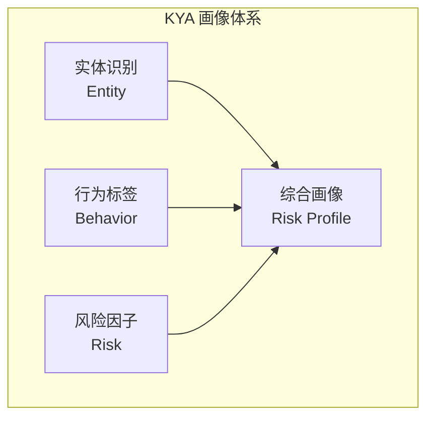
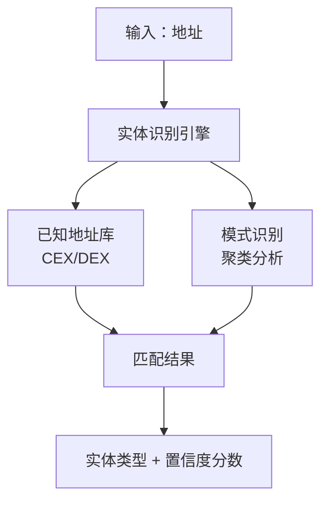
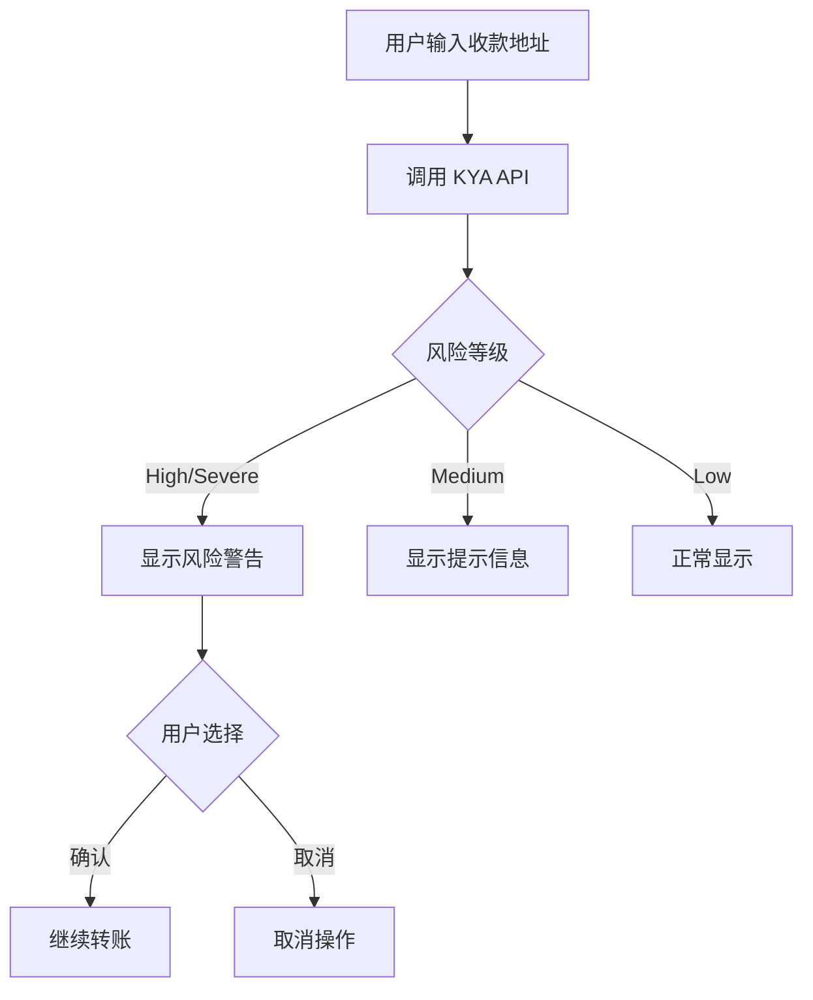
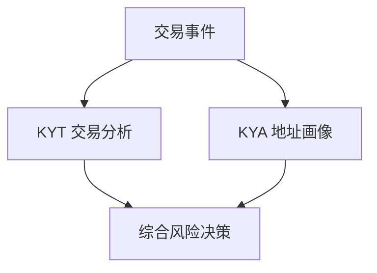

## KYA 是什么

**KYA (Know Your Address)** 是对加密货币地址进行整体画像和风险评估的机制。

<Info>
**核心定义**

KYA = 地址画像

基于地址的历史行为、关联网络、标签信息，构建完整的风险画像。
</Info>

## 与 KYT 的区别

| 维度 | KYT | KYA |
|------|-----|-----|
| 分析对象 | 单笔交易 | 地址整体 |
| 时间维度 | 实时快照 | 历史累积 |
| 核心问题 | 这笔交易安全吗？ | 这个地址可信吗？ |
| 更新频率 | 每笔交易触发 | 定期/按需更新 |
| 数据深度 | 交易级别 | 画像级别 |

---

## 画像维度

KYA 从三个核心维度构建地址画像：



---

## 实体识别

识别地址背后的实体类型：

### 实体分类

| 类别 | 说明 | 风险权重 | 识别方法 |
|------|------|----------|----------|
| CEX | 中心化交易所 | 低 | 已知热钱包地址、充值地址模式 |
| DEX | 去中心化交易所 | 低-中 | 智能合约识别、路由器地址 |
| 个人 | 普通用户地址 | 中 | 行为模式分析、余额特征 |
| 合约 | 智能合约 | 视情况 | 链上代码验证 |
| 已知犯罪 | 确认的犯罪地址 | 极高 | 执法通报、制裁名单 |

### 实体识别流程



### 置信度等级

| 等级 | 置信度 | 说明 | 应用建议 |
|------|--------|------|----------|
| **确认** | &gt;95% | 官方确认或执法通报 | 可直接使用 |
| **高置信** | 80-95% | 强特征匹配 | 建议使用 |
| **中置信** | 50-80% | 部分特征匹配 | 参考使用 |
| **低置信** | &lt;50% | 推测 | 仅供参考 |

---

## 行为标签

基于地址的链上行为特征，系统自动打上相应标签。

<Tabs>
  <Tab title="角色标签">
    反映地址在链上生态中的角色定位：
    
    | 标签 | 定义 | 风险含义 |
    |------|------|----------|
    | `whale` | 大额持仓地址 (&gt;$1M) | 市场影响力大 |
    | `trader` | 高频交易行为 | 正常活跃 |
    | `holder` | 长期持有不动 | 低风险 |
    | `bot` | 程序化交易特征 | 需关注 |
    | `smart_money` | 聪明钱 | 专业交易者 |
  </Tab>
  
  <Tab title="行为标签">
    反映地址的具体行为模式：
    
    | 标签 | 定义 | 风险含义 |
    |------|------|----------|
    | `mixer_user` | 使用过混币服务 | 高风险 |
    | `bridge_user` | 跨链桥使用者 | 中等风险 |
    | `defi_active` | DeFi 协议交互频繁 | 正常 |
    | `nft_trader` | NFT 交易活跃 | 正常 |
    | `new_address` | 新创建地址 | 需观察 |
  </Tab>
  
  <Tab title="实体标签">
    已识别的归属实体：
    
    | 标签 | 说明 |
    |------|------|
    | `exchange:binance` | Binance 交易所 |
    | `exchange:coinbase` | Coinbase 交易所 |
    | `defi:uniswap` | Uniswap 协议 |
    | `bridge:multichain` | 跨链桥 |
    | `sanctions` | 受制裁地址 |
  </Tab>
</Tabs>

### 标签组合风险

某些标签组合会放大风险信号：

<Warning>
**高风险组合示例**

`mixer_user` + `high_value` + `new_address`

**风险等级**：HIGH

**原因**：新地址收到混币器大额资金，符合洗钱模式
</Warning>

<Check>
**低风险组合示例**

`whale` + `holder` + `exchange:binance`

**风险等级**：LOW

**原因**：交易所关联的长期持有大户，属于正常行为
</Check>

---

## 风险因子

量化风险评估的核心指标：

### 核心风险因子

| 因子 | 说明 | 计算方式 |
|------|------|----------|
| 黑名单关联度 | 与黑名单地址的关联程度 | 直接/间接暴露比例 |
| 异常行为指数 | 偏离正常行为的程度 | 统计异常检测 |
| 匿名服务使用 | 混币器/隐私协议使用 | 交互历史 |
| 地理风险 | 高风险司法管辖区关联 | IP/交易所关联 |
| 时间异常 | 异常时间模式 | 交易时间分析 |

---

## 应用场景

### 1. 交易对手方尽调

<Steps>
  <Step title="获取对手方地址">
    收集 OTC 交易对手方提供的钱包地址
  </Step>
  <Step title="注册地址">
    ```bash
    POST https://api.chainstream.io/v1/kyt/address
    Authorization: Bearer <access_token>
    Content-Type: application/json

    {
      "address": "0x1234567890abcdef1234567890abcdef12345678"
    }
    ```
  </Step>
  <Step title="获取风险评估">
    ```bash
    GET https://api.chainstream.io/v1/kyt/addresses/{address}/risk
    Authorization: Bearer <access_token>
    ```
  </Step>
  <Step title="决定是否交易">
    - `Severe/High` → 拒绝交易
    - `Medium` → 额外 KYC 要求
    - `Low` → 正常进行
  </Step>
</Steps>

### 2. 批量地址筛查

定期筛查存量用户地址：

```javascript
async function batchScreenAddresses(addresses) {
  const results = [];
  
  for (const address of addresses) {
    // 1. 注册地址
    await fetch('https://api.chainstream.io/v1/kyt/address', {
      method: 'POST',
      headers: {
        'Authorization': `Bearer ${accessToken}`,
        'Content-Type': 'application/json'
      },
      body: JSON.stringify({ address })
    });
    
    // 2. 获取风险评估
    const riskResponse = await fetch(
      `https://api.chainstream.io/v1/kyt/addresses/${address}/risk`,
      { headers: { 'Authorization': `Bearer ${accessToken}` } }
    );
    const risk = await riskResponse.json();
    
    results.push({
      address,
      risk: risk.risk,
      addressType: risk.addressType
    });
  }
  
  return results;
}
```

**业务流程**：
1. 导出用户地址列表
2. 批量注册并查询风险
3. 筛选高风险地址
4. 触发后续处理

### 3. 实时风险提示

钱包用户转账前提示：



---

## 数据要素

### 输入数据

| 字段 | 必填 | 说明 |
|------|------|------|
| address | ✅ | 待查询地址 |

### 输出数据

```json
{
  "address": "0x0038AC785dfB6C82b2c9A7B3B6854e08a10cb9f1",
  "risk": "Low",
  "riskReason": null,
  "addressType": "PRIVATE_WALLET",
  "cluster": null,
  "addressIdentifications": [],
  "exposures": [
    {
      "category": "sanctions",
      "value": 0.0
    }
  ],
  "triggers": [],
  "status": "COMPLETE"
}
```

### 响应字段说明

| 字段 | 类型 | 说明 |
|------|------|------|
| address | string | 查询的地址 |
| risk | string | 风险等级：`Severe`, `High`, `Medium`, `Low` |
| riskReason | string | 风险原因（可为空） |
| addressType | string | 地址类型：`PRIVATE_WALLET`, `EXCHANGE`, `CONTRACT` 等 |
| cluster | string | 关联集群名称（可为空） |
| addressIdentifications | array | 地址识别标签列表 |
| exposures | array | 风险暴露列表 |
| triggers | array | 触发的风险规则 |
| status | string | 分析状态：`COMPLETE`, `PENDING` |

---

## 与 KYT 的协同

KYA 和 KYT 在实际业务中需要配合使用：

### 协同模式



### 决策矩阵

| KYT结果 | KYA结果 | 综合决策 |
|---------|---------|----------|
| SEVERE | 任意 | 立即冻结 |
| HIGH | HIGH/SEVERE | 冻结待审 |
| HIGH | LOW/MEDIUM | 人工审核 |
| MEDIUM | HIGH/SEVERE | 人工审核 |
| MEDIUM | MEDIUM | 增强监控 |
| LOW | LOW | 自动放行 |
| LOW | HIGH | 标记监控 |

---

## 最佳实践

### 1. 缓存策略

KYA 结果可以适度缓存：

| 风险等级 | 建议缓存时间 | 原因 |
|----------|--------------|------|
| SEVERE | 不缓存 | 可能有更新 |
| HIGH | 1小时 | 需要较新数据 |
| MEDIUM | 6小时 | 平衡性能 |
| LOW | 24小时 | 低风险稳定 |

### 2. 增量更新

对于存量地址监控：

<Note>
**推荐方案**

1. 首次全量查询建立基线
2. 每日增量更新 HIGH 以上地址
3. 每周增量更新 MEDIUM 地址
4. 每月全量刷新
</Note>

### 3. 阈值调优

根据业务场景调整判定阈值：

| 场景 | 建议调整 |
|------|----------|
| 高净值客户 | 适当提高 MEDIUM 阈值 |
| 新用户 | 严格使用默认阈值 |
| 批量筛查 | 可略微放宽避免过多误报 |

---

## 下一步

<CardGroup cols={2}>
  <Card title="合规集成指南" icon="plug" href="/cn/guides/data-concepts/compliance-integration">
    开始接入 KYA
  </Card>
  <Card title="KYT 核心概念" icon="magnifying-glass-dollar" href="/cn/guides/data-concepts/kyt-concepts">
    了解交易维度风控
  </Card>
  <Card title="API 认证" icon="key" href="/cn/guides/getting-started/authentication">
    了解认证方式
  </Card>
  <Card title="KYA API 参考" icon="code" href="/cn/api-reference/endpoint/kyt/v1/kyt-address-post">
    查看接口文档
  </Card>
</CardGroup>
