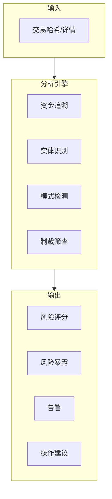
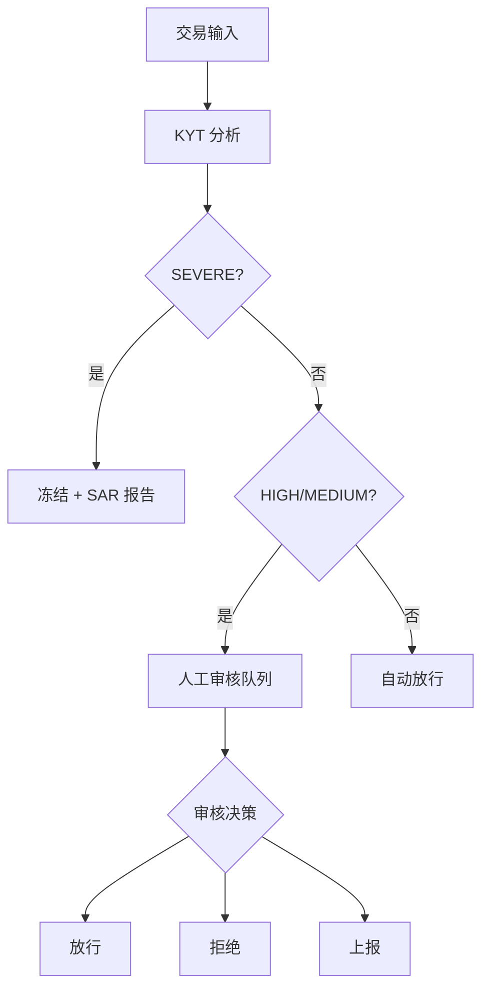

## 什么是 KYT

**KYT (Know Your Transaction)** 是针对单笔加密货币交易的风险识别机制，对每一笔链上交易进行实时分析，判断其风险等级并给出处置建议。

<Info>
**核心问题**：这笔交易安全吗？

KYT 帮助你在处理每一笔交易前，快速识别其风险等级和关联的风险实体。
</Info>

## 与传统金融对比

| 维度 | 传统金融 | 加密货币 KYT |
|------|----------|--------------|
| **监控方式** | 银行交易监控 | 链上交易分析 |
| **数据基础** | 基于账户历史 | 基于地址关联 |
| **处理时效** | T+1 批量处理 | 实时/准实时 |
| **规则引擎** | 人工规则为主 | 算法+标签驱动 |

## 工作原理



### 分析流程

1. **资金追溯**：向前/向后追溯资金的来源和去向
2. **实体识别**：识别交易涉及的已知实体（交易所、协议、标记地址）
3. **模式检测**：识别可疑的交易模式（拆分、混淆、layering）
4. **制裁筛查**：与制裁名单进行匹配

---

## 风险等级定义

ChainStream 采用四级风险分类体系：

| 等级 | 标识 | 定义 | 典型触发条件 |
|------|------|------|--------------|
| **SEVERE** | 🔴 | 已知犯罪关联 | 制裁名单地址、已确认黑客地址、暗网市场 |
| **HIGH** | 🟠 | 高风险模式 | 混币器输出、诈骗关联、未授权赌博 |
| **MEDIUM** | 🟡 | 需关注 | 高风险交易所、隐私币兑换、异常模式 |
| **LOW** | 🟢 | 正常 | 已知合规实体、普通用户行为 |

### 等级详解

<AccordionGroup>
  <Accordion title="SEVERE（严重）" icon="circle-exclamation">
    - **定义**：与已确认的犯罪活动直接关联
    - **数据来源**：OFAC 制裁名单、执法通报、确认的黑客事件
    - **误判率**：极低（&lt;0.1%）
    - **建议操作**：立即冻结，上报监管
  </Accordion>
  
  <Accordion title="HIGH（高风险）" icon="triangle-exclamation">
    - **定义**：具有高风险特征但未确认犯罪
    - **数据来源**：混币器识别、诈骗地址聚类、行为模式分析
    - **误判率**：低（&lt;5%）
    - **建议操作**：人工审核，延迟处理
  </Accordion>
  
  <Accordion title="MEDIUM（中等）" icon="circle-info">
    - **定义**：存在风险信号但需进一步评估
    - **数据来源**：关联分析、行为异常检测
    - **误判率**：中等（5-15%）
    - **建议操作**：增强监控，可放行
  </Accordion>
  
  <Accordion title="LOW（低风险）" icon="circle-check">
    - **定义**：无明显风险特征
    - **数据来源**：正常交易模式、已知合规实体
    - **建议操作**：正常处理
  </Accordion>
</AccordionGroup>

---

## 建议操作映射

根据风险等级，系统给出标准化操作建议：

| 风险等级 | 建议操作 | 自动化程度 | SLA |
|----------|----------|------------|-----|
| **SEVERE** | 冻结 (Freeze) | 自动执行 | 即时 |
| **HIGH** | 人工审核 (Manual Review) | 需人工确认 | 4 小时 |
| **MEDIUM** | 增强监控 (Enhanced Monitoring) | 半自动 | 24 小时 |
| **LOW** | 放行 (Pass) | 自动执行 | 即时 |

### 操作流程



---

## 暴露类型

ChainStream 区分两种风险暴露方式：

<Tabs>
  <Tab title="直接暴露 (Direct)">
    **定义**：交易直接与风险地址发生交互
    
    ```
    风险地址 ──────────────> 目标地址
             直接转账
             
    暴露类型：DIRECT
    风险传导：100%
    ```
    
    **特征**：
    - 一跳关联
    - 风险确定性高
    - 通常触发即时响应
    
    **示例场景**：
    - 从已知黑客地址收款
    - 向制裁名单地址付款
    - 直接从混币器输出接收
    
    ```json
    {
      "type": "DIRECT",
      "category": "SANCTIONS",
      "entity": "OFAC Sanctioned Address",
      "percentage": 100
    }
    ```
  </Tab>
  
  <Tab title="间接暴露 (Indirect)">
    **定义**：通过 N 跳关联与风险地址产生关联
    
    ```
    风险地址 ──> 中间地址1 ──> 中间地址2 ──> 目标地址
             N 跳关联
             
    暴露类型：INDIRECT
    风险传导：衰减计算
    ```
    
    **特征**：
    - 多跳关联（通常 2-5 跳）
    - 风险随距离衰减
    - 需要综合评估
    
    **衰减模型**：
    
    `风险得分 = 基础风险 × (衰减系数 ^ 跳数)`
    
    示例：基础风险 100，衰减系数 0.5，3 跳后得分 = 100 × 0.5³ = 12.5
    
    ```json
    {
      "type": "INDIRECT",
      "category": "MIXER",
      "entity": "Tornado Cash",
      "percentage": 12.5,
      "hops": 3
    }
    ```
  </Tab>
</Tabs>

### 暴露类型处理建议

| 场景 | Direct 处理 | Indirect 处理 |
|------|-------------|---------------|
| SEVERE 来源 | 立即冻结 | 2 跳内冻结，3 跳+ 人工审核 |
| HIGH 来源 | 人工审核 | 标记监控 |
| MEDIUM 来源 | 正常处理 | 忽略 |

---

## 业务流程

### 标准 KYT 流程

<Steps>
  <Step title="注册交易">
    提交交易信息到 KYT API
    ```bash
    POST https://api-dex.chainstream.io/v1/kyt/transfer
    Authorization: Bearer <access_token>
    Content-Type: application/json

    {
      "network": "ethereum",
      "asset": "ETH",
      "transferReference": "0x1234...abcd:0xRecipientAddress",
      "direction": "received"
    }
    ```
  </Step>
  <Step title="等待分析">
    通过轮询等待分析完成（通常 30 秒内）
  </Step>
  <Step title="查询结果">
    获取风险评估结果
    ```bash
    GET https://api-dex.chainstream.io/v1/kyt/transfers/{externalId}/summary
    Authorization: Bearer <access_token>
    ```
  </Step>
  <Step title="执行决策">
    根据风险等级和建议操作执行业务逻辑
  </Step>
</Steps>

### 处理时效

| 阶段 | 目标时间 | SLA 承诺 |
|------|----------|----------|
| 交易注册 | &lt;100ms | 99.9% |
| 风险分析 | &lt;30s | 95% |
| 结果返回 | &lt;30s | 95% |
| 端到端 | &lt;1min | 90% |

<Note>
有效交易 30 秒内完成分析，复杂关联可能需要更长时间。
</Note>

---

## 数据要素

### 输入数据（注册转账）

| 字段 | 必填 | 说明 |
|------|------|------|
| `network` | ✅ | 网络：`bitcoin`, `ethereum`, `Solana` |
| `asset` | ✅ | 资产类型：`BTC`, `ETH`, `SOL` 等 |
| `transferReference` | ✅ | 转账参考（交易哈希:地址） |
| `direction` | ✅ | 方向：`sent`（发送）或 `received`（接收） |

### 输入数据（注册提现）

| 字段 | 必填 | 说明 |
|------|------|------|
| `network` | ✅ | 网络：`bitcoin`, `ethereum`, `Solana` |
| `asset` | ✅ | 资产类型 |
| `address` | ✅ | 提现目标地址 |
| `assetAmount` | ✅ | 资产数量 |
| `attemptTimestamp` | ✅ | 尝试时间戳 |
| `assetPrice` | 可选 | 资产价格 |

### 输出数据

```json
{
  "externalId": "393905a7-bb96-394b-9e20-3645298c1079",
  "asset": "ETH",
  "network": "ethereum",
  "transferReference": "0x1234...abcd:0xAddress",
  "direction": "received",
  "tx": "0x1234...abcd",
  "outputAddress": "0xAddress",
  "assetAmount": "1.5",
  "usdAmount": "3000.00",
  "timestamp": "2024-01-15T10:30:00.000Z",
  "updatedAt": "2024-01-15T10:30:15.000Z"
}
```

### 响应字段说明

| 字段 | 类型 | 说明 |
|------|------|------|
| externalId | string | 转账 ID（UUID），用于后续查询 |
| asset | string | 资产类型 |
| network | string | 区块链网络 |
| transferReference | string | 转账参考 |
| direction | string | 转账方向 |
| tx | string | 交易哈希 |
| outputAddress | string | 输出地址 |
| assetAmount | string | 资产数量 |
| usdAmount | string | USD 金额 |
| timestamp | string | 交易时间戳 |
| updatedAt | string | 更新时间 |

---

## API 使用

### 注册充值交易（Transfer）

```bash
POST https://api-dex.chainstream.io/v1/kyt/transfer
Authorization: Bearer <access_token>
Content-Type: application/json

{
  "network": "ethereum",
  "asset": "ETH",
  "transferReference": "0x9f318afbad2a183f97750bc51a75b582ad8f9e9c:0x17A16QmavnUfCW11DAApi",
  "direction": "received"
}
```

### 注册提现交易（Withdrawal）

```bash
POST https://api-dex.chainstream.io/v1/kyt/withdrawal
Authorization: Bearer <access_token>
Content-Type: application/json

{
  "network": "Solana",
  "asset": "SOL",
  "address": "D1Mc6j9xQWgR1o1Z7yU5nVVXFQiAYx7FG9AW1aVfwrUM",
  "assetAmount": "5",
  "attemptTimestamp": "2024-01-15T10:30:00.000Z"
}
```

### 获取评估详情

```bash
# 获取转账摘要
GET https://api-dex.chainstream.io/v1/kyt/transfers/{externalId}/summary

# 获取直接风险暴露
GET https://api-dex.chainstream.io/v1/kyt/transfers/{externalId}/exposures/direct

# 获取风险告警
GET https://api-dex.chainstream.io/v1/kyt/transfers/{externalId}/alerts

# 获取网络识别
GET https://api-dex.chainstream.io/v1/kyt/transfers/{externalId}/network-identifications
```

### 提现相关查询

```bash
# 获取提现摘要
GET https://api-dex.chainstream.io/v1/kyt/withdrawal/{withdrawalId}/summary

# 获取提现直接暴露
GET https://api-dex.chainstream.io/v1/kyt/withdrawal/{withdrawalId}/exposures/direct

# 获取提现告警
GET https://api-dex.chainstream.io/v1/kyt/withdrawal/{withdrawalId}/alerts

# 获取欺诈评估
GET https://api-dex.chainstream.io/v1/kyt/withdrawal/{withdrawalId}/fraud-assessment
```

---

## 最佳实践

<AccordionGroup>
  <Accordion title="风险阈值配置" icon="sliders">
    根据业务风险偏好调整阈值：
    
    | 业务类型 | SEVERE 阈值 | HIGH 阈值 | 建议 |
    |----------|-------------|-----------|------|
    | 持牌 CEX | 默认 | 默认 | 严格模式 |
    | 钱包服务 | 默认 | 提高 10% | 平衡模式 |
    | DeFi 协议 | 默认 | 提高 20% | 宽松模式 |
  </Accordion>
  
  <Accordion title="误报处理" icon="flag">
    建立误报反馈机制：
    
    1. 记录所有人工推翻的案例
    2. 定期分析误报模式
    3. 向 ChainStream 提交误报反馈
    4. 调整本地阈值配置
  </Accordion>
  
  <Accordion title="审计留痕" icon="file-lines">
    确保合规审计要求：
    
    - 保存所有 KYT 请求和响应
    - 记录人工决策及理由
    - 保留至少 5 年（视监管要求）
    - 支持导出标准格式报告
  </Accordion>
  
  <Accordion title="持续监控" icon="rotate">
    风险状态可能变化（如地址后续被制裁），建议：
    
    - 定期重新评估历史交易
    - 监控关联地址的新活动
    - 建立风险状态变更的告警机制
  </Accordion>
</AccordionGroup>

---

## 相关资源

<CardGroup cols={2}>
  <Card title="KYA 核心概念" icon="user-shield" href="/cn/guides/data-concepts/kya-concepts">
    了解地址维度风控
  </Card>
  <Card title="合规集成指南" icon="plug" href="/cn/guides/data-concepts/compliance-integration">
    开始接入 KYT
  </Card>
  <Card title="API 认证" icon="key" href="/cn/guides/getting-started/authentication">
    了解认证方式
  </Card>
  <Card title="KYT API 参考" icon="code" href="/cn/api-reference/endpoint/kyt/v1/kyt-transfer-post">
    查看接口文档
  </Card>
</CardGroup>
