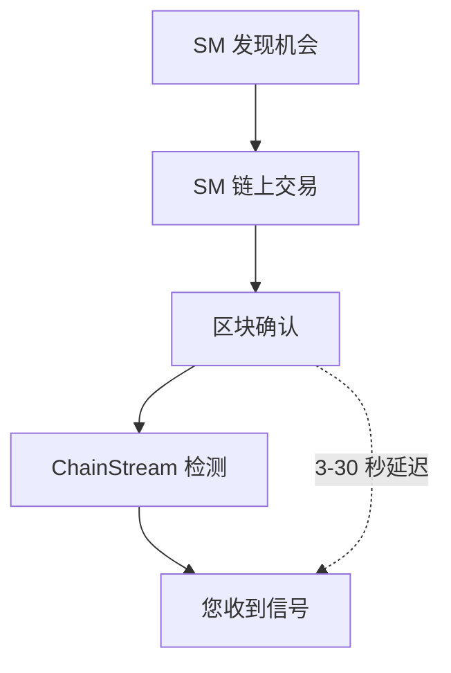

ChainStream 的 Smart Money 功能帮助开发者追踪和分析"聪明钱"——即在加密市场中持续获得超额收益的地址。本文档详细说明 Smart Money 的识别方法论和数据更新机制。

---

## 什么是 Smart Money

### 定义

Smart Money（聪明钱）指在加密市场中展现出以下特征的地址：

- 持续跑赢市场基准收益
- 较早进入优质项目
- 较高的交易胜率
- 专业的风险管理能力

### Smart Money 类型

| 类型 | 说明 | 典型特征 |
|:--|:--|:--|
| 机构投资者 | 专业投资机构、基金 | 大额交易、长期持有、分散投资 |
| 专业交易员 | 全职加密货币交易者 | 高频交易、技术分析、多策略 |
| 早期投资者 | 项目早期参与者 | 一级市场参与、长期锁仓 |
| KOL/影响力钱包 | 行业知名人士 | 社区影响力、信息优势 |

### 与普通地址的区别

| 维度 | Smart Money | 普通地址 |
|:--|:--|:--|
| 收益率 | 持续正收益，跑赢大盘 | 收益波动大，常亏损 |
| 入场时机 | 早期发现，低位买入 | 追涨杀跌，高位接盘 |
| 交易胜率 | &gt; 60% | &lt; 50% |
| 持仓管理 | 有明确的止盈止损策略 | 随意买卖，无纪律 |
| 资金规模 | 通常 &gt; $100K | 分布广泛 |

---

## 识别方法论

### 数据来源

ChainStream 分析以下链上数据：

- 所有 DEX 交易记录
- Token 持仓变化
- 资金流向轨迹
- 交易时间分布
- Gas 费用模式

### 候选池筛选方法

ChainStream 采用基于新 Launch Token 表现的反向追踪方法来构建 Smart Money 候选池：

#### 筛选流程

<Steps>
  <Step title="Token 表现筛选">
    从过去 60 天内所有新 Launch 的 Token 中，按照市值涨幅/交易量等指标筛选出表现最好的 Top 1000 个 Token
  </Step>
  <Step title="早期参与者识别">
    针对上述 Token，识别出在项目早期（Launch 后 24 小时内）买入的地址
  </Step>
  <Step title="地址去噪处理">
    排除以下类型地址：
    - DEV/项目方地址（通过交易模式识别）
    - 做市商地址（通过高频对敲交易识别）
    - CEX 热钱包地址（通过已知地址库匹配）
    - Sybil 攻击地址（通过关联分析识别）
  </Step>
  <Step title="频次统计与排序">
    统计每个地址在 Top 1000 Token 中的早期买入次数，取频次最高的 Top 200 地址作为 Smart Money 候选池
  </Step>
</Steps>

### 动态滚动更新机制

为保持 Smart Money 数据的时效性和准确性，ChainStream 实现了每周滚动更新的权重衰减机制：

| 配置项 | 值 |
|:--|:--|
| 更新周期 | 每周一 UTC 00:00 |
| 窗口大小 | 60 天（约 8 周） |
| 滚动方式 | 每周移除最早一周数据，纳入最新一周数据 |

#### 权重衰减模型

| 数据周期 | 权重 |
|:--|:--|
| 最近 1 周 | 100% |
| 2 周前 | 85% |
| 3 周前 | 70% |
| 4 周前 | 55% |
| 5-8 周前 | 40% |

<Warning>
滚动更新意味着 Smart Money 列表会动态变化。历史上的 Smart Money 地址如果近期表现不佳，会逐步移出候选池。
</Warning>

---

## 数据更新周期

### 实时更新

| 数据类型 | 更新延迟 |
|:--|:--|
| 新交易检测 | &lt; 1 分钟 |
| 持仓变化 | &lt; 5 分钟 |

### 定期更新

| 数据类型 | 更新周期 |
|:--|:--|
| Smart Money 列表 | 每周一 UTC 00:00 |
| 评分重算 | 每 24 小时 |
| 全量重评估 | 每 30 天 |

---

## 使用场景

<CardGroup cols={2}>
  <Card title="跟单交易" icon="copy">
    监控 Smart Money 买入信号，辅助交易决策。
  </Card>
  <Card title="项目发现" icon="magnifying-glass">
    分析 Smart Money 关注的新项目：
    - 多个 Smart Money 同时买入
    - 持续增持而非快进快出
  </Card>
  <Card title="市场情绪" icon="chart-mixed">
    通过 Smart Money 行为判断市场情绪：
    - 大量买入：看涨信号
    - 集中卖出：看跌信号
  </Card>
  <Card title="风险预警" icon="triangle-exclamation">
    监控异常资金流动：
    - 巨鲸大额转账
    - 项目方地址异动
  </Card>
</CardGroup>

---

## 使用注意事项

<Warning>
Smart Money 信号仅供参考，不构成投资建议。
</Warning>

### 正确使用方式

- 作为研究起点，发现值得关注的 Token
- 结合基本面分析，做出独立判断
- 理解信号延迟，链上交易需要确认时间
- 关注多个信号共振，提高准确率

### 错误使用方式

- 盲目跟单，不做任何研究
- 忽视交易成本（Gas、滑点）
- 忽视市场环境和宏观因素
- 过度依赖单一信号来源

---

## 局限性说明

### 1. 信息延迟

### 2. 反向操作风险

- 部分 SM 可能意识到被追踪，故意反向操作
- 大额买入可能是为了出货制造假象

### 3. 市场容量限制

- 跟随 SM 买入会推高价格
- 小市值 Token 容量有限，跟单效果递减

### 4. 历史不代表未来

- 过去的高收益不保证未来表现
- 市场环境变化可能导致策略失效

---

## 相关文档

<CardGroup cols={2}>
  <Card title="Smart Money 追踪器" icon="user-secret" href="/cn/playbooks/tutorials/smart-money-tracker">
    实战教程：构建 SM 追踪系统
  </Card>
  <Card title="实时数据流" icon="bolt" href="/cn/guides/data-concepts/realtime-streaming">
    实时流处理
  </Card>
</CardGroup>
