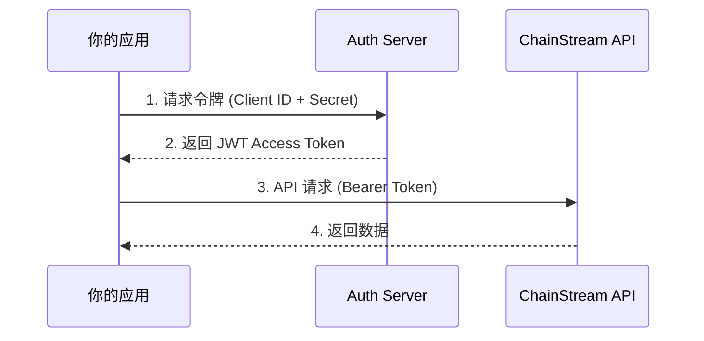

## 认证机制

ChainStream 使用 **OAuth 2.0 Client Credentials** 流程进行 API 认证。你需要使用 API 凭据（Client ID 和 Client Secret）换取 JWT 访问令牌，然后在每个 API 请求中携带该令牌。



## 获取 API 凭据

<Steps>
  <Step title="登录 Dashboard">
    访问 [ChainStream Dashboard](https://www.chainstream.io/dashboard) 并登录你的账户
  </Step>
  <Step title="进入 Applications 页面">
    在侧边栏找到 "Applications"
  </Step>
  <Step title="创建新应用">
    点击 "Create New App"，系统会生成 Client ID 和 Client Secret
  </Step>
</Steps>

<Warning>
请妥善保管你的 API 凭据，不要将其提交到代码仓库或分享给他人。如果凭据泄露，请立即在 Dashboard 中撤销并重新生成。
</Warning>

## 生成访问令牌

### 基础用法（通用 API 访问）

<CodeGroup>
```javascript JavaScript
import { AuthenticationClient } from 'auth0';

const auth0Client = new AuthenticationClient({
  domain: 'dex.asia.auth.chainstream.io',
  clientId: 'YOUR_CLIENT_ID',
  clientSecret: 'YOUR_CLIENT_SECRET'
});

const response = await auth0Client.oauth.clientCredentialsGrant({
  audience: 'https://api.dex.chainstream.io'
});

const accessToken = response.data.access_token;
```

```python Python
import requests

def get_access_token(client_id, client_secret):
    response = requests.post(
        'https://dex.asia.auth.chainstream.io/oauth/token',
        json={
            'client_id': client_id,
            'client_secret': client_secret,
            'audience': 'https://api.dex.chainstream.io',
            'grant_type': 'client_credentials'
        }
    )
    return response.json()['access_token']
```

```go Go
package main

import (
    "bytes"
    "encoding/json"
    "net/http"
)

func getAccessToken(clientID, clientSecret string) (string, error) {
    payload := map[string]string{
        "client_id":     clientID,
        "client_secret": clientSecret,
        "audience":      "https://api.dex.chainstream.io",
        "grant_type":    "client_credentials",
    }
    
    body, _ := json.Marshal(payload)
    resp, err := http.Post(
        "https://dex.asia.auth.chainstream.io/oauth/token",
        "application/json",
        bytes.NewBuffer(body),
    )
    if err != nil {
        return "", err
    }
    defer resp.Body.Close()
    
    var result map[string]interface{}
    json.NewDecoder(resp.Body).Decode(&result)
    return result["access_token"].(string), nil
}
```
</CodeGroup>

## Scope 权限控制

某些高级 API 端点需要特定的访问权限（Scope）。在获取令牌时指定所需的 scope：

### 可用的 Scope

| Scope | 说明 | 适用端点 |
|-------|------|----------|
| `webhook.read` | Webhook 读取权限 | 查询 Webhook 配置 |
| `webhook.write` | Webhook 写入权限 | 创建/修改/删除 Webhook |
| `kyt.read` | KYT 读取权限 | 查询风险评估结果 |
| `kyt.write` | KYT 写入权限 | 提交交易/地址进行风险评估 |

### 带 Scope 的令牌请求

<CodeGroup>
```javascript Webhook 权限
const response = await auth0Client.oauth.clientCredentialsGrant({
  audience: 'https://api.dex.chainstream.io',
  scope: 'webhook.read webhook.write'
});
```

```javascript KYT 权限
const response = await auth0Client.oauth.clientCredentialsGrant({
  audience: 'https://api.dex.chainstream.io',
  scope: 'kyt.read kyt.write'
});
```

```javascript 多个权限
const response = await auth0Client.oauth.clientCredentialsGrant({
  audience: 'https://api.dex.chainstream.io',
  scope: 'webhook.read webhook.write kyt.read kyt.write'
});
```
</CodeGroup>

<Note>
如果不指定 scope，令牌将可以访问所有通用 API 端点。仅在访问受保护的 Webhook 或 KYT 端点时才需要指定 scope。
</Note>

## 使用访问令牌

在每个 API 请求的 `Authorization` 头中携带令牌：

```bash
curl https://api-dex.chainstream.io/v1/token/sol/{address} \
  -H "Authorization: Bearer YOUR_ACCESS_TOKEN"
```

## 令牌有效期与刷新

- **有效期**：访问令牌默认有效期为 24 小时
- **刷新策略**：建议在令牌过期前重新获取新令牌
- **缓存建议**：在应用中缓存令牌，避免每次请求都重新获取

```javascript
// 示例：带缓存的令牌管理
class TokenManager {
  constructor(clientId, clientSecret) {
    this.clientId = clientId;
    this.clientSecret = clientSecret;
    this.token = null;
    this.expiresAt = null;
  }

  async getToken() {
    // 如果令牌即将过期（提前 5 分钟），重新获取
    if (!this.token || Date.now() > this.expiresAt - 5 * 60 * 1000) {
      await this.refreshToken();
    }
    return this.token;
  }

  async refreshToken() {
    const response = await auth0Client.oauth.clientCredentialsGrant({
      audience: 'https://api.dex.chainstream.io'
    });
    this.token = response.data.access_token;
    // JWT 默认 24 小时有效
    this.expiresAt = Date.now() + 24 * 60 * 60 * 1000;
  }
}
```

## API 端点

- **主网 API**：`https://api-dex.chainstream.io/`
- **WebSocket**：`wss://realtime-dex.chainstream.io/connection/websocket`
- **认证服务**：`https://dex.asia.auth.chainstream.io/`

## 常见问题

<AccordionGroup>
  <Accordion title="令牌过期了怎么办？">
    访问令牌过期后，使用相同的凭据重新获取新令牌即可。建议在应用中实现自动刷新机制。
  </Accordion>
  
  <Accordion title="可以创建多个 App 吗？">
    可以。你可以为不同的应用或环境创建独立的 App（各有独立的 Client ID/Secret），便于管理和追踪用量。
  </Accordion>
  
  <Accordion title="如何撤销泄露的凭据？">
    在 Dashboard 的 Apps 页面找到对应的 App，点击 "Delete" 删除即可。删除后该凭据将立即失效。
  </Accordion>
</AccordionGroup>
