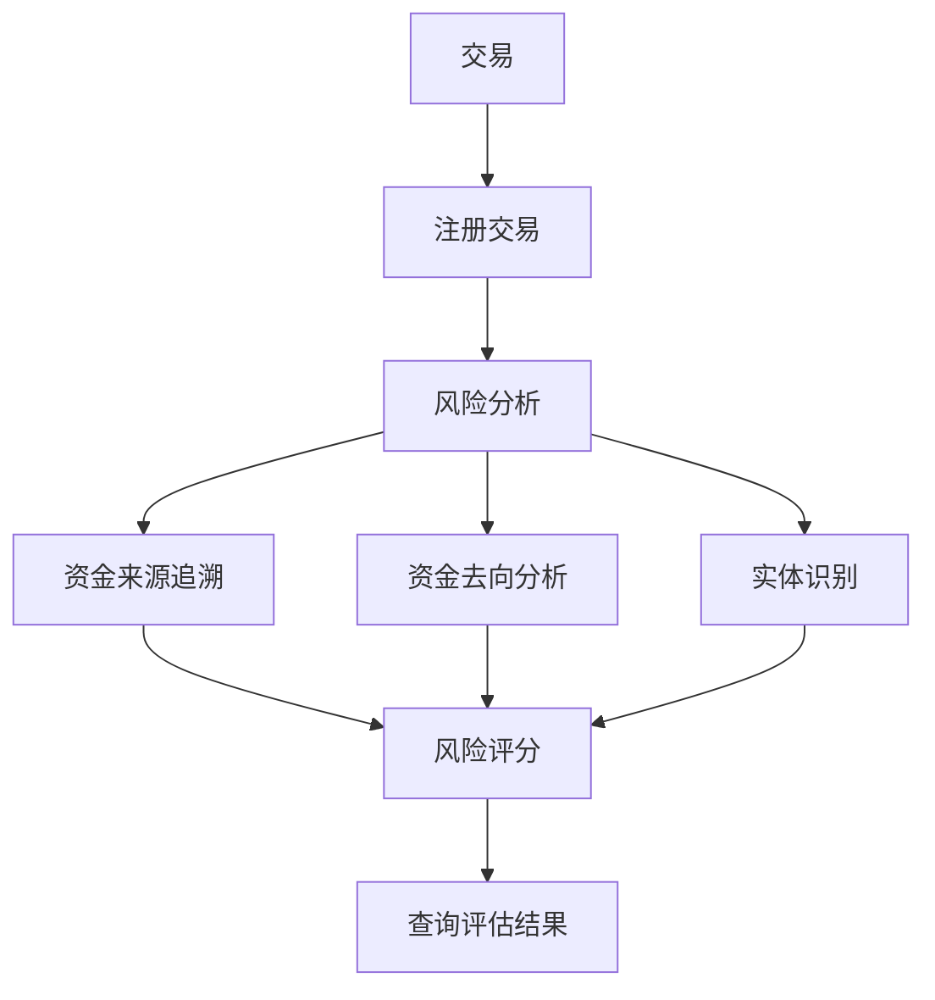

## 概述

随着加密货币的主流化，合规要求日益严格。ChainStream 提供完整的安全与合规解决方案，帮助企业满足监管要求、识别风险交易、保护用户资产。

<CardGroup cols={2}>
  <Card title="KYT - 了解你的交易" icon="magnifying-glass-dollar" color="#4D9CFF">
    实时分析交易的资金来源和去向，识别高风险关联
  </Card>
  <Card title="KYA - 了解你的地址" icon="user-shield" color="#16A34A">
    评估钱包地址的风险等级和关联实体
  </Card>
</CardGroup>

## 为什么需要链上合规

<AccordionGroup>
  <Accordion title="监管要求" icon="gavel">
    全球主要司法管辖区（美国、欧盟、新加坡、香港等）对加密货币交易所和服务商有明确的 AML/CFT 合规要求，包括：
    - 交易监控
    - 可疑活动报告 (SAR)
    - 制裁筛查
    - 记录保存
  </Accordion>
  
  <Accordion title="风险控制" icon="shield-halved">
    识别和阻止：
    - 黑客攻击关联资金
    - 勒索软件支付
    - 混币器和隐私协议关联
    - 诈骗和钓鱼地址
  </Accordion>
  
  <Accordion title="用户保护" icon="user-shield">
    - 防止用户与高风险地址交互
    - 提供代币安全检查
    - 识别蜜罐和 Rug Pull
  </Accordion>
</AccordionGroup>

## ChainStream 合规能力

### KYT (Know Your Transaction)

针对**单笔交易**进行风险评估：



**核心功能**：
- 交易风险评分
- 资金来源/去向追溯
- 关联实体识别
- 风险告警生成

详见 [KYT 核心概念](/cn/guides/data-concepts/kyt-concepts)

### KYA (Know Your Address)

针对**钱包地址**进行风险评估：

**核心功能**：
- 地址风险评级
- 历史行为分析
- 关联实体识别
- 标签分类

详见 [KYA 核心概念](/cn/guides/data-concepts/kya-concepts)

## 覆盖范围

### 支持的链

| 链 | KYT | KYA | 说明 |
|----|-----|-----|------|
| Ethereum | 完整支持 | 完整支持 | 包含 ERC-20 |
| BSC | 完整支持 | 完整支持 | 包含 BEP-20 |
| Polygon | 完整支持 | 完整支持 | |
| Arbitrum | 完整支持 | 完整支持 | |
| Solana | 完整支持 | 完整支持 | SPL 代币 |
| Tron | 完整支持 | 完整支持 | TRC-20 |
| Bitcoin | 部分支持 | 部分支持 | 主网 |

### 风险类别

ChainStream 可识别以下风险类别：

| 类别 | 说明 | 风险等级 |
|------|------|----------|
| Sanctions | 受制裁实体/地址 | 严重 |
| Darknet | 暗网市场关联 | 严重 |
| Ransomware | 勒索软件关联 | 严重 |
| Hacking | 黑客攻击关联 | 严重 |
| Fraud | 诈骗/钓鱼关联 | 高 |
| Mixer | 混币器/隐私协议 | 高 |
| Gambling | 赌博平台 | 中 |
| High Risk Exchange | 高风险交易所 | 中 |

## 集成方式

KYT/KYA 采用**注册 + 查询**的两步模式：先注册交易或地址，系统完成风险分析后，再查询评估结果。

<Tabs>
  <Tab title="交易风险评估 (KYT)">
    **步骤 1：注册交易**
    
    ```bash
    POST /v1/kyt/transfer
    {
      "network": "ethereum",
      "asset": "ETH",
      "transferReference": "your-unique-reference",
      "direction": "received",
      "transferTimestamp": "2024-01-15T10:30:00Z",
      "txHash": "0x...",
      "outputAddress": "0x..."
    }
    ```
    
    **步骤 2：查询评估结果**
    
    ```bash
    # 获取风险摘要
    GET /v1/kyt/transfers/{transferId}/summary
    
    # 获取风险告警
    GET /v1/kyt/transfers/{transferId}/alerts
    
    # 获取直接风险暴露
    GET /v1/kyt/transfers/{transferId}/exposures/direct
    ```
  </Tab>
  
  <Tab title="地址风险评估 (KYA)">
    **步骤 1：注册地址**
    
    ```bash
    POST /v1/kyt/address
    {
      "network": "ethereum",
      "address": "0x...",
      "asset": "ETH"
    }
    ```
    
    **步骤 2：查询风险评级**
    
    ```bash
    GET /v1/kyt/addresses/{address}/risk
    ```
  </Tab>
  
  <Tab title="集成示例">
    将 KYT 集成到充值流程中：
    
    ```javascript
    import { ChainStreamClient } from '@chainstream-io/sdk';
    
    const client = new ChainStreamClient(process.env.CHAINSTREAM_ACCESS_TOKEN);
    
    async function processDeposit(txHash, toAddress) {
      // 步骤 1：注册交易
      const transfer = await client.kyt.registerTransfer({
        network: 'ethereum',
        asset: 'ETH',
        transferReference: `deposit-${txHash}`,
        direction: 'received',
        transferTimestamp: new Date().toISOString(),
        txHash: txHash,
        outputAddress: toAddress
      });
      
      // 步骤 2：查询风险摘要
      const summary = await client.kyt.getTransferSummary(transfer.transferId);
      
      // 步骤 3：根据风险等级决策
      if (summary.rating === 'highRisk' || summary.rating === 'severe') {
        // 获取详细告警信息
        const alerts = await client.kyt.getTransferAlerts(transfer.transferId);
        await flagForReview(txHash, alerts);
        return { status: 'pending_review', alerts };
      }
      
      return { status: 'approved', rating: summary.rating };
    }
    ```
  </Tab>
</Tabs>

## 使用场景

<CardGroup cols={2}>
  <Card title="交易所充值监控" icon="arrow-down-to-arc">
    在用户充值时评估资金来源风险，阻止问题资金入金
  </Card>
  
  <Card title="提款前检查" icon="arrow-up-from-arc">
    在用户提款前评估目标地址风险，防止资金流向制裁实体
  </Card>
  
  <Card title="钱包风险筛查" icon="wallet">
    在用户注册或 KYC 时检查其钱包历史风险
  </Card>
  
  <Card title="合规报告" icon="file-lines">
    生成符合监管要求的交易监控报告
  </Card>
</CardGroup>

## 下一步

<CardGroup cols={3}>
  <Card title="KYT 概念" icon="magnifying-glass-dollar" href="/cn/guides/data-concepts/kyt-concepts">
    深入了解交易风险评估
  </Card>
  <Card title="KYA 概念" icon="user-shield" href="/cn/guides/data-concepts/kya-concepts">
    深入了解地址风险评估
  </Card>
  <Card title="集成指南" icon="plug" href="/cn/guides/data-concepts/compliance-integration">
    了解如何集成合规 API
  </Card>
</CardGroup>
