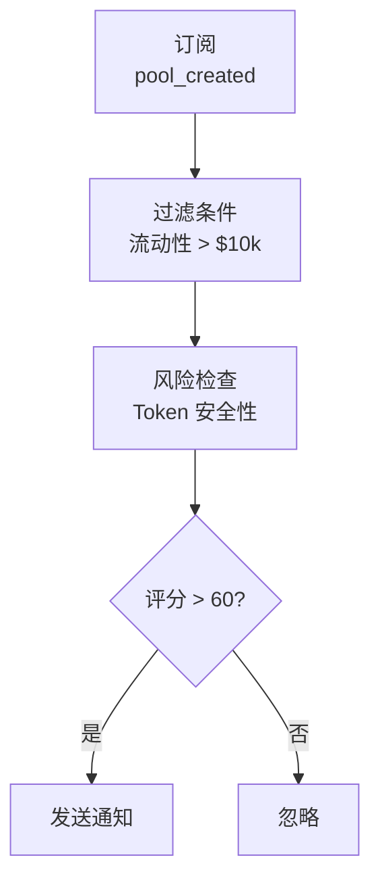

<Warning>
**Coming Soon** - 此功能正在开发中，敬请期待！
</Warning>

本文档介绍如何使用 ChainStream 监控 DeFi 协议活动，包括流动性变化、大额交易、收益追踪和风险告警。

---

## 支持的 DeFi 协议

### DEX（去中心化交易所）

| 协议 | 链 | 支持功能 |
|------|-----|----------|
| **Uniswap V2/V3** | Ethereum, Polygon, Arbitrum, Base | 交易、LP、池子数据 |
| **PancakeSwap** | BSC | 交易、LP、池子数据 |
| **SushiSwap** | Multi-chain | 交易、LP |
| **Raydium** | Solana | 交易、LP |
| **Jupiter** | Solana | 聚合交易 |
| **Curve** | Ethereum, Multi-chain | 稳定币交易、LP |

### 借贷协议

| 协议 | 链 | 支持功能 |
|------|-----|----------|
| **Aave V3** | Ethereum, Polygon, Arbitrum | 借贷、清算、利率 |
| **Compound V3** | Ethereum, Base | 借贷、清算 |
| **Venus** | BSC | 借贷、清算 |
| **Morpho** | Ethereum | 借贷优化 |

### 收益聚合器

| 协议 | 链 | 支持功能 |
|------|-----|----------|
| **Yearn Finance** | Ethereum | Vault 策略、收益 |
| **Convex Finance** | Ethereum | Curve LP 增强 |
| **Beefy Finance** | Multi-chain | 自动复投 |

### 流动性质押

| 协议 | 链 | 支持功能 |
|------|-----|----------|
| **Lido** | Ethereum | ETH 质押 |
| **Rocket Pool** | Ethereum | ETH 质押 |
| **Marinade** | Solana | SOL 质押 |

---

## 监控维度

### 1. 流动性监控

#### 监控事件

| 事件 | 描述 | 重要性 |
|------|------|--------|
| `pool_created` | 新池子创建 | 发现新机会 |
| `liquidity_add` | 添加流动性 | 信心指标 |
| `liquidity_remove` | 移除流动性 | ⚠️ 撤池预警 |
| `pool_update` | 池子参数变更 | 协议治理 |

#### 关键指标

| 指标 | 描述 | 健康标准 |
|------|------|----------|
| TVL | 总锁仓价值 | 稳定或增长 |
| TVL 变化率 | 24h/7d TVL 变化 | &gt; -10%/天 |
| LP 持有者数 | LP Token 持有者分布 | 分散为佳 |
| 流动性深度 | ±2% 价格范围内的流动性 | 深度越大越好 |

#### 撤池风险信号

<Tabs>
  <Tab title="🔴 高风险">
    - 单笔撤池 &gt; 池子 30%
    - 24h 累计撤池 &gt; 50%
    - LP 集中在少数地址（&lt; 5 个）
  </Tab>
  <Tab title="🟡 中风险">
    - 单笔撤池 &gt; 池子 10%
    - LP 锁定即将到期
    - 项目方地址开始撤池
  </Tab>
  <Tab title="🟢 低风险">
    - LP 广泛分布
    - LP 锁定期 &gt; 6 个月
    - TVL 稳定增长
  </Tab>
</Tabs>

---

### 2. 交易监控

#### 实时交易流

通过 WebSocket 订阅实时交易：

| 事件类型 | 描述 | 数据字段 |
|----------|------|----------|
| `swap` | DEX 交易 | token_in, token_out, amount, price |
| `large_trade` | 大额交易 | threshold, trade_details |
| `arbitrage` | 套利交易 | profit, path |
| `mev` | MEV 相关交易 | type, extracted_value |

```typescript
// 订阅 DEX 交易流
ws.subscribe('defi_trades', {
  protocol: 'uniswap_v3',
  chain: 'ethereum',
  min_amount_usd: 10000
}, (trade) => {
  console.log(`${trade.type}: ${trade.token_in} → ${trade.token_out}`);
});
```

#### 交易分析维度

| 分析维度 | 指标 | 意义 |
|----------|------|------|
| 买卖压力 | 买入量/卖出量比率 | &gt; 1 看涨 |
| 交易量趋势 | 交易量移动平均 | 活跃度 |
| 大户行为 | 大额交易占比 | 市场影响 |
| 交易对热度 | 交易频率排名 | 市场关注度 |

---

### 3. 收益追踪

#### 追踪内容

| 收益类型 | 描述 | 计算方式 |
|----------|------|----------|
| **LP 挖矿** | 提供流动性获得的交易费 | 交易费 × 份额占比 |
| **借贷利息** | 存款/借款利息 | 本金 × APY |
| **质押奖励** | 协议代币奖励 | 质押量 × 奖励率 |
| **空投收益** | 协议空投 | 快照持仓 |

#### 收益指标

| 指标 | 描述 | 注意事项 |
|------|------|----------|
| **APY** | 年化收益率（含复利） | 实际收益参考 |
| **APR** | 年化收益率（不含复利） | 基础收益 |
| **无常损失** | LP 相对于持有的损失 | 重要风险因素 |
| **净收益** | 收益 - Gas - 无常损失 | 最终收益 |

#### 无常损失估算

<Info>
**无常损失公式**

```
无常损失 = 2 × √(价格比率) / (1 + 价格比率) - 1
```
</Info>

| 价格变化 | 无常损失 |
|----------|----------|
| ±10% | -0.11% |
| ±25% | -0.64% |
| ±50% | -2.02% |
| ±100% | -5.72% |
| ±200% | -13.4% |

---

### 4. 风险告警

#### 协议级风险

| 风险类型 | 描述 | 告警触发 |
|----------|------|----------|
| **大额撤池** | 流动性大幅减少 | 单笔 &gt; 池子 5% |
| **TVL 骤降** | 协议 TVL 快速下降 | 1h 内下降 &gt; 20% |
| **闪电贷攻击** | 检测到闪电贷模式 | 自动检测 |
| **治理攻击** | 异常提案或投票 | 自动检测 |
| **预言机异常** | 价格数据异常 | 偏离 &gt; 5% |

#### 头寸级风险

| 风险类型 | 描述 | 告警触发 |
|----------|------|----------|
| **清算风险** | 借贷头寸接近清算 | 健康因子 &lt; 1.2 |
| **无常损失** | LP 无常损失扩大 | 损失 &gt; 5% |
| **收益下降** | APY 大幅下降 | 下降 &gt; 50% |

#### 告警配置示例

```json
{
  "alert_type": "liquidity_remove",
  "protocol": "uniswap_v3",
  "pool": "0x...",
  "threshold": {
    "type": "percentage",
    "value": 10
  },
  "notification": {
    "webhook": "https://your-server.com/webhook",
    "email": "alert@example.com"
  }
}
```

---

## 监控场景

### 场景 1：新池子发现

**目标**：第一时间发现新建的交易池



```typescript
ws.subscribe('pool_created', {
  chain: 'ethereum',
  min_liquidity_usd: 10000
}, async (pool) => {
  // 检查 Token 安全性
  const risk = await checkTokenRisk(pool.token_address);
  if (risk.score > 60) {
    notify(`新池子发现: ${pool.pair_name}, 流动性: $${pool.liquidity_usd}`);
  }
});
```

### 场景 2：撤池预警

**目标**：监控持仓池子的撤池风险

<Steps>
  <Step title="添加监控">
    添加目标池子到监控列表
  </Step>
  <Step title="设置阈值">
    设置撤池阈值（如单笔 &gt; 10%）
  </Step>
  <Step title="接收告警">
    接收实时告警
  </Step>
  <Step title="调整持仓">
    及时调整持仓
  </Step>
</Steps>

```typescript
ws.subscribe('liquidity_remove', {
  pool: '0x...',
  threshold_percentage: 10
}, (event) => {
  alert(`⚠️ 撤池预警: ${event.percentage}% 流动性被移除`);
});
```

### 场景 3：套利机会发现

**目标**：发现跨 DEX 价格差异

<Steps>
  <Step title="订阅价格流">
    订阅多个 DEX 的价格流
  </Step>
  <Step title="计算价差">
    计算价差百分比
  </Step>
  <Step title="成本评估">
    考虑 Gas 和滑点成本
  </Step>
  <Step title="发送告警">
    当净利润 &gt; 阈值时告警
  </Step>
</Steps>

```typescript
// 监听多个 DEX 的价格
const prices = {};

ws.subscribe('token_price', { 
  token: 'WETH',
  dex: ['uniswap', 'sushiswap', 'curve']
}, (data) => {
  prices[data.dex] = data.price;
  checkArbitrage(prices);
});

function checkArbitrage(prices) {
  const maxPrice = Math.max(...Object.values(prices));
  const minPrice = Math.min(...Object.values(prices));
  const spread = (maxPrice - minPrice) / minPrice;
  
  if (spread > 0.005) {  // 0.5% 价差
    notify(`套利机会: ${spread * 100}% 价差`);
  }
}
```

### 场景 4：清算监控

**目标**：监控借贷头寸健康度

<Steps>
  <Step title="获取头寸">
    获取目标地址的借贷头寸
  </Step>
  <Step title="计算健康因子">
    计算实时健康因子
  </Step>
  <Step title="预警">
    当健康因子 &lt; 1.5 时预警
  </Step>
  <Step title="紧急告警">
    当健康因子 &lt; 1.2 时紧急告警
  </Step>
</Steps>

```typescript
async function monitorLiquidationRisk(address: string) {
  const position = await getDefiPosition(address, 'aave_v3');
  
  if (position.health_factor < 1.2) {
    urgentAlert(`🚨 清算风险！健康因子: ${position.health_factor}`);
  } else if (position.health_factor < 1.5) {
    warnAlert(`⚠️ 健康因子较低: ${position.health_factor}`);
  }
}
```

---

## 数据延迟说明

| 数据类型 | 延迟 | 说明 |
|----------|------|------|
| 实时交易 | &lt; 3s | 区块确认后推送 |
| TVL 数据 | &lt; 1min | 分钟级更新 |
| APY 数据 | &lt; 5min | 基于最近交易计算 |
| 持有者数据 | &lt; 1h | 小时级快照 |

---

## API 端点

| 功能 | 端点 |
|------|------|
| 获取协议 TVL | `GET /v1/defi/{protocol}/tvl` |
| 获取池子信息 | `GET /v1/defi/{protocol}/pools/{pool_id}` |
| 获取用户头寸 | `GET /v1/defi/{protocol}/positions/{address}` |
| 获取收益数据 | `GET /v1/defi/{protocol}/yields` |

---

## 相关文档

<CardGroup cols={2}>
  <Card title="套利扫描器" icon="magnifying-glass-dollar" href="/cn/playbooks/tutorials/build-arbitrage-scanner">
    实战构建套利扫描工具
  </Card>
  <Card title="价格预警机器人" icon="bell" href="/cn/playbooks/tutorials/build-price-alert-bot">
    构建价格预警系统
  </Card>
</CardGroup>
