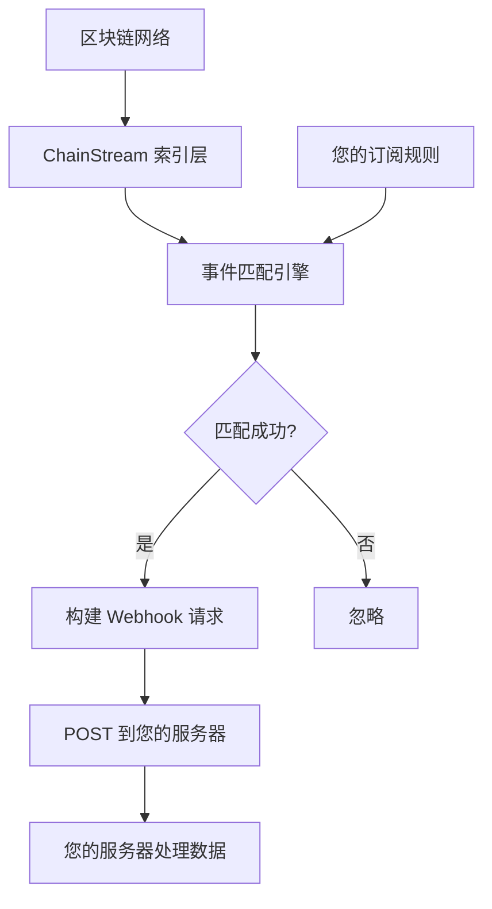
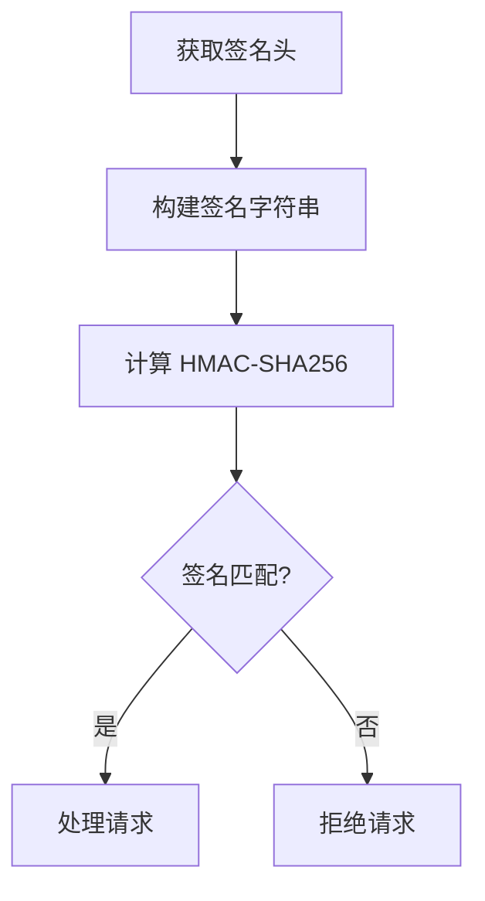

<Warning>
**Beta** — 此功能目前处于测试阶段，API 可能会有变动。
</Warning>

本文档介绍 ChainStream Webhook 的工作原理、配置方法和最佳实践，帮助您实现链上事件的实时推送。

<Note>
Webhook 功能对所有用户开放。
</Note>

---

## 工作原理

### 数据流程



### 核心特性

| 特性 | 说明 |
|------|------|
| **实时推送** | 事件触发后毫秒级推送 |
| **可靠投递** | 失败自动重试 |
| **签名验证** | HMAC 签名防伪造 |
| **过滤规则** | 支持事件类型过滤 |

---

## 支持的事件类型

目前 Webhook 支持以下事件类型（channels）：

| Channel | 描述 | 典型用途 |
|---------|------|----------|
| `sol.token.created` | Solana 新代币创建 | 新币发现、早期机会 |
| `sol.token.migrated` | Solana 代币毕业/迁移 | 追踪从 Pump.fun 等平台毕业的代币 |

<Info>
更多事件类型正在开发中，敬请期待！
</Info>

---

## 创建 Webhook 端点

### API 端点

```bash
POST /v1/webhook/endpoint
Content-Type: application/json
Authorization: Bearer YOUR_ACCESS_TOKEN
```

### 请求参数

| 参数 | 类型 | 必填 | 描述 |
|------|------|------|------|
| `url` | string | 是 | Webhook 回调 URL（必须是 HTTPS） |
| `channels` | array | 是 | 订阅的事件类型列表 |
| `description` | string | 否 | 端点描述 |
| `disabled` | boolean | 否 | 是否禁用，默认 false |
| `filterTypes` | array | 否 | 过滤类型 |
| `metadata` | object | 否 | 自定义元数据 |
| `rateLimit` | integer | 否 | 速率限制 |

### 请求示例

```json
{
  "url": "https://your-server.com/webhook",
  "channels": ["sol.token.created", "sol.token.migrated"],
  "description": "监控新代币和毕业代币"
}
```

### 响应示例

```json
{
  "id": "ep_abc123",
  "url": "https://your-server.com/webhook",
  "channels": ["sol.token.created", "sol.token.migrated"],
  "description": "监控新代币和毕业代币",
  "disabled": false
}
```

---

## Webhook 通知格式

Webhook 通知的数据结构与 WebSocket 推送一致。

### 新代币创建 (sol.token.created)

```json
{
  "channel": "sol.token.created",
  "timestamp": 1706947200000,
  "data": {
    "a": "6p6xgHyF7AeE6TZkSmFsko444wqoP15icUSqi2jfGiPN",
    "n": "Example Token",
    "s": "EXT",
    "dec": 9,
    "cts": 1706947200000,
    "lf": {
      "pa": "6EF8rrecthR5Dkzon8Nwu78hRvfCKubJ14M5uBEwF6P",
      "pf": "pump_fun",
      "pn": "Pump.fun"
    }
  }
}
```

**字段说明**：

| 字段 | 描述 |
|------|------|
| `a` | 代币地址 |
| `n` | 代币名称 |
| `s` | 代币符号 |
| `dec` | 小数位数 |
| `cts` | 创建时间戳（毫秒） |
| `lf.pa` | 启动平台程序地址 |
| `lf.pf` | 协议家族 |
| `lf.pn` | 协议名称 |

### 代币毕业 (sol.token.migrated)

```json
{
  "channel": "sol.token.migrated",
  "timestamp": 1706947200000,
  "data": {
    "a": "6p6xgHyF7AeE6TZkSmFsko444wqoP15icUSqi2jfGiPN",
    "n": "Example Token",
    "s": "EXT",
    "cts": 1706947200000,
    "lf": {
      "pa": "6EF8rrecthR5Dkzon8Nwu78hRvfCKubJ14M5uBEwF6P",
      "pf": "pump_fun",
      "pn": "Pump.fun"
    },
    "mt": {
      "pa": "675kPX9MHTjS2zt1qfr1NYHuzeLXfQM9H24wFSUt1Mp8",
      "pf": "raydium",
      "pn": "Raydium"
    }
  }
}
```

**额外字段**：

| 字段 | 描述 |
|------|------|
| `mt.pa` | 迁移目标平台程序地址 |
| `mt.pf` | 迁移目标协议家族 |
| `mt.pn` | 迁移目标协议名称 |

---

## Webhook URL 要求

| 要求 | 说明 |
|------|------|
| ✅ HTTPS | 必须使用 HTTPS 协议 |
| ✅ 公网可访问 | URL 必须可从公网访问 |
| ✅ 2xx 响应 | 必须返回 2xx 状态码表示成功 |
| ✅ 响应时间 | 应在 5 秒内响应 |
| ✅ 幂等处理 | 需要处理重复请求 |

---

## 安全验证

### 获取 Webhook 密钥

创建端点后，通过以下 API 获取密钥：

```bash
GET /v1/webhook/endpoint/{id}/secret
```

**响应**：

```json
{
  "secret": "whsec_abcdXXX"
}
```

### 签名验证

每个 Webhook 请求都包含签名头，用于验证请求来源：

```
X-Webhook-Signature: <signature>
X-Webhook-Timestamp: <timestamp>
```

### 验证流程



### 代码示例

<Tabs>
  <Tab title="Node.js">
```javascript
const crypto = require('crypto');

function verifyWebhook(req, secret) {
  const signature = req.headers['x-webhook-signature'];
  const timestamp = req.headers['x-webhook-timestamp'];
  const body = JSON.stringify(req.body);
  
  // 检查时间戳（5分钟窗口）
  const now = Date.now();
  if (Math.abs(now - parseInt(timestamp)) > 300000) {
    return false;
  }
  
  // 计算签名
  const message = `${timestamp}.${body}`;
  const expectedSignature = crypto
    .createHmac('sha256', secret)
    .update(message)
    .digest('hex');
  
  // 安全比较
  return crypto.timingSafeEqual(
    Buffer.from(signature),
    Buffer.from(expectedSignature)
  );
}
```
  </Tab>
  <Tab title="Python">
```python
import hmac
import hashlib
import time

def verify_webhook(request, secret):
    signature = request.headers.get('X-Webhook-Signature')
    timestamp = request.headers.get('X-Webhook-Timestamp')
    body = request.get_data(as_text=True)
    
    # 检查时间戳（5分钟窗口）
    now = int(time.time() * 1000)
    if abs(now - int(timestamp)) > 300000:
        return False
    
    # 计算签名
    message = f"{timestamp}.{body}"
    expected_signature = hmac.new(
        secret.encode(),
        message.encode(),
        hashlib.sha256
    ).hexdigest()
    
    # 安全比较
    return hmac.compare_digest(signature, expected_signature)
```
  </Tab>
  <Tab title="Go">
```go
import (
    "crypto/hmac"
    "crypto/sha256"
    "encoding/hex"
    "strconv"
    "time"
)

func verifyWebhook(signature, timestamp, body, secret string) bool {
    // 检查时间戳
    ts, _ := strconv.ParseInt(timestamp, 10, 64)
    now := time.Now().UnixMilli()
    if abs(now-ts) > 300000 {
        return false
    }
    
    // 计算签名
    message := timestamp + "." + body
    mac := hmac.New(sha256.New, []byte(secret))
    mac.Write([]byte(message))
    expected := hex.EncodeToString(mac.Sum(nil))
    
    return hmac.Equal([]byte(signature), []byte(expected))
}
```
  </Tab>
</Tabs>

---

## 管理 Webhook 端点

### 获取端点列表

```bash
GET /v1/webhook/endpoint
```

**查询参数**：

| 参数 | 类型 | 描述 |
|------|------|------|
| `limit` | integer | 每页数量（1-100，默认100） |
| `iterator` | string | 分页迭代器 |
| `order` | string | 排序方式（ascending/descending） |

### 获取端点详情

```bash
GET /v1/webhook/endpoint/{id}
```

### 更新端点

```bash
PATCH /v1/webhook/endpoint
```

```json
{
  "endpointId": "ep_abc123",
  "channels": ["sol.token.created"],
  "description": "只监控新代币"
}
```

### 删除端点

```bash
DELETE /v1/webhook/endpoint/{id}
```

### 轮换密钥

```bash
POST /v1/webhook/endpoint/{id}/secret/rotate
```

---

## 最佳实践

### ✅ 快速响应

```python
# 推荐：先响应，后处理
@app.route('/webhook', methods=['POST'])
def webhook():
    # 验证签名
    if not verify_webhook(request, SECRET):
        return "Invalid signature", 401
    
    # 放入队列异步处理
    queue.put(request.json)
    
    # 立即返回 200
    return "OK", 200
```

### ✅ 幂等性处理

每个事件包含唯一标识，请在服务端记录已处理的事件：

```python
# 使用 Redis 记录已处理事件
def process_webhook(event):
    event_id = f"{event['channel']}:{event['data']['a']}:{event['timestamp']}"
    
    # 检查是否已处理
    if redis.exists(f"processed:{event_id}"):
        return {"status": "already_processed"}
    
    # 处理事件
    handle_event(event)
    
    # 标记为已处理（TTL 24小时）
    redis.setex(f"processed:{event_id}", 86400, "1")
    
    return {"status": "ok"}
```

### ✅ 安全性

<CardGroup cols={2}>
  <Card title="始终验证签名" icon="shield-check">
    验证每个请求的签名
  </Card>
  <Card title="使用 HTTPS" icon="lock">
    确保传输安全
  </Card>
  <Card title="定期轮换密钥" icon="rotate">
    建议每 90 天轮换
  </Card>
  <Card title="保护敏感数据" icon="eye-slash">
    不在日志中记录敏感数据
  </Card>
</CardGroup>

### ✅ 可靠性

<CardGroup cols={2}>
  <Card title="实现幂等性" icon="repeat">
    处理重复请求
  </Card>
  <Card title="消息队列缓冲" icon="layer-group">
    使用队列异步处理
  </Card>
  <Card title="合理超时时间" icon="clock">
    避免长时间阻塞
  </Card>
  <Card title="完善日志" icon="file-lines">
    记录关键信息便于排查
  </Card>
</CardGroup>

---

## 常见问题

<AccordionGroup>
  <Accordion title="Webhook 没有收到请求？" icon="circle-question">
    **排查步骤**：

    1. **确认 URL 可访问** — 从公网测试 URL 是否可达
    2. **检查 HTTPS** — 必须使用有效的 SSL 证书
    3. **检查端点状态** — 确认 `disabled` 不是 `true`
    4. **检查 channels** — 确认订阅了正确的事件类型
  </Accordion>
  
  <Accordion title="收到重复事件怎么办？" icon="clone">
    这可能是重试机制导致的。请实现幂等性处理：

    1. 使用事件的唯一标识（channel + 代币地址 + 时间戳）
    2. 收到请求时先检查是否已处理
    3. 使用带 TTL 的缓存（如 Redis）存储
  </Accordion>
  
  <Accordion title="如何测试 Webhook？" icon="flask">
    1. 使用 ngrok 暴露本地服务
    2. 创建 Webhook 端点指向 ngrok URL
    3. 等待真实事件触发，或使用测试环境
    4. 查看本地服务日志
  </Accordion>
</AccordionGroup>

---

## API 端点汇总

| 功能 | 端点 |
|------|------|
| 获取端点列表 | `GET /v1/webhook/endpoint` |
| 创建端点 | `POST /v1/webhook/endpoint` |
| 更新端点 | `PATCH /v1/webhook/endpoint` |
| 获取端点详情 | `GET /v1/webhook/endpoint/{id}` |
| 删除端点 | `DELETE /v1/webhook/endpoint/{id}` |
| 获取密钥 | `GET /v1/webhook/endpoint/{id}/secret` |
| 轮换密钥 | `POST /v1/webhook/endpoint/{id}/secret/rotate` |

---

## 相关文档

<CardGroup cols={2}>
  <Card title="WebSocket API" icon="plug" href="/cn/api-reference/endpoint/websocket/api">
    实时数据订阅
  </Card>
  <Card title="Endpoint API 参考" icon="code" href="/cn/api-reference/endpoint/endpoint/v1/webhook-endpoint-post">
    完整 API 文档
  </Card>
</CardGroup>
