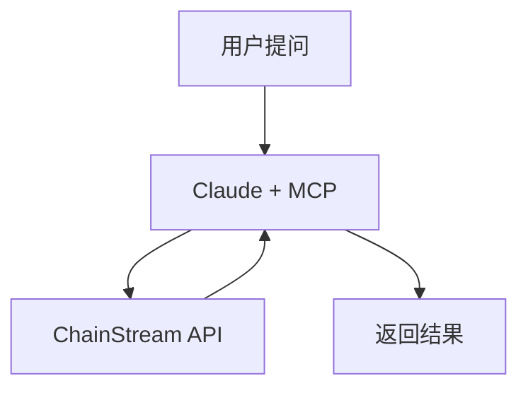

本教程介绍如何使用 ChainStream MCP Server 构建一个能够查询链上数据、分析市场并辅助交易决策的 AI 助理。

<Info>
**预计时间**：30 分钟  
**难度等级**：⭐⭐ 入门
</Info>

---

## 目标

构建一个具备链上感知能力的 AI 助理：



**能力展示**：
- ✅ 查询 Token 价格和余额
- ✅ 分析钱包持仓
- ✅ 追踪 Smart Money

---

## Step 1：配置 MCP

### 前置条件

- ChainStream 账户（获取 Client ID 和 Client Secret）
- Claude Desktop 或 Cursor
- Node.js 18+

### 安装 MCP Server

```bash
npm install -g @chainstream/mcp-server
```

### 配置 Claude Desktop

编辑配置文件：

<Tabs>
  <Tab title="macOS">
```bash
# 配置文件路径
~/Library/Application Support/Claude/claude_desktop_config.json
```
  </Tab>
  <Tab title="Windows">
```bash
# 配置文件路径
%APPDATA%\Claude\claude_desktop_config.json
```
  </Tab>
</Tabs>

添加配置：

```json
{
  "mcpServers": {
    "chainstream": {
      "url": "https://mcp.chainstream.io/mcp",
      "headers": {
        "Authorization": "Bearer your_access_token"
      }
    }
  }
}
```

重启 Claude Desktop。

<Note>
详细步骤请参考 [MCP 配置指南](/cn/guides/ai-infrastructure/mcp-server/setup-guide)。
</Note>

---

## Step 2：对话示例

### 示例 1：查看 ETH 价格

```
用户: 帮我看看 ETH 的价格

Claude: [调用 get_token_price 工具]

ETH 当前价格：
- 价格：$2,015.32
- 24h 变化：+2.5%
- 24h 交易量：$12.5B
- 市值：$242B
```

### 示例 2：分析钱包持仓

```
用户: 分析一下 0xd8dA6BF26964aF9D7eEd9e03E53415D37aA96045 的持仓

Claude: [调用 get_token_balance 和 analyze_wallet 工具]

该地址（vitalik.eth）持仓分析：

持仓概览
| Token | 数量 | 价值 |
|-------|------|------|
| ETH | 1,234 | $2.48M |
| USDC | 50,000 | $50K |
| ENS | 10,000 | $25K |

钱包特征
- 钱包年龄：7+ 年
- 标签：核心开发者、长期持有者
- 主要活动：DeFi、NFT、捐赠
```

### 示例 3：追踪 Smart Money

```
用户: 最近有哪些 Smart Money 在买入 ARB？

Claude: [调用 get_smart_money_activities 工具]

过去 24h Smart Money ARB 买入记录：

1. 0xabc...123 (Smart Score: 92)
   - 买入：500,000 ARB ($450K)
   - 时间：2小时前
   - 标签：DeFi 专家、高胜率交易者

2. 0xdef...456 (Smart Score: 85)
   - 买入：200,000 ARB ($180K)
   - 时间：5小时前
   - 标签：机构钱包

趋势分析：Smart Money 整体对 ARB 呈净买入态势
```

---

## Step 3：高级用法

### 多步骤分析

```
用户: 首先查看这个地址的持仓，然后分析它最近的交易，判断它的投资风格

Claude: 好的，我来分步分析：

第一步：持仓查询
[调用 get_token_balance]
...

第二步：交易历史
[调用 get_transaction_history]
...

第三步：综合分析
[调用 analyze_wallet]

基于以上数据，该地址的投资风格是：
- 类型：中长期持有者
- 偏好：DeFi 蓝筹 + Layer2
- 风险偏好：中等
- 特点：善于在回调时加仓
```

### 对比分析

```
用户: 对比这两个地址的交易策略

Claude: [调用 analyze_wallet x2]

| 维度 | 地址 A | 地址 B |
|------|--------|--------|
| 交易频率 | 高（日均50笔）| 低（日均5笔）|
| 持仓风格 | 短线 | 长线 |
| 胜率 | 62% | 78% |
| 偏好板块 | Meme币 | DeFi |
| 风险等级 | 高 | 中 |
```

---

## 安全考量

### 策略限制

AI 助理仅提供数据查询和分析，不直接执行交易。

```
用户: 帮我买入 100 USDC 的 ETH

Claude: 我可以帮你查询当前 ETH 价格和最佳交易路径，
但无法直接执行交易。

当前 ETH 价格：$2,015
建议执行方式：
1. Uniswap V3 - 预计滑点 0.1%
2. 1inch 聚合器 - 可能获得更优价格

请在你的钱包中手动执行交易。
```

### 人工确认

对于重要决策，AI 会提供分析但建议人工确认：

<Warning>
根据分析，多个 Smart Money 正在买入 ARB，但请注意：
- 这不构成投资建议
- 市场有风险，请独立判断
- 建议结合更多信息来源
</Warning>

---

## 扩展：自定义 Agent

### 使用 MCP SDK 构建

```javascript
import Anthropic from '@anthropic-ai/sdk';
import { Client } from '@modelcontextprotocol/sdk/client/index.js';
import { SSEClientTransport } from '@modelcontextprotocol/sdk/client/sse.js';

const anthropic = new Anthropic();

// 初始化 MCP Client
async function createMcpClient() {
  const transport = new SSEClientTransport(
    new URL('https://mcp.chainstream.io/sse'),
    {
      requestInit: {
        headers: {
          'Authorization': `Bearer ${process.env.CHAINSTREAM_ACCESS_TOKEN}`
        }
      }
    }
  );

  const client = new Client({
    name: 'custom-agent',
    version: '1.0.0'
  });

  await client.connect(transport);
  return client;
}

async function chat(userMessage) {
  const mcp = await createMcpClient();

  // 获取可用工具
  const { tools } = await mcp.listTools();

  // 转换为 Anthropic 格式
  const anthropicTools = tools.map(tool => ({
    name: tool.name,
    description: tool.description,
    input_schema: tool.inputSchema
  }));

  // 调用 Claude
  let response = await anthropic.messages.create({
    model: 'claude-sonnet-4-20250514',
    max_tokens: 1024,
    tools: anthropicTools,
    messages: [{ role: 'user', content: userMessage }]
  });

  // 处理工具调用
  while (response.stop_reason === 'tool_use') {
    const toolUse = response.content.find(c => c.type === 'tool_use');

    // 调用 MCP 工具
    const toolResult = await mcp.callTool({
      name: toolUse.name,
      arguments: toolUse.input
    });

    // 带工具结果继续对话
    response = await anthropic.messages.create({
      model: 'claude-sonnet-4-20250514',
      max_tokens: 1024,
      tools: anthropicTools,
      messages: [
        { role: 'user', content: userMessage },
        { role: 'assistant', content: response.content },
        {
          role: 'user',
          content: [{
            type: 'tool_result',
            tool_use_id: toolUse.id,
            content: JSON.stringify(toolResult.content)
          }]
        }
      ]
    });
  }

  await mcp.close();

  return response.content.find(c => c.type === 'text')?.text;
}

// 使用示例
const result = await chat('查看 Ethereum 上的 ETH 价格');
console.log(result);
```

---

## 可用 MCP 工具

| 工具 | 描述 |
|------|------|
| `get_token_balance` | 查询地址代币余额 |
| `get_token_price` | 获取实时代币价格 |
| `get_transaction_history` | 查询地址交易历史 |
| `get_smart_money_activities` | 获取 Smart Money 活动 |
| `get_defi_positions` | 查询 DeFi 仓位 |
| `analyze_wallet` | 分析钱包特征 |
| `get_token_holders` | 获取代币持有者分析 |

---

## 常见问题

<AccordionGroup>
  <Accordion title="Claude 没有调用 MCP 工具？" icon="circle-question">
    1. 确认 MCP Server 配置正确
    2. 重启 Claude Desktop
    3. 检查 Client ID 和 Client Secret 是否有效
    4. 尝试更明确的提问，如"使用 ChainStream 查询..."
  </Accordion>

  <Accordion title="响应太慢？" icon="clock">
    链上数据查询需要一定时间，特别是复杂分析。可以：
    1. 分步提问，减少单次查询量
    2. 指定具体链减少查询范围
  </Accordion>

  <Accordion title="可以让 AI 自动交易吗？" icon="robot">
    当前版本仅支持数据查询，不支持直接执行交易。这是为了安全考虑。如需自动交易，建议基于 AI 分析结果，通过独立的交易系统执行。
  </Accordion>
</AccordionGroup>

---

## 相关文档

<CardGroup cols={2}>
  <Card title="MCP 配置指南" icon="gear" href="/cn/guides/ai-infrastructure/mcp-server/setup-guide">
    详细配置步骤
  </Card>
  <Card title="MCP 工具目录" icon="wrench" href="/cn/guides/ai-infrastructure/mcp-server/tools-catalog">
    查看所有可用工具
  </Card>
</CardGroup>
