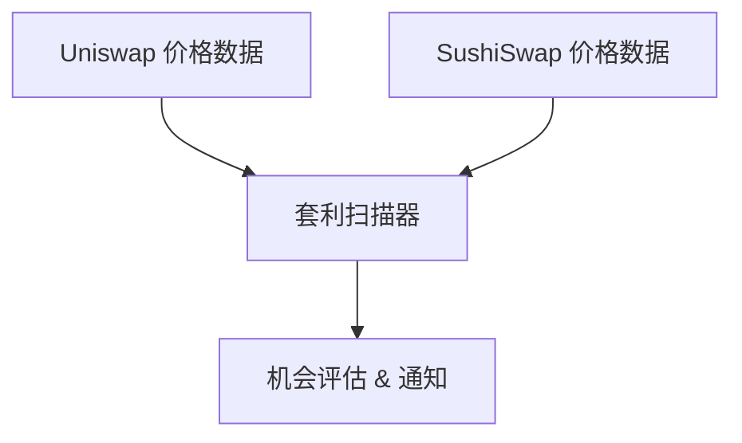

<Warning>
**Coming Soon** — 此功能正在开发中，尚未上线。
</Warning>

本教程将带您构建一个跨 DEX 套利扫描器，实时发现不同交易所之间的价格差异，识别潜在套利机会。

<Info>
**预计时间**：45 分钟  
**难度等级**：⭐⭐⭐ 中级
</Info>

---

## 目标

发现跨 DEX 的价格差异套利机会：



**功能清单**：
- ✅ 获取多 DEX 交易对价格
- ✅ 计算价差百分比
- ✅ 评估可行性（考虑 Gas、滑点、深度）
- ✅ 风险提示（MEV、抢跑）

---

## 套利原理

### 跨 DEX 套利

同一代币在不同 DEX 上可能存在价格差异：

```
例：ETH/USDC 交易对

Uniswap:   1 ETH = $2,000
SushiSwap: 1 ETH = $2,010

价差 = ($2,010 - $2,000) / $2,000 = 0.5%

套利路径：
Uniswap 买入 ETH → SushiSwap 卖出 ETH → 赚取差价
```

### 利润公式

<Info>
**净利润 = 价差收益 - Gas费用 - 滑点损失**
</Info>

实际考虑：
- 两笔交易的 Gas 费用
- 买入/卖出的滑点
- 流动性深度限制
- MEV 抢跑风险

---

## Step 1：获取交易对

### 1.1 安装依赖

```bash
npm install @chainstream-io/sdk dotenv
```

### 1.2 配置文件

```javascript
// config.js
import 'dotenv/config';

export const CHAINSTREAM_ACCESS_TOKEN = process.env.CHAINSTREAM_ACCESS_TOKEN;

// 监控的 DEX
export const DEXES = ['uniswap_v3', 'sushiswap', 'curve'];

// 监控的交易对
export const TRADING_PAIRS = [
  { base: 'ETH', quote: 'USDC', chain: 'ethereum' },
  { base: 'ETH', quote: 'USDT', chain: 'ethereum' },
  { base: 'WBTC', quote: 'ETH', chain: 'ethereum' },
];

// 套利阈值
export const MIN_PROFIT_PERCENT = 0.3;   // 最小利润率
export const MIN_LIQUIDITY_USD = 50000;  // 最小流动性
```

### 1.3 获取价格数据

```javascript
// scanner.js
import { ChainStreamClient } from '@chainstream-io/sdk';
import { CHAINSTREAM_ACCESS_TOKEN, DEXES } from './config.js';

export class PriceScanner {
  constructor() {
    this.client = new ChainStreamClient(CHAINSTREAM_ACCESS_TOKEN);
  }

  async getDexPrices(base, quote, chain) {
    // 获取交易对在各 DEX 的价格
    const prices = await this.client.dex.getPrices({
      base,
      quote,
      chain,
      dexes: DEXES
    });
    return prices;
  }
}
```

---

## Step 2：计算价差

```javascript
// evaluator.js
import { MIN_PROFIT_PERCENT, MIN_LIQUIDITY_USD } from './config.js';

export class ArbitrageEvaluator {

  findOpportunity(prices, pair) {
    // 过滤低流动性
    const validPrices = prices.filter(
      p => (p.liquidityUsd || 0) >= MIN_LIQUIDITY_USD
    );

    if (validPrices.length < 2) {
      return null;
    }

    // 找最低买入价和最高卖出价
    const sortedPrices = [...validPrices].sort((a, b) => a.price - b.price);
    const buyFrom = sortedPrices[0];   // 最低价 - 买入
    const sellTo = sortedPrices[sortedPrices.length - 1]; // 最高价 - 卖出

    // 计算价差
    const spread = (sellTo.price - buyFrom.price) / buyFrom.price * 100;

    // 估算成本
    const gasCostPercent = 0.1;  // 约 0.1%
    const slippagePercent = 0.2; // 约 0.2%
    const totalCost = gasCostPercent + slippagePercent;

    // 净利润
    const netProfit = spread - totalCost;

    if (netProfit < MIN_PROFIT_PERCENT) {
      return null;
    }

    return {
      pair: `${pair.base}/${pair.quote}`,
      buyDex: buyFrom.dex,
      buyPrice: buyFrom.price,
      sellDex: sellTo.dex,
      sellPrice: sellTo.price,
      spreadPercent: Number(spread.toFixed(3)),
      netProfitPercent: Number(netProfit.toFixed(3)),
      maxSizeUsd: Math.min(buyFrom.liquidityUsd, sellTo.liquidityUsd) * 0.02
    };
  }
}
```

---

## Step 3：评估可行性

### 风险评估

```javascript
// risk.js
export function assessRisk(opportunity) {
  const risks = [];

  // MEV 风险
  if (opportunity.netProfitPercent > 1.0) {
    risks.push('🔴 高利润易被 MEV 抢跑');
  }

  // 流动性风险
  if (opportunity.maxSizeUsd < 5000) {
    risks.push('🟡 可执行规模较小');
  }

  // 时效风险
  risks.push('⚠️ 价格数据有延迟');

  return {
    risks,
    executable: risks.filter(r => r.includes('🔴')).length === 0
  };
}
```

### 风险提示

<Warning>
**重要风险提示**：

1. **MEV 抢跑**：套利交易容易被 MEV 机器人抢跑
2. **价格延迟**：实际执行时价格可能已变化
3. **Gas 波动**：网络拥堵时成本可能大幅上涨
4. **滑点**：实际滑点可能高于预估

本工具仅用于发现机会，不构成投资建议。
</Warning>

---

## 完整代码

```javascript
// index.js
import { PriceScanner } from './scanner.js';
import { ArbitrageEvaluator } from './evaluator.js';
import { TRADING_PAIRS } from './config.js';

async function main() {
  const scanner = new PriceScanner();
  const evaluator = new ArbitrageEvaluator();

  console.log('🔍 套利扫描器启动...');

  while (true) {
    for (const pair of TRADING_PAIRS) {
      const prices = await scanner.getDexPrices(
        pair.base, 
        pair.quote, 
        pair.chain
      );

      const opp = evaluator.findOpportunity(prices, pair);

      if (opp) {
        console.log(`
🎯 发现套利机会！
   交易对: ${opp.pair}
   买入: ${opp.buyDex} @ $${opp.buyPrice}
   卖出: ${opp.sellDex} @ $${opp.sellPrice}
   价差: ${opp.spreadPercent}%
   净利润: ${opp.netProfitPercent}%
   最大规模: $${opp.maxSizeUsd.toLocaleString()}
        `);
      }
    }

    // 10秒扫描一次
    await new Promise(resolve => setTimeout(resolve, 10000));
  }
}

main();
```

---

## 扩展建议

<CardGroup cols={3}>
  <Card title="闪电贷集成" icon="bolt">
    使用闪电贷实现无本金套利
  </Card>
  <Card title="多链扫描" icon="layer-group">
    扩展到 Arbitrum、Base 等 L2
  </Card>
  <Card title="自动执行" icon="robot">
    集成钱包实现自动交易（需谨慎）
  </Card>
</CardGroup>

---

## 相关文档

<CardGroup cols={2}>
  <Card title="DeFi 监控概述" icon="landmark" href="/cn/playbooks/frameworks/defi-monitoring-overview">
    了解 DeFi 监控维度
  </Card>
  <Card title="价格预警机器人" icon="bell" href="/cn/playbooks/tutorials/build-price-alert-bot">
    实时价格监控入门
  </Card>
</CardGroup>
