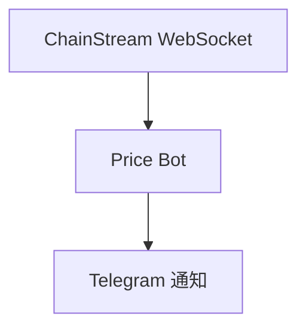

本教程将带您从零构建一个实时价格监控机器人，当目标 Token 价格变动超过设定阈值时，自动发送 Telegram 通知。

<Info>
**预计时间**：30 分钟  
**难度等级**：⭐⭐ 入门
</Info>

---

## 目标

构建一个监控代币价格并自动通知的 Bot：



**功能清单**：
- ✅ 订阅实时价格流
- ✅ 设置价格变动触发条件（> X%）
- ✅ 发送 Telegram 通知
- ✅ 支持多币种监控

---

## 技术栈

| 组件 | 技术 | 用途 |
|------|------|------|
| 语言 | Node.js 18+ | 主开发语言 |
| 实时数据 | WebSocket | 订阅价格流 |
| 通知 | Telegram Bot API | 发送告警 |
| 配置 | 环境变量 | 存储敏感信息 |

---

## 前置条件

- ChainStream 账户（获取 Access Token）
- Node.js 18+
- Telegram 账号

---

## Step 1：连接 WebSocket

### 1.1 安装依赖

```bash
npm install @chainstream-io/sdk node-telegram-bot-api dotenv
```

### 1.2 创建项目结构

```
price-alert-bot/
├── .env
├── config.js
├── bot.js
└── index.js
```

### 1.3 配置文件

**.env**：

```
CHAINSTREAM_ACCESS_TOKEN=your_access_token
TELEGRAM_BOT_TOKEN=your_bot_token
TELEGRAM_CHAT_ID=your_chat_id
```

**config.js**：

```javascript
import 'dotenv/config';

// ChainStream 配置
export const CHAINSTREAM_ACCESS_TOKEN = process.env.CHAINSTREAM_ACCESS_TOKEN;

// Telegram 配置
export const TELEGRAM_BOT_TOKEN = process.env.TELEGRAM_BOT_TOKEN;
export const TELEGRAM_CHAT_ID = process.env.TELEGRAM_CHAT_ID;

// 监控配置
export const WATCH_TOKENS = [
  {
    chain: 'sol',
    address: '6p6xgHyF7AeE6TZkSmFsko444wqoP15icUSqi2jfGiPN',
    symbol: 'EXAMPLE',
    thresholdPercent: 3.0  // 3% 变动触发
  },
  {
    chain: 'sol',
    address: 'So11111111111111111111111111111111111111112',
    symbol: 'SOL',
    thresholdPercent: 5.0  // 5% 变动触发
  }
];
```

### 1.4 WebSocket 连接

**index.js**：

```javascript
import { ChainStreamClient } from '@chainstream-io/sdk';
import { CHAINSTREAM_ACCESS_TOKEN, WATCH_TOKENS } from './config.js';
import { sendAlert } from './bot.js';

class PriceMonitor {
  constructor() {
    this.client = new ChainStreamClient(CHAINSTREAM_ACCESS_TOKEN);
    this.lastPrices = new Map(); // 记录上次价格
  }

  async start() {
    console.log('✅ 开始监控价格...');

    // 订阅每个 Token 的统计数据
    for (const token of WATCH_TOKENS) {
      this.subscribeToken(token);
    }
  }

  subscribeToken(token) {
    this.client.stream.subscribeTokenStats({
      chain: token.chain,
      tokenAddress: token.address,
      callback: (data) => this.handlePriceUpdate(token, data)
    });

    console.log(`📡 已订阅 ${token.symbol} 价格流`);
  }

  handlePriceUpdate(token, data) {
    const currentPrice = data.price || data.p;
    if (!currentPrice) return;

    const lastPrice = this.lastPrices.get(token.address);

    if (lastPrice) {
      // 计算变动百分比
      const changePercent = ((currentPrice - lastPrice) / lastPrice) * 100;

      // 检查是否触发告警
      if (Math.abs(changePercent) >= token.thresholdPercent) {
        this.triggerAlert(token, currentPrice, changePercent);
      }
    }

    // 更新价格记录
    this.lastPrices.set(token.address, currentPrice);
  }

  async triggerAlert(token, price, change) {
    const direction = change > 0 ? '📈 上涨' : '📉 下跌';

    const message = `
${direction} 价格告警！

🪙 Token: ${token.symbol}
💰 当前价格: $${price.toFixed(6)}
📊 变动幅度: ${change >= 0 ? '+' : ''}${change.toFixed(2)}%
⚡ 触发阈值: ${token.thresholdPercent}%
    `.trim();

    await sendAlert(message);
    console.log(`🚨 已发送告警: ${token.symbol} ${change >= 0 ? '+' : ''}${change.toFixed(2)}%`);
  }
}

// 启动监控
const monitor = new PriceMonitor();
monitor.start();
```

---

## Step 2：设置触发条件

触发条件已在 `config.js` 中配置：

```javascript
export const WATCH_TOKENS = [
  {
    symbol: 'EXAMPLE',
    thresholdPercent: 3.0  // 价格变动 > 3% 时触发
  },
  // ...
];
```

### 高级触发条件

可以扩展为更复杂的条件：

```javascript
// 多条件触发
const ALERT_CONDITIONS = {
  priceChange: {
    enabled: true,
    thresholdPercent: 5.0
  },
  priceAbove: {
    enabled: true,
    value: 100  // 价格超过 $100 时触发
  },
  priceBelow: {
    enabled: true,
    value: 50   // 价格低于 $50 时触发
  }
};
```

---

## Step 3：发送通知

### 3.1 创建 Telegram Bot

<Steps>
  <Step title="创建 Bot">
    在 Telegram 中搜索 `@BotFather`，发送 `/newbot`
  </Step>
  <Step title="获取 Token">
    按提示创建 Bot，获取 Bot Token
  </Step>
  <Step title="获取 Chat ID">
    - 给 Bot 发送一条消息
    - 访问 `https://api.telegram.org/bot<TOKEN>/getUpdates`
    - 找到 `chat.id`
  </Step>
</Steps>

### 3.2 Telegram 通知模块

**bot.js**：

```javascript
import TelegramBot from 'node-telegram-bot-api';
import { TELEGRAM_BOT_TOKEN, TELEGRAM_CHAT_ID } from './config.js';

const bot = new TelegramBot(TELEGRAM_BOT_TOKEN);

export async function sendAlert(message) {
  try {
    await bot.sendMessage(TELEGRAM_CHAT_ID, message, {
      parse_mode: 'HTML'
    });
  } catch (error) {
    console.error(`❌ Telegram 发送失败: ${error.message}`);
  }
}

export async function sendAlertWithRetry(message, maxRetries = 3) {
  for (let attempt = 0; attempt < maxRetries; attempt++) {
    try {
      await sendAlert(message);
      return true;
    } catch (error) {
      if (attempt < maxRetries - 1) {
        // 指数退避
        await new Promise(resolve => setTimeout(resolve, 2 ** attempt * 1000));
      } else {
        console.error(`❌ 通知发送失败，已重试 ${maxRetries} 次`);
        return false;
      }
    }
  }
}
```

---

## 验证安装

### 运行 Bot

```bash
node index.js
```

### 预期输出

```
✅ 开始监控价格...
📡 已订阅 EXAMPLE 价格流
📡 已订阅 SOL 价格流
```

### 触发测试

可以临时将阈值设为 0.01% 来快速测试：

```javascript
thresholdPercent: 0.01  // 测试用
```

---

## 扩展建议

<Tabs>
  <Tab title="多币种监控">
```javascript
// 从 API 动态获取监控列表
async function fetchWatchlist() {
  const response = await fetch('https://api.chainstream.io/v1/watchlist');
  return response.json();
}
```
  </Tab>
  <Tab title="持久化存储">
```javascript
import Database from 'better-sqlite3';

const db = new Database('alerts.db');

// 创建表
db.exec(`
  CREATE TABLE IF NOT EXISTS alerts (
    id INTEGER PRIMARY KEY AUTOINCREMENT,
    symbol TEXT,
    price REAL,
    change REAL,
    timestamp INTEGER
  )
`);

function saveAlert(alertData) {
  const stmt = db.prepare(`
    INSERT INTO alerts (symbol, price, change, timestamp)
    VALUES (?, ?, ?, ?)
  `);
  stmt.run(
    alertData.symbol,
    alertData.price,
    alertData.change,
    Date.now()
  );
}
```
  </Tab>
  <Tab title="Web 仪表盘">
```javascript
import express from 'express';

const app = express();

app.get('/alerts', (req, res) => {
  const alerts = getRecentAlerts();
  res.json({ alerts });
});

app.post('/config', (req, res) => {
  // 更新监控配置
  updateConfig(req.body);
  res.json({ success: true });
});

app.listen(3000);
```
  </Tab>
  <Tab title="多通知渠道">
```javascript
async function sendNotification(message, channels) {
  const tasks = [];
  
  if (channels.includes('telegram')) {
    tasks.push(sendTelegram(message));
  }
  if (channels.includes('discord')) {
    tasks.push(sendDiscord(message));
  }
  if (channels.includes('email')) {
    tasks.push(sendEmail(message));
  }
  
  await Promise.all(tasks);
}
```
  </Tab>
</Tabs>

---

## 常见问题

<AccordionGroup>
  <Accordion title="WebSocket 连接失败？" icon="plug">
    1. 检查 Access Token 是否正确
    2. 确认网络可访问 ChainStream
    3. 查看是否有防火墙限制 WebSocket
  </Accordion>
  
  <Accordion title="Telegram 通知收不到？" icon="telegram">
    1. 确认 Bot Token 正确
    2. 确认 Chat ID 正确
    3. 确保已给 Bot 发送过消息（激活对话）
  </Accordion>
  
  <Accordion title="如何监控更多 Token？" icon="coins">
    在 `config.js` 的 `WATCH_TOKENS` 数组中添加更多配置即可。
  </Accordion>
</AccordionGroup>

---

## 相关文档

<CardGroup cols={2}>
  <Card title="WebSocket API" icon="plug" href="/cn/api-reference/endpoint/websocket/api">
    WebSocket 订阅详情
  </Card>
  <Card title="Webhook 基础" icon="webhook" href="/cn/playbooks/frameworks/webhook-fundamentals">
    使用 Webhook 替代 WebSocket
  </Card>
</CardGroup>
