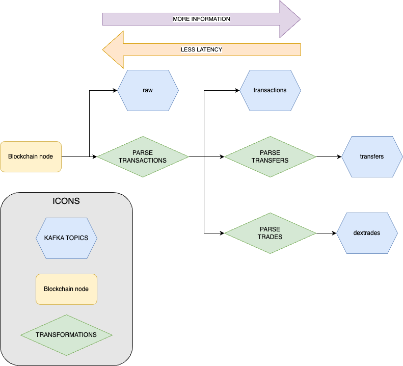

# Kafka 流式数据概念

## GraphQL 与 Kafka Streams 对比

### Kafka 优势

1. **更低延迟**
   - 更短的数据管道
   - 相比 GraphQL 订阅更少的处理开销
   - 无需自定义数据库或额外的格式化逻辑

2. **更好的可靠性**
   - 比 WebSocket 更稳定的连接协议
   - 针对持久连接优化
   - 可以从最新偏移量读取消息

3. **卓越的可扩展性**
   - 多个消费者可以分担负载
   - 自动负载重分配
   - 更好地处理大容量数据

### Kafka 限制

1. **浏览器不兼容**
   - 仅支持服务器端实现
   - 不能直接在浏览器中使用

2. **有限的过滤能力**
   - 无预过滤功能
   - 预定义的模式
   - 需要客户端后处理

3. **开发复杂性**
   - 无 IDE 流支持
   - 调试仅限于消费者端

## 何时选择各项技术

### 使用 GraphQL 的场景：

- 以开发速度为优先级构建原型
- 结合归档和实时数据
- 在网页上显示不同数据
- 构建仅客户端应用

### 使用 Kafka 的场景：

- 延迟要求严格
- 需要消息持久化
- 需要复杂计算
- 构建可扩展的云应用

## 技术考虑因素

### 重要说明

1. **流特性**
   - 未过滤的数据流
   - 需要强大的网络吞吐量
   - 可变的消息粒度
   - 非顺序消息传递
   - 可能出现消息重复
   - 大消息可能被分割（1MB 限制）

2. **延迟因素**
   - 大多数区块链都有广播主题
   - 转换增加 100-1000ms 延迟
   - 链的距离影响速度

<Frame>
  
</Frame>

## 实现指南

### 消息保留

- **Proto 流：** 24 小时
- **DEX 交易 (JSON)：** 24 小时
- **其他 JSON 流：** 4 小时

### 连接设置

```javascript
const sasl_conf = {
  'bootstrap.servers': 'kfk0.chainstream.io:9093,kfk1.chainstream.io:9093,kfk2.chainstream.io:9093',
  'security.protocol': 'SASL_SSL',
  'sasl.mechanism': 'SCRAM-SHA-512',
  'sasl.username': '<YOUR USERNAME HERE>',
  'sasl.password': '<YOUR PASSWORD HERE>',
  'ssl.key.location': 'client.key.pem',
  'ssl.ca.location': 'server.cer.pem',
  'ssl.certificate.location': 'client.cer.pem',
  'ssl.endpoint.identification.algorithm': 'none'
}
```

### 主题结构

```plaintext
<BLOCKCHAIN_NAME>.<MESSAGE_TYPE>
<BLOCKCHAIN_NAME>.broadcasted.<MESSAGE_TYPE>
```

常见的 MESSAGE_TYPES：
- dextrades
- dexorders
- dexpools
- transactions
- transfers
- instructions
- raw

## 最佳实践

### 1. 并行处理
- 并行读取所有分区
- 每个分区一个线程
- 平衡负载分配

### 2. 持续消费
- 维护不间断的消费者循环
- 异步处理消息
- 避免阻塞主消费循环

### 3. 消息处理
- 适时实现批处理
- 使用工作组进行并发处理
- 监控和管理处理延迟

## Protobuf 流

### 主要特性
- 更低的延迟传递
- 紧凑的二进制格式
- 严格的模式遵守
- 消息打包（最多 250 个交易）
- 24 小时消息保留

### 可用主题
- solana.dextrades.proto
- solana.tokens.proto
- solana.transactions.proto

<Note>
有关特定语言的详细实现示例，请参阅我们的语言特定指南。
</Note> 