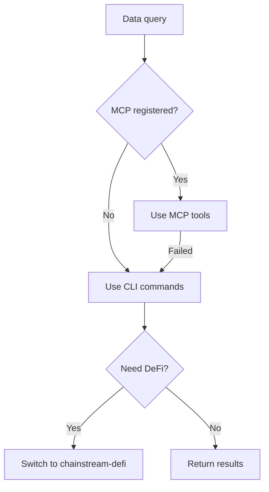
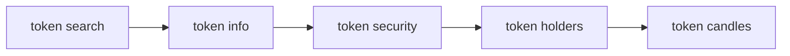
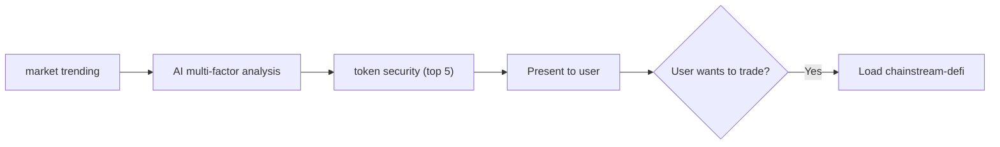
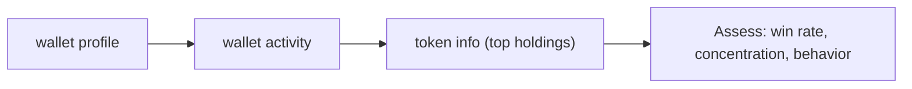

## Overview

The `chainstream-data` skill provides read-only on-chain data capabilities across Solana, BSC, and Ethereum. It covers token analytics, market ranking, wallet profiling, and WebSocket streaming.

- **Pattern**: Tool (read-only, no signing)
- **MCP Server**: `https://mcp.chainstream.io/mcp` (17 tools)
- **CLI**: `npx @chainstream-io/cli`
- **API Base**: `https://api.chainstream.io`

## Integration Path

The skill uses a decision tree to route to the right execution channel:



## Channel Matrix

| Operation | MCP Tool | CLI Command | SDK Method |
|-----------|----------|-------------|------------|
| Search tokens | `tokens_search` | `token search` | `client.token.search` |
| Analyze token | `tokens_analyze` | `token info` | `client.token.getToken` |
| Security check | `tokens_analyze` | `token security` | `client.token.getSecurity` |
| Top holders | `tokens_analyze` | `token holders` | `client.token.getHolders` |
| Price history (K-line) | `tokens_price_history` | `token candles` | `client.token.getCandles` |
| Liquidity pools | `tokens_discover` | `token pools` | `client.token.getPools` |
| Trending tokens | `market_trending` | `market trending` | `client.ranking.*` |
| New listings | `market_trending` | `market new` | `client.ranking.*` |
| Recent trades | `trades_recent` | `market trades` | `client.trade.*` |
| Wallet profile | `wallets_profile` | `wallet profile` | `client.wallet.*` |
| Wallet PnL | `wallets_profile` | `wallet pnl` | `client.wallet.*` |
| Token balances | `wallets_profile` | `wallet holdings` | `client.wallet.*` |
| Transfer history | `wallets_activity` | `wallet activity` | `client.wallet.*` |
| DEX quote | `dex_quote` | `dex route` | `client.dex.quote` |

## AI Workflows

### Token Research

A complete token analysis flow — always run security checks before recommending any token.



<Tabs>
  <Tab title="CLI">
    ```bash
    npx @chainstream-io/cli token search --keyword PUMP --chain sol
    npx @chainstream-io/cli token info --chain sol --address <addr>
    npx @chainstream-io/cli token security --chain sol --address <addr>
    npx @chainstream-io/cli token holders --chain sol --address <addr>
    npx @chainstream-io/cli token candles --chain sol --address <addr> --resolution 1h
    ```
  </Tab>
  <Tab title="MCP">
    ```
    tokens_search { "query": "PUMP", "chain": "solana" }
    tokens_analyze { "chain": "solana", "address": "<addr>" }
    tokens_price_history { "chain": "solana", "address": "<addr>", "resolution": "1h" }
    ```
  </Tab>
</Tabs>

### Market Discovery

Find trending tokens, apply multi-factor analysis, then security-check the top candidates.



<Tabs>
  <Tab title="CLI">
    ```bash
    npx @chainstream-io/cli market trending --chain sol --duration 1h --limit 50
    # AI analyzes: smart money signals, volume, momentum, safety
    npx @chainstream-io/cli token security --chain sol --address <candidate_1>
    npx @chainstream-io/cli token security --chain sol --address <candidate_2>
    ```
  </Tab>
  <Tab title="MCP">
    ```
    market_trending { "chain": "solana", "duration": "1h", "limit": 50 }
    tokens_analyze { "chain": "solana", "address": "<candidate>" }
    ```
  </Tab>
</Tabs>

### Wallet Profiling

Analyze a wallet's performance, holdings, and trading behavior.



<Tabs>
  <Tab title="CLI">
    ```bash
    npx @chainstream-io/cli wallet profile --chain sol --address <wallet>
    npx @chainstream-io/cli wallet activity --chain sol --address <wallet>
    npx @chainstream-io/cli token info --chain sol --address <top_holding>
    ```
  </Tab>
  <Tab title="MCP">
    ```
    wallets_profile { "chain": "solana", "address": "<wallet>" }
    wallets_activity { "chain": "solana", "address": "<wallet>" }
    ```
  </Tab>
</Tabs>

## Safety Rules

<Warning>
These rules are enforced by the skill to ensure data accuracy and responsible AI behavior.
</Warning>

| Rule | Reason |
|------|--------|
| Never answer price questions from training data | Crypto prices are stale within seconds — always make a live API call |
| Always run `token security` before recommending | ChainStream's risk model covers honeypot, rug pull, and concentration signals |
| Never pass `format: "detailed"` to MCP unless requested | Returns 4-10x more data than `concise`, wastes context window |
| Never batch more than 50 addresses in `/multi` endpoints | API hard limit |
| Never use public RPC as substitute | Results differ and miss ChainStream-specific enrichments |

## Error Recovery

| Error | Recovery |
|-------|----------|
| 401 / "Not authenticated" | Configure API Key or run `chainstream login` |
| 402 / "Payment required" | Follow [x402 payment flow](/en/guides/cli/x402-payment) |
| 429 / Rate limit | Wait 1s, exponential backoff |
| 5xx / Server error | Retry once after 2s |

## Related

<CardGroup cols={2}>
  <Card title="chainstream-defi" icon="right-left" href="/en/guides/ai-infrastructure/agent-skills/chainstream-defi">
    For executing trades after research
  </Card>
  <Card title="CLI Commands" icon="terminal" href="/en/guides/cli/commands">
    Full CLI command reference
  </Card>
</CardGroup>
