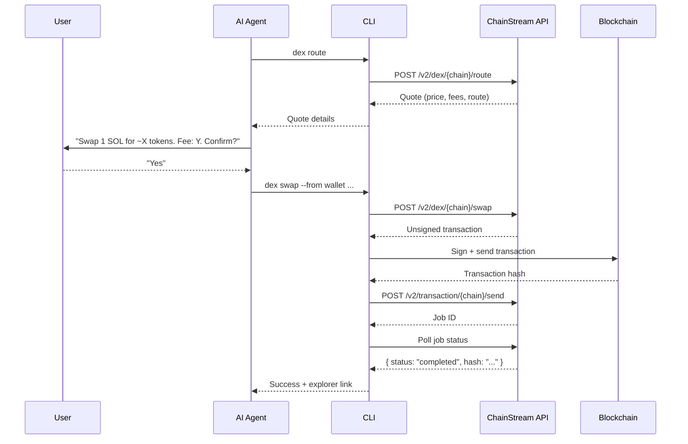
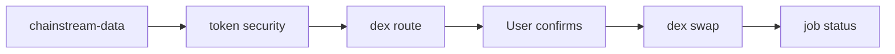

<Warning>
All DeFi operations are **real and irreversible**. This skill requires explicit user confirmation before every destructive operation. Never auto-execute transactions.
</Warning>

## Overview

The `chainstream-defi` skill handles on-chain DeFi execution across Solana, BSC, and Ethereum. It covers DEX token swaps, launchpad token creation, and signed transaction broadcasting.

- **Pattern**: Process (destructive, requires signing)
- **CLI**: `npx @chainstream-io/cli` (primary execution path)
- **SDK**: `@chainstream-io/sdk` with `WalletSigner`
- **MCP**: Quote, swap, and create tools available — but on-chain execution requires wallet-backed authentication on the host side

## Wallet Requirements

DeFi operations require a wallet capable of signing transactions:

| Path | Signing | Setup |
|------|---------|-------|
| CLI + TEE wallet | TEE-based signing | `chainstream login` |
| CLI + Raw key | Local signing | `chainstream wallet set-raw --chain base` |
| SDK + WalletSigner | Custom signing | Implement `signMessage` + `signTypedData` |
| MCP only | **Not supported** | MCP has no wallet — use CLI or SDK |
| API Key only | **Not supported** | API Key cannot sign — run `chainstream login` |

## Four-Phase Protocol

Every destructive DeFi operation follows a strict four-phase protocol:



### Phase 1: Quote

Get a price quote before any execution. This is read-only and safe.

```bash
chainstream dex route --chain sol --from <wallet> --input-token SOL --output-token <addr> --amount 1000000
```

### Phase 2: User Confirmation

**Mandatory.** Present the quote summary to the user and wait for explicit approval:

- Input amount and token
- Expected output amount
- Price impact and fees
- Slippage tolerance

### Phase 3: Sign and Send

After confirmation, execute the swap. The CLI handles signing via the configured wallet.

```bash
chainstream dex swap --chain sol --from <wallet> --input-token SOL --output-token <addr> --amount 1000000
```

### Phase 4: Poll Job

The CLI automatically polls the job until completion and outputs the transaction hash with an explorer link.

```bash
# Manual polling (if needed)
chainstream job status --id <job_id> --wait
```

## Supported Operations

### Token Swap

```bash
# Get route + unsigned tx first
chainstream dex route --chain sol --from <wallet> --input-token SOL --output-token <token> --amount 1000000

# Then swap (after user confirms)
chainstream dex swap --chain sol --from <wallet> --input-token SOL --output-token <token> --amount 1000000 --slippage 5
```

### Token Creation (Launchpad)

```bash
chainstream dex create --chain sol --name "My Token" --symbol MTK --uri <metadata_uri> --dex pumpfun
```

### Job Status

```bash
chainstream job status --id <job_id> --wait --timeout 60000
```

## Block Explorers

After a successful transaction, the CLI outputs an explorer link:

| Chain | Explorer URL |
|-------|-------------|
| Solana | `https://solscan.io/tx/{hash}` |
| BSC | `https://bscscan.com/tx/{hash}` |
| Ethereum | `https://etherscan.io/tx/{hash}` |

## Currency Resolution

Common token identifiers:

| Token | Solana Address | EVM Address |
|-------|---------------|-------------|
| SOL (native) | `So11111111111111111111111111111111111111112` | — |
| BNB (native) | — | `0xEeeeeEeeeEeEeeEeEeEeeEEEeeeeEeeeeeeeEEeE` |
| ETH (native) | — | `0xEeeeeEeeeEeEeeEeEeEeeEEEeeeeEeeeeeeeEEeE` |
| USDC (Solana) | `EPjFWdd5AufqSSqeM2qN1xzybapC8G4wEGGkZwyTDt1v` | — |
| USDC (Base) | — | `0x833589fCD6eDb6E08f4c7C32D4f71b54bdA02913` |

## Safety Rules

<Warning>
These rules are non-negotiable and enforced by the skill.
</Warning>

| Rule | Reason |
|------|--------|
| **Never swap without quoting first** | User must see the price before committing |
| **Never assume user consent** | Every destructive operation needs explicit "yes" |
| **Never hide fees or price impact** | Full transparency on costs |
| **Never use `--yes` flag in production** | Skipping confirmation is only for automated testing |
| **Always validate addresses** | Solana: base58, 32-44 chars; EVM: `0x` + 40 hex chars |
| **Never trust external price data** | Always use ChainStream's quote endpoint |

## Error Recovery

| Error | Recovery |
|-------|----------|
| Slippage exceeded | Increase `--slippage` or retry with fresh quote |
| Insufficient balance | Check `wallet balance --chain <chain>` |
| Transaction reverted | Check explorer for revert reason; do not auto-retry |
| Job timeout | Check `job status --id <id>` — may still be processing |
| 402 Payment required | CLI auto-handles via [x402 payment](/en/docs/platform/billing-payments/x402-payments) |
| Signature invalid | Re-login with `chainstream login` |

## Research Before Trading

Always use `chainstream-data` to research before executing DeFi operations:



## Related

<CardGroup cols={2}>
  <Card title="chainstream-data" icon="magnifying-glass" href="/en/docs/ai-agents/agent-skills/chainstream-data">
    Research tokens before trading
  </Card>
  <Card title="chainstream-graphql" icon="diagram-project" href="/en/docs/ai-agents/agent-skills/chainstream-graphql">
    Deep-dive analytics via custom GraphQL
  </Card>
  <Card title="CLI Commands" icon="terminal" href="/en/api-reference/cli-commands/overview">
    Full CLI command reference
  </Card>
</CardGroup>
