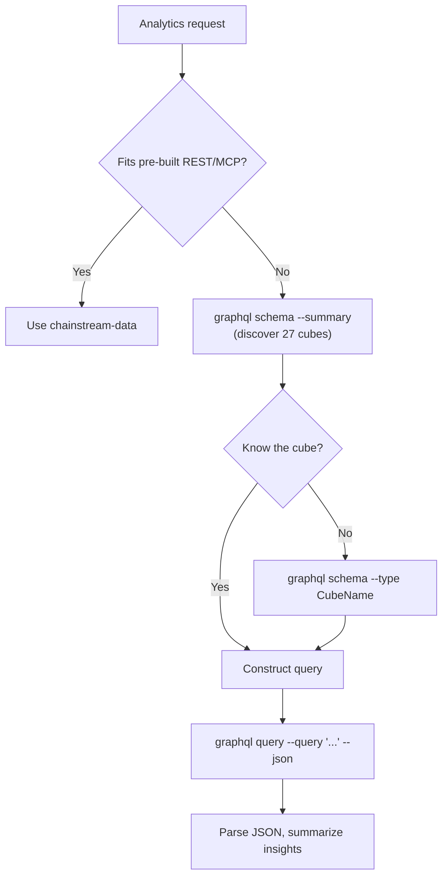

## Overview

The `chainstream-graphql` skill gives AI agents flexible SQL-like access to ChainStream's on-chain data warehouse through GraphQL. It is the right tool whenever a pre-built REST/MCP endpoint is not expressive enough — cross-cube JOINs, custom aggregations, multi-condition filters, custom time-series resolution, or data only exposed via GraphQL (e.g. PolyMarket prediction cubes).

- **Pattern**: Tool (read-only, no signing)
- **Endpoint**: `https://graphql.chainstream.io/graphql` (routed through APISIX)
- **CLI**: `npx @chainstream-io/cli graphql`
- **Auth**: API Key via `X-API-KEY`, or SIWX wallet token
- **Payment**: Same API Key / subscription pool as REST (x402 / MPP auto-handled by CLI)
- **Scope**: 27 cubes across 3 chain groups — `Solana`, `EVM(network: eth | bsc | polygon)`, `Trading`

## When to Use

Decision matrix vs `chainstream-data`:

| Scenario | Use | Why |
|----------|-----|-----|
| Standard token search, market trending, wallet profile | `chainstream-data` | Pre-built REST / MCP endpoints, simpler |
| Cross-cube JOIN (trades + transfers, pools + events) | **chainstream-graphql** | `joinXxx` support |
| Custom aggregation (count / sum / avg with `groupBy`) | **chainstream-graphql** | Metrics + dimension grouping |
| Multi-condition filters (nested, OR via `any`) | **chainstream-graphql** | Full filter operator set |
| Time-series with custom resolution / buckets | **chainstream-graphql** | Time interval bucketing |
| Prediction market data (PolyMarket on Polygon) | **chainstream-graphql** | `PredictionTrades / Managements / Settlements` cubes |

## Integration Path



## Channel Matrix

GraphQL is a single surface accessed from different callers:

| Operation | CLI Command | SDK Method |
|-----------|-------------|------------|
| List all cubes (summary) | `graphql schema --summary` | N/A — use CLI for discovery |
| Drill into one cube | `graphql schema --type <CubeName>` | N/A |
| Full schema reference | `graphql schema --full` | N/A |
| Force-refresh cached schema | `graphql schema --summary --refresh` | N/A |
| Inline query | `graphql query --query '<gql>'` | `client.graphql.query(gql)` |
| Query from file | `graphql query --file ./q.graphql` | `client.graphql.query(fs.readFileSync(...))` |
| Query with variables | `graphql query --query '...' --var '{"k":"v"}'` | `client.graphql.query(gql, vars)` |
| Machine-readable output | Append `--json` | Native JSON return |

## AI Workflows

### Discover Schema

Always start here if the agent doesn't already know which cube it needs.

```bash
npx @chainstream-io/cli graphql schema --summary
npx @chainstream-io/cli graphql schema --type DEXTrades
```

`--summary` returns a compact catalog of all 27 cubes grouped by chain (EVM / Solana / Trading), with top-level fields and descriptions. `--type` expands one cube's field tree for query construction.

### Construct and Run a Query

The schema uses **chain group wrappers** as the top-level entry point.

<Tabs>
  <Tab title="Solana">
    ```graphql
    query {
      Solana {
        DEXTrades(
          limit: { count: 25 }
          orderBy: { descending: Block_Time }
        ) {
          Block { Time }
          Trade {
            Buy  { Currency { MintAddress } Amount PriceInUSD }
            Sell { Currency { MintAddress } Amount }
            Dex  { ProtocolName }
          }
        }
      }
    }
    ```
  </Tab>
  <Tab title="EVM">
    ```graphql
    query {
      EVM(network: eth) {
        DEXTrades(
          limit: { count: 25 }
          orderBy: { descending: Block_Time }
          where: { Trade: { Buy: { Amount: { gt: "0" } } } }
        ) {
          Block { Time }
          Trade { Buy { Currency { Symbol } Amount } Sell { Currency { Symbol } Amount } }
        }
      }
    }
    ```
  </Tab>
  <Tab title="Trading">
    ```graphql
    query {
      Trading {
        Pairs(
          tokenAddress: { is: "So11111111111111111111111111111111111111112" }
          limit: { count: 24 }
        ) {
          TimeMinute
          Price { Open High Low Close }
        }
      }
    }
    ```
  </Tab>
</Tabs>

Execute from the CLI:

```bash
npx @chainstream-io/cli graphql query --file ./query.graphql --json
```

Or inline:

```bash
npx @chainstream-io/cli graphql query \
  --query 'query { Solana { DEXTrades(limit:{count:5}) { Block { Time } } } }' \
  --json
```

## Query Construction Quick Reference

- **Chain group wrapper**: Top-level required. `Solana`, `EVM(network: ...)`, or `Trading`.
- **`network`**: Only on `EVM`. Values: `eth`, `bsc`, `polygon`.
- **`limit`**: `{ count: N, offset: M }`. Default 25.
- **`orderBy`**: `{ descending: Field }` / `{ ascending: Field }`. For computed fields use `{ descendingByField: "field_name" }`.
- **`where`**: `{ Group: { Field: { operator: value } } }`. OR conditions via `any: [{...}, {...}]`.
- **DateTime format**: `"YYYY-MM-DD HH:MM:SS"` — **no `T`, no `Z`** (ClickHouse requirement).
- **DateTime filters**: `since`, `till`, `after`, `before` — **never `gt` / `lt`** on DateTime fields.
- **`joinXxx`**: LEFT JOIN to related cubes. Prefer over multiple queries.
- **`dataset`** wrapper arg: `realtime`, `archive`, `combined` (default).
- **`aggregates`** wrapper arg: `yes`, `no`, `only`.

## Chain Groups and Cubes

| Chain Group | Wrapper | Cubes |
|-------------|---------|-------|
| **Solana** | `Solana { ... }` | DEXTrades, DEXTradeByTokens, Transfers, BalanceUpdates, Blocks, Transactions, DEXPools, Instructions, InstructionBalanceUpdates, Rewards, DEXOrders, TokenSupplyUpdates |
| **EVM** | `EVM(network: eth\|bsc\|polygon) { ... }` | DEXTrades, DEXTradeByTokens, Transfers, BalanceUpdates, Blocks, Transactions, DEXPoolEvents, Events, Calls, MinerRewards, DEXPoolSlippages, TokenHolders, TransactionBalances, Uncles, PredictionTrades\*, PredictionManagements\*, PredictionSettlements\* |
| **Trading** | `Trading { ... }` | Pairs, Tokens, Currencies, Trades |

\* Prediction cubes only available on `polygon` network.

## Safety Rules

<Warning>
These rules are enforced by the skill to keep queries correct and avoid wasted quota.
</Warning>

| Rule | Reason |
|------|--------|
| Never use a flat `CubeName(network: sol)` — always wrap in a chain group | Server rejects un-wrapped queries |
| Never guess field names — run `graphql schema --type <cube>` first | Saves a round-trip of "field does not exist" errors |
| Never use ISO-8601 `"2026-03-31T00:00:00Z"` — use `"2026-03-31 00:00:00"` | ClickHouse DateTime format |
| Never use `gt` / `lt` on DateTime — use `since` / `after` / `before` / `till` | DateTime filters are named |
| Never split related data across multiple queries when `joinXxx` can combine | One paid request instead of many |
| Never auto-select a payment plan — always let the user choose | Billing consent |

## Error Recovery

| Error | Recovery |
|-------|----------|
| 401 / "Not authenticated" | `config auth` — if not logged in, run `login` (auto-grants the nano trial, 50K CU). Then retry. |
| 402 / "Payment required" | `plan status`; if no active subscription, `wallet pricing` → `plan purchase --plan <choice>`. See [x402 payments](/en/docs/platform/billing-payments/x402-payments). |
| `GraphQL error: field X does not exist` | Re-check the field against `graphql schema --type <cube>`. |
| 429 | Wait 1s, exponential backoff. |
| 5xx | Retry once after 2s. |

## Related

<CardGroup cols={2}>
  <Card title="chainstream-data" icon="magnifying-glass" href="/en/docs/ai-agents/agent-skills/chainstream-data">
    Standard REST/MCP queries for token, market and wallet analytics
  </Card>
  <Card title="chainstream-defi" icon="right-left" href="/en/docs/ai-agents/agent-skills/chainstream-defi">
    Execute trades after analysis — swap, create token
  </Card>
  <Card title="GraphQL access method" icon="diagram-project" href="/en/docs/access-methods/graphql">
    Endpoint reference, auth, schema overview
  </Card>
  <Card title="CLI `graphql` subcommand" icon="terminal" href="/en/docs/access-methods/cli#graphql-subcommand">
    `chainstream graphql schema` and `query` reference
  </Card>
</CardGroup>
