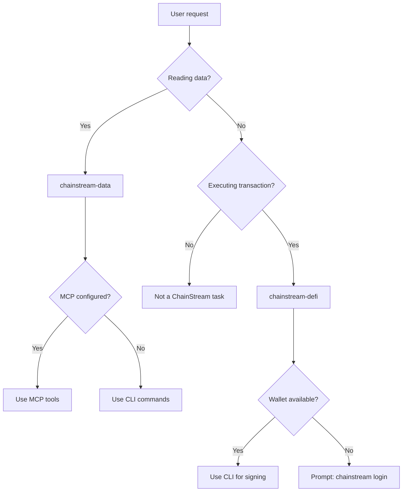

## What Are Agent Skills

Agent Skills are structured instruction packages (`SKILL.md` files) that teach AI coding assistants how to use ChainStream's on-chain data and DeFi capabilities. Unlike raw API docs, skills provide **decision trees, workflows, safety rules, and error recovery** — everything an AI agent needs to operate autonomously.

<CardGroup cols={2}>
  <Card title="chainstream-data" icon="magnifying-glass" color="#4D9CFF">
    **Tool pattern** — read-only on-chain data: token analytics, market trends, wallet profiling, WebSocket streams
  </Card>
  <Card title="chainstream-defi" icon="right-left" color="#9333EA">
    **Process pattern** — irreversible DeFi execution: swap, bridge, launchpad, transaction broadcast
  </Card>
</CardGroup>

## Skills vs MCP vs SDK

| Layer | What It Is | Best For |
|-------|-----------|----------|
| **Agent Skills** | High-level AI instruction set (SKILL.md) with decision trees, workflows, and safety rules | AI coding assistants (Cursor, Claude Code, Codex) |
| **MCP Server** | Model Context Protocol — 17 tools callable by AI models | AI chat assistants (Claude Desktop, ChatGPT) |
| **CLI** | Command-line tool with wallet and x402 payment | Scripts, CI/CD, AI agents needing DeFi |
| **SDK** | TypeScript/Python/Go/Rust client library | Custom applications |

Skills sit at the **highest abstraction layer** — they reference MCP tools and CLI commands internally, routing the AI agent to the right tool for each task.

## Routing Decision Tree

## Skill Comparison

| Aspect | chainstream-data | chainstream-defi |
|--------|-----------------|-----------------|
| Pattern | Tool (read-only) | Process (execute) |
| Risk Level | Low | High (irreversible) |
| Wallet Required | No (API Key sufficient) | Yes (signing needed) |
| MCP Support | Full (17 tools) | Tools available, but execution requires wallet on host |
| User Confirmation | Not required | **Mandatory** before every transaction |
| Typical Actions | Search, analyze, track, stream | Swap, bridge, create, broadcast |

## Shared Resources

Both skills share common reference documents:

| Resource | Content |
|----------|---------|
| **Authentication** | Four auth paths (API Key, wallet login, raw key, Tempo MPP) |
| **x402 Payment** | x402 and MPP payment protocols, plan selection flow |
| **Error Handling** | HTTP status codes, retry strategies, DeFi-specific errors |
| **Chains** | Supported chains matrix, native token addresses, block explorers |

## Supported Platforms

Skills work with any AI coding assistant that supports `SKILL.md` files:

| Platform | Installation Method |
|----------|-------------------|
| Cursor | Auto-discovered via `.cursor-plugin/` |
| Claude Code | `/plugin install chainstream` |
| Codex | Clone + symlink |
| OpenCode | Clone + symlink |
| Gemini CLI | `gemini extensions install` |

See [Installation Guide](/en/guides/ai-infrastructure/agent-skills/installation) for setup instructions.

## Next Steps

<CardGroup cols={2}>
  <Card title="Installation" icon="download" href="/en/guides/ai-infrastructure/agent-skills/installation">
    Set up skills on your platform
  </Card>
  <Card title="chainstream-data" icon="magnifying-glass" href="/en/guides/ai-infrastructure/agent-skills/chainstream-data">
    Data queries and analytics
  </Card>
  <Card title="chainstream-defi" icon="right-left" href="/en/guides/ai-infrastructure/agent-skills/chainstream-defi">
    DeFi execution workflows
  </Card>
  <Card title="MCP Server" icon="plug" href="/en/guides/ai-infrastructure/mcp-server/introduction">
    Underlying MCP protocol
  </Card>
</CardGroup>
