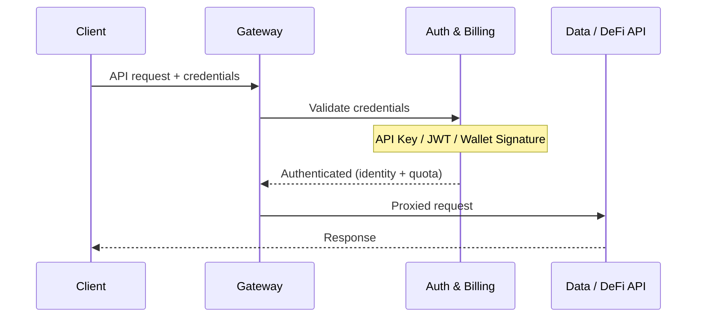

## Architecture

All API requests pass through a **gateway** that validates credentials before forwarding to backend services. The gateway delegates authentication and quota checking to an internal **auth & billing service**, ensuring every request is verified in a single hop.



When authentication fails, the gateway returns an error directly (401 Unauthorized, or 402 Payment Required when x402 is enabled) without hitting the backend.

---

## Three Authentication Methods

ChainStream supports **three** credential types, evaluated in this order:

| Priority | Method | Header | Best For |
|----------|--------|--------|----------|
| 1 | **Wallet Signature (SIWX)** | `Authorization: SIWX <token>` | AI agents with on-chain wallets (x402 subscribers) |
| 2 | **API Key** | `X-API-KEY: <key>` | Applications, scripts, CLI, MCP Server |
| 3 | **JWT Bearer Token** | `Authorization: Bearer <jwt>` | Dashboard apps using OAuth 2.0 Client Credentials |

<Info>
If no valid credentials are found and x402 is enabled, the gateway returns **HTTP 402 Payment Required** with a pointer to `/x402/purchase`. This allows AI agents to auto-purchase a subscription.
</Info>

---

## Method 1: API Key (Recommended)

The simplest authentication method. Create an API Key in the Dashboard and pass it in the `X-API-KEY` header.

### Get an API Key

<Steps>
  <Step title="Login to Dashboard">
    Visit [ChainStream Dashboard](https://www.chainstream.io/dashboard) and login
  </Step>
  <Step title="Go to Applications">
    Find "Applications" in the sidebar
  </Step>
  <Step title="Create New App">
    Click "Create New App" to generate your API Key
  </Step>
</Steps>

### Use the API Key

<Tabs>
  <Tab title="cURL">
```bash
curl https://api.chainstream.io/v2/token/sol/So11111111111111111111111111111111111111112 \
  -H "X-API-KEY: your_api_key"
```
  </Tab>
  <Tab title="SDK">
```typescript
import { ChainStreamClient } from "@chainstream-io/sdk";

const cs = new ChainStreamClient({
  apiKey: "your_api_key",
});

const token = await cs.token.getToken("So11111111111111111111111111111111111111112", "solana");
```
  </Tab>
  <Tab title="CLI">
```bash
chainstream config set --key apiKey --value your_api_key
chainstream token info --chain sol --address So11111111111111111111111111111111111111112
```
  </Tab>
  <Tab title="MCP Server">
```bash
export CHAINSTREAM_API_KEY=your_api_key
npx @chainstream-io/mcp
```
  </Tab>
</Tabs>

### How It Works

1. The gateway extracts the `X-API-KEY` header
2. The auth service validates the key against the database
3. On success, the request is forwarded with the associated organization and permission context
4. The key must be `active` and not expired

<Warning>
Keep your API Key secure. Never commit it to code repositories. If compromised, revoke it immediately in the Dashboard.
</Warning>

---

## Method 2: JWT Bearer Token (OAuth 2.0)

For applications that use the OAuth 2.0 Client Credentials flow. Exchange your Client ID and Client Secret for a JWT access token.

### Generate Access Token

<Tabs>
  <Tab title="cURL">
```bash
curl -X POST "https://dex.asia.auth.chainstream.io/oauth/token" \
  -H "Content-Type: application/json" \
  -d '{
    "client_id": "YOUR_CLIENT_ID",
    "client_secret": "YOUR_CLIENT_SECRET",
    "audience": "https://api.dex.chainstream.io",
    "grant_type": "client_credentials"
  }'
```
  </Tab>
  <Tab title="JavaScript">
```javascript
const response = await fetch('https://dex.asia.auth.chainstream.io/oauth/token', {
  method: 'POST',
  headers: { 'Content-Type': 'application/json' },
  body: JSON.stringify({
    client_id: 'YOUR_CLIENT_ID',
    client_secret: 'YOUR_CLIENT_SECRET',
    audience: 'https://api.dex.chainstream.io',
    grant_type: 'client_credentials'
  })
});

const { access_token } = await response.json();
```
  </Tab>
  <Tab title="Python">
```python
import requests

response = requests.post(
    'https://dex.asia.auth.chainstream.io/oauth/token',
    json={
        'client_id': 'YOUR_CLIENT_ID',
        'client_secret': 'YOUR_CLIENT_SECRET',
        'audience': 'https://api.dex.chainstream.io',
        'grant_type': 'client_credentials'
    }
)

access_token = response.json()['access_token']
```
  </Tab>
</Tabs>

### Use the Token

```bash
curl https://api.chainstream.io/v2/token/sol/So11111111111111111111111111111111111111112 \
  -H "Authorization: Bearer YOUR_ACCESS_TOKEN"
```

### How It Works

1. The gateway extracts the `Authorization: Bearer <jwt>` header
2. The auth service validates the JWT signature, issuer, and audience
3. The `client_id` claim is resolved to an organization for quota tracking

### Token Details

- **Validity**: 24 hours by default
- **Algorithm**: RS256
- **Issuer**: `https://dex.asia.auth.chainstream.io/`
- **Audience**: `https://api.dex.chainstream.io`

### Scope Permissions

Certain endpoints require specific scopes:

| Scope | Description | Applicable Endpoints |
|-------|-------------|---------------------|
| `webhook.read` | Webhook read access | Query Webhook configuration |
| `webhook.write` | Webhook write access | Create/modify/delete Webhooks |
| `kyt.read` | KYT read access | Query risk assessment results |
| `kyt.write` | KYT write access | Submit transactions/addresses for risk assessment |

```javascript
const response = await auth0Client.oauth.clientCredentialsGrant({
  audience: 'https://api.dex.chainstream.io',
  scope: 'webhook.read webhook.write kyt.read kyt.write'
});
```

<Note>
If no scope is specified, the token can access all general API endpoints. Scope is only required for Webhook and KYT endpoints.
</Note>

---

## Method 3: Wallet Signature (SIWX)

For AI agents with on-chain wallets that have purchased a subscription via [x402 payment](/en/guides/getting-started/x402-payments). Uses the **Sign-In with X (SIWX)** standard (EIP-4361 for EVM, equivalent for Solana).

### How It Works

1. The agent constructs a standard sign-in message with domain, address, nonce, and expiration
2. The agent signs the message with their wallet private key
3. The signed token is sent as `Authorization: SIWX base64(message).signature`
4. The auth service verifies the signature and checks for a valid x402 subscription
5. If a valid, non-expired subscription exists, authentication succeeds

### Token Format

```
Authorization: SIWX base64(message).signature
```

The message follows the EIP-4361 format:

```
api.chainstream.io wants you to sign in with your Ethereum account:
0xYourWalletAddress

Sign in to ChainStream API

URI: https://api.chainstream.io
Version: 1
Chain ID: 8453
Nonce: abc123
Issued At: 2026-03-26T10:00:00Z
Expiration Time: 2026-03-27T10:00:00Z
```

### Supported Chains

| Chain | Address Format | Signature Type |
|-------|---------------|---------------|
| EVM (Base, Ethereum) | `0x` prefixed, 40 hex chars | EIP-191 personal_sign |
| Solana | Base58 encoded, 32-44 chars | Ed25519 |

### SDK Usage

```typescript
const cs = new ChainStreamClient({
  auth: {
    type: "siwx",
    address: "0xYourWalletAddress",
    signMessage: async (message: string) => {
      return await wallet.signMessage(message);
    },
  },
});
```

<Note>
SIWX authentication requires an active x402 subscription. If the subscription has expired, the request will be rejected. See [x402 Payment](/en/guides/getting-started/x402-payments) for purchasing a subscription.
</Note>

---

## WebSocket Authentication

WebSocket connections use the same three authentication methods. The gateway:

1. Detects WebSocket upgrade requests
2. Validates credentials before allowing the handshake
3. Tracks the session for usage metering
4. Reports usage metrics (bytes transferred, duration) on disconnect

WebSocket tokens can also be passed as a query parameter:

```
wss://realtime-dex.chainstream.io/connection/websocket?token=YOUR_ACCESS_TOKEN
```

---

## Authentication Priority

When multiple credentials are present in a single request, they are evaluated in this order:

1. **SIWX** -- if `Authorization` header starts with `SIWX ` and x402 is configured
2. **API Key** -- if `X-API-KEY` header is present
3. **JWT Bearer** -- if `Authorization` header starts with `Bearer `
4. **402 Payment Required** -- if no credentials match and x402 is enabled

The first successful match wins. Subsequent methods are not evaluated.

---

## API Endpoints

| Service | URL |
|---------|-----|
| Mainnet API | `https://api.chainstream.io/` |
| WebSocket | `wss://realtime-dex.chainstream.io/connection/websocket` |
| Auth Service (OAuth) | `https://dex.asia.auth.chainstream.io/` |
| x402 Pricing | `https://api.chainstream.io/x402/pricing` |
| x402 Purchase | `https://api.chainstream.io/x402/purchase` |

---

## Choosing an Auth Method

<CardGroup cols={3}>
  <Card title="API Key" icon="key" color="#4D9CFF">
    **Best for**: Applications, scripts, CLI, MCP Server

    Simplest setup. Create in Dashboard, pass as header. No token refresh needed.
  </Card>
  <Card title="JWT Bearer" icon="shield-check" color="#9333EA">
    **Best for**: Dashboard apps, server-to-server

    Standard OAuth 2.0 flow. Supports scoped permissions. 24h token TTL.
  </Card>
  <Card title="SIWX Wallet" icon="wallet" color="#16A34A">
    **Best for**: AI agents with on-chain wallets

    Wallet-native auth via x402 subscription. No API key management needed.
  </Card>
</CardGroup>

---

## FAQ

<AccordionGroup>
  <Accordion title="Which method should I use?">
    **API Key** is recommended for most use cases. It's the simplest to set up and works with all ChainStream products (SDK, CLI, MCP Server). Use **JWT** if you need OAuth 2.0 integration with scoped permissions. Use **SIWX** if you're building an AI agent with its own wallet and want to pay via x402.
  </Accordion>
  <Accordion title="What if the token expires?">
    For JWT: generate a new token using your Client ID and Client Secret. For SIWX: sign a new message with a future expiration time. API Keys do not expire unless you set an expiration date in the Dashboard.
  </Accordion>
  <Accordion title="Can I use multiple auth methods?">
    Only one method is evaluated per request. If you send both `X-API-KEY` and `Authorization: Bearer`, the API Key takes priority (SIWX > API Key > JWT).
  </Accordion>
  <Accordion title="What is the 402 Payment Required response?">
    When no valid credentials are found and x402 is enabled, the gateway returns HTTP 402 with instructions to purchase a subscription at `/x402/purchase`. This enables AI agents to auto-purchase access. See [x402 Payment](/en/guides/getting-started/x402-payments).
  </Accordion>
  <Accordion title="How do I revoke credentials?">
    **API Key**: Delete the App in the Dashboard. The key is invalidated immediately. **JWT**: Revoke the Client ID/Secret in the Dashboard. **SIWX**: The subscription expires naturally; there is no manual revocation.
  </Accordion>
</AccordionGroup>
