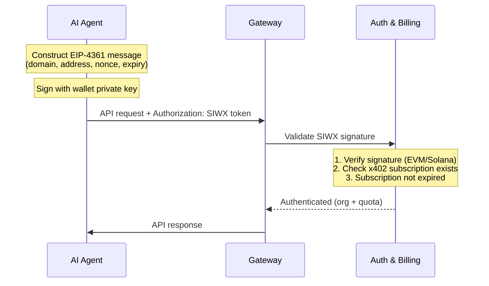

Sign-In with X (SIWX) lets you authenticate with ChainStream by signing a message with your wallet on every API request — no API Key or OAuth token needed. This is designed for **AI agents with on-chain wallets** that have purchased a subscription via [x402 payment](/en/docs/platform/billing-payments/x402-payments).

<Info>
SIWX replaces the API Key. Instead of passing `X-API-KEY`, you pass `Authorization: SIWX <token>` on each request. The gateway verifies the signature and checks for a valid x402 subscription in real time.
</Info>

## How It Works

Unlike traditional challenge/response flows, SIWX is **stateless and self-contained**. The client constructs and signs the message locally, then attaches it to every request.



### Step-by-Step

1. **Construct an EIP-4361 message** with your wallet address, domain, nonce, and expiration time
2. **Sign the message** with your wallet private key
3. **Encode as SIWX token**: `base64(message).signature`
4. **Attach to every API request**: `Authorization: SIWX <token>`
5. The gateway verifies the signature and checks that the wallet has an active x402 subscription
6. If valid, the request proceeds normally (same as API Key auth)

## Token Format

```
Authorization: SIWX base64(message).signature
```

The message follows the EIP-4361 standard:

```
api.chainstream.io wants you to sign in with your Ethereum account:
0xYourWalletAddress

Sign in to ChainStream API

URI: https://api.chainstream.io
Version: 1
Chain ID: 8453
Nonce: abc123def456
Issued At: 2026-03-26T10:00:00Z
Expiration Time: 2026-03-27T10:00:00Z
```

### Required Fields

| Field | Description |
|---|---|
| Domain | Must be `api.chainstream.io` |
| Address | Your wallet address (EVM `0x...` or Solana base58) |
| URI | `https://api.chainstream.io` |
| Version | `1` |
| Nonce | A random string (client-generated, for replay protection) |
| Issued At | ISO 8601 timestamp |
| Expiration Time | ISO 8601 timestamp (the token is rejected after this time) |

<Note>
The expiration time is set by the client. You can sign a message valid for minutes, hours, or days. A longer expiration means fewer re-signs, but a shorter one is more secure.
</Note>

## Supported Chains

| Chain | Address Format | Signature Verification |
|---|---|---|
| EVM (Base, Ethereum) | `0x` prefixed, 40 hex chars | EIP-191 `personal_sign` recovery |
| Solana | Base58 encoded, 32-44 chars | Ed25519 signature verification |

## Prerequisites

SIWX authentication requires an **active x402 subscription** linked to the wallet address. Without a subscription, the gateway rejects the request with an error.

To get a subscription:

```bash
# Via CLI (automatic)
chainstream login
chainstream token info --chain sol --address So11111111111111111111111111111111111111112
# → 402 triggers plan selection → x402 payment → API Key saved

# Or via direct x402 purchase
curl https://api.chainstream.io/x402/purchase?plan=nano
# → Follow x402 payment flow
```

See [x402 Payment](/en/docs/platform/billing-payments/x402-payments) for details.

## Usage Examples

### cURL

```bash
# 1. Construct and sign the message (using your preferred tool)
# 2. Base64-encode the message and append the signature
TOKEN="base64EncodedMessage.signatureHex"

# 3. Use on any API call
curl https://api.chainstream.io/v2/token/sol/So11111111111111111111111111111111111111112 \
  -H "Authorization: SIWX $TOKEN"
```

### SDK

```typescript
import { ChainStreamClient } from "@chainstream-io/sdk";

const cs = new ChainStreamClient({
  auth: {
    type: "siwx",
    address: "0xYourWalletAddress",
    signMessage: async (message: string) => {
      return await wallet.signMessage(message);
    },
  },
});

const token = await cs.token.getToken("So11111111111111111111111111111111111111112", "sol");
```

### CLI

The CLI uses SIWX automatically when you log in with a wallet:

```bash
chainstream login
chainstream token info --chain sol --address So11111111111111111111111111111111111111112
```

## SIWX vs API Key

| | SIWX | API Key |
|---|---|---|
| **Header** | `Authorization: SIWX <token>` | `X-API-KEY: <key>` |
| **Credential management** | No key to store — sign on demand | Store and protect the key |
| **Prerequisite** | Wallet + x402 subscription | Dashboard account |
| **Best for** | AI agents with wallets | Applications, scripts, MCP |
| **Token expiry** | Set by client (per-message) | Set in Dashboard (or never) |

## Security Considerations

- **Stateless**: No server-side session. Each request is independently verified.
- **Expiration**: The client controls token lifetime via the `Expiration Time` field. Expired tokens are rejected.
- **Domain binding**: The message includes `api.chainstream.io` as the domain. Signatures for other domains are rejected.
- **No private key exposure**: The wallet only signs a plaintext message — the private key is never transmitted.
- **Subscription check**: Even with a valid signature, the request is rejected if the wallet has no active x402 subscription.
