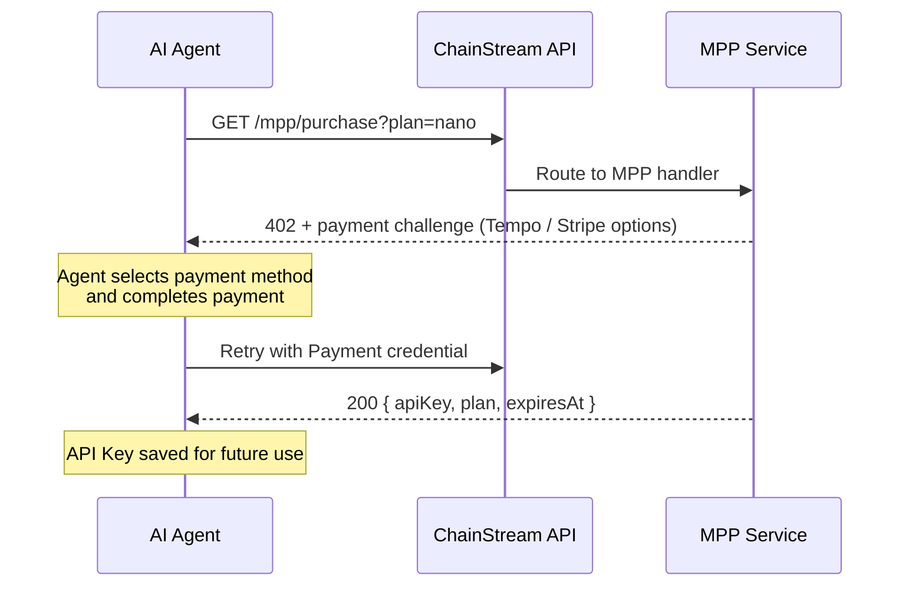

MPP (Machine Payment Protocol) is a payment protocol designed for AI agents and automated systems. It is the superset of x402, supporting both **Tempo stablecoin payments** and **Stripe card payments** in a single unified flow.

<Info>
Unlike x402 which only supports on-chain USDC, MPP adds Tempo network stablecoins and traditional card payments as additional options.
</Info>

## How It Works



### Detailed Flow

1. **Agent calls** `GET /mpp/purchase?plan=<plan>` without payment credentials
2. **MPP service returns 402** with a `WWW-Authenticate: Payment` challenge containing amount, currency, and recipient
3. **Agent signs the payment** using Tempo Wallet or Stripe
4. **Agent retries** the purchase request with `Authorization: Payment` credential
5. **MPP service verifies payment**, creates a subscription, and returns an API Key

## Supported Payment Methods

| Method | Network | Currency | Gas Fee | Best For |
|--------|---------|----------|---------|----------|
| **Tempo** | Tempo (chain ID 4217) | USDC.e (ERC-20) | **Free** (gas in stablecoin) | AI agents, no ETH needed |
| **Stripe** | Traditional | USD (card) | N/A | Agents with card access, no crypto needed |

<Tip>
Tempo payments do not require native gas tokens — gas is paid in the stablecoin directly. This makes it ideal for AI agents that only hold stablecoins.
</Tip>

## API Endpoints

| Endpoint | Method | Description |
|----------|--------|-------------|
| `/mpp/purchase?plan=<plan>` | GET / POST | Purchase a subscription via MPP |
| `/mpp/pricing` | GET | List available plans and payment methods |
| `/mpp/health` | GET | Health check |

### Pricing Response

```bash
curl https://api.chainstream.io/mpp/pricing
```

```json
{
  "plans": [
    { "name": "nano", "priceUsd": 5, "quotaTotal": 500000, "durationDays": 30 },
    { "name": "starter", "priceUsd": 199, "quotaTotal": 10000000, "durationDays": 30 }
  ],
  "currency": "USD",
  "paymentMethods": ["tempo", "stripe"],
  "note": "Prices in USD. Pay via MPP (Tempo stablecoin or Stripe card)."
}
```

### Purchase Response (Success)

```json
{
  "status": "ok",
  "plan": "nano",
  "expiresAt": "2026-04-25T12:00:00.000Z",
  "apiKey": "cs_live_..."
}
```

## CLI Usage

The ChainStream CLI supports MPP as a payment option during the auto-purchase flow:

```bash
chainstream token info --chain sol --address So11111111111111111111111111111111111111112
# → 402 → plan selection → choose "MPP Tempo" → payment → API Key saved
```

For agents without a ChainStream wallet, the CLI prints the Tempo command:

```bash
tempo request "https://api.chainstream.io/mpp/purchase?plan=nano"
```

## Manual Integration (Tempo Wallet)

### Setup

Install the Tempo Wallet CLI and log in (one-time passkey authentication via browser):

```bash
curl -fsSL https://tempo.xyz/install | bash
tempo wallet login
```

<Note>
Tempo Wallet uses passkey (WebAuthn) authentication. The first setup requires a browser interaction. After that, the session persists and agent operations work without further browser interaction.
</Note>

### Purchase

```bash
# Check your balance
tempo wallet balance

# Purchase a plan (auto-handles 402 → sign → retry)
tempo request "https://api.chainstream.io/mpp/purchase?plan=nano"
```

The Tempo CLI handles the `WWW-Authenticate: Payment` challenge automatically, signs the transaction, and returns the API Key on success.

### Compatible Wallets

Tempo is EVM-compatible (chain ID 4217). Any wallet holding USDC.e on Tempo works:

- **Tempo Wallet CLI** (`tempo request`) — recommended, passkey auth, built-in MPP support
- Any EVM wallet (MetaMask, Coinbase CDP, Privy) — add Tempo as custom network

## MPP vs x402

| | MPP | x402 |
|---|---|---|
| **Payment methods** | Tempo stablecoin + Stripe card | On-chain USDC only |
| **Networks** | Tempo (chain ID 4217) + Stripe | Base (EVM) + Solana |
| **Gas fee** | Free (Tempo) / N/A (Stripe) | Free (facilitator) |
| **Requires crypto wallet** | No (Stripe option available) | Yes |
| **Purchase endpoint** | `/mpp/purchase` | `/x402/purchase` |
| **Protocol** | MPP (HTTP 402) | x402 protocol |
| **Best for** | Agents without crypto wallets | Agents with USDC on Base/Solana |

## Next Steps

<CardGroup cols={2}>
  <Card title="x402 Payment Protocol" icon="money-bill-wave" href="/en/docs/platform/billing-payments/x402-payments">
    On-chain USDC payments via the x402 protocol
  </Card>
  <Card title="Billing & Units" icon="receipt" href="/en/docs/platform/billing-payments/plans-and-units">
    Understand CU consumption and plan details
  </Card>
</CardGroup>
