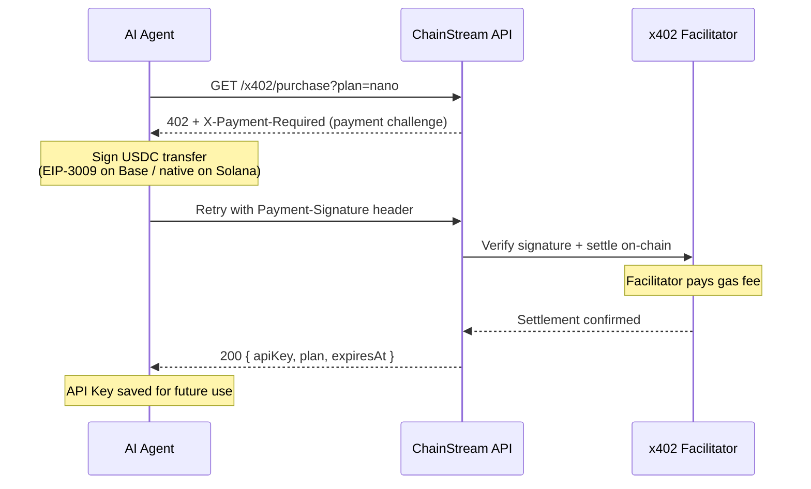

x402 is a payment protocol built on the HTTP 402 Payment Required status code. It enables machine-to-machine micropayments for API access without manual billing, credit cards, or subscription management. Pay per request with USDC, and get instant API access.

## How It Works



### Detailed Flow

1. **Client sends a request** to the ChainStream API without an API key or with an expired key.

2. **Gateway returns HTTP 402** with a message pointing to `/x402/purchase`.

3. **Client calls `GET /x402/purchase?plan=<plan>`** (without payment header). The server returns HTTP 402 with the x402 payment requirements:

   | Response Header | Description |
   |---|---|
   | `X-Payment-Required` | Base64-encoded JSON with payment details |
   | `Payment-Required` | Same value (for x402 client compatibility) |

   The decoded JSON body follows the x402 v2 protocol:

   ```json
   {
     "x402Version": 2,
     "resource": {
       "url": "/x402/purchase?plan=nano",
       "description": "ChainStream API access: nano plan"
     },
     "accepts": [
       {
         "scheme": "exact",
         "network": "eip155:8453",
         "asset": "0x833589fCD6eDb6E08f4c7C32D4f71b54bdA02913",
         "amount": "5000000",
         "payTo": "0xRecipientAddress",
         "maxTimeoutSeconds": 60
       },
       {
         "scheme": "exact",
         "network": "solana:5eykt4UsFv8P8NJdTREpY1vzqKqZKvdp",
         "asset": "EPjFWdd5AufqSSqeM2qN1xzybapC8G4wEGGkZwyTDt1v",
         "amount": "5000000",
         "payTo": "SolanaRecipientAddress",
         "maxTimeoutSeconds": 60
       }
     ]
   }
   ```

4. **Client signs a USDC transfer** using the `@x402` SDK and retries `GET /x402/purchase?plan=<plan>` with the payment proof:

   | Request Header | Description |
   |---|---|
   | `Payment-Signature` | Base64-encoded signed payment payload |

5. **Server verifies and settles the payment**, then returns the subscription details:

   ```json
   {
     "status": "ok",
     "plan": "nano",
     "chain": "evm",
     "address": "0xPayerAddress",
     "expiresAt": "2026-04-25T12:00:00.000Z",
     "txHash": "0xabc123...",
     "apiKey": "cs_live_..."
   }
   ```

   The client saves the `apiKey` for all future API calls.

## CLI Integration

The ChainStream CLI handles x402 payments automatically via `callWithAutoPayment`. When any command hits a 402, the CLI guides you through plan selection and payment.

### Automatic Flow

When the CLI encounters a 402 response, it:

1. Fetches available plans from `/x402/pricing` and displays a selection table
2. Prompts you to choose a plan
3. Asks for payment method: **x402** (USDC on Base/Solana) or **MPP** (USDC.e on Tempo)
4. If x402: signs and sends payment via `@x402/fetch`, saves the returned API Key to config
5. If MPP: prints the `tempo request` command for manual purchase
6. Retries the original command with the new API Key

```bash
$ chainstream token info --chain sol --address So11111111111111111111111111111111111111112

[chainstream] No active subscription. Available plans:

   #  Plan       Price    Quota           Duration
   ── ────────── ──────── ──────────────── ────────
   1  nano       $5             500,000 CU  30 days
   2  starter    $199        10,000,000 CU  30 days
   3  pro        $699        50,000,000 CU  30 days

Select plan (1-3): 1

[chainstream] Choose payment method:
  1. x402 (USDC on Base/Solana)
  2. MPP Tempo (USDC.e on Tempo)

Select method (1-2): 1

[chainstream] Purchasing nano plan via x402...
[chainstream] Subscription activated: nano (expires: 2026-04-25T12:00:00.000Z)
[chainstream] API Key saved to config.
```

<Note>
If you only have an API Key (no wallet), the CLI skips x402 and prints MPP instructions instead.
</Note>

### Wallet Setup

The CLI needs a funded wallet for x402 payments:

```bash
# Create a ChainStream TEE wallet (recommended)
chainstream login

# Or import a raw private key (dev/testing only)
chainstream wallet set-raw --chain base
```

## Manual Integration

For custom integrations, you can implement the x402 flow using the `@x402` package family.

### Dependencies

```bash
npm install @x402/core @x402/evm @x402/svm @x402/fetch
```

| Package | Purpose |
|---|---|
| `@x402/core` | Protocol types, header parsing, verification logic |
| `@x402/evm` | EVM payment execution (built on viem) |
| `@x402/svm` | Solana payment execution (built on @solana/kit) |
| `@x402/fetch` | Drop-in `fetch` wrapper with automatic 402 handling |

### Using @x402/fetch (Recommended)

The simplest integration -- wrap the standard `fetch` with x402 support:

```typescript
import { createX402Fetch } from "@x402/fetch";
import { createWalletClient, http } from "viem";
import { base } from "viem/chains";
import { privateKeyToAccount } from "viem/accounts";

// Create a wallet for payments
const account = privateKeyToAccount(process.env.PRIVATE_KEY as `0x${string}`);
const walletClient = createWalletClient({
  account,
  chain: base,
  transport: http(),
});

// Create an x402-enabled fetch
const x402Fetch = createX402Fetch({
  evm: { walletClient },
  autoApprove: true, // auto-pay without prompting
  maxAmount: "10.00", // safety cap per request
});

// Use it like normal fetch -- 402 payments are handled automatically
const response = await x402Fetch(
  "https://api.chainstream.io/v1/tokens/analyze",
  {
    method: "POST",
    headers: { "Content-Type": "application/json" },
    body: JSON.stringify({ tokenAddress: "0x1234...abcd", chain: "ethereum" }),
  }
);

const data = await response.json();
console.log(data);
```

### Manual Flow (Advanced)

For full control over the payment flow:

```typescript
import { parsePaymentHeaders, createPaymentProof } from "@x402/core";
import { sendPayment } from "@x402/evm";

// 1. Make the initial request
const response = await fetch("https://api.chainstream.io/v1/tokens/analyze", {
  method: "POST",
  headers: { "Content-Type": "application/json" },
  body: JSON.stringify({ tokenAddress: "0x1234...abcd" }),
});

if (response.status === 402) {
  // 2. Parse payment details from headers
  const payment = parsePaymentHeaders(response.headers);
  console.log(`Payment required: ${payment.amount} USDC on ${payment.chain}`);

  // 3. Send the USDC payment
  const txHash = await sendPayment({
    walletClient,
    to: payment.address,
    amount: payment.amount,
    token: payment.token,
    memo: payment.memo,
  });

  // 4. Retry with payment signature
  const retryResponse = await fetch(
    "https://api.chainstream.io/x402/purchase?plan=nano",
    {
      headers: {
        "Payment-Signature": paymentSignature,
      },
    }
  );

  // 5. Extract the API key from the response
  const result = await retryResponse.json();
  console.log("API key for future use:", result.apiKey);
  console.log("Expires at:", result.expiresAt);
}
```

## Supported Chains for Payment

| Chain | Token | Confirmation Time |
|---|---|---|
| Base | USDC | ~2 seconds |
| Solana | USDC | ~400ms |

## Zero Gas Fee

ChainStream operates its own **x402 facilitator** that submits the on-chain payment transaction on behalf of the agent. This means:

- **No gas fee** — the facilitator covers all gas costs (Base ETH / Solana SOL)
- **Agent wallet only needs USDC** — no need to hold native tokens for gas
- The agent signs a USDC transfer authorization; the facilitator broadcasts and pays for execution

This removes the biggest friction point for AI agents: acquiring and managing native gas tokens across multiple chains.

## Security Considerations

- **Payment caps**: Always set a `maxAmount` when using `@x402/fetch` to prevent unexpected charges.
- **Verification**: The facilitator verifies the signed payment on-chain before settling. Invalid signatures are rejected.
- **Idempotency**: If a payment is settled but the response fails (network error), the same `Payment-Signature` can be resubmitted. Payments are only consumed once.
- **Compliance**: Payer addresses are screened before settlement. Sanctioned addresses are rejected.
