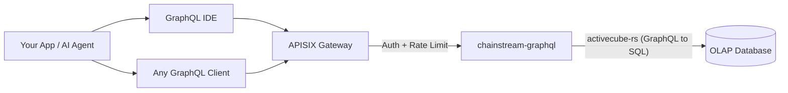

<Info>
ChainStream GraphQL is an OLAP analytical API that exposes multi-chain on-chain data (Solana, Ethereum, BSC, Polygon) through a single GraphQL endpoint. Query exactly the fields you need, aggregate data on the fly, and explore the schema interactively — all powered by a high-performance OLAP database.
</Info>

## What is ChainStream GraphQL

ChainStream GraphQL provides a **declarative query interface** for on-chain analytical data. Instead of calling dozens of REST endpoints with fixed response shapes, you write a single GraphQL query that specifies exactly what data you want, how it should be filtered, and how it should be aggregated.

The service is built on **activecube-rs**, which dynamically generates a GraphQL schema from **Cube** definitions — each Cube represents an analytical data model (e.g. DEX trades, token transfers, OHLC candles). Queries are compiled into optimized SQL and executed against a high-performance OLAP database.

---

## GraphQL vs REST Data API

| | **GraphQL API** | **REST Data API** |
|:--|:--|:--|
| **Query Style** | Declarative — you define shape, filters, aggregation | Imperative — fixed endpoints with predefined params |
| **Field Selection** | Client picks exactly the fields needed | Server returns a fixed response schema |
| **Aggregation** | Built-in `count`, `sum`, `avg`, `min`, `max` per query | Predefined aggregated endpoints only |
| **Endpoint** | Single endpoint for all data models | One endpoint per resource |
| **Pagination** | `limit` + `offset` in query arguments | `limit` + `offset` / cursor in query params |
| **Best For** | Analytics, dashboards, flexible exploration | Simple lookups, real-time price, wallet balance |
| **Latency** | Optimized for throughput over latency | Optimized for low-latency single-resource reads |

<Tip>
Use **GraphQL** when you need flexible analytical queries — aggregating trades, computing PnL across time ranges, or building custom dashboards. Use the **REST API** when you need fast, simple lookups like current token price or wallet balance.
</Tip>

---

## Core Advantages

<CardGroup cols={3}>
  <Card title="Single Endpoint" icon="bullseye">
    One URL serves 25 data Cubes across 4 chains. No endpoint sprawl — just change your query.
  </Card>
  <Card title="Client-Selected Fields" icon="filter">
    Request only the columns you need. No over-fetching, no under-fetching — ideal for bandwidth-constrained clients.
  </Card>
  <Card title="Built-in Aggregation" icon="chart-column">
    Compute `count`, `sum`, `avg`, `min`, `max` directly in your query without post-processing.
  </Card>
</CardGroup>

---

## Supported Chains

| Network ID | Blockchain | Chain Group | Coverage |
|:--|:--|:--|:--|
| `eth` | Ethereum | EVM | Full DEX, transfers, balance updates, events, traces, token stats |
| `bsc` | BNB Chain (BSC) | EVM | Full DEX, transfers, balance updates, events, traces, token stats |
| `polygon` | Polygon | EVM | Full DEX, transfers, balance updates, prediction markets |
| `sol` | Solana | Solana | Full DEX, transfers, instructions, token holders, OHLC, PnL |

<Note>
Queries are organized into three **Chain Groups**: **EVM** (requires a `network` argument), **Solana**, and **Trading** (cross-chain OHLC and token statistics). See [Chain Groups](/en/graphql/schema/chain-groups) for details.
</Note>

---

## Available Data Cubes

25 Cubes are available across three Chain Groups, each representing a distinct analytical model:

<AccordionGroup>
  <Accordion title="DEX Trading">
    - **DEXTrades** — Individual DEX swap events with buy/sell amounts, prices, and DEX protocol info
    - **DEXTradeByTokens** — DEX trades indexed by token for efficient per-token queries
    - **DEXOrders** — DEX order events including limit orders *(Solana only)*
  </Accordion>
  <Accordion title="Pools & Liquidity">
    - **DEXPoolEvents** — Liquidity add/remove events on DEX pools
    - **DEXPools** — DEX pool snapshots with current reserves and metadata
    - **DEXPoolSlippages** — Pool slippage data *(EVM only)*
    - **TokenSupplyUpdates** — Mint and burn events affecting token supply
  </Accordion>
  <Accordion title="Tokens & Transfers">
    - **Transfers** — Token transfer events with sender, receiver, amounts, and USD values
    - **BalanceUpdates** — Wallet balance change events per token
    - **TokenHolders** — Current holder list and distribution for a token
    - **WalletTokenPnL** — PnL per wallet-token pair
  </Accordion>
  <Accordion title="Trading Analytics (Cross-chain)">
    - **Pairs** — OHLC candlestick data at configurable time intervals (formerly referenced as OHLC)
    - **Tokens** — Aggregated trade statistics per token: volume, trade count, unique traders (formerly referenced as TokenTradeStats)
  </Accordion>
  <Accordion title="Blockchain Infrastructure">
    - **Blocks** — Block-level data (timestamps, height, miners/validators)
    - **Transactions** — Transaction-level data (hash, status, gas/fees)
    - **TransactionBalances** — Per-transaction balance changes
    - **Events** — Smart contract event logs *(EVM only)*
    - **Calls** — Internal call traces *(EVM only)*
    - **Instructions** — Instruction-level data *(Solana only)*
    - **InstructionBalanceUpdates** — Instruction-level balance changes *(Solana only)*
  </Accordion>
  <Accordion title="Rewards & Network">
    - **Rewards** — Validator/staking rewards *(Solana only)*
    - **MinerRewards** — Miner/validator rewards *(EVM only)*
    - **Uncles** — Uncle block data *(EVM only)*
  </Accordion>
  <Accordion title="Prediction Markets">
    - **PredictionTrades** — Prediction market trade events *(EVM — Polygon)*
    - **PredictionManagements** — Prediction market management events *(EVM — Polygon)*
    - **PredictionSettlements** — Prediction market settlement events *(EVM — Polygon)*
  </Accordion>
</AccordionGroup>

---

## Key Query Parameters

Beyond standard filtering and pagination, ChainStream GraphQL supports two powerful parameters at the Chain Group level:

| Parameter | Values | Description |
|:--|:--|:--|
| **`dataset`** | `realtime`, `archive`, `combined` (default) | Controls data source scope — recent data only, historical data, or full range |
| **`aggregates`** | `yes`, `no`, `only` | Controls whether to use pre-aggregated tables for faster analytical queries |

<Tip>
See [Dataset & Aggregates](/en/graphql/schema/dataset-aggregates) for detailed usage and examples.
</Tip>

---

## Architecture

<Info>
All requests pass through the APISIX gateway for authentication and rate limiting. The `chainstream-graphql` service compiles GraphQL queries into optimized SQL executed against the OLAP analytical database.
</Info>

---

## Next Steps

<CardGroup cols={3}>
  <Card title="Endpoints & Auth" icon="key" href="/en/graphql/getting-started/endpoints">
    Configure the endpoint URL, authentication headers, and understand the request/response format.
  </Card>
  <Card title="First Query" icon="play" href="/en/graphql/getting-started/first-query">
    Run your first GraphQL query step by step — from the IDE or cURL.
  </Card>
  <Card title="GraphQL IDE" icon="code" href="/en/graphql/ide/introduction">
    Explore the interactive GraphQL IDE with auto-complete, query templates, and code export.
  </Card>
</CardGroup>
