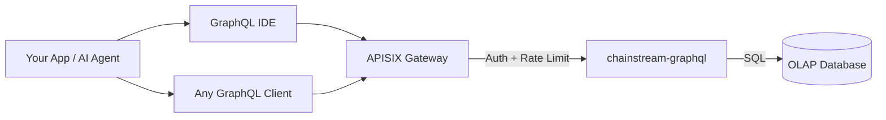

<Info>
ChainStream GraphQL is an OLAP analytical API that exposes multi-chain on-chain data (Solana, Ethereum, BSC) through a single GraphQL endpoint. Query exactly the fields you need, aggregate data on the fly, and explore the schema interactively — all powered by a high-performance OLAP database.
</Info>

## What is ChainStream GraphQL

ChainStream GraphQL provides a **declarative query interface** for on-chain analytical data. Instead of calling dozens of REST endpoints with fixed response shapes, you write a single GraphQL query that specifies exactly what data you want, how it should be filtered, and how it should be aggregated.

The service is built on **activecube-rs**, which dynamically generates a GraphQL schema from **Cube** definitions — each Cube represents an analytical data model (e.g. DEX trades, token transfers, OHLC candles). Queries are compiled into optimized SQL and executed against a high-performance OLAP database.

---

## GraphQL vs REST Data API

| | **GraphQL API** | **REST Data API** |
|:--|:--|:--|
| **Query Style** | Declarative — you define shape, filters, aggregation | Imperative — fixed endpoints with predefined params |
| **Field Selection** | Client picks exactly the fields needed | Server returns a fixed response schema |
| **Aggregation** | Built-in `count`, `sum`, `avg`, `min`, `max` per query | Predefined aggregated endpoints only |
| **Endpoint** | Single endpoint for all data models | One endpoint per resource |
| **Pagination** | `limit` + `offset` in query arguments | `limit` + `offset` / cursor in query params |
| **Best For** | Analytics, dashboards, flexible exploration | Simple lookups, real-time price, wallet balance |
| **Latency** | Optimized for throughput over latency | Optimized for low-latency single-resource reads |

<Tip>
Use **GraphQL** when you need flexible analytical queries — aggregating trades, computing PnL across time ranges, or building custom dashboards. Use the **REST API** when you need fast, simple lookups like current token price or wallet balance.
</Tip>

---

## Core Advantages

<CardGroup cols={3}>
  <Card title="Single Endpoint" icon="bullseye">
    One URL serves 12 data Cubes across 3 chains. No endpoint sprawl — just change your query.
  </Card>
  <Card title="Client-Selected Fields" icon="filter">
    Request only the columns you need. No over-fetching, no under-fetching — ideal for bandwidth-constrained clients.
  </Card>
  <Card title="Built-in Aggregation" icon="chart-column">
    Compute `count`, `sum`, `avg`, `min`, `max` directly in your query without post-processing.
  </Card>
</CardGroup>

---

## Supported Chains

| Network ID | Blockchain | Coverage |
|:--|:--|:--|
| `sol` | Solana | Full DEX, transfers, token holders, OHLC, PnL |
| `eth` | Ethereum | Full DEX, transfers, balance updates, token stats |
| `bsc` | BNB Chain (BSC) | Full DEX, transfers, balance updates, token stats |

<Note>
The `network` argument is required on every top-level Cube query. Pass it as an enum value: `sol`, `eth`, or `bsc`.
</Note>

---

## Available Data Cubes

12 Cubes are available, each representing a distinct analytical model:

<AccordionGroup>
  <Accordion title="Trading & Markets">
    - **DEXTrades** — Individual DEX swap events with buy/sell amounts, prices, and DEX protocol info
    - **OHLC** — Open/High/Low/Close candlestick data at configurable time intervals
    - **TokenTradeStats** — Aggregated trade statistics per token (volume, trade count, unique traders)
    - **TokenMarketCap** — Token market capitalization snapshots
  </Accordion>
  <Accordion title="Tokens & Transfers">
    - **Transfers** — Token transfer events with sender, receiver, amounts, and USD values
    - **BalanceUpdates** — Wallet balance change events per token
    - **TokenSupplyUpdates** — Mint and burn events affecting token supply
    - **TokenSearch** — Full-text token search by name, symbol, or address
  </Accordion>
  <Accordion title="Pools & Liquidity">
    - **DEXPools** — DEX liquidity pool metadata and current reserves
    - **PoolLiquiditySnapshots** — Historical pool liquidity snapshots over time
  </Accordion>
  <Accordion title="Wallets & PnL">
    - **TokenHolders** — Current holder list and distribution for a token
    - **WalletTokenPnL** — Realized and unrealized PnL per wallet-token pair
  </Accordion>
</AccordionGroup>

---

## Architecture

<Info>
All requests pass through the APISIX gateway for authentication and rate limiting. The `chainstream-graphql` service compiles GraphQL queries into optimized SQL executed against the OLAP analytical database.
</Info>

---

## Next Steps

<CardGroup cols={3}>
  <Card title="Endpoints & Auth" icon="key" href="/en/graphql/getting-started/endpoints">
    Configure the endpoint URL, authentication headers, and understand the request/response format.
  </Card>
  <Card title="First Query" icon="play" href="/en/graphql/getting-started/first-query">
    Run your first GraphQL query step by step — from the IDE or cURL.
  </Card>
  <Card title="GraphQL IDE" icon="code" href="/en/graphql/ide/introduction">
    Explore the interactive GraphQL IDE with auto-complete, query templates, and code export.
  </Card>
</CardGroup>
