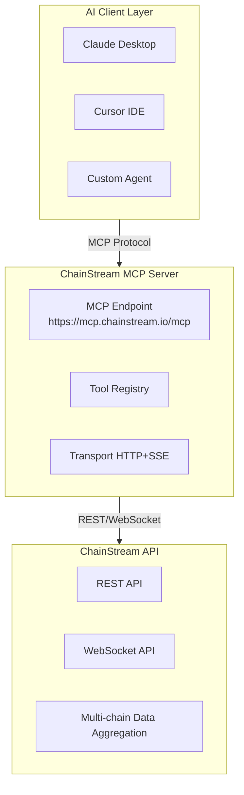

## What is MCP

**MCP (Model Context Protocol)** is an open protocol proposed by Anthropic to standardize how AI applications connect to external data sources.

<Info>
Simply put, MCP enables AI to:
- Discover available tools and data sources
- Call external tools to perform operations
- Understand returned structured data
</Info>

### Traditional vs MCP

| Method | Flow |
|--------|------|
| **Traditional** | User → Write code → Call API → Parse data → Input to AI → Get answer |
| **MCP** | User → Natural language question → AI auto-calls tools → Get answer |

### Core Concepts

| Concept | Description |
|---------|-------------|
| **MCP Server** | Server providing tools and data, like ChainStream MCP Server |
| **MCP Client** | Client using tools, like Claude Desktop, Cursor |
| **Tools** | Functions callable by AI, like query balance, analyze wallet |
| **Resources** | Data resources accessible by AI |

---

## Why MCP Matters

### AI Agents Need "Hands and Eyes"

AI large models have powerful reasoning capabilities, but they:

- ❌ Cannot directly access real-time data
- ❌ Cannot execute external operations
- ❌ Have knowledge cutoff dates

MCP solves this by enabling AI to:

- ✅ Get real-time on-chain data
- ✅ Call professional tools for analysis
- ✅ Interact with the external world

<Note>
**Analogy**

MCP to AI is like:
- **Eyes** → Let AI see real-time data
- **Hands** → Let AI execute operations
- **Tools** → Let AI use professional capabilities
</Note>

---

## ChainStream MCP Capabilities

ChainStream MCP Server exposes blockchain data and analysis capabilities to AI applications via the MCP protocol.

**MCP Endpoint**: `https://mcp.chainstream.io/mcp`

### Capability Matrix

ChainStream MCP Server supports all REST API and WebSocket subscription features in API Reference:

<Tabs>
  <Tab title="Token API">
    | Feature | Description |
    |---------|-------------|
    | Token Search | Search tokens by name/symbol |
    | Token Info | Get token basic info and metadata |
    | Token Price | Real-time and historical prices |
    | Token Stats | Volume, market cap statistics |
    | Holder Analysis | Holder distribution and top holders |
    | Candlestick Data | OHLCV data for various periods |
    | Market Data | Liquidity, trading pair info |
    | Security Check | Token contract security analysis |
    | Creation Info | Token creator and time |
    | Mint/Burn History | Token minting and burning records |
    | Liquidity Snapshots | Historical liquidity data |
  </Tab>
  
  <Tab title="Wallet API">
    | Feature | Description |
    |---------|-------------|
    | Balance Query | Wallet token balances |
    | PnL Calculation | Profit and loss analysis |
    | Wallet Stats | Transaction count, activity, etc. |
    | Balance History | Balance change records |
  </Tab>
  
  <Tab title="Trade API">
    | Feature | Description |
    |---------|-------------|
    | Trade History | Get trade records |
    | Trade Activities | Real-time trading activities |
    | Top Traders | Top traders ranking |
  </Tab>
  
  <Tab title="DEX API">
    | Feature | Description |
    |---------|-------------|
    | Quote Query | Get trade quotes |
    | Route Calculation | Optimal trading path |
    | Swap Execution | Build swap transactions |
    | DEX List | Supported DEX information |
  </Tab>
  
  <Tab title="Ranking API">
    | Feature | Description |
    |---------|-------------|
    | Hot Tokens | Ranking by time period |
    | New Tokens | Newly listed tokens |
    | Final Stretch | Near graduation on Bonding Curve |
    | Migrated | Migrated to DEX |
  </Tab>
  
  <Tab title="KYT API">
    | Feature | Description |
    |---------|-------------|
    | Register Transfer | Register transaction for risk assessment |
    | Risk Summary | Get transaction risk rating |
    | Risk Alerts | Get risk alert details |
    | Address Risk | Address risk assessment |
  </Tab>
  
  <Tab title="WebSocket">
    | Subscription | Description |
    |--------------|-------------|
    | Token Candles | Real-time candlestick updates |
    | Token Stats | Real-time statistics |
    | Token Holders | Holder changes |
    | New Tokens | New token creation notifications |
    | Wallet Balance | Real-time balance updates |
    | Wallet Trades | Real-time trade notifications |
    | Liquidity Pools | Pool balance changes |
  </Tab>
</Tabs>

### Supported Blockchains

<Tabs>
  <Tab title="EVM Chains">
    | Chain | Identifier | Status |
    |-------|------------|--------|
    | Ethereum | `ethereum` | ✅ |
    | BNB Chain | `bsc` | ✅ |
    | Polygon | `polygon` | ✅ |
    | Arbitrum | `arbitrum` | ✅ |
    | Optimism | `optimism` | ✅ |
    | Base | `base` | ✅ |
    | Avalanche | `avalanche` | ✅ |
  </Tab>
  <Tab title="Non-EVM Chains">
    | Chain | Identifier | Status |
    |-------|------------|--------|
    | Solana | `solana` | ✅ |
  </Tab>
</Tabs>

---

## Supported Platforms

### Claude Desktop

Officially supported MCP client with the most complete feature support.

| Feature | Status |
|---------|--------|
| Tool Calling | ✅ |
| Multi-turn Dialog | ✅ |
| Streaming Response | ✅ |

```json
// claude_desktop_config.json
{
  "mcpServers": {
    "chainstream": {
      "url": "https://mcp.chainstream.io/mcp",
      "headers": {
        "Authorization": "Bearer your-access-token"
      }
    }
  }
}
```

### Cursor IDE

Developer-friendly AI coding assistant with MCP integration.

| Feature | Status |
|---------|--------|
| Tool Calling | ✅ |
| Code Context | ✅ |

```json
// .cursor/mcp.json
{
  "mcpServers": {
    "chainstream": {
      "url": "https://mcp.chainstream.io/mcp",
      "headers": {
        "Authorization": "Bearer your-access-token"
      }
    }
  }
}
```

### Custom Agent

Any client following MCP protocol can integrate.

```javascript
import { Client } from '@modelcontextprotocol/sdk/client/index.js';
import { SSEClientTransport } from '@modelcontextprotocol/sdk/client/sse.js';

const transport = new SSEClientTransport(
  new URL('https://mcp.chainstream.io/sse'),
  {
    requestInit: {
      headers: {
        'Authorization': `Bearer ${process.env.CHAINSTREAM_ACCESS_TOKEN}`
      }
    }
  }
);

const client = new Client({
  name: 'my-agent',
  version: '1.0.0'
});

await client.connect(transport);

// List available tools
const { tools } = await client.listTools();

// Call a tool
const result = await client.callTool({
  name: 'get_token_balance',
  arguments: {
    address: '0x...',
    chain: 'ethereum'
  }
});
```

---

## Typical Use Cases

### Case 1: AI Research Assistant

**Need**: Use AI to analyze a specific wallet's trading behavior

<Steps>
  <Step title="User Question">
    Analyze the trading style of address `0xd8dA6BF26964aF9D7eEd9e03E53415D37aA96045`
  </Step>
  <Step title="AI Calls Tool">
    Calls `analyze_wallet` tool
  </Step>
  <Step title="AI Returns Analysis">
    Based on analysis, this address (Vitalik) characteristics:
    - Wallet age: Over 5 years
    - Main holdings: ETH, various ERC-20 Tokens
    - Trading style: Long-term holding, occasional donations and project support
    - Active protocols: Uniswap, ENS, Gitcoin
    - Labels: Core developer, Philanthropist
  </Step>
</Steps>

### Case 2: Smart Money Tracking

**Need**: Track Smart Money large trades

<Steps>
  <Step title="User Question">
    Which Smart Money addresses have been buying ARB in the last 24 hours?
  </Step>
  <Step title="AI Calls Tool">
    Calls `get_smart_money_activities` tool
  </Step>
  <Step title="AI Returns Results">
    In the past 24 hours, the following Smart Money addresses bought ARB:

    1. `0xabc...123` (Labels: whale, defi_expert)
       - Amount: 500,000 ARB
       - Value: $450,000
       - Time: 2 hours ago

    2. `0xdef...456` (Labels: institution)
       - Amount: 200,000 ARB
       - Value: $180,000
       - Time: 5 hours ago

    Overall trend: Smart Money net buying ARB
  </Step>
</Steps>

### Case 3: Token Security Analysis

**Need**: Analyze token security

<Steps>
  <Step title="User Question">
    Help me check if this token `0x...` is safe
  </Step>
  <Step title="AI Calls Tool">
    Calls `get_token_security` tool
  </Step>
  <Step title="AI Returns Results">
    Token security check results:

    | Check Item | Result |
    |------------|--------|
    | Contract Verified | ✅ |
    | No Malicious Functions | ✅ |
    | Liquidity Locked | ✅ |
    | Holder Distribution | ⚠️ Top 10 hold 45% |
    | Trading Tax | Buy 1% / Sell 1% |
    
    Risk Level: Medium (watch holder concentration)
  </Step>
</Steps>

---

## Technical Architecture



### Data Flow

<Steps>
  <Step title="User Question">
    Natural language input to AI client
  </Step>
  <Step title="Intent Recognition">
    AI understands user intent, selects appropriate tool
  </Step>
  <Step title="Tool Call">
    MCP Client sends request to MCP Server
  </Step>
  <Step title="Data Retrieval">
    MCP Server calls ChainStream API
  </Step>
  <Step title="Result Return">
    Structured data returned to AI
  </Step>
  <Step title="Generate Response">
    AI generates natural language response based on data
  </Step>
</Steps>

---

## Difference from Traditional API

| Feature | Traditional API | MCP |
|---------|-----------------|-----|
| Call Method | HTTP REST | Protocol Standardized |
| Target User | Developers | AI Models |
| Parameter Handling | Manual Construction | AI Auto-inference |
| Error Handling | Status Codes | Semantic Errors |
| Context | Stateless | Session Context Maintained |

---

## Authentication

ChainStream MCP Server uses Access Token for authentication.

### Getting Access Token

1. Create an App in [ChainStream Dashboard](https://www.chainstream.io/dashboard)
2. Get **Client ID** and **Client Secret**
3. Use credentials to generate Access Token (see [Authentication docs](/en/guides/getting-started/authentication))
4. Configure Access Token in MCP Server environment variables

### Environment Variables

| Variable | Description |
|----------|-------------|
| `CHAINSTREAM_ACCESS_TOKEN` | JWT Access Token |

<Note>
Access Token is valid for 24 hours. After expiration, you need to regenerate. We recommend implementing an automatic refresh mechanism in your application.
</Note>

### Permission Control

Control tool access through API Scope:

| Scope | Description |
|-------|-------------|
| Default | Read-only data query tools |
| `webhook.read` | Webhook read permission |
| `webhook.write` | Webhook write permission |
| `kyt.read` | KYT read permission |
| `kyt.write` | KYT write permission |

---

## Security Model

<AccordionGroup>
  <Accordion title="Authentication" icon="key">
    MCP Server uses JWT Access Token for authentication. Access Token is obtained from the Auth service using Client ID and Client Secret. All API requests require a valid token.
  </Accordion>
  
  <Accordion title="Permission Control" icon="lock">
    Control tool access through API Scope:
    - Read-only tools: Available by default
    - Trading tools: Require explicit authorization
    - KYT tools: Require `kyt.read` scope
  </Accordion>
  
  <Accordion title="Audit Logs" icon="file-lines">
    All tool calls are fully logged and viewable in Dashboard.
  </Accordion>
</AccordionGroup>

---

## Next Steps

<CardGroup cols={2}>
  <Card title="Setup Guide" icon="gear" href="/en/guides/ai-infrastructure/mcp-server/setup-guide">
    Configure MCP Server in 5 minutes
  </Card>
  <Card title="Tools Catalog" icon="wrench" href="/en/guides/ai-infrastructure/mcp-server/tools-catalog">
    View all available tool details
  </Card>
</CardGroup>
