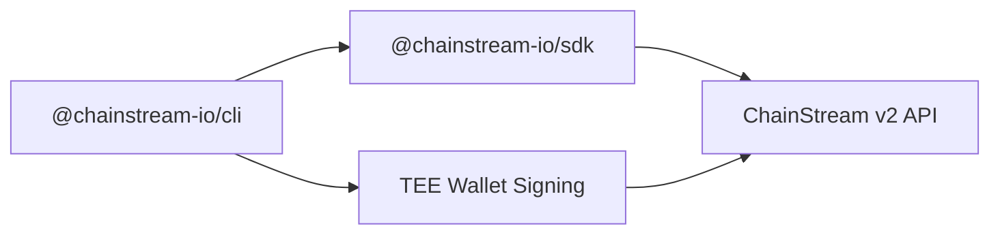

## What is ChainStream CLI

ChainStream CLI (`@chainstream-io/cli`) is a command-line tool for querying on-chain data and executing DeFi operations across Solana, BSC, and Ethereum. It is designed for both human developers and AI agents.

<CardGroup cols={2}>
  <Card title="Data Queries" icon="magnifying-glass" color="#4D9CFF">
    Search tokens, analyze wallets, track market trends, and query recent trades
  </Card>
  <Card title="DeFi Execution" icon="right-left" color="#9333EA">
    Swap tokens, create tokens on launchpads, and broadcast transactions with built-in wallet signing
  </Card>
</CardGroup>

## Install

No global install needed — run directly with `npx`:

```bash
npx @chainstream-io/cli token search --keyword PUMP --chain sol
```

Or install globally:

```bash
npm install -g @chainstream-io/cli
chainstream token search --keyword PUMP --chain sol
```

<Note>Requires Node.js 18 or later.</Note>

## Architecture



- **SDK-based** — all API calls go through `@chainstream-io/sdk` with typed responses, auto-retry, and job polling
- **TEE signing** — DeFi transactions are signed remotely in a TEE (Trusted Execution Environment); device keys are stored locally in `~/.config/chainstream/keys/`
- **API Key first** — x402 purchase auto-saves an API Key to config; wallet signatures are only needed for DeFi execution

## Supported Chains

| Chain | CLI ID | Data API | DeFi | WebSocket |
|-------|--------|----------|------|-----------|
| Solana | `sol` | Yes | Yes | Yes |
| BSC | `bsc` | Yes | Yes | Yes |
| Ethereum | `eth` | Yes | Yes | Yes |

## CLI vs MCP vs SDK

| Capability | CLI | MCP Server | SDK |
|------------|-----|------------|-----|
| Token search & analysis | Yes | Yes | Yes |
| Market trending & ranking | Yes | Yes | Yes |
| Wallet profiling & PnL | Yes | Yes | Yes |
| DEX quote | Yes | Yes | Yes |
| DEX swap (signing) | Yes | No | Yes (with WalletSigner) |
| Token creation | Yes | No | Yes (with WalletSigner) |
| x402 auto-payment | Yes | N/A | Manual |
| Best for | AI agents, scripts, CI | AI chat assistants | Custom applications |

## Quick Start

```bash
# 1. Authenticate (only needed once)
npx @chainstream-io/cli login

# 2. Search tokens
npx @chainstream-io/cli token search --keyword PUMP --chain sol

# 3. Check token security
npx @chainstream-io/cli token security --chain sol --address <token_address>

# 4. View trending tokens
npx @chainstream-io/cli market trending --chain sol --duration 1h

# 5. Analyze wallet PnL
npx @chainstream-io/cli wallet pnl --chain sol --address <wallet_address>
```

## Next Steps

<CardGroup cols={3}>
  <Card title="Authentication" icon="key" href="/en/guides/cli/authentication">
    Set up API Key or wallet login
  </Card>
  <Card title="Command Reference" icon="book" href="/en/guides/cli/commands">
    Full list of commands and options
  </Card>
  <Card title="x402 Payment" icon="credit-card" href="/en/guides/cli/x402-payment">
    Auto-purchase subscriptions with USDC
  </Card>
</CardGroup>
