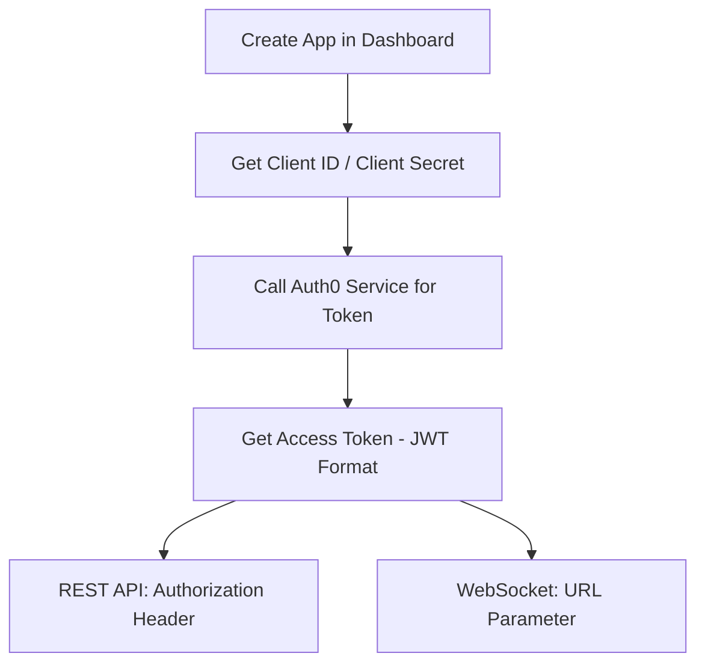

ChainStream employs multiple security mechanisms to protect API access. This document covers API security best practices, common threat protection, and security configuration guidelines.

<Info>
**Last Updated:** February 2026 | **Version:** v2.0
</Info>

---

## Authentication Security

### Access Token Mechanism

ChainStream uses an OAuth 2.0-based authentication mechanism. You generate a JWT Access Token using your Client ID and Client Secret for API authentication.

**Authentication Flow:**



**Credential Specifications**

| Item | Specification |
|:--|:--|
| Client ID | Application unique identifier |
| Client Secret | 64 random characters |
| Access Token | JWT format, includes expiration and scopes |
| Token Validity | 24 hours |

### Access Token Generation

<CodeGroup>
```javascript JavaScript
import { AuthenticationClient } from 'auth0';

const auth0Client = new AuthenticationClient({
  domain: 'dex.asia.auth.chainstream.io',
  clientId: process.env.CHAINSTREAM_CLIENT_ID,
  clientSecret: process.env.CHAINSTREAM_CLIENT_SECRET
});

const { data } = await auth0Client.oauth.clientCredentialsGrant({
  audience: 'https://api.dex.chainstream.io'
});

const accessToken = data.access_token;
```

```python Python
from auth0.authentication import GetToken

get_token = GetToken(
    'dex.asia.auth.chainstream.io',
    os.environ['CHAINSTREAM_CLIENT_ID'],
    client_secret=os.environ['CHAINSTREAM_CLIENT_SECRET']
)

token = get_token.client_credentials(
    audience='https://api.dex.chainstream.io'
)

access_token = token['access_token']
```
</CodeGroup>

### Credential Security

**Storage Requirements**

<Warning>
Client Secret is a core credential for accessing ChainStream services. Leakage may result in service abuse and financial loss.
</Warning>

| Storage Method | Security Level | Notes |
|:--|:--|:--|
| Environment Variables | ✅ Recommended | Not in version control |
| Secret Management Service | ✅ Best | AWS Secrets Manager, HashiCorp Vault, etc. |
| Config Files | ⚠️ Caution | Must add to .gitignore |
| Hardcoded | ❌ Prohibited | High leak risk |

### Code Examples

<CodeGroup>
```javascript JavaScript
// ❌ Dangerous: Hardcoded credentials
const clientId = "your_client_id";
const clientSecret = "your_secret";

// ❌ Dangerous: Committed to version control
// config.json: { "client_id": "...", "client_secret": "..." }

// ✅ Secure: Use environment variables
const clientId = process.env.CHAINSTREAM_CLIENT_ID;
const clientSecret = process.env.CHAINSTREAM_CLIENT_SECRET;

// ✅ Secure: Use secret management service
const credentials = await secretsManager.getSecret('chainstream-credentials');
```

```python Python
import os

# ❌ Dangerous: Hardcoded
client_id = "your_client_id"
client_secret = "your_secret"

# ✅ Secure: Use environment variables
client_id = os.environ.get('CHAINSTREAM_CLIENT_ID')
client_secret = os.environ.get('CHAINSTREAM_CLIENT_SECRET')

# ✅ Secure: Use secret management service (AWS Secrets Manager example)
import boto3
client = boto3.client('secretsmanager')
credentials = client.get_secret_value(SecretId='chainstream-credentials')['SecretString']
```

```go Go
// ❌ Dangerous: Hardcoded
clientID := "your_client_id"
clientSecret := "your_secret"

// ✅ Secure: Use environment variables
clientID := os.Getenv("CHAINSTREAM_CLIENT_ID")
clientSecret := os.Getenv("CHAINSTREAM_CLIENT_SECRET")
```
</CodeGroup>

### Multi-App Management

We recommend creating separate Apps for different environments and services:

| Purpose | Suggested App Name | Description |
|:--|:--|:--|
| Production | `prod-main` | Production workloads |
| Testing | `test-dev` | Development and testing |
| CI/CD | `ci-pipeline` | Automated testing |
| Monitoring | `monitoring` | Monitoring and alerting |

---

## Transport Security

### TLS Requirements

| Item | Requirement |
|:--|:--|
| Minimum Version | TLS 1.2 |
| Recommended Version | TLS 1.3 |
| Certificate Validation | Must be enabled |
| Not Supported | HTTP, TLS 1.0/1.1 |

### Certificate Validation

<Warning>
Never skip certificate validation in production environments. This exposes your application to man-in-the-middle attack risks.
</Warning>

<CodeGroup>
```javascript JavaScript
// ❌ Dangerous: Skip certificate validation
process.env.NODE_TLS_REJECT_UNAUTHORIZED = '0';

// ✅ Secure: Normal certificate validation (default behavior)
const response = await fetch('https://api-dex.chainstream.io/v1/...');
```

```python Python
import requests

# ❌ Dangerous: Skip certificate validation
requests.get(url, verify=False)

# ✅ Secure: Normal certificate validation (default behavior)
requests.get(url)
```

```bash cURL
# ❌ Dangerous: Skip certificate validation
curl -k https://api-dex.chainstream.io/v1/...

# ✅ Secure: Normal certificate validation (default behavior)
curl https://api-dex.chainstream.io/v1/...
```
</CodeGroup>

---

## Webhook Security

Webhook messages use a signature mechanism to ensure message source reliability.

### Signature Verification

When you receive a Webhook message, you need to verify the signature using your Webhook Secret to confirm the message is from ChainStream and has not been tampered with.

| Item | Description |
|:--|:--|
| Algorithm | HMAC-SHA256 |
| Key | Webhook Secret (configured in Dashboard) |
| Signature Header | `X-Webhook-Signature` |

### Verification Example

<CodeGroup>
```javascript JavaScript
const crypto = require('crypto');

function verifyWebhookSignature(payload, signature, secret) {
  const expectedSignature = crypto
    .createHmac('sha256', secret)
    .update(JSON.stringify(payload))
    .digest('hex');
  
  return crypto.timingSafeEqual(
    Buffer.from(signature),
    Buffer.from(expectedSignature)
  );
}

// Express middleware example
app.post('/webhook', (req, res) => {
  const signature = req.headers['x-webhook-signature'];
  const isValid = verifyWebhookSignature(
    req.body,
    signature,
    process.env.WEBHOOK_SECRET
  );
  
  if (!isValid) {
    return res.status(401).send('Invalid signature');
  }
  
  // Process webhook message
  console.log('Received webhook:', req.body);
  res.status(200).send('OK');
});
```

```python Python
import hmac
import hashlib
import json

def verify_webhook_signature(payload, signature, secret):
    expected_signature = hmac.new(
        secret.encode(),
        json.dumps(payload).encode(),
        hashlib.sha256
    ).hexdigest()
    
    return hmac.compare_digest(signature, expected_signature)

# Flask example
@app.route('/webhook', methods=['POST'])
def webhook():
    signature = request.headers.get('X-Webhook-Signature')
    is_valid = verify_webhook_signature(
        request.json,
        signature,
        os.environ['WEBHOOK_SECRET']
    )
    
    if not is_valid:
        return 'Invalid signature', 401
    
    # Process webhook message
    print('Received webhook:', request.json)
    return 'OK', 200
```
</CodeGroup>

### Webhook Secret Rotation

To rotate your Webhook Secret:

<Steps>
  <Step title="Generate New Secret">
    Dashboard → Webhooks → Select Endpoint → Rotate Secret
  </Step>
  <Step title="Update Application Config">
    Update to the new Webhook Secret in your application
  </Step>
  <Step title="Verify Signature">
    Confirm the new Secret correctly verifies signatures
  </Step>
</Steps>

---

## Usage Monitoring

### Metrics Dashboard

In the Dashboard's Metrics panel, you can view API and WebSocket call statistics:

| Metric | Description |
|:--|:--|
| Request IP | Source IP address |
| User Agent | Client identifier |
| Status Code | HTTP status code |
| Latency | Request response time |
| Units Consumed | Usage units consumed by this request |
| Total Usage | Cumulative usage consumed |

### Chart Data

The Metrics panel provides charts at multiple time dimensions:

- **Hourly** — View call trends for the last 24 hours
- **Daily** — View call trends for the last 30 days
- **Monthly** — View historical monthly statistics

**View Path:** Dashboard → Metrics

---

## Security Monitoring

<Note>
🚧 **Coming Soon** — Security monitoring features are under development and will be available soon.
</Note>

Once available, it will support:

- **Anomaly Detection** — Auto-detect auth failure spikes, unusual geography, etc.
- **Alert Notifications** — Email and Webhook alerts
- **Auto Protection** — Temporary bans, rate limiting, etc.

---

## IP Whitelist

<Note>
🚧 **Coming Soon** — IP whitelist feature is under development and will be available soon.
</Note>

Once available, it will support:

- Single IP configuration (e.g., `203.0.113.50`)
- IP range configuration (e.g., `203.0.113.0/24`)
- Multiple IPs (comma-separated)

---

## Common Attack Protection

### Man-in-the-Middle Attack

**Attack Method:** Attacker intercepts communication between client and server.

**Protection Measures:**

| Measure | Description |
|:--|:--|
| Enforce HTTPS | Only TLS 1.2+ supported |
| Certificate Validation | Must enable certificate verification |
| HSTS | Force HTTPS connections |

### Injection Attack

**Attack Method:** Attacker attempts unauthorized operations through malicious input data.

**Protection Measures:**

| Measure | Description |
|:--|:--|
| Input Validation | Strict parameter type checking |
| Parameterized Queries | Prevent SQL/NoSQL injection |
| Output Encoding | Prevent XSS |

### Credential Leak Response

If you suspect your Client Secret has been leaked, immediately execute the following steps:

<Steps>
  <Step title="Delete App Immediately">
    Dashboard → Apps → Select App → Delete
  </Step>
  <Step title="Create New App">
    Dashboard → Apps → Create New App
  </Step>
  <Step title="Update Application Config">
    Update to new Client ID and Secret in all applications using the old credential
  </Step>
  <Step title="Check Metrics">
    Dashboard → Metrics → Check for abnormal calls
  </Step>
  <Step title="Review Security Practices">
    Investigate leak cause and improve security measures
  </Step>
</Steps>

---

## Security Error Codes

### Authentication Related

| Error Code | HTTP Status | Description |
|:--|:--|:--|
| `UNAUTHORIZED` | 401 | No authentication provided |
| `EXPIRED_TOKEN` | 401 | Access Token expired |
| `INVALID_TOKEN` | 401 | Access Token invalid |
| `INVALID_CREDENTIALS` | 401 | Client ID or Secret incorrect |

### Access Control Related

| Error Code | HTTP Status | Description |
|:--|:--|:--|
| `FORBIDDEN` | 403 | No permission or quota exhausted |
| `RATE_LIMITED` | 429 | Request rate exceeded |
| `INSUFFICIENT_SCOPE` | 403 | Token permission insufficient |

### Webhook Related

| Error Code | Description |
|:--|:--|
| `INVALID_SIGNATURE` | Webhook signature verification failed |
| `MISSING_SIGNATURE` | Missing signature header |

### Error Response Example

```json
{
  "error": {
    "code": "EXPIRED_TOKEN",
    "message": "Access token has expired",
    "details": {
      "expired_at": "2024-01-15T10:30:00Z"
    }
  }
}
```

---

## Security Configuration Checklist

### Basic Configuration (Required)

- [ ] Use HTTPS for API access
- [ ] Store Client ID and Client Secret in environment variables or secret management service
- [ ] Don't commit credentials to code repository
- [ ] Use different Apps for production/test environments
- [ ] Properly verify Webhook signatures

### Advanced Configuration (Recommended)

- [ ] Integrate secret management service (AWS Secrets Manager / HashiCorp Vault)
- [ ] Regularly check Metrics dashboard for call statistics
- [ ] Create separate Apps for different services

### Enterprise Configuration (Optional)

- [ ] Integrate SIEM system for log analysis
- [ ] Establish security incident response process

---

## FAQ

<AccordionGroup>
  <Accordion title="What should I do if my Client Secret is leaked?">
    Immediately log into Dashboard to delete that App, create a new App, then update all application configurations using that credential. See [Credential Leak Response](#credential-leak-response).
  </Accordion>

  <Accordion title="What if my Access Token expires?">
    Access Tokens are valid for 24 hours. Recommendations:
    
    1. **Cache Token** — Reuse the same Token within validity period
    2. **Refresh Early** — Refresh Token about 1 hour before expiration
    3. **Error Retry** — Automatically get new Token when receiving 401 error
  </Accordion>

  <Accordion title="How do I view API call statistics?">
    Log into Dashboard → Metrics, where you can view request IP, status codes, latency, Units consumed, and time-dimension charts.
  </Accordion>

  <Accordion title="How do I troubleshoot Webhook signature verification failures?">
    Common causes:
    
    1. **Secret mismatch** — Confirm using the correct Webhook Secret
    2. **Payload handling error** — Ensure using the original JSON string for signature calculation
    3. **Missing signature header** — Confirm request headers include `X-Webhook-Signature`
  </Accordion>

  <Accordion title="Can I create multiple Apps?">
    Yes. We recommend creating separate Apps for different environments (production/test) and different services for easier management and troubleshooting.
  </Accordion>
</AccordionGroup>

---

## Related Documentation

<CardGroup cols={2}>
  <Card title="Authentication" icon="key" href="/en/guides/getting-started/authentication">
    Authentication and credential management
  </Card>
  <Card title="Data Privacy" icon="shield" href="/en/guides/data-concepts/data-privacy">
    Data privacy policy
  </Card>
  <Card title="Error Codes" icon="circle-exclamation" href="/en/guides/resources/error-codes">
    Complete error code list
  </Card>
  <Card title="Webhook Fundamentals" icon="webhook" href="/en/playbooks/frameworks/webhook-fundamentals">
    Webhook configuration and usage
  </Card>
</CardGroup>
