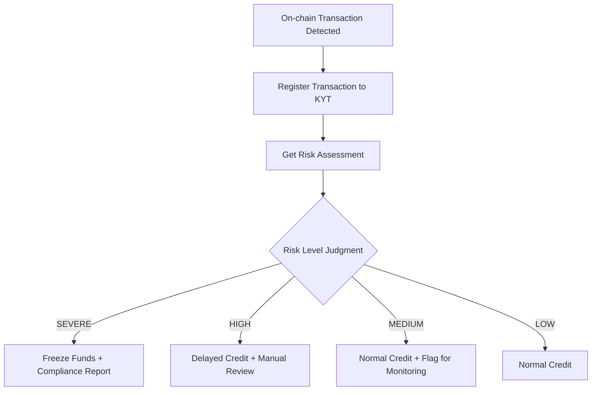
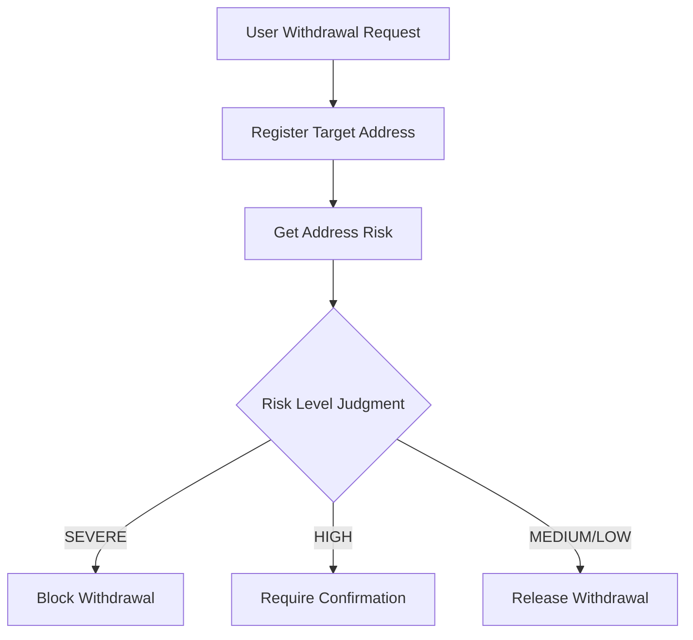
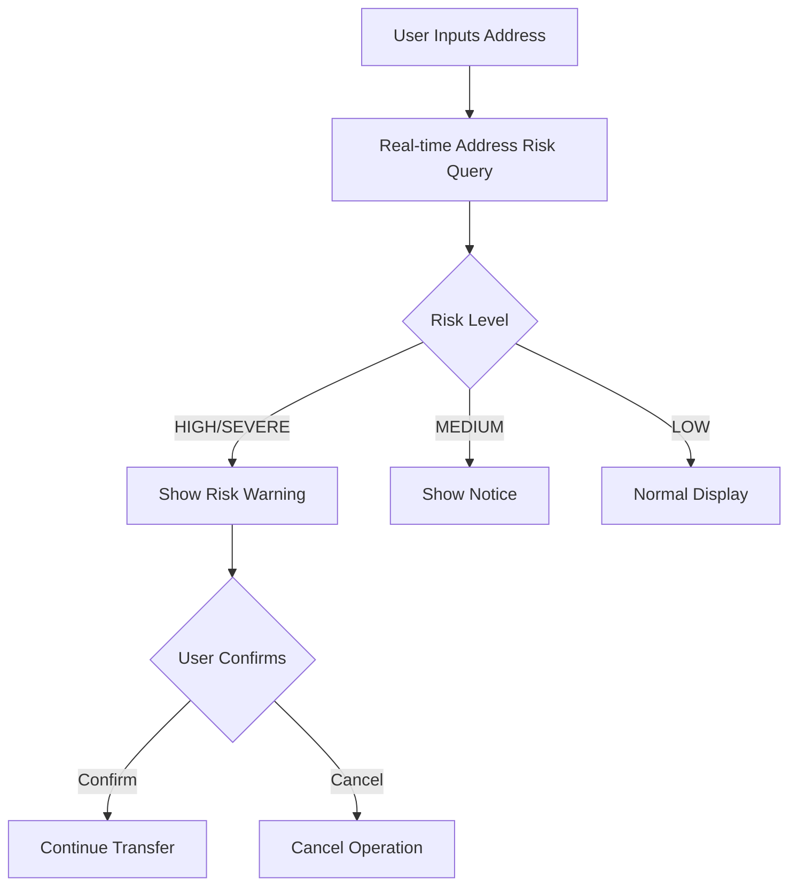

This guide covers how to integrate ChainStream KYT/KYA compliance capabilities into your application, including complete scenarios for CEX deposit/withdrawal risk control, wallet risk alerts, and batch screening.

---

## Prerequisites

### API Configuration

| Config | Value |
|:--|:--|
| Base URL | `https://api-dex.chainstream.io/` |
| Auth Domain | `dex.asia.auth.chainstream.io` |
| Audience | `https://api.dex.chainstream.io` |

### KYT Related Scopes

| Scope | Description |
|:--|:--|
| `kyt.read` | KYT API read permission (query transaction risk) |
| `kyt.write` | KYT API write permission (register transaction analysis) |

### Generate Access Token

<CodeGroup>
```javascript JavaScript
import { AuthenticationClient } from 'auth0';

const auth0Client = new AuthenticationClient({
  domain: 'dex.asia.auth.chainstream.io',
  clientId: 'your-client-id',
  clientSecret: 'your-client-secret'
});

// Get Token with full KYT permissions
const response = await auth0Client.oauth.clientCredentialsGrant({
  audience: 'https://api.dex.chainstream.io',
  scope: 'kyt.read kyt.write'
});

const accessToken = response.data.access_token;
```

```python Python
from auth0.authentication import GetToken

get_token = GetToken(
    'dex.asia.auth.chainstream.io',
    'your-client-id',
    client_secret='your-client-secret'
)

token = get_token.client_credentials(
    audience='https://api.dex.chainstream.io',
    scope='kyt.read kyt.write'
)

access_token = token['access_token']
```
</CodeGroup>

### API Calls

All requests must include the Token in the Header:

```javascript
const response = await fetch('https://api-dex.chainstream.io/v1/kyt/transfer', {
  method: 'POST',
  headers: {
    'Authorization': `Bearer ${accessToken}`,
    'Content-Type': 'application/json'
  },
  body: JSON.stringify({ /* request body */ })
});
```

---

## CEX Deposit Risk Control

Exchange deposit scenarios are the core use case for KYT, requiring risk assessment before funds are credited.

### Business Flow



### Integration Steps

<Steps>
  <Step title="Initialize Client">
    ```javascript
    import { AuthenticationClient } from 'auth0';

    // Generate Token (recommend caching, refresh before expiry)
    async function getAccessToken() {
      const auth0Client = new AuthenticationClient({
        domain: 'dex.asia.auth.chainstream.io',
        clientId: process.env.CHAINSTREAM_CLIENT_ID,
        clientSecret: process.env.CHAINSTREAM_CLIENT_SECRET
      });

      const { data } = await auth0Client.oauth.clientCredentialsGrant({
        audience: 'https://api.dex.chainstream.io',
        scope: 'kyt.read kyt.write'
      });

      return data.access_token;
    }
    ```
  </Step>

  <Step title="Transaction Detection">
    Monitor incoming transactions to user deposit addresses:
    ```javascript
    async function onDepositDetected(tx) {
      const deposit = {
        network: 'ethereum',           // Network: bitcoin, ethereum, Solana
        asset: tx.asset,               // Asset type: ETH, SOL, etc.
        transferReference: tx.hash,    // Transaction hash
        direction: 'received'          // Direction: sent or received
      };
      
      // Call KYT analysis
      const result = await registerTransfer(deposit);
      
      // Get risk assessment
      const risk = await getTransferSummary(result.externalId);
      
      // Execute decision
      await executeDecision(tx, risk);
    }
    ```
  </Step>

  <Step title="Register Transaction">
    Call KYT API to register transaction:
    ```javascript
    async function registerTransfer(deposit) {
      const response = await fetch('https://api-dex.chainstream.io/v1/kyt/transfer', {
        method: 'POST',
        headers: {
          'Authorization': `Bearer ${accessToken}`,
          'Content-Type': 'application/json'
        },
        body: JSON.stringify({
          network: deposit.network,
          asset: deposit.asset,
          transferReference: deposit.transferReference,
          direction: deposit.direction
        })
      });
      
      return await response.json();
    }
    ```
  </Step>

  <Step title="Get Risk Assessment">
    Query transaction risk summary:
    ```javascript
    async function getTransferSummary(transferId) {
      const response = await fetch(
        `https://api-dex.chainstream.io/v1/kyt/transfers/${transferId}/summary`,
        {
          headers: {
            'Authorization': `Bearer ${accessToken}`
          }
        }
      );
      
      return await response.json();
    }
    ```
  </Step>

  <Step title="Auto Decision">
    Execute appropriate actions based on risk level:
    ```javascript
    async function executeDecision(tx, risk) {
      const riskLevel = risk.rating; // SEVERE, HIGH, MEDIUM, LOW
      
      switch (riskLevel) {
        case 'SEVERE':
          await freezeDeposit(tx);
          await createSARReport(tx, risk);
          await notifyCompliance(tx, risk);
          break;
          
        case 'HIGH':
          await holdDeposit(tx, { hours: 24 });
          await createManualReview(tx, risk);
          break;
          
        case 'MEDIUM':
          await creditDeposit(tx);
          await flagForMonitoring(tx, risk);
          break;
          
        case 'LOW':
          await creditDeposit(tx);
          break;
      }
      
      // Record audit log
      await auditLog.record({
        action: 'DEPOSIT_RISK_DECISION',
        txHash: tx.hash,
        riskLevel,
        timestamp: new Date()
      });
    }
    ```
  </Step>
</Steps>

---

## Complete Flow Details

The end-to-end compliance integration flow covers: Detect → Register → Poll → Risk Judgment → Release/Freeze

### 1. Detection Phase

| Trigger Source | Description | Latency |
|:--|:--|:--|
| On-chain Monitoring | Monitor deposit addresses | Block confirmation time |
| User Submission | Withdrawal request | Instant |
| Scheduled Scan | Catch-up mechanism | Configurable |

### 2. Registration Phase

```bash
POST https://api-dex.chainstream.io/v1/kyt/transfer
Authorization: Bearer <access_token>
Content-Type: application/json

{
  "network": "ethereum",
  "asset": "ETH",
  "transferReference": "0x1234567890abcdef...",
  "direction": "received"
}
```

**Response:**

```json
{
  "externalId": "123e4567-e89b-12d3-a456-426614174000",
  "asset": "ETH",
  "network": "ethereum",
  "transferReference": "0x1234567890abcdef...",
  "direction": "received",
  "updatedAt": "2024-01-15T10:30:00.000Z"
}
```

### 3. Query Phase

<Tabs>
  <Tab title="Polling Method">
    ```javascript
    async function pollForResult(transferId, maxAttempts = 10) {
      for (let i = 0; i < maxAttempts; i++) {
        const response = await fetch(
          `https://api-dex.chainstream.io/v1/kyt/transfers/${transferId}/summary`,
          {
            headers: { 'Authorization': `Bearer ${accessToken}` }
          }
        );
        const data = await response.json();
        
        if (data.rating) {
          return data;
        }
        
        await new Promise(r => setTimeout(r, 3000)); // 3 second interval
      }
      
      throw new Error('Analysis timeout');
    }
    ```
  </Tab>
  <Tab title="Get Detailed Info">
    Get risk exposure details:
    ```javascript
    // Get direct risk exposures
    const exposures = await fetch(
      `https://api-dex.chainstream.io/v1/kyt/transfers/${transferId}/exposures/direct`,
      { headers: { 'Authorization': `Bearer ${accessToken}` } }
    );

    // Get risk alerts
    const alerts = await fetch(
      `https://api-dex.chainstream.io/v1/kyt/transfers/${transferId}/alerts`,
      { headers: { 'Authorization': `Bearer ${accessToken}` } }
    );
    ```
  </Tab>
</Tabs>

### 4. Judgment Phase

Risk judgment rule configuration:

```yaml
risk_rules:
  severe:
    action: FREEZE
    auto_execute: true
    notify:
      - compliance@company.com
      - security@company.com
    
  high:
    action: MANUAL_REVIEW
    auto_execute: false
    hold_period: 24h
    escalation: 4h
    
  medium:
    action: FLAG
    auto_execute: true
    monitoring_period: 30d
    
  low:
    action: PASS
    auto_execute: true
```

### 5. Execution Phase

| Action | Trigger Condition | Follow-up |
|:--|:--|:--|
| Release | LOW risk | Normal credit/payment |
| Flag | MEDIUM risk | Credit but continue monitoring |
| Hold | HIGH risk | Enter manual review queue |
| Freeze | SEVERE risk | Freeze + Compliance report |

---

## Complete Service Implementation

<CodeGroup>
```javascript JavaScript
import { AuthenticationClient } from 'auth0';

class ComplianceService {
  constructor() {
    this.accessToken = null;
    this.tokenExpiry = null;
  }

  // Get or refresh Token
  async getAccessToken() {
    if (this.accessToken && this.tokenExpiry > Date.now()) {
      return this.accessToken;
    }

    const auth0Client = new AuthenticationClient({
      domain: 'dex.asia.auth.chainstream.io',
      clientId: process.env.CHAINSTREAM_CLIENT_ID,
      clientSecret: process.env.CHAINSTREAM_CLIENT_SECRET
    });

    const { data } = await auth0Client.oauth.clientCredentialsGrant({
      audience: 'https://api.dex.chainstream.io',
      scope: 'kyt.read kyt.write'
    });

    this.accessToken = data.access_token;
    // Token usually valid 24 hours, refresh 1 hour early
    this.tokenExpiry = Date.now() + (23 * 60 * 60 * 1000);
    
    return this.accessToken;
  }

  // Deposit compliance check
  async checkDeposit(deposit) {
    const token = await this.getAccessToken();
    
    // 1. Register transaction
    const registerResponse = await fetch('https://api-dex.chainstream.io/v1/kyt/transfer', {
      method: 'POST',
      headers: {
        'Authorization': `Bearer ${token}`,
        'Content-Type': 'application/json'
      },
      body: JSON.stringify({
        network: deposit.network,
        asset: deposit.asset,
        transferReference: deposit.txHash,
        direction: 'received'
      })
    });
    const registered = await registerResponse.json();

    // 2. Wait and get risk assessment
    const risk = await this.waitForAnalysis(token, registered.externalId);
    
    // 3. Generate decision
    const decision = this.makeDecision(risk);
    
    // 4. Record audit
    await this.auditLog(deposit, risk, decision);
    
    return decision;
  }

  async waitForAnalysis(token, transferId, maxAttempts = 10) {
    for (let i = 0; i < maxAttempts; i++) {
      const response = await fetch(
        `https://api-dex.chainstream.io/v1/kyt/transfers/${transferId}/summary`,
        { headers: { 'Authorization': `Bearer ${token}` } }
      );
      const result = await response.json();
      
      if (result.rating) {
        return result;
      }
      await new Promise(r => setTimeout(r, 3000));
    }
    throw new Error('Analysis timeout');
  }

  makeDecision(risk) {
    const decisions = {
      'SEVERE': {
        action: 'FREEZE',
        requireSAR: true,
        notify: ['compliance@company.com', 'security@company.com']
      },
      'HIGH': {
        action: 'HOLD',
        requireReview: true,
        holdHours: 24
      },
      'MEDIUM': {
        action: 'PASS',
        flagMonitoring: true
      },
      'LOW': {
        action: 'PASS'
      }
    };
    return decisions[risk.rating] || decisions['LOW'];
  }

  async auditLog(deposit, risk, decision) {
    console.log({
      timestamp: new Date().toISOString(),
      type: 'COMPLIANCE_CHECK',
      deposit,
      risk,
      decision
    });
  }
}

// Usage example
const compliance = new ComplianceService();

app.post('/deposit/process', async (req, res) => {
  const deposit = req.body;
  const decision = await compliance.checkDeposit(deposit);
  res.json(decision);
});
```

```python Python
import os
import time
import requests
from auth0.authentication import GetToken

class ComplianceService:
    def __init__(self):
        self.access_token = None
        self.token_expiry = 0
        self.base_url = 'https://api-dex.chainstream.io'
    
    def get_access_token(self):
        if self.access_token and self.token_expiry > time.time():
            return self.access_token
        
        get_token = GetToken(
            'dex.asia.auth.chainstream.io',
            os.environ['CHAINSTREAM_CLIENT_ID'],
            client_secret=os.environ['CHAINSTREAM_CLIENT_SECRET']
        )
        
        token = get_token.client_credentials(
            audience='https://api.dex.chainstream.io',
            scope='kyt.read kyt.write'
        )
        
        self.access_token = token['access_token']
        self.token_expiry = time.time() + (23 * 60 * 60)
        
        return self.access_token
    
    def check_deposit(self, deposit: dict) -> dict:
        token = self.get_access_token()
        headers = {
            'Authorization': f'Bearer {token}',
            'Content-Type': 'application/json'
        }
        
        # Register transaction
        register_response = requests.post(
            f'{self.base_url}/v1/kyt/transfer',
            headers=headers,
            json={
                'network': deposit['network'],
                'asset': deposit['asset'],
                'transferReference': deposit['tx_hash'],
                'direction': 'received'
            }
        )
        registered = register_response.json()
        
        # Wait for result
        risk = self.wait_for_analysis(token, registered['externalId'])
        
        # Return decision
        return self.make_decision(risk['rating'])
    
    def wait_for_analysis(self, token, transfer_id, max_attempts=10):
        headers = {'Authorization': f'Bearer {token}'}
        
        for _ in range(max_attempts):
            response = requests.get(
                f'{self.base_url}/v1/kyt/transfers/{transfer_id}/summary',
                headers=headers
            )
            result = response.json()
            
            if result.get('rating'):
                return result
            time.sleep(3)
        
        raise Exception('Analysis timeout')
    
    def make_decision(self, rating):
        decisions = {
            'SEVERE': {'action': 'FREEZE', 'requireSAR': True},
            'HIGH': {'action': 'HOLD', 'requireReview': True},
            'MEDIUM': {'action': 'PASS', 'flagMonitoring': True},
            'LOW': {'action': 'PASS'}
        }
        return decisions.get(rating, decisions['LOW'])
```
</CodeGroup>

---

## CEX Withdrawal Risk Control

Withdrawal scenarios require checking the risk of the destination address when users initiate withdrawals.

### Business Flow



### Implementation Example

```javascript
async function handleWithdrawal(request) {
  const { toAddress } = request;
  const token = await complianceService.getAccessToken();
  
  // 1. Register address
  const registerResponse = await fetch('https://api-dex.chainstream.io/v1/kyt/address', {
    method: 'POST',
    headers: {
      'Authorization': `Bearer ${token}`,
      'Content-Type': 'application/json'
    },
    body: JSON.stringify({ address: toAddress })
  });
  await registerResponse.json();
  
  // 2. Get address risk
  const riskResponse = await fetch(
    `https://api-dex.chainstream.io/v1/kyt/addresses/${toAddress}/risk`,
    { headers: { 'Authorization': `Bearer ${token}` } }
  );
  const addressRisk = await riskResponse.json();
  
  // 3. Risk handling
  switch (addressRisk.rating) {
    case 'SEVERE':
      return {
        status: 'REJECTED',
        reason: 'Target address is associated with known criminal activity',
        riskLevel: 'SEVERE'
      };
      
    case 'HIGH':
      return {
        status: 'PENDING_CONFIRMATION',
        warning: 'This address has been flagged as high risk',
        riskDetails: addressRisk,
        requiresConfirmation: true
      };
      
    default:
      return {
        status: 'APPROVED',
        riskLevel: addressRisk.rating
      };
  }
}

// Express route example
app.post('/withdraw/request', async (req, res) => {
  const result = await handleWithdrawal(req.body);
  res.json(result);
});
```

---

## Wallet Risk Alerts

In wallet applications, provide risk alerts before users initiate transfers.

### User Experience Flow



### Frontend/Backend Integration

<Warning>
Frontend should never expose clientSecret directly. Use backend API proxy to call ChainStream.
</Warning>

<Tabs>
  <Tab title="Frontend Call">
    ```javascript
    // Trigger on address input change
    async function onAddressChange(address) {
      if (!isValidAddress(address)) return;
      
      setLoading(true);
      
      try {
        // Call backend proxy API
        const response = await fetch('/api/risk/check-address', {
          method: 'POST',
          headers: { 'Content-Type': 'application/json' },
          body: JSON.stringify({ address })
        });
        const risk = await response.json();
        
        setRiskInfo({
          level: risk.rating,
          labels: risk.labels,
          warnings: risk.warnings
        });
      } finally {
        setLoading(false);
      }
    }
    ```
  </Tab>
  <Tab title="Backend Proxy">
    ```javascript
    app.post('/api/risk/check-address', async (req, res) => {
      const { address } = req.body;
      const token = await complianceService.getAccessToken();
      
      // Register address
      await fetch('https://api-dex.chainstream.io/v1/kyt/address', {
        method: 'POST',
        headers: {
          'Authorization': `Bearer ${token}`,
          'Content-Type': 'application/json'
        },
        body: JSON.stringify({ address })
      });
      
      // Get risk
      const riskResponse = await fetch(
        `https://api-dex.chainstream.io/v1/kyt/addresses/${address}/risk`,
        { headers: { 'Authorization': `Bearer ${token}` } }
      );
      const result = await riskResponse.json();
      
      res.json({
        rating: result.rating,
        riskScore: result.riskScore,
        labels: result.labels || [],
        warnings: generateWarnings(result)
      });
    });

    function generateWarnings(result) {
      const warnings = [];
      if (result.exposures?.direct?.severe > 0) {
        warnings.push('Directly linked to known criminal address');
      }
      if (result.labels?.includes('Mixer User')) {
        warnings.push('Has interacted with mixing services');
      }
      return warnings;
    }
    ```
  </Tab>
</Tabs>

---

## Batch Address Screening

Enterprise-level compliance screening for existing addresses.

### Use Cases

- Regular compliance audits
- New regulatory requirement implementation
- M&A due diligence
- Risk screening

### Batch Screening Implementation

```javascript
async function batchScreenAddresses(addresses) {
  const token = await complianceService.getAccessToken();
  const results = [];
  
  for (const address of addresses) {
    try {
      // Register address
      await fetch('https://api-dex.chainstream.io/v1/kyt/address', {
        method: 'POST',
        headers: {
          'Authorization': `Bearer ${token}`,
          'Content-Type': 'application/json'
        },
        body: JSON.stringify({ address })
      });
      
      // Get risk
      const riskResponse = await fetch(
        `https://api-dex.chainstream.io/v1/kyt/addresses/${address}/risk`,
        { headers: { 'Authorization': `Bearer ${token}` } }
      );
      const risk = await riskResponse.json();
      
      results.push({
        address,
        rating: risk.rating,
        riskScore: risk.riskScore
      });
    } catch (error) {
      results.push({
        address,
        error: error.message
      });
    }
  }
  
  // Process high-risk addresses
  const highRiskAddresses = results.filter(
    r => r.rating === 'SEVERE' || r.rating === 'HIGH'
  );
  
  return { all: results, highRisk: highRiskAddresses };
}
```

---

## Best Practices

### Threshold Setting Recommendations

Adjust risk thresholds based on business type:

| Business Type | SEVERE Handling | HIGH Handling | MEDIUM Handling |
|:--|:--|:--|:--|
| Licensed CEX | Auto freeze | Manual review | Flag monitoring |
| Wallet App | Strong warning | Warning | Notice |
| DeFi Protocol | Reject interaction | Warning | Normal |
| OTC Platform | Reject trade | Additional KYC | Normal |

### Audit Log Requirements

Ensure complete audit trail:

```json
{
  "eventId": "evt_123456",
  "timestamp": "2024-01-15T10:30:00Z",
  "eventType": "RISK_DECISION",
  "subject": {
    "transferId": "123e4567-e89b-12d3-a456-426614174000",
    "txHash": "0x...",
    "userId": "user_789"
  },
  "riskAssessment": {
    "rating": "HIGH",
    "riskScore": 72
  },
  "decision": {
    "action": "HOLD",
    "decidedBy": "SYSTEM",
    "reason": "Auto-hold per risk policy"
  },
  "metadata": {
    "policyVersion": "1.2.0",
    "engineVersion": "2024.01"
  }
}
```

---

## Next Steps

<CardGroup cols={2}>
  <Card title="Authentication Docs" icon="key" href="/en/guides/getting-started/authentication">
    Detailed authentication guide
  </Card>
  <Card title="KYT Concepts" icon="shield" href="/en/guides/data-concepts/kyt-concepts">
    KYT core concepts
  </Card>
  <Card title="KYA Concepts" icon="user-shield" href="/en/guides/data-concepts/kya-concepts">
    KYA core concepts
  </Card>
  <Card title="KYT API Reference" icon="code" href="/en/api-reference/endpoint/kyt/v1/kyt-transfer-post">
    KYT API complete documentation
  </Card>
</CardGroup>
