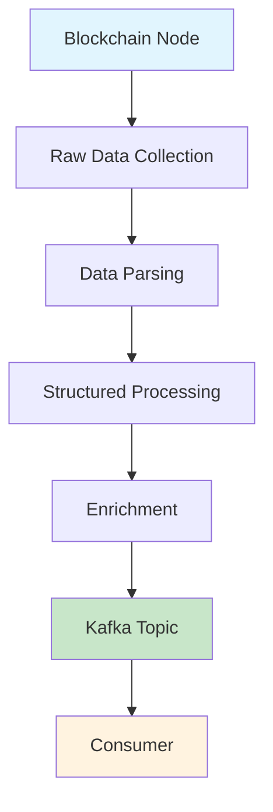

ChainStream provides multi-chain real-time on-chain data streams through Kafka Streams. Compared to GraphQL Subscriptions and WebSocket, Kafka Streams is designed for latency-sensitive, high-reliability server-side application scenarios, offering lower latency and stronger fault tolerance for data consumption.

<Card title="Protobuf Schema Repository" icon="github" href="https://github.com/chainstream-io/streaming_protobuf">
  Official ChainStream Protobuf Schema definitions, supporting Go and Python, including all message types for EVM, Solana, and TRON.
</Card>

---

## Support Matrix

| Chain | dex.trades | tokens | balances | dex.pools | transfers | candlesticks |
|:---|:---:|:---:|:---:|:---:|:---:|:---:|
| Ethereum (eth) | ✅ | ✅ | ✅ | ✅ | ✅ | ✅ |
| BSC (bsc) | ✅ | ✅ | ✅ | ✅ | ✅ | ✅ |
| Solana (sol) | ✅ | ✅ | ✅ | ✅ | ✅ | ✅ |
| TRON (tron) | ✅ | ✅ | ✅ | ✅ | ✅ | ✅ |

<Note>
All chains also support `token-supplies`, `token-prices`, `token-holdings`, `token-market-caps`, `trade-stats` Topics. See full Topic list for details.
</Note>

---

## Kafka Streams vs WebSocket Selection Guide

### When to Choose Kafka Streams

<CardGroup cols={2}>
  <Card title="Latency Sensitive" icon="bolt">
    Latency is the primary concern, application deployed on cloud or dedicated servers
  </Card>
  <Card title="Message Reliability" icon="shield-check">
    Cannot accept losing any messages, requires durable and reliable data consumption
  </Card>
  <Card title="Complex Processing" icon="gears">
    Need to perform complex computation, filtering, or formatting beyond pre-processing capabilities
  </Card>
  <Card title="Horizontal Scaling" icon="server">
    Need multi-instance horizontal scaling for consumption capacity
  </Card>
</CardGroup>

### When to Choose WebSocket

<CardGroup cols={2}>
  <Card title="Rapid Prototyping" icon="rocket">
    Building prototypes, development speed is the primary factor
  </Card>
  <Card title="Unified Interface" icon="plug">
    Application needs both historical and real-time data with unified query and subscription interface
  </Card>
  <Card title="Browser-side" icon="browser">
    Application consumes data directly in browser (Kafka Streams only supports server-side)
  </Card>
  <Card title="Dynamic Filtering" icon="filter">
    Need to dynamically filter data based on page content
  </Card>
</CardGroup>

### Comparison Summary

| Feature | Kafka Streams | WebSocket |
|:---|:---:|:---:|
| Latency | Lowest | Low |
| Reliability | Persistent, no message loss | May lose on disconnect |
| Scalability | Native horizontal scaling | Requires additional design |
| Data Filtering | Client-side processing | Server-side pre-filtering |
| Client Support | Server-side only | Server + Browser |
| Integration Complexity | Higher | Lower |

---

## Credential Acquisition

Kafka Streams uses independent authentication credentials and requires contacting the ChainStream team to apply for access.

<Steps>
  <Step title="Contact to Apply">
    Send an email to [support@chainstream.io](mailto:support@chainstream.io) to apply for Kafka Streams access
  </Step>
  <Step title="Receive Credentials">
    After approval, you will receive the following credential information:
    - Username
    - Password
    - Broker address list
  </Step>
  <Step title="Configure Connection">
    Configure your Kafka client connection using the received credentials
  </Step>
</Steps>

---

## Connection Configuration

### Broker Address

<Note>
The Broker address will be provided along with your credentials after your application is approved. Do not use any unauthorized addresses for connection.
</Note>

### SASL_SSL Connection Configuration

<Tabs>
  <Tab title="Python">
    ```python
    from kafka import KafkaConsumer

    consumer = KafkaConsumer(
        'eth.dex.trades',
        bootstrap_servers=['<your_broker_address>'],
        security_protocol='SASL_SSL',
        sasl_mechanism='SCRAM-SHA-512',
        sasl_plain_username='your_username',
        sasl_plain_password='your_password',
        auto_offset_reset='latest',
        enable_auto_commit=False,
        group_id='your_group_id'
    )
    ```
  </Tab>
  <Tab title="JavaScript">
    ```javascript
    const { Kafka } = require('kafkajs');

    const kafka = new Kafka({
      clientId: 'my-app',
      brokers: ['<your_broker_address>'],
      ssl: true,
      sasl: {
        mechanism: 'scram-sha-512',
        username: 'your_username',
        password: 'your_password'
      }
    });

    const consumer = kafka.consumer({ groupId: 'your_group_id' });
    ```
  </Tab>
  <Tab title="Go">
    ```go
    package main

    import (
        "github.com/segmentio/kafka-go"
        "github.com/segmentio/kafka-go/sasl/scram"
    )

    func main() {
        mechanism, _ := scram.Mechanism(scram.SHA512, "your_username", "your_password")
        
        reader := kafka.NewReader(kafka.ReaderConfig{
            Brokers: []string{"<your_broker_address>"},
            Topic:   "eth.dex.trades",
            GroupID: "your_group_id",
            Dialer: &kafka.Dialer{
                SASLMechanism: mechanism,
                TLS:           &tls.Config{},
            },
        })
    }
    ```
  </Tab>
</Tabs>

---

## Topic Naming Convention & Complete List

### Naming Convention

Topics follow this naming pattern:

```
{chain}.{message_type}              # Raw event data
{chain}.{message_type}.processed    # Processed data (with price, flags, enrichments)
{chain}.{message_type}.created      # Creation events (e.g., token creation)
```

Where `{chain}` includes: `sol`, `bsc`, `eth`, `tron`

### Message Types

| Type | Description |
|:---|:---|
| `dex.trades` | DEX trade events |
| `dex.pools` | Liquidity pool events |
| `tokens` | Token events |
| `balances` | Balance change events |
| `transfers` | Transfer events |
| `token-supplies` | Token supply events |
| `token-prices` | Token price events |
| `token-holdings` | Token holding data |
| `token-market-caps` | Token market cap events |
| `candlesticks` | OHLCV candlestick data |
| `trade-stats` | Trade statistics |

### Complete Topic List

<Tabs>
  <Tab title="Cross-Chain Topics">
    The following Topics apply to all supported chains (replace `{chain}` with `sol`, `bsc`, `eth`):

    ```
    # DEX Trades
    {chain}.dex.trades
    {chain}.dex.trades.processed    # Includes USD/native price, suspicious flag

    # Token Events
    {chain}.tokens
    {chain}.tokens.created          # Token creation events
    {chain}.tokens.processed        # Includes description, image URL, social links

    # Balance Changes
    {chain}.balances
    {chain}.balances.processed      # Includes USD/native value

    # Liquidity Pools
    {chain}.dex.pools
    {chain}.dex.pools.processed     # Includes liquidity USD/native value

    # Token Data
    {chain}.token-supplies
    {chain}.token-supplies.processed
    {chain}.token-prices
    {chain}.token-holdings
    {chain}.token-market-caps.processed

    # Aggregated Data
    {chain}.candlesticks            # OHLCV candlestick data
    {chain}.trade-stats             # Trade statistics
    ```
  </Tab>
  <Tab title="Solana Specific">
    ```
    # Transfer Events
    sol.transfers
    sol.transfers.processed         # Includes USD/native value
    ```
  </Tab>
  <Tab title="EVM Specific">
    ```
    # Transfer Messages (BSC / ETH)
    {chain}.v1.transfers.proto
    {chain}.v1.transfers.processed.proto
    ```
  </Tab>
  <Tab title="TRON Specific">
    ```
    # Transfer Messages
    tron.v1.transfers.proto
    tron.v1.transfers.processed.proto
    ```
  </Tab>
</Tabs>

<Tip>
For complete Protobuf Schema and Topic mappings, refer to the [streaming_protobuf repository](https://github.com/chainstream-io/streaming_protobuf).
</Tip>

---

## Consumption Modes & Offset Management

Two core configurations to consider when subscribing to topics:

### Offset Strategy Selection

Consumers need to decide where to start reading messages after connecting to Kafka. Two common strategies:

<Tabs>
  <Tab title="Consume Latest Only">
    Start from the current latest position on each connection, suitable for scenarios only caring about real-time data. No historical message replay on reconnection.

    ```javascript
    {
      autoCommit: false,
      fromBeginning: false,
      'auto.offset.reset': 'latest'
    }
    ```
  </Tab>
  <Tab title="Persistent Consumption">
    Auto-commit offset, continue from last consumed position on reconnection, ensuring no message loss.

    ```javascript
    {
      autoCommit: true,
      fromBeginning: false,
      'auto.offset.reset': 'latest'
    }
    ```

    <Warning>
    If service restarts, it will continue reading from the last recorded offset. Messages during restart may cause backlog after recovery.
    </Warning>
  </Tab>
</Tabs>

### Group ID Rules

Deploying multiple instances with the same Group ID enables failover and load balancing—messages from the same topic will only be consumed by one instance in the Group, with Kafka automatically distributing partitions among instances.

<Tip>
It's recommended to have an independent consumer for each topic, as different topics have different message parsing logic.
</Tip>

---

## Quick Start: First Consumer in 5 Minutes

The following example shows how to consume the `eth.dex.trades` topic and parse DEX trade data.

<Steps>
  <Step title="Get Protobuf Schema">
    Clone the Schema definitions from the official repository:

    ```bash
    git clone https://github.com/chainstream-io/streaming_protobuf.git
    ```

    Or add as a Git submodule to your project:

    ```bash
    git submodule add https://github.com/chainstream-io/streaming_protobuf.git
    ```
  </Step>
  <Step title="Install Dependencies">
    ```bash
    pip install kafka-python protobuf
    ```
  </Step>
  <Step title="Configure and Consume">
    ```python
    from kafka import KafkaConsumer
    from common import trade_event_pb2  # Get from streaming_protobuf repository

    # Create consumer
    consumer = KafkaConsumer(
        'eth.dex.trades',
        bootstrap_servers=['<your_broker_address>'],
        security_protocol='SASL_SSL',
        sasl_mechanism='SCRAM-SHA-512',
        sasl_plain_username='your_username',
        sasl_plain_password='your_password',
        auto_offset_reset='latest',
        enable_auto_commit=False,
        group_id='my-dex-consumer'
    )

    # Consume messages
    for message in consumer:
        # Parse protobuf message
        trade_events = trade_event_pb2.TradeEvents()
        trade_events.ParseFromString(message.value)
        
        # Print DEX trade info
        for event in trade_events.events:
            print(f"Pool: {event.trade.pool_address}")
            print(f"Token A: {event.trade.token_a_address}")
            print(f"Token B: {event.trade.token_b_address}")
            print(f"Amount A: {event.trade.user_a_amount}")
            print(f"Amount B: {event.trade.user_b_amount}")
            print(f"Block: {event.block.height}")
            print("---")
    ```
  </Step>
</Steps>

---

## Core Data Structures

All message types share these base structures (defined in `common/common.proto`):

### Base Structures

<Tabs>
  <Tab title="Block">
    Block information:

    | Field | Type | Description |
    |:---|:---|:---|
    | `timestamp` | int64 | Block timestamp |
    | `hash` | string | Block hash |
    | `height` | uint64 | Block height |
    | `slot` | uint64 | Slot number (Solana) |
  </Tab>
  <Tab title="Transaction">
    Transaction information:

    | Field | Type | Description |
    |:---|:---|:---|
    | `fee` | uint64 | Transaction fee |
    | `fee_payer` | string | Fee payer |
    | `index` | uint32 | Index within block |
    | `signature` | string | Transaction signature |
    | `signer` | string | Signer address |
    | `status` | Status | Execution status (SUCCESS/FAILED) |
    | `bundles` | []BundleTransaction | Bundle info (MEV detection) |
  </Tab>
  <Tab title="Instruction">
    Instruction information:

    | Field | Type | Description |
    |:---|:---|:---|
    | `index` | uint32 | Instruction index |
    | `is_inner_instruction` | bool | Is inner instruction |
    | `inner_instruction_index` | uint32 | Inner instruction index |
    | `type` | string | Instruction type |
  </Tab>
  <Tab title="DApp">
    DApp information:

    | Field | Type | Description |
    |:---|:---|:---|
    | `program_address` | string | Program address |
    | `inner_program_address` | string | Inner program address |
    | `chain` | Chain | Chain identifier |
  </Tab>
</Tabs>

### Main Message Types

<AccordionGroup>
  <Accordion title="TradeEvent - DEX Trade Events">
    **Topic**: `{chain}.dex.trades`

    ```protobuf
    message TradeEvent {
      Instruction instruction = 1;
      Block block = 2;
      Transaction transaction = 3;
      DApp d_app = 4;
      Trade trade = 100;
      BondingCurve bonding_curve = 110;
      TradeProcessed trade_processed = 200;  // included in processed topic
    }
    ```

    **Trade Core Fields**:

    | Field | Description |
    |:---|:---|
    | `token_a_address` / `token_b_address` | Trading pair token addresses |
    | `user_a_amount` / `user_b_amount` | User trade amounts |
    | `pool_address` | Pool address |
    | `vault_a` / `vault_b` | Pool vault addresses |
    | `vault_a_amount` / `vault_b_amount` | Vault amounts |

    **TradeProcessed Enhanced Fields** (processed topic):

    | Field | Description |
    |:---|:---|
    | `token_a_price_in_usd` / `token_b_price_in_usd` | USD price |
    | `token_a_price_in_native` / `token_b_price_in_native` | Native currency price |
    | `is_token_a_price_in_usd_suspect` | Is price suspicious |
    | `is_token_a_price_in_usd_suspect_reason` | Suspicious reason |
  </Accordion>

  <Accordion title="TokenEvent - Token Events">
    **Topic**: `{chain}.tokens`, `{chain}.tokens.created`

    ```protobuf
    message TokenEvent {
      Instruction instruction = 1;
      Block block = 2;
      Transaction transaction = 3;
      DApp d_app = 4;
      EventType type = 100;        // CREATED, UPDATED
      Token token = 101;
      TokenProcessed token_processed = 200;
    }
    ```

    **Token Core Fields**:

    | Field | Description |
    |:---|:---|
    | `address` | Token address |
    | `name` / `symbol` | Name and symbol |
    | `decimals` | Decimals |
    | `uri` | Metadata URI |
    | `metadata_address` | Metadata address |
    | `creators` | Creator list |
    | `solana_extra` | Solana-specific fields |
    | `evm_extra` | EVM-specific fields (token_standard) |
  </Accordion>

  <Accordion title="BalanceEvent - Balance Change Events">
    **Topic**: `{chain}.balances`

    ```protobuf
    message BalanceEvent {
      Instruction instruction = 1;
      Block block = 2;
      Transaction transaction = 3;
      DApp d_app = 4;
      Balance balance = 100;
      BalanceProcessed balance_processed = 200;
    }
    ```

    **Balance Core Fields**:

    | Field | Description |
    |:---|:---|
    | `token_account_address` | Token account address |
    | `account_owner_address` | Account owner address |
    | `token_address` | Token address |
    | `pre_amount` / `post_amount` | Balance before/after |
    | `decimals` | Decimals |
    | `lifecycle` | Account lifecycle (NEW/EXISTING/CLOSED) |
  </Accordion>

  <Accordion title="DexPoolEvent - Liquidity Pool Events">
    **Topic**: `{chain}.dex.pools`

    ```protobuf
    message DexPoolEvent {
      Instruction instruction = 1;
      Block block = 2;
      Transaction transaction = 3;
      DApp d_app = 4;
      DexPoolEventType type = 100;  // INITIALIZE, INCREASE_LIQUIDITY, DECREASE_LIQUIDITY, SWAP
      DexPool pool = 101;
      DexPoolProcessed pool_processed = 200;
    }
    ```

    **DexPool Core Fields**:

    | Field | Description |
    |:---|:---|
    | `address` | Pool address |
    | `token_a_address` / `token_b_address` | Token addresses |
    | `token_a_vault_address` / `token_b_vault_address` | Vault addresses |
    | `token_a_amount` / `token_b_amount` | Token amounts |
    | `lp_wallet` | LP wallet address |
  </Accordion>

  <Accordion title="CandlestickEvent - Candlestick Data">
    **Topic**: `{chain}.candlesticks`

    | Field | Description |
    |:---|:---|
    | `token_address` | Token address |
    | `resolution` | Time resolution (1m, 5m, 15m, 1h, etc.) |
    | `timestamp` | Timestamp |
    | `open` / `high` / `low` / `close` | OHLC prices (USD) |
    | `open_in_native` / `high_in_native` / `low_in_native` / `close_in_native` | OHLC prices (native) |
    | `volume` / `volume_in_usd` / `volume_in_native` | Volume |
    | `trades` | Trade count |
    | `dimension` | Dimension type (TOKEN_ADDRESS/POOL_ADDRESS/PAIR) |
  </Accordion>

  <Accordion title="TradeStatEvent - Trade Statistics">
    **Topic**: `{chain}.trade-stats`

    | Field | Description |
    |:---|:---|
    | `token_address` | Token address |
    | `resolution` | Time resolution |
    | `buys` / `sells` | Buy/sell count |
    | `buyers` / `sellers` | Buyer/seller count |
    | `buy_volume` / `sell_volume` | Buy/sell volume |
    | `buy_volume_in_usd` / `sell_volume_in_usd` | USD volume |
    | `high_in_usd` / `low_in_usd` | High/low price |
  </Accordion>

  <Accordion title="TokenHoldingEvent - Holding Statistics">
    **Topic**: `{chain}.token-holdings`

    | Field Group | Description |
    |:---|:---|
    | `top10_holders` / `top10_amount` / `top10_ratio` | Top 10 holders stats |
    | `top50_holders` / `top50_amount` / `top50_ratio` | Top 50 holders stats |
    | `top100_holders` / `top100_amount` / `top100_ratio` | Top 100 holders stats |
    | `holders` | Total holders count |
    | `creators_count` / `creators_amount` / `creators_ratio` | Creators holding stats |
    | `fresh_count` / `fresh_amount` / `fresh_ratio` | Fresh wallets holding stats |
    | `smart_count` / `smart_amount` / `smart_ratio` | Smart Money holding stats |
    | `sniper_count` / `sniper_amount` / `sniper_ratio` | Sniper holding stats |
    | `insider_count` / `insider_amount` / `insider_ratio` | Insider holding stats |
  </Accordion>

  <Accordion title="TokenPriceEvent - Price Events">
    **Topic**: `{chain}.token-prices`

    | Field | Description |
    |:---|:---|
    | `token_address` | Token address |
    | `price_in_usd` | USD price |
    | `price_in_native` | Native currency price |
  </Accordion>

  <Accordion title="TokenSupplyEvent - Supply Events">
    **Topic**: `{chain}.token-supplies`

    | Field | Description |
    |:---|:---|
    | `type` | Event type (INITIALIZE_MINT/MINT/BURN) |
    | `token_address` | Token address |
    | `amount` | Amount |
    | `decimals` | Decimals |
    | `amount_with_decimals` | Amount with decimals |
  </Accordion>
</AccordionGroup>

<Tip>
For complete Protobuf definitions, refer to the [streaming_protobuf repository](https://github.com/chainstream-io/streaming_protobuf).
</Tip>

---

## Message Characteristics & Considerations

Developers need to be aware of the following message characteristics when consuming Kafka Streams:

<AccordionGroup>
  <Accordion title="Unfiltered Complete Data Stream">
    Stream does not pre-filter, containing all messages and complete data within the topic. This means consumers need sufficient network throughput, server performance, and efficient parsing code.
  </Accordion>
  
  <Accordion title="Same Entity Messages Are Ordered">
    **Messages for the same token or same account arrive strictly in block order**. This means the event stream for a specific token or wallet address is ordered, making it easy to track state changes. However, message arrival order between different tokens/accounts is not guaranteed.
  </Accordion>
  
  <Accordion title="Messages May Duplicate">
    The same message may be delivered multiple times. If duplicate processing causes issues, consumers need to maintain cache or storage for idempotent processing.
  </Accordion>
  
  <Accordion title="Message Integrity Guaranteed">
    ChainStream guarantees the integrity of each message. Messages will not be split. Regardless of how many transactions a block contains, the message you receive is a complete data unit.
  </Accordion>
  
  <Accordion title="Protobuf Binary Format">
    Messages use Protobuf encoding, more compact than JSON. Consumers need to use the corresponding language's Protobuf library for parsing.
  </Accordion>
</AccordionGroup>

---

## Latency Model

Kafka Streams latency depends on the processing stages data passes through in the pipeline. Different topics from the same chain have different latencies:



### Broadcasted vs Committed

| Type | Description | Latency | Data Certainty |
|:---|:---|:---:|:---:|
| Broadcasted | Transactions consumable at broadcast stage, no block confirmation needed | Lowest | Lower |
| Committed | Transactions enter stream only after block confirmation | Higher | Highest |

### Pipeline Latency

Each transformation layer from blockchain node to Kafka topic (parsing, structuring, enrichment) introduces approximately 100-1000ms latency:

- **raw topic**: Lowest latency, closest to raw node data
- **transactions topic**: Parsed and structured
- **dextrades topic**: Relatively higher latency, but richer data

<Tip>
If latency is your primary concern, prefer topics closest to raw data that you can effectively parse.
</Tip>

---

## Best Practices

### Parallel Partition Consumption

Kafka topics are divided into multiple partitions, each partition needs parallel reading to maximize throughput.

Message partition keys are set to **token address** or **wallet address** (unified across all chains), ensuring:
- All events for the same token route to the same partition, guaranteeing order
- All balance changes for the same wallet route to the same partition, facilitating state tracking

Recommend allocating an independent thread for each partition for load balancing.

### Continuous Consumption, Don't Block Main Loop

Consumer's read loop should run continuously, avoiding backlog from message processing blocking. If messages need processing, adopt async processing mode: main loop handles reading, processing logic delegated to worker threads.

### Message Processing Efficiency

Batch processing can reduce overhead, but requires balancing batch size and latency. In Go, use channel + worker group for concurrent processing.

---

## Chain-Specific Documentation

<CardGroup cols={3}>
  <Card title="EVM Streams" icon="ethereum" href="/en/guides/data-concepts/kafka-streams/evm-streams">
    Ethereum, BSC, Base, Polygon, Optimism
  </Card>
  <Card title="Solana Streams" icon="circle-s" href="/en/guides/data-concepts/kafka-streams/solana-streams">
    Solana high-throughput data streams
  </Card>
  <Card title="TRON Streams" icon="circle-t" href="/en/guides/data-concepts/kafka-streams/tron-streams">
    TRON network data streams
  </Card>
</CardGroup>

---

## Related Documentation

<CardGroup cols={2}>
  <Card title="Real-time Streaming" icon="bolt" href="/en/guides/data-concepts/realtime-streaming">
    WebSocket real-time data integration guide
  </Card>
  <Card title="Authentication Guide" icon="key" href="/en/guides/getting-started/authentication">
    Get Access Token
  </Card>
</CardGroup>
