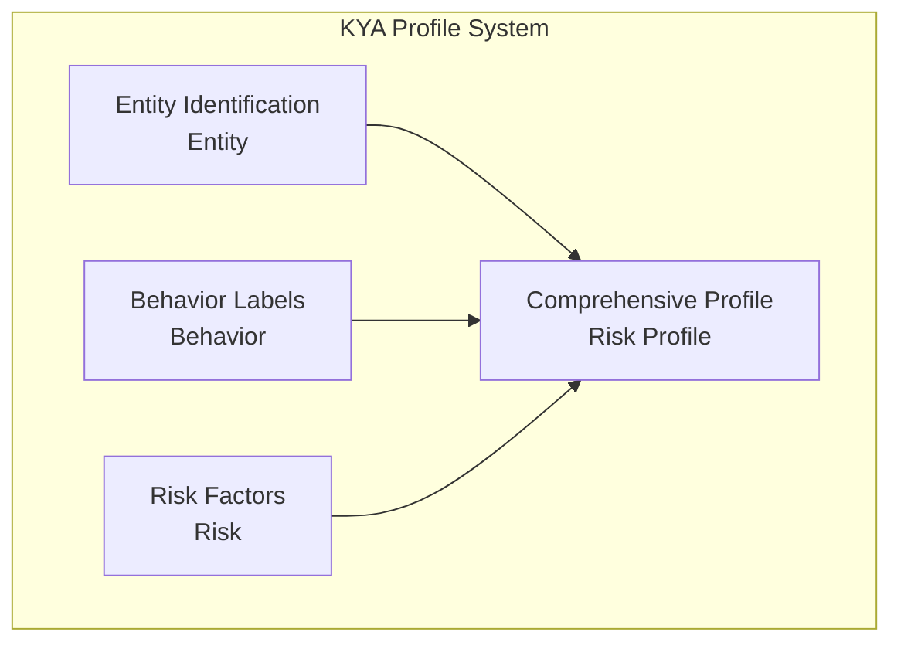
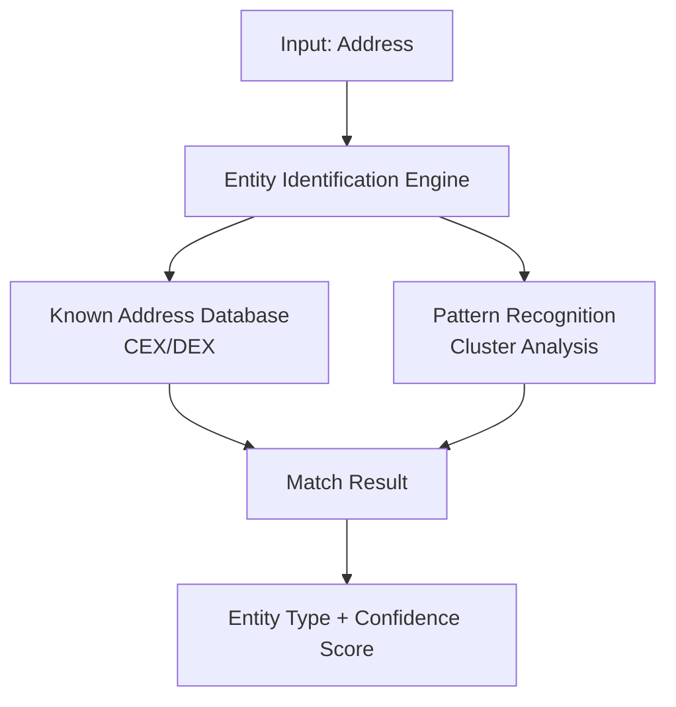
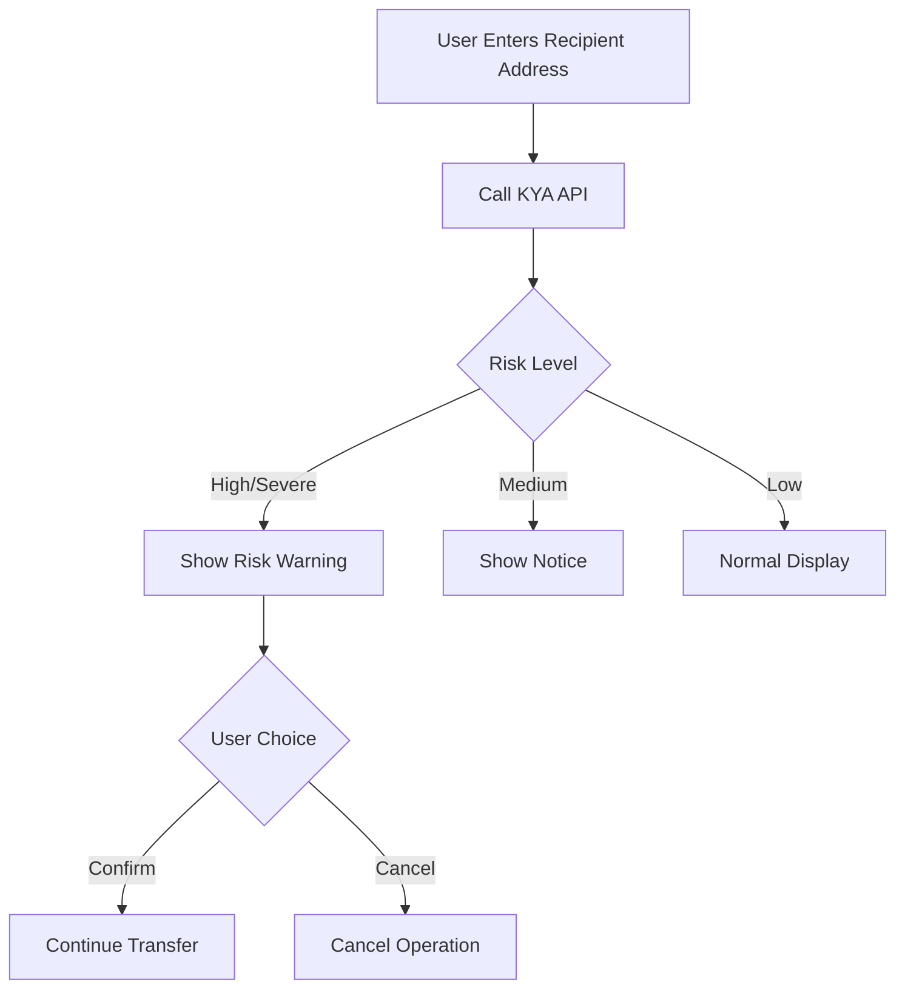
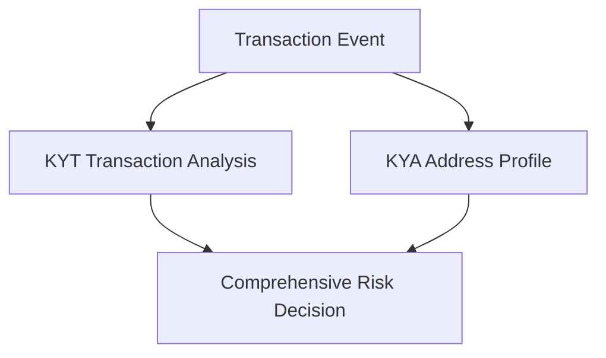

## What is KYA

**KYA (Know Your Address)** is a comprehensive mechanism for profiling and risk assessment of cryptocurrency addresses. By analyzing an address's historical behavior, associated networks, and label information, it constructs a complete risk profile.

<Info>
**Core Question**: Is this address trustworthy?

KYA helps you fully understand an address's historical behavior and risk status before interacting with it.
</Info>

## KYA vs KYT

KYA and KYT are complementary risk control tools that assess risk from different dimensions:

| Dimension | KYT | KYA |
|-----------|-----|-----|
| **Analysis Target** | Individual transaction | Overall address |
| **Time Dimension** | Real-time snapshot | Historical accumulation |
| **Core Question** | Is this transaction safe? | Is this address trustworthy? |
| **Update Frequency** | Triggered per transaction | Periodic/on-demand |
| **Data Depth** | Transaction level | Profile level |

---

## Profiling Dimensions

KYA constructs address profiles from three core dimensions:



---

## Entity Identification

Identify the type of entity behind an address to understand its nature and trustworthiness.

### Entity Classification

| Category | Description | Risk Weight | Identification Method |
|----------|-------------|-------------|----------------------|
| **CEX** | Centralized Exchange | Low | Known hot wallet addresses, deposit address patterns |
| **DEX** | Decentralized Exchange | Low-Medium | Smart contract identification, router addresses |
| **Individual** | Regular user address | Medium | Behavior pattern analysis, balance characteristics |
| **Contract** | Smart contract | Varies | On-chain code verification |
| **Known Criminal** | Confirmed criminal address | Very High | Law enforcement reports, sanctions lists |

### Entity Identification Flow



### Confidence Levels

Entity identification results include confidence scores to help you evaluate reliability:

| Level | Confidence | Description | Recommended Use |
|-------|------------|-------------|-----------------|
| **Confirmed** | &gt;95% | Officially confirmed or law enforcement reported | Use directly |
| **High Confidence** | 80-95% | Strong feature matching | Recommended to use |
| **Medium Confidence** | 50-80% | Partial feature matching | Use as reference |
| **Low Confidence** | &lt;50% | Speculation | For reference only |

---

## Behavior Labels

Based on on-chain behavioral characteristics, the system automatically assigns corresponding labels.

<Tabs>
  <Tab title="Role Labels">
    Reflect the address's role in the on-chain ecosystem:
    
    | Label | Definition | Risk Implication |
    |-------|------------|------------------|
    | `whale` | Large holdings address (&gt;$1M) | High market influence |
    | `trader` | High-frequency trading behavior | Normal activity |
    | `holder` | Long-term holding without movement | Low risk |
    | `bot` | Programmatic trading characteristics | Needs attention |
    | `smart_money` | Smart money | Professional trader |
  </Tab>
  
  <Tab title="Behavior Labels">
    Reflect specific behavioral patterns:
    
    | Label | Definition | Risk Implication |
    |-------|------------|------------------|
    | `mixer_user` | Has used mixing services | High risk |
    | `bridge_user` | Cross-chain bridge user | Medium risk |
    | `defi_active` | Frequent DeFi protocol interactions | Normal |
    | `nft_trader` | Active NFT trading | Normal |
    | `new_address` | Newly created address | Needs observation |
  </Tab>
  
  <Tab title="Entity Labels">
    Identified ownership entities:
    
    | Label | Description |
    |-------|-------------|
    | `exchange:binance` | Binance Exchange |
    | `exchange:coinbase` | Coinbase Exchange |
    | `defi:uniswap` | Uniswap Protocol |
    | `bridge:multichain` | Cross-chain Bridge |
    | `sanctions` | Sanctioned address |
  </Tab>
</Tabs>

### Label Combination Risk

Certain label combinations amplify risk signals:

<Warning>
**High Risk Combination Example**

`mixer_user` + `high_value` + `new_address`

**Risk Level**: HIGH

**Reason**: New address receiving large funds from mixer matches money laundering patterns
</Warning>

<Check>
**Low Risk Combination Example**

`whale` + `holder` + `exchange:binance`

**Risk Level**: LOW

**Reason**: Exchange-associated long-term large holder, normal behavior
</Check>

---

## Risk Factors

Core metrics for quantifying risk assessment, used to calculate comprehensive risk scores.

### Core Risk Factors

| Factor | Description | Calculation Method |
|--------|-------------|-------------------|
| **Blacklist Exposure** | Degree of association with blacklisted addresses | Direct/indirect exposure ratio |
| **Anomaly Index** | Degree of deviation from normal behavior | Statistical anomaly detection |
| **Privacy Service Usage** | Mixer/privacy protocol usage | Interaction history analysis |
| **Geographic Risk** | High-risk jurisdiction association | IP/exchange correlation |
| **Temporal Anomaly** | Abnormal time patterns | Transaction time analysis |

---

## Use Cases

### 1. Counterparty Due Diligence

<Steps>
  <Step title="Collect Counterparty Address">
    Collect wallet address from OTC trading counterparty
  </Step>
  <Step title="Register Address">
    ```bash
    POST https://api.chainstream.io/v1/kyt/address
    Authorization: Bearer <access_token>
    Content-Type: application/json

    {
      "address": "0x1234567890abcdef1234567890abcdef12345678"
    }
    ```
  </Step>
  <Step title="Get Risk Assessment">
    ```bash
    GET https://api.chainstream.io/v1/kyt/addresses/{address}/risk
    Authorization: Bearer <access_token>
    ```
  </Step>
  <Step title="Make Decision">
    - `Severe/High` → Reject transaction
    - `Medium` → Request additional KYC
    - `Low` → Proceed normally
  </Step>
</Steps>

### 2. Batch Address Screening

Periodically screen existing user addresses:

```javascript
async function batchScreenAddresses(addresses) {
  const results = [];
  
  for (const address of addresses) {
    // 1. Register address
    await fetch('https://api.chainstream.io/v1/kyt/address', {
      method: 'POST',
      headers: {
        'Authorization': `Bearer ${accessToken}`,
        'Content-Type': 'application/json'
      },
      body: JSON.stringify({ address })
    });
    
    // 2. Get risk assessment
    const riskResponse = await fetch(
      `https://api.chainstream.io/v1/kyt/addresses/${address}/risk`,
      { headers: { 'Authorization': `Bearer ${accessToken}` } }
    );
    const risk = await riskResponse.json();
    
    results.push({
      address,
      risk: risk.risk,
      addressType: risk.addressType
    });
  }
  
  return results;
}
```

**Business Flow**:
1. Export user address list
2. Batch register and query risk
3. Filter high-risk addresses
4. Trigger follow-up processing

### 3. Real-time Risk Alerts

Provide risk alerts before wallet users transfer:



---

## Data Elements

### Input Data

| Field | Required | Description |
|-------|----------|-------------|
| address | ✅ | Address to query |

### Output Data

```json
{
  "address": "0x0038AC785dfB6C82b2c9A7B3B6854e08a10cb9f1",
  "risk": "Low",
  "riskReason": null,
  "addressType": "PRIVATE_WALLET",
  "cluster": null,
  "addressIdentifications": [],
  "exposures": [
    {
      "category": "sanctions",
      "value": 0.0
    }
  ],
  "triggers": [],
  "status": "COMPLETE"
}
```

### Response Field Description

| Field | Type | Description |
|-------|------|-------------|
| address | string | Queried address |
| risk | string | Risk level: `Severe`, `High`, `Medium`, `Low` |
| riskReason | string | Risk reason (can be null) |
| addressType | string | Address type: `PRIVATE_WALLET`, `EXCHANGE`, `CONTRACT`, etc. |
| cluster | string | Associated cluster name (can be null) |
| addressIdentifications | array | Address identification labels |
| exposures | array | Risk exposure list |
| triggers | array | Triggered risk rules |
| status | string | Analysis status: `COMPLETE`, `PENDING` |

---

## Synergy with KYT

KYA and KYT should be used together in practice to achieve comprehensive risk management.

### Synergy Pattern



### Decision Matrix

| KYT Result | KYA Result | Combined Decision |
|------------|------------|-------------------|
| SEVERE | Any | Immediate freeze |
| HIGH | HIGH/SEVERE | Freeze pending review |
| HIGH | LOW/MEDIUM | Manual review |
| MEDIUM | HIGH/SEVERE | Manual review |
| MEDIUM | MEDIUM | Enhanced monitoring |
| LOW | LOW | Auto-approve |
| LOW | HIGH | Flag for monitoring |

---

## Best Practices

### 1. Caching Strategy

KYA results can be cached moderately:

| Risk Level | Recommended Cache Duration | Reason |
|------------|---------------------------|--------|
| SEVERE | No caching | May have updates |
| HIGH | 1 hour | Needs fresh data |
| MEDIUM | 6 hours | Balance performance |
| LOW | 24 hours | Low risk is stable |

### 2. Incremental Update

For monitoring existing addresses:

<Note>
**Recommended Approach**

1. Initial full query to establish baseline
2. Daily incremental update for HIGH and above addresses
3. Weekly incremental update for MEDIUM addresses
4. Monthly full refresh
</Note>

### 3. Threshold Tuning

Adjust thresholds based on business scenarios:

| Scenario | Recommended Adjustment |
|----------|----------------------|
| High-value clients | Raise MEDIUM threshold |
| New users | Strictly use default thresholds |
| Batch screening | Slightly relax to avoid excessive false positives |

---

## Next Steps

<CardGroup cols={2}>
  <Card title="Compliance Integration Guide" icon="plug" href="/en/guides/data-concepts/compliance-integration">
    Start integrating KYA
  </Card>
  <Card title="KYT Core Concepts" icon="magnifying-glass-dollar" href="/en/guides/data-concepts/kyt-concepts">
    Learn about transaction-level risk control
  </Card>
  <Card title="API Authentication" icon="key" href="/en/guides/getting-started/authentication">
    Understand authentication methods
  </Card>
  <Card title="KYA API Reference" icon="code" href="/en/api-reference/endpoint/kyt/v1/kyt-address-post">
    View API documentation
  </Card>
</CardGroup>
