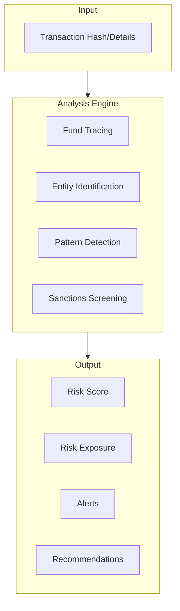
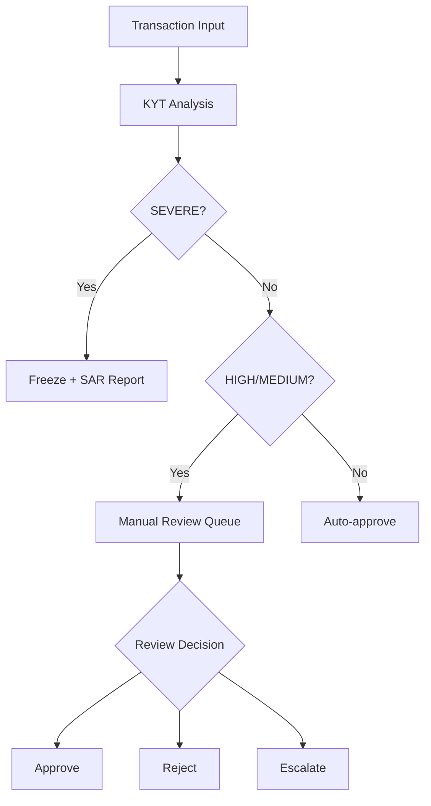

## What is KYT

**KYT (Know Your Transaction)** is a risk identification mechanism for individual cryptocurrency transactions, providing real-time analysis of each on-chain transaction to determine its risk level and provide handling recommendations.

<Info>
**Core Question**: Is this transaction safe?

KYT helps you quickly identify the risk level and associated risk entities before processing each transaction.
</Info>

## Comparison with Traditional Finance

| Dimension | Traditional Finance | Crypto KYT |
|-----------|---------------------|------------|
| **Monitoring Method** | Bank transaction monitoring | On-chain transaction analysis |
| **Data Foundation** | Account history based | Address association based |
| **Processing Time** | T+1 batch processing | Real-time/near real-time |
| **Rule Engine** | Primarily manual rules | Algorithm + label driven |

## How It Works



### Analysis Flow

1. **Fund Tracing**: Trace fund sources and destinations forward/backward
2. **Entity Identification**: Identify known entities involved in transactions (exchanges, protocols, labeled addresses)
3. **Pattern Detection**: Identify suspicious transaction patterns (splitting, obfuscation, layering)
4. **Sanctions Screening**: Match against sanctions lists

---

## Risk Level Definitions

ChainStream uses a four-tier risk classification system:

| Level | Indicator | Definition | Typical Triggers |
|-------|-----------|------------|------------------|
| **SEVERE** | 🔴 | Known criminal association | Sanctioned addresses, confirmed hacker addresses, darknet markets |
| **HIGH** | 🟠 | High-risk patterns | Mixer outputs, scam associations, unlicensed gambling |
| **MEDIUM** | 🟡 | Requires attention | High-risk exchanges, privacy coin swaps, anomalous patterns |
| **LOW** | 🟢 | Normal | Known compliant entities, regular user behavior |

### Level Details

<AccordionGroup>
  <Accordion title="SEVERE" icon="circle-exclamation">
    - **Definition**: Direct association with confirmed criminal activity
    - **Data Sources**: OFAC sanctions list, law enforcement reports, confirmed hacking incidents
    - **False Positive Rate**: Very low (&lt;0.1%)
    - **Recommended Action**: Immediate freeze, report to regulators
  </Accordion>
  
  <Accordion title="HIGH" icon="triangle-exclamation">
    - **Definition**: High-risk characteristics but unconfirmed criminal activity
    - **Data Sources**: Mixer identification, scam address clustering, behavior pattern analysis
    - **False Positive Rate**: Low (&lt;5%)
    - **Recommended Action**: Manual review, delayed processing
  </Accordion>
  
  <Accordion title="MEDIUM" icon="circle-info">
    - **Definition**: Risk signals present but requires further evaluation
    - **Data Sources**: Association analysis, behavioral anomaly detection
    - **False Positive Rate**: Moderate (5-15%)
    - **Recommended Action**: Enhanced monitoring, may proceed
  </Accordion>
  
  <Accordion title="LOW" icon="circle-check">
    - **Definition**: No obvious risk characteristics
    - **Data Sources**: Normal transaction patterns, known compliant entities
    - **Recommended Action**: Process normally
  </Accordion>
</AccordionGroup>

---

## Recommended Action Mapping

Based on risk level, the system provides standardized action recommendations:

| Risk Level | Recommended Action | Automation Level | SLA |
|------------|-------------------|------------------|-----|
| **SEVERE** | Freeze | Automatic | Immediate |
| **HIGH** | Manual Review | Requires manual confirmation | 4 hours |
| **MEDIUM** | Enhanced Monitoring | Semi-automatic | 24 hours |
| **LOW** | Pass | Automatic | Immediate |

### Action Flow



---

## Exposure Types

ChainStream distinguishes between two types of risk exposure:

<Tabs>
  <Tab title="Direct Exposure">
    **Definition**: Transaction directly interacts with a risk address
    
    ```
    Risk Address ──────────────> Target Address
                 Direct Transfer
                 
    Exposure Type: DIRECT
    Risk Transmission: 100%
    ```
    
    **Characteristics**:
    - One-hop association
    - High certainty of risk
    - Typically triggers immediate response
    
    **Example Scenarios**:
    - Receiving funds from known hacker address
    - Sending to sanctioned address
    - Receiving directly from mixer output
    
    ```json
    {
      "type": "DIRECT",
      "category": "SANCTIONS",
      "entity": "OFAC Sanctioned Address",
      "percentage": 100
    }
    ```
  </Tab>
  
  <Tab title="Indirect Exposure">
    **Definition**: Associated with risk address through N hops
    
    ```
    Risk Address ──> Intermediate1 ──> Intermediate2 ──> Target Address
                 N-hop Association
                 
    Exposure Type: INDIRECT
    Risk Transmission: Decay calculation
    ```
    
    **Characteristics**:
    - Multi-hop association (typically 2-5 hops)
    - Risk decays with distance
    - Requires comprehensive evaluation
    
    **Decay Model**:
    
    `Risk Score = Base Risk × (Decay Factor ^ Hops)`
    
    Example: Base risk 100, decay factor 0.5, after 3 hops = 100 × 0.5³ = 12.5
    
    ```json
    {
      "type": "INDIRECT",
      "category": "MIXER",
      "entity": "Tornado Cash",
      "percentage": 12.5,
      "hops": 3
    }
    ```
  </Tab>
</Tabs>

### Exposure Handling Guidelines

| Scenario | Direct Handling | Indirect Handling |
|----------|-----------------|-------------------|
| SEVERE source | Immediate freeze | Freeze within 2 hops, 3+ hops manual review |
| HIGH source | Manual review | Flag for monitoring |
| MEDIUM source | Process normally | Ignore |

---

## Business Flow

### Standard KYT Flow

<Steps>
  <Step title="Register Transaction">
    Submit transaction information to KYT API
    ```bash
    POST https://api.chainstream.io/v1/kyt/transfer
    Authorization: Bearer <access_token>
    Content-Type: application/json

    {
      "network": "ethereum",
      "asset": "ETH",
      "transferReference": "0x1234...abcd:0xRecipientAddress",
      "direction": "received"
    }
    ```
  </Step>
  <Step title="Wait for Analysis">
    Wait for analysis completion via polling (typically within 30 seconds)
  </Step>
  <Step title="Query Results">
    Retrieve risk assessment results
    ```bash
    GET https://api.chainstream.io/v1/kyt/transfers/{externalId}/summary
    Authorization: Bearer <access_token>
    ```
  </Step>
  <Step title="Execute Decision">
    Execute business logic based on risk level and recommendations
  </Step>
</Steps>

### Processing Times

| Stage | Target Time | SLA Commitment |
|-------|-------------|----------------|
| Transaction Registration | &lt;100ms | 99.9% |
| Risk Analysis | &lt;30s | 95% |
| Result Return | &lt;30s | 95% |
| End-to-end | &lt;1min | 90% |

<Note>
Valid transactions complete analysis within 30 seconds. Complex associations may require longer processing time.
</Note>

---

## Data Elements

### Input Data (Register Transfer)

| Field | Required | Description |
|-------|----------|-------------|
| `network` | ✅ | Network: `bitcoin`, `ethereum`, `Solana` |
| `asset` | ✅ | Asset type: `BTC`, `ETH`, `SOL`, etc. |
| `transferReference` | ✅ | Transfer reference (tx hash:address) |
| `direction` | ✅ | Direction: `sent` or `received` |

### Input Data (Register Withdrawal)

| Field | Required | Description |
|-------|----------|-------------|
| `network` | ✅ | Network: `bitcoin`, `ethereum`, `Solana` |
| `asset` | ✅ | Asset type |
| `address` | ✅ | Withdrawal destination address |
| `assetAmount` | ✅ | Asset amount |
| `attemptTimestamp` | ✅ | Attempt timestamp |
| `assetPrice` | Optional | Asset price |

### Output Data

```json
{
  "externalId": "393905a7-bb96-394b-9e20-3645298c1079",
  "asset": "ETH",
  "network": "ethereum",
  "transferReference": "0x1234...abcd:0xAddress",
  "direction": "received",
  "tx": "0x1234...abcd",
  "outputAddress": "0xAddress",
  "assetAmount": "1.5",
  "usdAmount": "3000.00",
  "timestamp": "2024-01-15T10:30:00.000Z",
  "updatedAt": "2024-01-15T10:30:15.000Z"
}
```

### Response Field Description

| Field | Type | Description |
|-------|------|-------------|
| externalId | string | Transfer ID (UUID), used for subsequent queries |
| asset | string | Asset type |
| network | string | Blockchain network |
| transferReference | string | Transfer reference |
| direction | string | Transfer direction |
| tx | string | Transaction hash |
| outputAddress | string | Output address |
| assetAmount | string | Asset amount |
| usdAmount | string | USD amount |
| timestamp | string | Transaction timestamp |
| updatedAt | string | Update time |

---

## API Usage

### Register Deposit Transaction (Transfer)

```bash
POST https://api.chainstream.io/v1/kyt/transfer
Authorization: Bearer <access_token>
Content-Type: application/json

{
  "network": "ethereum",
  "asset": "ETH",
  "transferReference": "0x9f318afbad2a183f97750bc51a75b582ad8f9e9c:0x17A16QmavnUfCW11DAApi",
  "direction": "received"
}
```

### Register Withdrawal Transaction

```bash
POST https://api.chainstream.io/v1/kyt/withdrawal
Authorization: Bearer <access_token>
Content-Type: application/json

{
  "network": "Solana",
  "asset": "SOL",
  "address": "D1Mc6j9xQWgR1o1Z7yU5nVVXFQiAYx7FG9AW1aVfwrUM",
  "assetAmount": "5",
  "attemptTimestamp": "2024-01-15T10:30:00.000Z"
}
```

### Get Assessment Details

```bash
# Get transfer summary
GET https://api.chainstream.io/v1/kyt/transfers/{externalId}/summary

# Get direct risk exposure
GET https://api.chainstream.io/v1/kyt/transfers/{externalId}/exposures/direct

# Get risk alerts
GET https://api.chainstream.io/v1/kyt/transfers/{externalId}/alerts

# Get network identifications
GET https://api.chainstream.io/v1/kyt/transfers/{externalId}/network-identifications
```

### Withdrawal Related Queries

```bash
# Get withdrawal summary
GET https://api.chainstream.io/v1/kyt/withdrawal/{withdrawalId}/summary

# Get withdrawal direct exposure
GET https://api.chainstream.io/v1/kyt/withdrawal/{withdrawalId}/exposures/direct

# Get withdrawal alerts
GET https://api.chainstream.io/v1/kyt/withdrawal/{withdrawalId}/alerts

# Get fraud assessment
GET https://api.chainstream.io/v1/kyt/withdrawal/{withdrawalId}/fraud-assessment
```

---

## Best Practices

<AccordionGroup>
  <Accordion title="Risk Threshold Configuration" icon="sliders">
    Adjust thresholds based on business risk appetite:
    
    | Business Type | SEVERE Threshold | HIGH Threshold | Recommendation |
    |---------------|------------------|----------------|----------------|
    | Licensed CEX | Default | Default | Strict mode |
    | Wallet Service | Default | Raise 10% | Balanced mode |
    | DeFi Protocol | Default | Raise 20% | Relaxed mode |
  </Accordion>
  
  <Accordion title="False Positive Handling" icon="flag">
    Establish a false positive feedback mechanism:
    
    1. Record all manually overturned cases
    2. Regularly analyze false positive patterns
    3. Submit false positive feedback to ChainStream
    4. Adjust local threshold configuration
  </Accordion>
  
  <Accordion title="Audit Trail" icon="file-lines">
    Ensure compliance audit requirements:
    
    - Save all KYT requests and responses
    - Record manual decisions with reasoning
    - Retain for at least 5 years (per regulatory requirements)
    - Support export in standard report formats
  </Accordion>
  
  <Accordion title="Continuous Monitoring" icon="rotate">
    Risk status may change (e.g., address subsequently sanctioned). Recommendations:
    
    - Periodically re-evaluate historical transactions
    - Monitor new activity from associated addresses
    - Establish alert mechanism for risk status changes
  </Accordion>
</AccordionGroup>

---

## Related Resources

<CardGroup cols={2}>
  <Card title="KYA Core Concepts" icon="user-shield" href="/en/guides/data-concepts/kya-concepts">
    Learn about address-level risk control
  </Card>
  <Card title="Compliance Integration Guide" icon="plug" href="/en/guides/data-concepts/compliance-integration">
    Start integrating KYT
  </Card>
  <Card title="API Authentication" icon="key" href="/en/guides/getting-started/authentication">
    Understand authentication methods
  </Card>
  <Card title="KYT API Reference" icon="code" href="/en/api-reference/endpoint/kyt/v1/kyt-transfer-post">
    View API documentation
  </Card>
</CardGroup>
