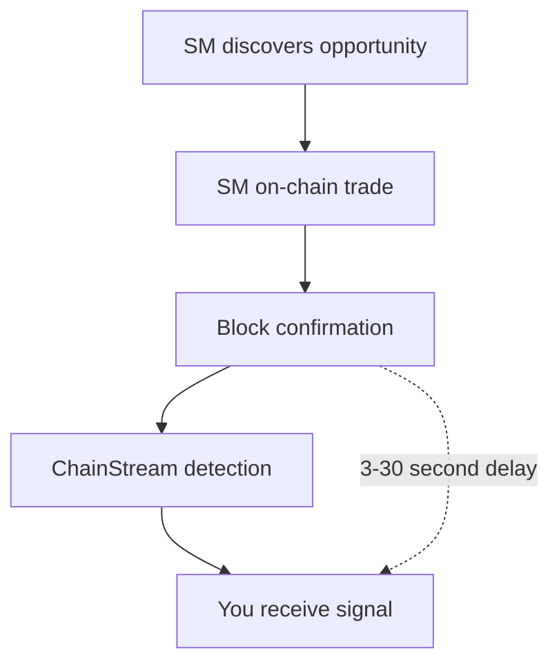

ChainStream's Smart Money feature helps developers track and analyze "smart money" — addresses that consistently achieve above-market returns in the crypto market. This document details the Smart Money identification methodology and data update mechanisms.

---

## What is Smart Money

### Definition

Smart Money refers to addresses that demonstrate the following characteristics in the crypto market:

- Consistently outperform market benchmarks
- Enter quality projects early
- Maintain high win rates
- Professional risk management capabilities

### Smart Money Types

| Type | Description | Typical Characteristics |
|:--|:--|:--|
| Institutional Investors | Professional investment institutions, funds | Large trades, long-term holding, diversified investments |
| Professional Traders | Full-time cryptocurrency traders | High-frequency trading, technical analysis, multi-strategy |
| Early Investors | Early project participants | Primary market participation, long-term lockups |
| KOL/Influencer Wallets | Industry notable figures | Community influence, information advantage |

### Comparison with Regular Addresses

| Dimension | Smart Money | Regular Address |
|:--|:--|:--|
| Returns | Consistent positive returns, beats market | High volatility, frequent losses |
| Entry Timing | Early discovery, buy at lows | Chase pumps, buy at highs |
| Win Rate | &gt; 60% | &lt; 50% |
| Position Management | Clear take-profit/stop-loss strategy | Random trading, no discipline |
| Capital Scale | Usually &gt; $100K | Widely distributed |

---

## Identification Methodology

### Data Sources

ChainStream analyzes the following on-chain data:

- All DEX trading records
- Token holding changes
- Fund flow trajectories
- Trading time distribution
- Gas fee patterns

### Candidate Pool Selection Method

ChainStream uses a reverse-tracking method based on new launch token performance to build the Smart Money candidate pool:

#### Selection Process

<Steps>
  <Step title="Token Performance Screening">
    From all newly launched tokens in the past 60 days, select the top 1000 best-performing tokens based on market cap growth/trading volume metrics
  </Step>
  <Step title="Early Participant Identification">
    For the above tokens, identify addresses that bought in the early stage (within 24 hours after launch)
  </Step>
  <Step title="Address De-noising">
    Exclude the following address types:
    - DEV/project addresses (identified by trading patterns)
    - Market maker addresses (identified by high-frequency wash trading)
    - CEX hot wallet addresses (matched against known address database)
    - Sybil attack addresses (identified by correlation analysis)
  </Step>
  <Step title="Frequency Statistics and Ranking">
    Count each address's early buy frequency in the top 1000 tokens, take the top 200 addresses with highest frequency as the Smart Money candidate pool
  </Step>
</Steps>

### Dynamic Rolling Update Mechanism

To maintain timeliness and accuracy of Smart Money data, ChainStream implements a weekly rolling update with weight decay:

| Configuration | Value |
|:--|:--|
| Update Cycle | Every Monday UTC 00:00 |
| Window Size | 60 days (approximately 8 weeks) |
| Rolling Method | Remove oldest week's data weekly, include latest week's data |

#### Weight Decay Model

| Data Period | Weight |
|:--|:--|
| Last 1 week | 100% |
| 2 weeks ago | 85% |
| 3 weeks ago | 70% |
| 4 weeks ago | 55% |
| 5-8 weeks ago | 40% |

<Warning>
Rolling updates mean the Smart Money list changes dynamically. Historical Smart Money addresses with poor recent performance will gradually be removed from the candidate pool.
</Warning>

---

## Data Update Cycle

### Real-time Updates

| Data Type | Update Latency |
|:--|:--|
| New trade detection | &lt; 1 minute |
| Position changes | &lt; 5 minutes |

### Periodic Updates

| Data Type | Update Cycle |
|:--|:--|
| Smart Money list | Every Monday UTC 00:00 |
| Score recalculation | Every 24 hours |
| Full re-evaluation | Every 30 days |

---

## Use Cases

<CardGroup cols={2}>
  <Card title="Copy Trading" icon="copy">
    Monitor Smart Money buy signals to assist trading decisions.
  </Card>
  <Card title="Project Discovery" icon="magnifying-glass">
    Analyze new projects that Smart Money is interested in:
    - Multiple Smart Money buying simultaneously
    - Continuous accumulation rather than quick flips
  </Card>
  <Card title="Market Sentiment" icon="chart-mixed">
    Judge market sentiment through Smart Money behavior:
    - Heavy buying: Bullish signal
    - Concentrated selling: Bearish signal
  </Card>
  <Card title="Risk Warning" icon="triangle-exclamation">
    Monitor abnormal fund flows:
    - Whale large transfers
    - Project team address movements
  </Card>
</CardGroup>

---

## Usage Guidelines

<Warning>
Smart Money signals are for reference only and do not constitute investment advice.
</Warning>

### Correct Usage

- Use as a research starting point to discover tokens worth attention
- Combine with fundamental analysis to make independent judgments
- Understand signal latency — on-chain transactions need confirmation time
- Focus on multiple signal convergence to improve accuracy

### Incorrect Usage

- Blindly copy trading without any research
- Ignore trading costs (Gas, slippage)
- Ignore market environment and macro factors
- Over-rely on a single signal source

---

## Limitations

### 1. Information Delay

### 2. Counter-trading Risk

- Some SM may realize they're being tracked and deliberately counter-trade
- Large buys may be creating false signals for dumping

### 3. Market Capacity Limits

- Following SM buys will push up prices
- Small market cap tokens have limited capacity, copy trading effectiveness diminishes

### 4. Past Performance Doesn't Guarantee Future Results

- Historical high returns don't guarantee future performance
- Market environment changes may cause strategies to fail

---

## Related Documentation

<CardGroup cols={2}>
  <Card title="Smart Money Tracker" icon="user-secret" href="/en/playbooks/tutorials/smart-money-tracker">
    Hands-on tutorial: Build a SM tracking system
  </Card>
  <Card title="Realtime Streaming" icon="bolt" href="/en/guides/data-concepts/realtime-streaming">
    Real-time stream processing
  </Card>
</CardGroup>
