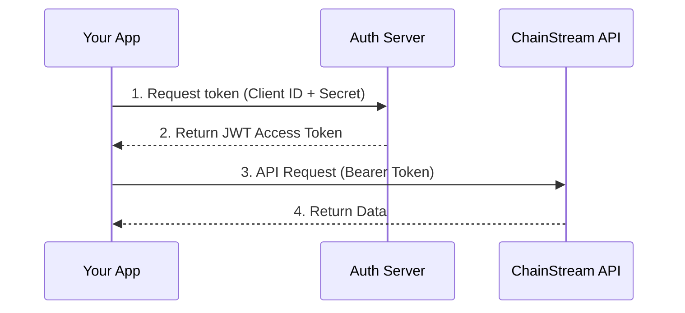

## Authentication Mechanism

ChainStream uses **OAuth 2.0 Client Credentials** flow for API authentication. You need to exchange your API credentials (Client ID and Client Secret) for a JWT access token, then include that token in each API request.



## Get API Credentials

<Steps>
  <Step title="Login to Dashboard">
    Visit [ChainStream Dashboard](https://www.chainstream.io/dashboard) and login
  </Step>
  <Step title="Go to Applications">
    Find "Applications" in the sidebar
  </Step>
  <Step title="Create New App">
    Click "Create New App" to generate Client ID and Client Secret
  </Step>
</Steps>

<Warning>
Keep your API credentials secure. Never commit them to code repositories or share with others. If credentials are leaked, revoke and regenerate them immediately in the Dashboard.
</Warning>

## Generate Access Token

### Basic Usage (General API Access)

<CodeGroup>
```javascript JavaScript
import { AuthenticationClient } from 'auth0';

const auth0Client = new AuthenticationClient({
  domain: 'dex.asia.auth.chainstream.io',
  clientId: 'YOUR_CLIENT_ID',
  clientSecret: 'YOUR_CLIENT_SECRET'
});

const response = await auth0Client.oauth.clientCredentialsGrant({
  audience: 'https://api.dex.chainstream.io'
});

const accessToken = response.data.access_token;
```

```python Python
import requests

def get_access_token(client_id, client_secret):
    response = requests.post(
        'https://dex.asia.auth.chainstream.io/oauth/token',
        json={
            'client_id': client_id,
            'client_secret': client_secret,
            'audience': 'https://api.dex.chainstream.io',
            'grant_type': 'client_credentials'
        }
    )
    return response.json()['access_token']
```

```go Go
package main

import (
    "bytes"
    "encoding/json"
    "net/http"
)

func getAccessToken(clientID, clientSecret string) (string, error) {
    payload := map[string]string{
        "client_id":     clientID,
        "client_secret": clientSecret,
        "audience":      "https://api.dex.chainstream.io",
        "grant_type":    "client_credentials",
    }
    
    body, _ := json.Marshal(payload)
    resp, err := http.Post(
        "https://dex.asia.auth.chainstream.io/oauth/token",
        "application/json",
        bytes.NewBuffer(body),
    )
    if err != nil {
        return "", err
    }
    defer resp.Body.Close()
    
    var result map[string]interface{}
    json.NewDecoder(resp.Body).Decode(&result)
    return result["access_token"].(string), nil
}
```
</CodeGroup>

## Scope Permissions

Certain advanced API endpoints require specific access permissions (Scope). Specify the required scope when obtaining the token:

### Available Scopes

| Scope | Description | Applicable Endpoints |
|-------|-------------|---------------------|
| `webhook.read` | Webhook read access | Query Webhook configuration |
| `webhook.write` | Webhook write access | Create/modify/delete Webhooks |
| `kyt.read` | KYT read access | Query risk assessment results |
| `kyt.write` | KYT write access | Submit transactions/addresses for risk assessment |

### Token Request with Scope

<CodeGroup>
```javascript Webhook Access
const response = await auth0Client.oauth.clientCredentialsGrant({
  audience: 'https://api.dex.chainstream.io',
  scope: 'webhook.read webhook.write'
});
```

```javascript KYT Access
const response = await auth0Client.oauth.clientCredentialsGrant({
  audience: 'https://api.dex.chainstream.io',
  scope: 'kyt.read kyt.write'
});
```
</CodeGroup>

<Note>
If no scope is specified, the token can access all general API endpoints. Scope is only required when accessing protected Webhook or KYT endpoints.
</Note>

## Using the Access Token

Include the token in the `Authorization` header of each API request:

```bash
curl https://api-dex.chainstream.io/v1/token/sol/{address} \
  -H "Authorization: Bearer YOUR_ACCESS_TOKEN"
```

## Token Validity & Refresh

- **Validity**: Access tokens are valid for 24 hours by default
- **Refresh Strategy**: Get a new token before the current one expires
- **Caching**: Cache tokens in your application to avoid requesting new ones for each call

## API Endpoints

- **Mainnet API**: `https://api-dex.chainstream.io/`
- **WebSocket**: `wss://realtime-dex.chainstream.io/connection/websocket`
- **Auth Service**: `https://dex.asia.auth.chainstream.io/`

## FAQ

<AccordionGroup>
  <Accordion title="What if the token expires?">
    When the access token expires, simply obtain a new token using the same credentials. It's recommended to implement an automatic refresh mechanism in your application.
  </Accordion>
  
  <Accordion title="Can I create multiple Apps?">
    Yes. You can create separate Apps (each with their own Client ID/Secret) for different applications or environments, making it easier to manage and track usage.
  </Accordion>
  
  <Accordion title="How do I revoke leaked credentials?">
    In the Dashboard's Applications page, find the corresponding app and click "Delete". The key will be invalidated immediately.
  </Accordion>
</AccordionGroup>
