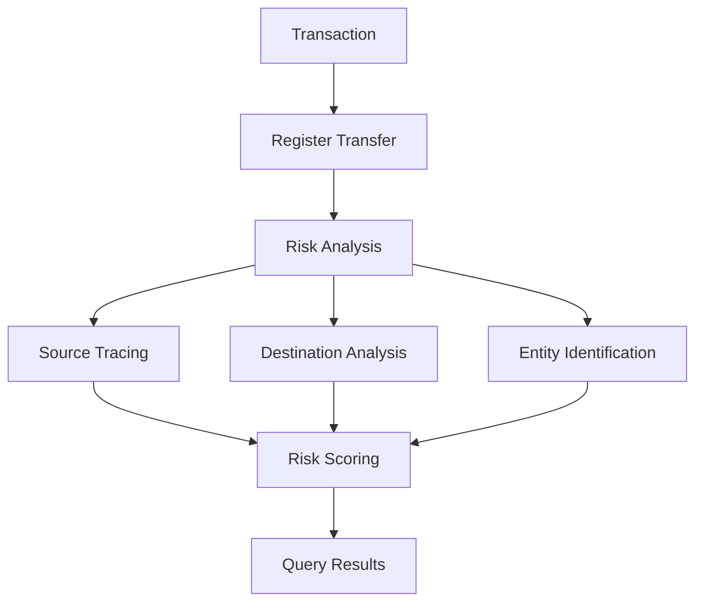

## Overview

As cryptocurrency goes mainstream, compliance requirements are increasingly strict. ChainStream provides comprehensive security and compliance solutions to help businesses meet regulatory requirements, identify risky transactions, and protect user assets.

<CardGroup cols={2}>
  <Card title="KYT - Know Your Transaction" icon="magnifying-glass-dollar" color="#4D9CFF">
    Real-time analysis of transaction fund sources and destinations to identify high-risk associations
  </Card>
  <Card title="KYA - Know Your Address" icon="user-shield" color="#16A34A">
    Assess wallet address risk levels and associated entities
  </Card>
</CardGroup>

## Why On-chain Compliance

<AccordionGroup>
  <Accordion title="Regulatory Requirements" icon="gavel">
    Major jurisdictions (US, EU, Singapore, Hong Kong, etc.) have clear AML/CFT compliance requirements for crypto exchanges and service providers.
  </Accordion>
  
  <Accordion title="Risk Control" icon="shield-halved">
    Identify and block:
    - Hack-related funds
    - Ransomware payments
    - Mixer and privacy protocol associations
    - Scam and phishing addresses
  </Accordion>
  
  <Accordion title="User Protection" icon="user-shield">
    - Prevent users from interacting with high-risk addresses
    - Provide token security checks
    - Identify honeypots and rug pulls
  </Accordion>
</AccordionGroup>

## ChainStream Compliance Capabilities

### KYT (Know Your Transaction)

Risk assessment for **individual transactions**:



**Core Features**:
- Transaction risk scoring
- Fund source/destination tracing
- Entity identification
- Alert generation

See [KYT Concepts](/en/guides/data-concepts/kyt-concepts) for details.

### KYA (Know Your Address)

Risk assessment for **wallet addresses**:

- Address risk rating
- Historical behavior analysis
- Entity identification
- Label classification

See [KYA Concepts](/en/guides/data-concepts/kya-concepts) for details.

## Coverage

### Supported Chains

| Chain | KYT | KYA | Notes |
|-------|-----|-----|-------|
| Ethereum | Full | Full | Including ERC-20 |
| BSC | Full | Full | Including BEP-20 |
| Polygon | Full | Full | |
| Arbitrum | Full | Full | |
| Solana | Full | Full | SPL tokens |
| Tron | Full | Full | TRC-20 |
| Bitcoin | Partial | Partial | Mainnet |

### Risk Categories

ChainStream can identify the following risk categories:

| Category | Description | Risk Level |
|----------|-------------|------------|
| Sanctions | Sanctioned entities/addresses | Severe |
| Darknet | Darknet market associations | Severe |
| Ransomware | Ransomware associations | Severe |
| Hacking | Hack-related funds | Severe |
| Fraud | Scam/phishing associations | High |
| Mixer | Mixer/privacy protocol | High |
| Gambling | Gambling platforms | Medium |
| High Risk Exchange | High-risk exchanges | Medium |

## Integration

KYT/KYA uses a **Register + Query** two-step model: first register a transaction or address, then query the assessment results after the system completes risk analysis.

<Tabs>
  <Tab title="Transaction Risk (KYT)">
    **Step 1: Register Transfer**
    
    ```bash
    POST /v1/kyt/transfer
    {
      "network": "ethereum",
      "asset": "ETH",
      "transferReference": "your-unique-reference",
      "direction": "received",
      "transferTimestamp": "2024-01-15T10:30:00Z",
      "txHash": "0x...",
      "outputAddress": "0x..."
    }
    ```
    
    **Step 2: Query Results**
    
    ```bash
    # Get risk summary
    GET /v1/kyt/transfers/{transferId}/summary
    
    # Get risk alerts
    GET /v1/kyt/transfers/{transferId}/alerts
    
    # Get direct risk exposure
    GET /v1/kyt/transfers/{transferId}/exposures/direct
    ```
  </Tab>
  
  <Tab title="Address Risk (KYA)">
    **Step 1: Register Address**
    
    ```bash
    POST /v1/kyt/address
    {
      "network": "ethereum",
      "address": "0x...",
      "asset": "ETH"
    }
    ```
    
    **Step 2: Query Risk Rating**
    
    ```bash
    GET /v1/kyt/addresses/{address}/risk
    ```
  </Tab>
  
  <Tab title="Integration Example">
    Integrate KYT into your deposit flow:
    
    ```javascript
    import { ChainStreamClient } from '@chainstream-io/sdk';
    
    const client = new ChainStreamClient(process.env.CHAINSTREAM_ACCESS_TOKEN);
    
    async function processDeposit(txHash, toAddress) {
      // Step 1: Register transfer
      const transfer = await client.kyt.registerTransfer({
        network: 'ethereum',
        asset: 'ETH',
        transferReference: `deposit-${txHash}`,
        direction: 'received',
        transferTimestamp: new Date().toISOString(),
        txHash: txHash,
        outputAddress: toAddress
      });
      
      // Step 2: Query risk summary
      const summary = await client.kyt.getTransferSummary(transfer.transferId);
      
      // Step 3: Make decision based on risk level
      if (summary.rating === 'highRisk' || summary.rating === 'severe') {
        // Get detailed alerts
        const alerts = await client.kyt.getTransferAlerts(transfer.transferId);
        await flagForReview(txHash, alerts);
        return { status: 'pending_review', alerts };
      }
      
      return { status: 'approved', rating: summary.rating };
    }
    ```
  </Tab>
</Tabs>

## Use Cases

<CardGroup cols={2}>
  <Card title="Deposit Monitoring" icon="arrow-down-to-arc">
    Assess fund source risk during deposits to block problematic funds
  </Card>
  
  <Card title="Pre-withdrawal Check" icon="arrow-up-from-arc">
    Evaluate destination address risk before withdrawals to prevent funds flowing to sanctioned entities
  </Card>
  
  <Card title="Wallet Screening" icon="wallet">
    Check wallet history risk during user registration or KYC
  </Card>
  
  <Card title="Compliance Reporting" icon="file-lines">
    Generate regulatory-compliant transaction monitoring reports
  </Card>
</CardGroup>

## Next Steps

<CardGroup cols={3}>
  <Card title="KYT Concepts" icon="magnifying-glass-dollar" href="/en/guides/data-concepts/kyt-concepts">
    Deep dive into transaction risk assessment
  </Card>
  <Card title="KYA Concepts" icon="user-shield" href="/en/guides/data-concepts/kya-concepts">
    Deep dive into address risk assessment
  </Card>
  <Card title="Integration Guide" icon="plug" href="/en/guides/data-concepts/compliance-integration">
    Learn how to integrate compliance APIs
  </Card>
</CardGroup>
