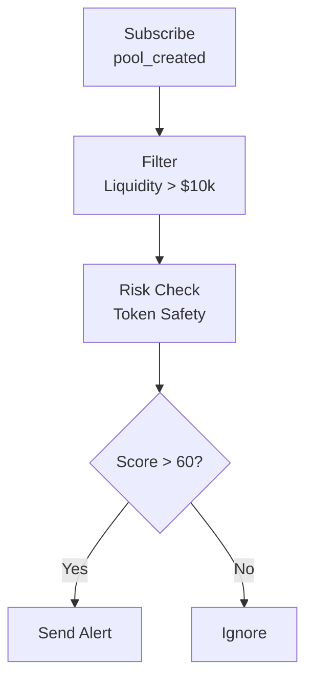

<Warning>
**Coming Soon** - This feature is currently under development. Stay tuned!
</Warning>

This document introduces how to use ChainStream to monitor DeFi protocol activities, including liquidity changes, large trades, yield tracking, and risk alerts.

---

## Supported DeFi Protocols

### DEX (Decentralized Exchanges)

| Protocol | Chains | Supported Features |
|----------|--------|-------------------|
| **Uniswap V2/V3** | Ethereum, Polygon, Arbitrum, Base | Trading, LP, Pool data |
| **PancakeSwap** | BSC | Trading, LP, Pool data |
| **SushiSwap** | Multi-chain | Trading, LP |
| **Raydium** | Solana | Trading, LP |
| **Jupiter** | Solana | Aggregated trading |
| **Curve** | Ethereum, Multi-chain | Stablecoin trading, LP |

### Lending Protocols

| Protocol | Chains | Supported Features |
|----------|--------|-------------------|
| **Aave V3** | Ethereum, Polygon, Arbitrum | Lending, Liquidation, Rates |
| **Compound V3** | Ethereum, Base | Lending, Liquidation |
| **Venus** | BSC | Lending, Liquidation |
| **Morpho** | Ethereum | Lending optimization |

### Yield Aggregators

| Protocol | Chains | Supported Features |
|----------|--------|-------------------|
| **Yearn Finance** | Ethereum | Vault strategies, Yields |
| **Convex Finance** | Ethereum | Curve LP enhancement |
| **Beefy Finance** | Multi-chain | Auto-compounding |

### Liquid Staking

| Protocol | Chains | Supported Features |
|----------|--------|-------------------|
| **Lido** | Ethereum | ETH staking |
| **Rocket Pool** | Ethereum | ETH staking |
| **Marinade** | Solana | SOL staking |

---

## Monitoring Dimensions

### 1. Liquidity Monitoring

#### Monitored Events

| Event | Description | Importance |
|-------|-------------|------------|
| `pool_created` | New pool creation | Discover new opportunities |
| `liquidity_add` | Add liquidity | Confidence indicator |
| `liquidity_remove` | Remove liquidity | ⚠️ Rug pull warning |
| `pool_update` | Pool parameter changes | Protocol governance |

#### Key Metrics

| Metric | Description | Healthy Standard |
|--------|-------------|------------------|
| TVL | Total Value Locked | Stable or growing |
| TVL Change Rate | 24h/7d TVL change | &gt; -10%/day |
| LP Holder Count | LP Token holder distribution | Dispersed is better |
| Liquidity Depth | Liquidity within ±2% price range | Greater depth is better |

#### Rug Pull Risk Signals

<Tabs>
  <Tab title="🔴 High Risk">
    - Single withdrawal &gt; 30% of pool
    - 24h cumulative withdrawal &gt; 50%
    - LP concentrated in few addresses (&lt; 5)
  </Tab>
  <Tab title="🟡 Medium Risk">
    - Single withdrawal &gt; 10% of pool
    - LP lock expiring soon
    - Project team addresses start withdrawing
  </Tab>
  <Tab title="🟢 Low Risk">
    - LP widely distributed
    - LP lock period &gt; 6 months
    - TVL stable growth
  </Tab>
</Tabs>

---

### 2. Trading Monitoring

#### Real-time Trading Flow

Subscribe to real-time trades via WebSocket:

| Event Type | Description | Data Fields |
|------------|-------------|-------------|
| `swap` | DEX trade | token_in, token_out, amount, price |
| `large_trade` | Large trade | threshold, trade_details |
| `arbitrage` | Arbitrage trade | profit, path |
| `mev` | MEV-related trade | type, extracted_value |

```typescript
// Subscribe to DEX trading flow
ws.subscribe('defi_trades', {
  protocol: 'uniswap_v3',
  chain: 'ethereum',
  min_amount_usd: 10000
}, (trade) => {
  console.log(`${trade.type}: ${trade.token_in} → ${trade.token_out}`);
});
```

#### Trading Analysis Dimensions

| Analysis Dimension | Metric | Significance |
|--------------------|--------|--------------|
| Buy/Sell Pressure | Buy volume/Sell volume ratio | &gt; 1 bullish |
| Volume Trend | Volume moving average | Activity level |
| Whale Behavior | Large trade percentage | Market impact |
| Pair Popularity | Trading frequency ranking | Market attention |

---

### 3. Yield Tracking

#### Tracked Content

| Yield Type | Description | Calculation Method |
|------------|-------------|-------------------|
| **LP Mining** | Trading fees from providing liquidity | Fees × Share percentage |
| **Lending Interest** | Deposit/borrow interest | Principal × APY |
| **Staking Rewards** | Protocol token rewards | Staked amount × Reward rate |
| **Airdrop Yields** | Protocol airdrops | Snapshot holdings |

#### Yield Metrics

| Metric | Description | Notes |
|--------|-------------|-------|
| **APY** | Annual Percentage Yield (with compounding) | Actual yield reference |
| **APR** | Annual Percentage Rate (without compounding) | Base yield |
| **Impermanent Loss** | LP loss relative to holding | Important risk factor |
| **Net Yield** | Yield - Gas - Impermanent Loss | Final yield |

#### Impermanent Loss Estimation

<Info>
**Impermanent Loss Formula**

```
Impermanent Loss = 2 × √(Price Ratio) / (1 + Price Ratio) - 1
```
</Info>

| Price Change | Impermanent Loss |
|--------------|------------------|
| ±10% | -0.11% |
| ±25% | -0.64% |
| ±50% | -2.02% |
| ±100% | -5.72% |
| ±200% | -13.4% |

---

### 4. Risk Alerts

#### Protocol-Level Risks

| Risk Type | Description | Alert Trigger |
|-----------|-------------|---------------|
| **Large Withdrawal** | Significant liquidity reduction | Single &gt; 5% of pool |
| **TVL Plunge** | Rapid protocol TVL decline | &gt; 20% decline in 1h |
| **Flash Loan Attack** | Flash loan pattern detected | Auto-detection |
| **Governance Attack** | Abnormal proposals or votes | Auto-detection |
| **Oracle Anomaly** | Abnormal price data | Deviation &gt; 5% |

#### Position-Level Risks

| Risk Type | Description | Alert Trigger |
|-----------|-------------|---------------|
| **Liquidation Risk** | Lending position near liquidation | Health factor &lt; 1.2 |
| **Impermanent Loss** | LP impermanent loss expanding | Loss &gt; 5% |
| **Yield Decline** | Significant APY drop | Decline &gt; 50% |

#### Alert Configuration Example

```json
{
  "alert_type": "liquidity_remove",
  "protocol": "uniswap_v3",
  "pool": "0x...",
  "threshold": {
    "type": "percentage",
    "value": 10
  },
  "notification": {
    "webhook": "https://your-server.com/webhook",
    "email": "alert@example.com"
  }
}
```

---

## Monitoring Scenarios

### Scenario 1: New Pool Discovery

**Goal**: Discover newly created trading pools as early as possible



```typescript
ws.subscribe('pool_created', {
  chain: 'ethereum',
  min_liquidity_usd: 10000
}, async (pool) => {
  // Check token safety
  const risk = await checkTokenRisk(pool.token_address);
  if (risk.score > 60) {
    notify(`New pool found: ${pool.pair_name}, Liquidity: $${pool.liquidity_usd}`);
  }
});
```

### Scenario 2: Rug Pull Warning

**Goal**: Monitor rug pull risk for held pools

<Steps>
  <Step title="Add Monitoring">
    Add target pool to monitoring list
  </Step>
  <Step title="Set Threshold">
    Set withdrawal threshold (e.g., single &gt; 10%)
  </Step>
  <Step title="Receive Alerts">
    Receive real-time alerts
  </Step>
  <Step title="Adjust Position">
    Adjust position promptly
  </Step>
</Steps>

```typescript
ws.subscribe('liquidity_remove', {
  pool: '0x...',
  threshold_percentage: 10
}, (event) => {
  alert(`⚠️ Rug pull warning: ${event.percentage}% liquidity removed`);
});
```

### Scenario 3: Arbitrage Opportunity Discovery

**Goal**: Discover cross-DEX price differences

<Steps>
  <Step title="Subscribe Price Feeds">
    Subscribe to price feeds from multiple DEXs
  </Step>
  <Step title="Calculate Spread">
    Calculate spread percentage
  </Step>
  <Step title="Cost Evaluation">
    Consider Gas and slippage costs
  </Step>
  <Step title="Send Alert">
    Alert when net profit &gt; threshold
  </Step>
</Steps>

```typescript
// Listen to prices from multiple DEXs
const prices = {};

ws.subscribe('token_price', { 
  token: 'WETH',
  dex: ['uniswap', 'sushiswap', 'curve']
}, (data) => {
  prices[data.dex] = data.price;
  checkArbitrage(prices);
});

function checkArbitrage(prices) {
  const maxPrice = Math.max(...Object.values(prices));
  const minPrice = Math.min(...Object.values(prices));
  const spread = (maxPrice - minPrice) / minPrice;
  
  if (spread > 0.005) {  // 0.5% spread
    notify(`Arbitrage opportunity: ${spread * 100}% spread`);
  }
}
```

### Scenario 4: Liquidation Monitoring

**Goal**: Monitor lending position health

<Steps>
  <Step title="Get Position">
    Get lending position for target address
  </Step>
  <Step title="Calculate Health Factor">
    Calculate real-time health factor
  </Step>
  <Step title="Warning">
    Warn when health factor &lt; 1.5
  </Step>
  <Step title="Urgent Alert">
    Urgent alert when health factor &lt; 1.2
  </Step>
</Steps>

```typescript
async function monitorLiquidationRisk(address: string) {
  const position = await getDefiPosition(address, 'aave_v3');
  
  if (position.health_factor < 1.2) {
    urgentAlert(`🚨 Liquidation risk! Health factor: ${position.health_factor}`);
  } else if (position.health_factor < 1.5) {
    warnAlert(`⚠️ Low health factor: ${position.health_factor}`);
  }
}
```

---

## Data Latency

| Data Type | Latency | Description |
|-----------|---------|-------------|
| Real-time Trades | &lt; 3s | Pushed after block confirmation |
| TVL Data | &lt; 1min | Minute-level updates |
| APY Data | &lt; 5min | Calculated from recent trades |
| Holder Data | &lt; 1h | Hourly snapshots |

---

## API Endpoints

| Function | Endpoint |
|----------|----------|
| Get Protocol TVL | `GET /v1/defi/{protocol}/tvl` |
| Get Pool Info | `GET /v1/defi/{protocol}/pools/{pool_id}` |
| Get User Positions | `GET /v1/defi/{protocol}/positions/{address}` |
| Get Yield Data | `GET /v1/defi/{protocol}/yields` |

---

## Related Documentation

<CardGroup cols={2}>
  <Card title="Arbitrage Scanner" icon="magnifying-glass-dollar" href="/en/playbooks/tutorials/build-arbitrage-scanner">
    Build an arbitrage scanning tool
  </Card>
  <Card title="Price Alert Bot" icon="bell" href="/en/playbooks/tutorials/build-price-alert-bot">
    Build a price alert system
  </Card>
</CardGroup>
