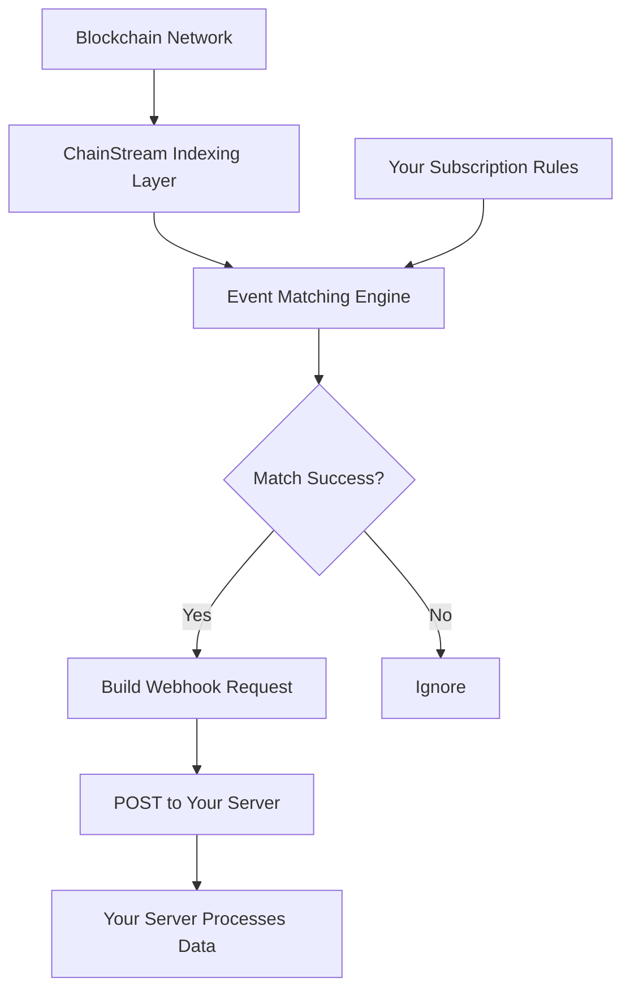
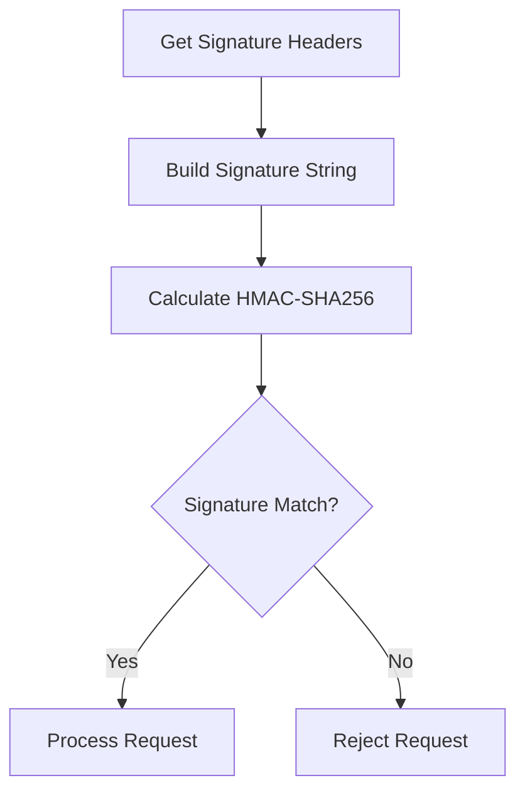

<Warning>
**Beta** — This feature is currently in beta. API may be subject to changes.
</Warning>

This document introduces the working principles, configuration methods, and best practices for ChainStream Webhooks, helping you implement real-time on-chain event delivery.

<Note>
Webhook functionality is available to all users.
</Note>

---

## How It Works

### Data Flow



### Core Features

| Feature | Description |
|---------|-------------|
| **Real-time Delivery** | Millisecond-level delivery after event trigger |
| **Reliable Delivery** | Auto-retry on failure |
| **Signature Verification** | HMAC signature anti-forgery |
| **Filter Rules** | Support event type filtering |

---

## Supported Event Types

Webhook currently supports the following event types (channels):

| Channel | Description | Typical Use |
|---------|-------------|-------------|
| `sol.token.created` | Solana new token creation | New token discovery, early opportunities |
| `sol.token.migrated` | Solana token graduation/migration | Track tokens graduating from Pump.fun and similar platforms |

<Info>
More event types are in development. Stay tuned!
</Info>

---

## Create Webhook Endpoint

### API Endpoint

```bash
POST /v1/webhook/endpoint
Content-Type: application/json
Authorization: Bearer YOUR_ACCESS_TOKEN
```

### Request Parameters

| Parameter | Type | Required | Description |
|-----------|------|----------|-------------|
| `url` | string | Yes | Webhook callback URL (must be HTTPS) |
| `channels` | array | Yes | List of event types to subscribe to |
| `description` | string | No | Endpoint description |
| `disabled` | boolean | No | Whether disabled, default false |
| `filterTypes` | array | No | Filter types |
| `metadata` | object | No | Custom metadata |
| `rateLimit` | integer | No | Rate limit |

### Request Example

```json
{
  "url": "https://your-server.com/webhook",
  "channels": ["sol.token.created", "sol.token.migrated"],
  "description": "Monitor new tokens and graduated tokens"
}
```

### Response Example

```json
{
  "id": "ep_abc123",
  "url": "https://your-server.com/webhook",
  "channels": ["sol.token.created", "sol.token.migrated"],
  "description": "Monitor new tokens and graduated tokens",
  "disabled": false
}
```

---

## Webhook Notification Format

Webhook notification data structure is consistent with WebSocket push.

### New Token Created (sol.token.created)

```json
{
  "channel": "sol.token.created",
  "timestamp": 1706947200000,
  "data": {
    "a": "6p6xgHyF7AeE6TZkSmFsko444wqoP15icUSqi2jfGiPN",
    "n": "Example Token",
    "s": "EXT",
    "dec": 9,
    "cts": 1706947200000,
    "lf": {
      "pa": "6EF8rrecthR5Dkzon8Nwu78hRvfCKubJ14M5uBEwF6P",
      "pf": "pump_fun",
      "pn": "Pump.fun"
    }
  }
}
```

**Field Descriptions**:

| Field | Description |
|-------|-------------|
| `a` | Token address |
| `n` | Token name |
| `s` | Token symbol |
| `dec` | Decimals |
| `cts` | Created timestamp (milliseconds) |
| `lf.pa` | Launch platform program address |
| `lf.pf` | Protocol family |
| `lf.pn` | Protocol name |

### Token Graduated (sol.token.migrated)

```json
{
  "channel": "sol.token.migrated",
  "timestamp": 1706947200000,
  "data": {
    "a": "6p6xgHyF7AeE6TZkSmFsko444wqoP15icUSqi2jfGiPN",
    "n": "Example Token",
    "s": "EXT",
    "cts": 1706947200000,
    "lf": {
      "pa": "6EF8rrecthR5Dkzon8Nwu78hRvfCKubJ14M5uBEwF6P",
      "pf": "pump_fun",
      "pn": "Pump.fun"
    },
    "mt": {
      "pa": "675kPX9MHTjS2zt1qfr1NYHuzeLXfQM9H24wFSUt1Mp8",
      "pf": "raydium",
      "pn": "Raydium"
    }
  }
}
```

**Additional Fields**:

| Field | Description |
|-------|-------------|
| `mt.pa` | Migration target platform program address |
| `mt.pf` | Migration target protocol family |
| `mt.pn` | Migration target protocol name |

---

## Webhook URL Requirements

| Requirement | Description |
|-------------|-------------|
| ✅ HTTPS | Must use HTTPS protocol |
| ✅ Publicly Accessible | URL must be accessible from public internet |
| ✅ 2xx Response | Must return 2xx status code for success |
| ✅ Response Time | Should respond within 5 seconds |
| ✅ Idempotent Handling | Must handle duplicate requests |

---

## Security Verification

### Get Webhook Secret

After creating an endpoint, get the secret via this API:

```bash
GET /v1/webhook/endpoint/{id}/secret
```

**Response**:

```json
{
  "secret": "whsec_abcdXXX"
}
```

### Signature Verification

Each Webhook request includes signature headers for verifying request origin:

```
X-Webhook-Signature: <signature>
X-Webhook-Timestamp: <timestamp>
```

### Verification Flow



### Code Examples

<Tabs>
  <Tab title="Node.js">
```javascript
const crypto = require('crypto');

function verifyWebhook(req, secret) {
  const signature = req.headers['x-webhook-signature'];
  const timestamp = req.headers['x-webhook-timestamp'];
  const body = JSON.stringify(req.body);
  
  // Check timestamp (5-minute window)
  const now = Date.now();
  if (Math.abs(now - parseInt(timestamp)) > 300000) {
    return false;
  }
  
  // Calculate signature
  const message = `${timestamp}.${body}`;
  const expectedSignature = crypto
    .createHmac('sha256', secret)
    .update(message)
    .digest('hex');
  
  // Safe comparison
  return crypto.timingSafeEqual(
    Buffer.from(signature),
    Buffer.from(expectedSignature)
  );
}
```
  </Tab>
  <Tab title="Python">
```python
import hmac
import hashlib
import time

def verify_webhook(request, secret):
    signature = request.headers.get('X-Webhook-Signature')
    timestamp = request.headers.get('X-Webhook-Timestamp')
    body = request.get_data(as_text=True)
    
    # Check timestamp (5-minute window)
    now = int(time.time() * 1000)
    if abs(now - int(timestamp)) > 300000:
        return False
    
    # Calculate signature
    message = f"{timestamp}.{body}"
    expected_signature = hmac.new(
        secret.encode(),
        message.encode(),
        hashlib.sha256
    ).hexdigest()
    
    # Safe comparison
    return hmac.compare_digest(signature, expected_signature)
```
  </Tab>
  <Tab title="Go">
```go
import (
    "crypto/hmac"
    "crypto/sha256"
    "encoding/hex"
    "strconv"
    "time"
)

func verifyWebhook(signature, timestamp, body, secret string) bool {
    // Check timestamp
    ts, _ := strconv.ParseInt(timestamp, 10, 64)
    now := time.Now().UnixMilli()
    if abs(now-ts) > 300000 {
        return false
    }
    
    // Calculate signature
    message := timestamp + "." + body
    mac := hmac.New(sha256.New, []byte(secret))
    mac.Write([]byte(message))
    expected := hex.EncodeToString(mac.Sum(nil))
    
    return hmac.Equal([]byte(signature), []byte(expected))
}
```
  </Tab>
</Tabs>

---

## Manage Webhook Endpoints

### List Endpoints

```bash
GET /v1/webhook/endpoint
```

**Query Parameters**:

| Parameter | Type | Description |
|-----------|------|-------------|
| `limit` | integer | Items per page (1-100, default 100) |
| `iterator` | string | Pagination iterator |
| `order` | string | Sort order (ascending/descending) |

### Get Endpoint Details

```bash
GET /v1/webhook/endpoint/{id}
```

### Update Endpoint

```bash
PATCH /v1/webhook/endpoint
```

```json
{
  "endpointId": "ep_abc123",
  "channels": ["sol.token.created"],
  "description": "Monitor new tokens only"
}
```

### Delete Endpoint

```bash
DELETE /v1/webhook/endpoint/{id}
```

### Rotate Secret

```bash
POST /v1/webhook/endpoint/{id}/secret/rotate
```

---

## Best Practices

### ✅ Fast Response

```python
# Recommended: Respond first, process later
@app.route('/webhook', methods=['POST'])
def webhook():
    # Verify signature
    if not verify_webhook(request, SECRET):
        return "Invalid signature", 401
    
    # Put in queue for async processing
    queue.put(request.json)
    
    # Return 200 immediately
    return "OK", 200
```

### ✅ Idempotency Handling

Each event contains a unique identifier. Record processed events on your server:

```python
# Use Redis to record processed events
def process_webhook(event):
    event_id = f"{event['channel']}:{event['data']['a']}:{event['timestamp']}"
    
    # Check if already processed
    if redis.exists(f"processed:{event_id}"):
        return {"status": "already_processed"}
    
    # Process event
    handle_event(event)
    
    # Mark as processed (TTL 24 hours)
    redis.setex(f"processed:{event_id}", 86400, "1")
    
    return {"status": "ok"}
```

### ✅ Security

<CardGroup cols={2}>
  <Card title="Always Verify Signature" icon="shield-check">
    Verify signature for every request
  </Card>
  <Card title="Use HTTPS" icon="lock">
    Ensure transport security
  </Card>
  <Card title="Rotate Secret Regularly" icon="rotate">
    Recommended every 90 days
  </Card>
  <Card title="Protect Sensitive Data" icon="eye-slash">
    Don't log sensitive data
  </Card>
</CardGroup>

### ✅ Reliability

<CardGroup cols={2}>
  <Card title="Implement Idempotency" icon="repeat">
    Handle duplicate requests
  </Card>
  <Card title="Message Queue Buffer" icon="layer-group">
    Use queues for async processing
  </Card>
  <Card title="Reasonable Timeout" icon="clock">
    Avoid long blocking
  </Card>
  <Card title="Comprehensive Logging" icon="file-lines">
    Log key information for troubleshooting
  </Card>
</CardGroup>

---

## FAQ

<AccordionGroup>
  <Accordion title="Not receiving Webhook requests?" icon="circle-question">
    **Troubleshooting steps**:

    1. **Confirm URL is accessible** — Test if URL is reachable from public internet
    2. **Check HTTPS** — Must use a valid SSL certificate
    3. **Check endpoint status** — Confirm `disabled` is not `true`
    4. **Check channels** — Confirm subscribed to correct event types
  </Accordion>
  
  <Accordion title="Receiving duplicate events?" icon="clone">
    This may be caused by retry mechanism. Implement idempotency handling:

    1. Use unique event identifier (channel + token address + timestamp)
    2. Check if already processed when receiving requests
    3. Use cache with TTL (like Redis) for storage
  </Accordion>
  
  <Accordion title="How to test Webhooks?" icon="flask">
    1. Use ngrok to expose local service
    2. Create Webhook endpoint pointing to ngrok URL
    3. Wait for real events to trigger, or use test environment
    4. Check local service logs
  </Accordion>
</AccordionGroup>

---

## API Endpoint Summary

| Function | Endpoint |
|----------|----------|
| List Endpoints | `GET /v1/webhook/endpoint` |
| Create Endpoint | `POST /v1/webhook/endpoint` |
| Update Endpoint | `PATCH /v1/webhook/endpoint` |
| Get Endpoint Details | `GET /v1/webhook/endpoint/{id}` |
| Delete Endpoint | `DELETE /v1/webhook/endpoint/{id}` |
| Get Secret | `GET /v1/webhook/endpoint/{id}/secret` |
| Rotate Secret | `POST /v1/webhook/endpoint/{id}/secret/rotate` |

---

## Related Documentation

<CardGroup cols={2}>
  <Card title="WebSocket API" icon="plug" href="/en/api-reference/endpoint/websocket/api">
    Real-time data subscription
  </Card>
  <Card title="Endpoint API Reference" icon="code" href="/en/api-reference/endpoint/endpoint/v1/webhook-endpoint-post">
    Complete API documentation
  </Card>
</CardGroup>
