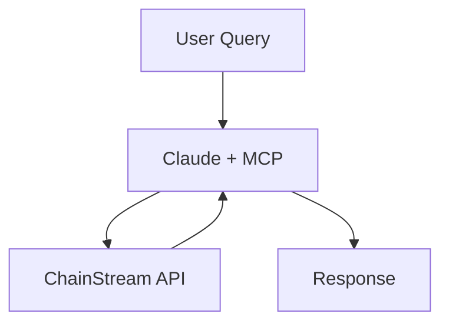

This tutorial introduces how to use ChainStream MCP Server to build an AI assistant that can query on-chain data, analyze markets, and assist with trading decisions.

<Info>
**Estimated Time**: 30 minutes  
**Difficulty Level**: ⭐⭐ Beginner
</Info>

---

## Objective

Build an AI assistant with on-chain awareness:



**Capabilities**:
- ✅ Query Token prices and balances
- ✅ Analyze wallet holdings
- ✅ Track Smart Money

---

## Step 1: Configure MCP

### Prerequisites

- ChainStream account (to get Client ID and Client Secret)
- Claude Desktop or Cursor
- Node.js 18+

### Install MCP Server

```bash
npm install -g @chainstream/mcp-server
```

### Configure Claude Desktop

Edit the configuration file:

<Tabs>
  <Tab title="macOS">
```bash
# Config file path
~/Library/Application Support/Claude/claude_desktop_config.json
```
  </Tab>
  <Tab title="Windows">
```bash
# Config file path
%APPDATA%\Claude\claude_desktop_config.json
```
  </Tab>
</Tabs>

Add configuration:

```json
{
  "mcpServers": {
    "chainstream": {
      "url": "https://mcp.chainstream.io/mcp",
      "headers": {
        "Authorization": "Bearer your_access_token"
      }
    }
  }
}
```

Restart Claude Desktop.

<Note>
For detailed steps, refer to the [MCP Setup Guide](/en/guides/ai-infrastructure/mcp-server/setup-guide).
</Note>

---

## Step 2: Conversation Examples

### Example 1: Check ETH Price

```
User: Show me the ETH price

Claude: [Calls get_token_price tool]

ETH Current Price:
- Price: $2,015.32
- 24h Change: +2.5%
- 24h Volume: $12.5B
- Market Cap: $242B
```

### Example 2: Analyze Wallet Holdings

```
User: Analyze the holdings of 0xd8dA6BF26964aF9D7eEd9e03E53415D37aA96045

Claude: [Calls get_token_balance and analyze_wallet tools]

This address (vitalik.eth) holdings analysis:

Holdings Overview
| Token | Amount | Value |
|-------|--------|-------|
| ETH | 1,234 | $2.48M |
| USDC | 50,000 | $50K |
| ENS | 10,000 | $25K |

Wallet Characteristics
- Wallet Age: 7+ years
- Tags: Core Developer, Long-term Holder
- Main Activities: DeFi, NFT, Donations
```

### Example 3: Track Smart Money

```
User: Which Smart Money addresses have been buying ARB recently?

Claude: [Calls get_smart_money_activities tool]

Past 24h Smart Money ARB Buy Records:

1. 0xabc...123 (Smart Score: 92)
   - Bought: 500,000 ARB ($450K)
   - Time: 2 hours ago
   - Tags: DeFi Expert, High Win-rate Trader

2. 0xdef...456 (Smart Score: 85)
   - Bought: 200,000 ARB ($180K)
   - Time: 5 hours ago
   - Tags: Institutional Wallet

Trend Analysis: Smart Money overall shows net buying stance on ARB
```

---

## Step 3: Advanced Usage

### Multi-step Analysis

```
User: First check this address's holdings, then analyze its recent trades, 
and determine its investment style

Claude: I'll analyze step by step:

Step 1: Holdings Query
[Calls get_token_balance]
...

Step 2: Transaction History
[Calls get_transaction_history]
...

Step 3: Comprehensive Analysis
[Calls analyze_wallet]

Based on the above data, this address's investment style is:
- Type: Medium to Long-term Holder
- Preference: DeFi Blue Chips + Layer2
- Risk Appetite: Moderate
- Characteristic: Good at adding positions during pullbacks
```

### Comparative Analysis

```
User: Compare the trading strategies of these two addresses

Claude: [Calls analyze_wallet x2]

| Dimension | Address A | Address B |
|-----------|-----------|-----------|
| Trading Frequency | High (50/day) | Low (5/day) |
| Holding Style | Short-term | Long-term |
| Win Rate | 62% | 78% |
| Preferred Sector | Meme Coins | DeFi |
| Risk Level | High | Medium |
```

---

## Security Considerations

### Strategy Limitations

The AI assistant only provides data queries and analysis, not direct trade execution.

```
User: Buy 100 USDC worth of ETH for me

Claude: I can help you query the current ETH price and best trading routes,
but cannot execute trades directly.

Current ETH price: $2,015
Suggested execution methods:
1. Uniswap V3 - Expected slippage 0.1%
2. 1inch Aggregator - May get better price

Please execute the trade manually in your wallet.
```

### Human Confirmation

For important decisions, AI provides analysis but recommends human confirmation:

<Warning>
Based on analysis, multiple Smart Money addresses are buying ARB, but please note:
- This does not constitute investment advice
- Markets are risky, please judge independently
- Recommend combining with more information sources
</Warning>

---

## Extension: Custom Agent

### Build with MCP SDK

```javascript
import Anthropic from '@anthropic-ai/sdk';
import { Client } from '@modelcontextprotocol/sdk/client/index.js';
import { SSEClientTransport } from '@modelcontextprotocol/sdk/client/sse.js';

const anthropic = new Anthropic();

// Initialize MCP Client
async function createMcpClient() {
  const transport = new SSEClientTransport(
    new URL('https://mcp.chainstream.io/sse'),
    {
      requestInit: {
        headers: {
          'Authorization': `Bearer ${process.env.CHAINSTREAM_ACCESS_TOKEN}`
        }
      }
    }
  );

  const client = new Client({
    name: 'custom-agent',
    version: '1.0.0'
  });

  await client.connect(transport);
  return client;
}

async function chat(userMessage) {
  const mcp = await createMcpClient();

  // Get available tools
  const { tools } = await mcp.listTools();

  // Convert to Anthropic format
  const anthropicTools = tools.map(tool => ({
    name: tool.name,
    description: tool.description,
    input_schema: tool.inputSchema
  }));

  // Call Claude
  let response = await anthropic.messages.create({
    model: 'claude-sonnet-4-20250514',
    max_tokens: 1024,
    tools: anthropicTools,
    messages: [{ role: 'user', content: userMessage }]
  });

  // Handle tool calls
  while (response.stop_reason === 'tool_use') {
    const toolUse = response.content.find(c => c.type === 'tool_use');

    // Call MCP tool
    const toolResult = await mcp.callTool({
      name: toolUse.name,
      arguments: toolUse.input
    });

    // Continue conversation with tool result
    response = await anthropic.messages.create({
      model: 'claude-sonnet-4-20250514',
      max_tokens: 1024,
      tools: anthropicTools,
      messages: [
        { role: 'user', content: userMessage },
        { role: 'assistant', content: response.content },
        {
          role: 'user',
          content: [{
            type: 'tool_result',
            tool_use_id: toolUse.id,
            content: JSON.stringify(toolResult.content)
          }]
        }
      ]
    });
  }

  await mcp.close();

  return response.content.find(c => c.type === 'text')?.text;
}

// Usage
const result = await chat('Check ETH price on Ethereum');
console.log(result);
```

---

## Available MCP Tools

| Tool | Description |
|------|-------------|
| `get_token_balance` | Query address token balance |
| `get_token_price` | Get real-time token price |
| `get_transaction_history` | Query address transaction history |
| `get_smart_money_activities` | Get Smart Money activities |
| `get_defi_positions` | Query DeFi positions |
| `analyze_wallet` | Analyze wallet characteristics |
| `get_token_holders` | Get token holder analysis |

---

## FAQ

<AccordionGroup>
  <Accordion title="Claude not calling MCP tools?" icon="circle-question">
    1. Confirm MCP Server is configured correctly
    2. Restart Claude Desktop
    3. Check if Client ID and Client Secret are valid
    4. Try more explicit prompts like "Use ChainStream to query..."
  </Accordion>

  <Accordion title="Response too slow?" icon="clock">
    On-chain data queries take time, especially for complex analysis. You can:
    1. Ask step by step to reduce single query load
    2. Specify a specific chain to reduce query scope
  </Accordion>

  <Accordion title="Can AI auto-trade?" icon="robot">
    The current version only supports data queries, not direct trade execution. This is for security reasons. For automated trading, we recommend executing through a separate trading system based on AI analysis results.
  </Accordion>
</AccordionGroup>

---

## Related Documentation

<CardGroup cols={2}>
  <Card title="MCP Setup Guide" icon="gear" href="/en/guides/ai-infrastructure/mcp-server/setup-guide">
    Detailed configuration steps
  </Card>
  <Card title="MCP Tools Catalog" icon="wrench" href="/en/guides/ai-infrastructure/mcp-server/tools-catalog">
    View all available tools
  </Card>
</CardGroup>
