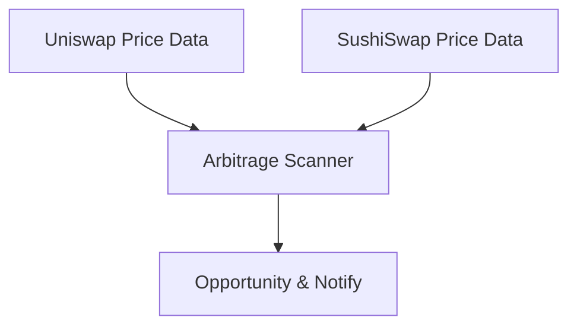

<Warning>
**Coming Soon** — This feature is under development and not yet available.
</Warning>

This tutorial will guide you through building a cross-DEX arbitrage scanner that discovers price differences between exchanges in real-time and identifies potential arbitrage opportunities.

<Info>
**Estimated Time**: 45 minutes  
**Difficulty Level**: ⭐⭐⭐ Intermediate
</Info>

---

## Objective

Discover cross-DEX price difference arbitrage opportunities:



**Feature Checklist**:
- ✅ Get multi-DEX trading pair prices
- ✅ Calculate spread percentage
- ✅ Evaluate feasibility (considering Gas, slippage, depth)
- ✅ Risk alerts (MEV, front-running)

---

## Arbitrage Principles

### Cross-DEX Arbitrage

The same token may have price differences across different DEXes:

```
Example: ETH/USDC trading pair

Uniswap:   1 ETH = $2,000
SushiSwap: 1 ETH = $2,010

Spread = ($2,010 - $2,000) / $2,000 = 0.5%

Arbitrage path:
Buy ETH on Uniswap → Sell ETH on SushiSwap → Profit from difference
```

### Profit Formula

<Info>
**Net Profit = Spread Revenue - Gas Fees - Slippage Loss**
</Info>

Practical considerations:
- Gas fees for two transactions
- Buy/sell slippage
- Liquidity depth limits
- MEV front-running risk

---

## Step 1: Get Trading Pairs

### 1.1 Install Dependencies

```bash
npm install @chainstream-io/sdk dotenv
```

### 1.2 Configuration File

```javascript
// config.js
import 'dotenv/config';

export const CHAINSTREAM_ACCESS_TOKEN = process.env.CHAINSTREAM_ACCESS_TOKEN;

// DEXes to monitor
export const DEXES = ['uniswap_v3', 'sushiswap', 'curve'];

// Trading pairs to monitor
export const TRADING_PAIRS = [
  { base: 'ETH', quote: 'USDC', chain: 'ethereum' },
  { base: 'ETH', quote: 'USDT', chain: 'ethereum' },
  { base: 'WBTC', quote: 'ETH', chain: 'ethereum' },
];

// Arbitrage thresholds
export const MIN_PROFIT_PERCENT = 0.3;   // Minimum profit rate
export const MIN_LIQUIDITY_USD = 50000;  // Minimum liquidity
```

### 1.3 Get Price Data

```javascript
// scanner.js
import { ChainStreamClient } from '@chainstream-io/sdk';
import { CHAINSTREAM_ACCESS_TOKEN, DEXES } from './config.js';

export class PriceScanner {
  constructor() {
    this.client = new ChainStreamClient(CHAINSTREAM_ACCESS_TOKEN);
  }

  async getDexPrices(base, quote, chain) {
    // Get trading pair prices across DEXes
    const prices = await this.client.dex.getPrices({
      base,
      quote,
      chain,
      dexes: DEXES
    });
    return prices;
  }
}
```

---

## Step 2: Calculate Spread

```javascript
// evaluator.js
import { MIN_PROFIT_PERCENT, MIN_LIQUIDITY_USD } from './config.js';

export class ArbitrageEvaluator {

  findOpportunity(prices, pair) {
    // Filter low liquidity
    const validPrices = prices.filter(
      p => (p.liquidityUsd || 0) >= MIN_LIQUIDITY_USD
    );

    if (validPrices.length < 2) {
      return null;
    }

    // Find lowest buy price and highest sell price
    const sortedPrices = [...validPrices].sort((a, b) => a.price - b.price);
    const buyFrom = sortedPrices[0];   // Lowest price - buy
    const sellTo = sortedPrices[sortedPrices.length - 1]; // Highest price - sell

    // Calculate spread
    const spread = (sellTo.price - buyFrom.price) / buyFrom.price * 100;

    // Estimate costs
    const gasCostPercent = 0.1;  // ~0.1%
    const slippagePercent = 0.2; // ~0.2%
    const totalCost = gasCostPercent + slippagePercent;

    // Net profit
    const netProfit = spread - totalCost;

    if (netProfit < MIN_PROFIT_PERCENT) {
      return null;
    }

    return {
      pair: `${pair.base}/${pair.quote}`,
      buyDex: buyFrom.dex,
      buyPrice: buyFrom.price,
      sellDex: sellTo.dex,
      sellPrice: sellTo.price,
      spreadPercent: Number(spread.toFixed(3)),
      netProfitPercent: Number(netProfit.toFixed(3)),
      maxSizeUsd: Math.min(buyFrom.liquidityUsd, sellTo.liquidityUsd) * 0.02
    };
  }
}
```

---

## Step 3: Evaluate Feasibility

### Risk Assessment

```javascript
// risk.js
export function assessRisk(opportunity) {
  const risks = [];

  // MEV risk
  if (opportunity.netProfitPercent > 1.0) {
    risks.push('🔴 High profit easily front-run by MEV');
  }

  // Liquidity risk
  if (opportunity.maxSizeUsd < 5000) {
    risks.push('🟡 Executable size is small');
  }

  // Timing risk
  risks.push('⚠️ Price data has latency');

  return {
    risks,
    executable: risks.filter(r => r.includes('🔴')).length === 0
  };
}
```

### Risk Warning

<Warning>
**Important Risk Warnings**:

1. **MEV Front-running**: Arbitrage trades are easily front-run by MEV bots
2. **Price Latency**: Prices may have changed by execution time
3. **Gas Volatility**: Costs can surge significantly during network congestion
4. **Slippage**: Actual slippage may be higher than estimated

This tool is only for discovering opportunities and does not constitute investment advice.
</Warning>

---

## Complete Code

```javascript
// index.js
import { PriceScanner } from './scanner.js';
import { ArbitrageEvaluator } from './evaluator.js';
import { TRADING_PAIRS } from './config.js';

async function main() {
  const scanner = new PriceScanner();
  const evaluator = new ArbitrageEvaluator();

  console.log('🔍 Arbitrage scanner starting...');

  while (true) {
    for (const pair of TRADING_PAIRS) {
      const prices = await scanner.getDexPrices(
        pair.base, 
        pair.quote, 
        pair.chain
      );

      const opp = evaluator.findOpportunity(prices, pair);

      if (opp) {
        console.log(`
🎯 Arbitrage opportunity found!
   Pair: ${opp.pair}
   Buy: ${opp.buyDex} @ $${opp.buyPrice}
   Sell: ${opp.sellDex} @ $${opp.sellPrice}
   Spread: ${opp.spreadPercent}%
   Net Profit: ${opp.netProfitPercent}%
   Max Size: $${opp.maxSizeUsd.toLocaleString()}
        `);
      }
    }

    // Scan every 10 seconds
    await new Promise(resolve => setTimeout(resolve, 10000));
  }
}

main();
```

---

## Extension Suggestions

<CardGroup cols={3}>
  <Card title="Flash Loan Integration" icon="bolt">
    Use flash loans for zero-capital arbitrage
  </Card>
  <Card title="Multi-chain Scanning" icon="layer-group">
    Extend to Arbitrum, Base, and other L2s
  </Card>
  <Card title="Auto Execution" icon="robot">
    Integrate wallet for automatic trading (use caution)
  </Card>
</CardGroup>

---

## Related Documentation

<CardGroup cols={2}>
  <Card title="DeFi Monitoring Overview" icon="landmark" href="/en/playbooks/frameworks/defi-monitoring-overview">
    Learn about DeFi monitoring dimensions
  </Card>
  <Card title="Price Alert Bot" icon="bell" href="/en/playbooks/tutorials/build-price-alert-bot">
    Get started with real-time price monitoring
  </Card>
</CardGroup>
